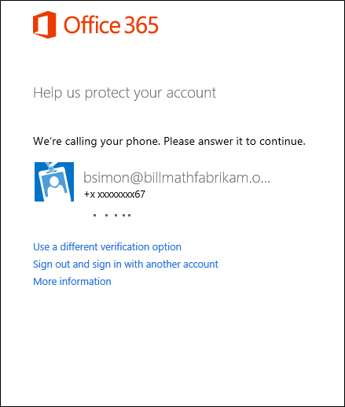
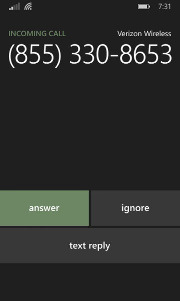

<properties 
	pageTitle="使用 Azure Multi-Factor Authentication 时的 Azure MFA 登录体验" 
	description="本页将会提供有关可在哪个位置查看 Azure MFA 支持的各种登录方法的指导。"
	keywords="用户身份验证, 登录体验, 使用手机登录, 使用办公电话登录" 
	services="multi-factor-authentication" 
	documentationCenter="" 
	authors="billmath" 
	manager="stevenpo" 
	editor="curtland"/>

<tags 
	ms.service="multi-factor-authentication" 
	ms.date="05/12/2016" 
	wacn.date="06/06/2016"/>

# Azure 多重身份验证的登录体验
> [AZURE.NOTE]本页提供的文档演示了一个典型的登录体验。有关登录的帮助，请参阅[使用 Azure (MFA)多重身份验证时遇到问题](/documentation/articles/multi-factor-authentication-end-user-manage-settings/)

## 你的登录体验是怎样的？
根据具体的登录方式和多重身份验证的使用方式，你的体验将有所不同。本部分将提供有关预期登录体验的信息。请选择最适当地描述了你的活动的一项：

你在做什么？|说明
:------------- | :------------- | 
[使用手机或办公电话登录](#signing-in-with-mobile-or-office-phone) | 这是使用手机或办公电话登录时所能预期到的情况。
[在移动应用中使用通知登录](#signing-in-with-the-mobile-app-using-notification) | 这是在移动应用中使用通知登录时所能预期到的情况。
[在移动应用中使用验证码登录](#signing-in-with-the-mobile-app-using-verification-code)|这是在移动应用中使用验证码登录时所能预期到的情况。
[使用替代方法登录](#signing-in-with-an-alternate-method)|说明使用替代方法时所能预期到的情况。

## 使用手机或办公电话登录

以下信息介绍在使用手机或办公电话执行多重身份验证时的体验。

### 使用办公电话或手机呼叫登录

- 使用你的用户名和密码登录到 Office 365 等应用程序或服务。
- Microsoft 将会向你拨打电话。

- 请接听电话并按 # 键。

- 现在你应已登录。</li>

## 在移动应用中使用通知登录

以下信息介绍在系统向你发送通知后，你在移动应用上使用多重身份验证的体验。

### 使用发送到移动应用的通知登录

- 使用你的用户名和密码登录到 Office 365 等应用程序或服务。
- Microsoft 将发送一条通知。

- 请接听电话并按验证键。

- 现在你应已登录。

## 在移动应用中使用验证码登录

以下信息介绍当你使用验证码执行身份验证时，在移动应用上使用多重身份验证的体验。

### 使用移动应用中的验证码登录

- 使用你的用户名和密码登录到 Office 365 等应用程序或服务。
- Microsoft 将提示你输入验证码。

- 打开手机上的 Azure 验证器应用，然后在登录框中输入该代码。

- 现在你应已登录。

## 使用替代方法登录

以下部分将会说明当你的主要方法不可用时，如何使用替代方法进行登录。

### 使用替代方法登录

- 使用你的用户名和密码登录到 Office 365 等应用程序或服务。
- 选择使用不同的验证选项。系统会显示不同的选项供你选择。看到的选项数目取决于你设置了多少个选项。

- 选择一种替代方法并登录。

 
<!---HONumber=Mooncake_0530_2016-->