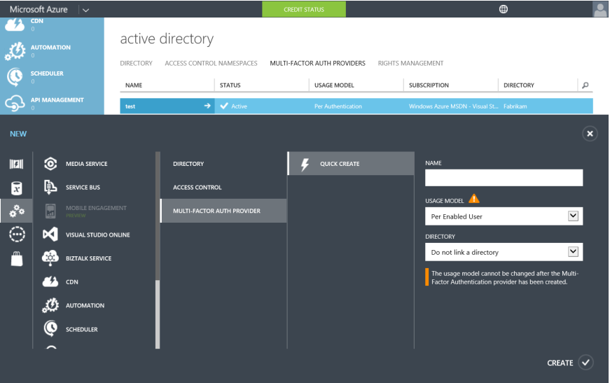

<properties 
	pageTitle="云中的 Azure Multi-Factor Authentication 入门" 
	description="这是与 Azure Multi-Factor Authentication 相关的页面，介绍如何在云中开始使用 Azure MFA。" 
	services="multi-factor-authentication" 
	documentationCenter="" 
	authors="billmath" 
	manager="stevenpo" 
	editor="curtand"/>

<tags 
	ms.service="multi-factor-authentication" 
	ms.date="02/16/2016" 
	wacn.date="05/09/2016"/>

# 云中的 Azure 多重身份验证入门

既然我们已经决定要在云中使用多重身份验证，那么现在就开始吧！ 请注意，如果你对 Office 365 使用多重身份验证或者对 Azure 管理员使用多重身份验证，则可以跳到步骤 3。本文还将说明

1. [注册 Azure 订阅](/pricing/free-trial/)
	- 如果你还没有 Azure 订阅，需要注册一个订阅。如果你是新手，只是在摸索如何使用 Azure MFA，你可以使用试用版订阅
2. [创建 Multi-Factor Auth 提供程序](#creating-an-azure-multi-factor-auth-provider)或者[向用户分配许可证](/documentation/articles/multi-factor-authentication-get-started-cloud#assigning-an-azure-ad-premium-or-enterprise-mobility-license-to-users)
	- 你需要创建 Azure Multi-Factor Auth 提供程序并将它分配给目录，或将 Azure MFA、Azure AD Premium 和/或 EMS 许可证分配给用户。Azure Multi-Factor Authentication 已随附在 Azure Active Directory Premium 中，因此也随附在 Enterprise Mobility Suite 中。如果你拥有的 Azure MFA、Azure AD Premium 和 EMS 许可证足以涵盖将要使用 Multi-Factor Authentication 的所有用户，则不需要创建 Multi-Factor Auth 提供程序。有关将许可证分配给用户的方式，请参阅后面的部分。
3. [为用户启用 Multi-Factor Authentication](#turn-on-multi-factor-authentication-for-users)
	- 通过 Office 365 或 Azure 门户为用户启用 Azure MFA。有关操作方法的信息，请参阅后面的部分。
4. [向用户发送电子邮件户，以通知他们有关 MFA 的信息](#send-email-to-end-users)
	- 在用户为其帐户启用 Multi-Factor Authentication 后，建议你向他们发送一封电子邮件，以通知相关的操作。系统将在用户下次登录时提示完成相应的过程，因此这样能让他们做好心理准备。有关示例电子邮件模板，请参阅后面的部分。

## 创建 Azure Multi-Factor Auth 提供程序
默认情况，具有 Azure Active Directory 的全局管理员可以使用 Multi-Factor Authentication。但是，如果要将 Multi-Factor Authentication 扩展到你的所有用户，并且/或者希望全域管理员和 Office 365 用户能够利用受信任 IP、自定义问候语及报告等功能，则必须购买完整版本的 Azure MFA。实现此目的的方法之一是创建 Multi-Factor Authentication 提供程序。

### 创建 Multi-Factor Auth 提供程序
--------------------------------------------------------------------------------

1. 以管理员身份登录到 Azure 门户。
2. 在左侧选择“Active Directory”。
3. 在“Active Directory”页的顶部，选择“Multi-Factor Authentication 提供程序”。然后，在底部单击“新建”。
4. 在“应用程序服务”下选择“Multi-Factor Auth 提供程序”，然后选择“快速创建”。
5. 填写以下字段，然后选择“创建”。
	1. 名称 - Multi-Factor Auth 提供程序的名称。
	2. 使用模型 - Multi-Factor Authentication 提供程序的使用模型。
		- 按身份验证 - 购买按身份验证收费的模型。通常用于在面向使用者的应用程序中使用 Azure Multi-Factor Authentication 的方案。
		- 按启用的用户 - 购买按每个启用的用户收费的模型。通常用于员工访问 Office 365 等应用程序的方案。
	2. 目录 - 与 Multi-Factor Authentication 提供程序关联的 Azure Active Directory 租户。请注意以下事项：
		- 无需 Azure AD 目录即可创建 Multi-Factor Auth 提供程序。如果计划仅使用 Azure Multi-Factor Authentication 服务器或 SDK，则此项可以保留为空。
		- 如果你想要将 Multi-Factor Authentication扩展到你的所有用户和/或希望全局管理员能够利用受信任的 IP、自定义问候语和报告等高级功能，则需要将 Multi-Factor Authentication 提供程序与 Azure AD 目录关联。
		- 仅当要将本地 Active Directory 环境与 Azure AD 目录同步时，才需要 Azure AD Connect、AAD Sync 或 DirSync。如果你只使用不与 Active Directory 的本地实例同步的 Azure AD 目录，则不需要这些功能。
		

5. 单击“创建”后，将创建 Multi-Factor Authentication 提供程序，此时你会看到以下消息：已成功创建 Multi-Factor Authentication 提供程序。单击“确定”。

## 向用户分配 Azure MFA、Azure AD Premium 或 Enterprise Mobility 许可证

如果你已购买 Azure MFA、Azure AD Premium 或 Enterprise Mobility Suite 许可证，则不需要创建 Multi-Factor Auth 提供程序。你只需将许可证分配给用户，然后就可以开始为用户启用 MFA。

### 分配 Azure MFA、Azure AD Premium 或 Enterprise Mobility Suite 许可证
--------------------------------------------------------------------------------

1. 以管理员身份登录到 Azure 门户。
2. 在左侧选择“Active Directory”。
3. 在“Active Directory”页上，双击要分配许可证的用户所在的目录。
4. 在“目录”页的顶部，选择“许可证”。
5. 在“许可证”页上，选择“Multi-Factor Authentication”、“Active Directory Premium”或“Enterprise Mobility Suite”，然后单击“分配”。
6. 在对话框中，选择要向其分配许可证的用户或组，然后单击复选标记图标以保存更改。

## 为用户启用 Multi-Factor Authentication

Azure Multi-Factor Authentication 中的用户帐户具有以下三种不同状态：

状态 | 说明 |受影响的非浏览器应用| 说明 
:-------------: | :-------------: |:-------------: |:-------------: |
已禁用 | 未加入多重身份验证的新用户的默认状态。|否|用户当前未使用多重身份验证。
Enabled |用户已加入多重身份验证。|否。它们将继续工作，直到注册过程完成。|用户已启用多重身份验证，但尚未完成注册过程。这些用户在下次登录时，系统将提示其完成注册过程。
强制|用户已加入，并已完成使用多重身份验证前的注册过程。|是的。除非创建及使用应用密码，否则将无法工作。 | 用户不一定完成了注册。如果他们已完成注册过程，表示他们正在使用多重身份验证。否则，在他们下次登录时，系统将提示其完成注册过程
创建身份验证提供程序或者将许可证分配给用户后，接下来我们要为目录中的用户启用 MFA。可以使用以下过程为用户启用 MFA。

### 启用 Multi-Factor Authentication
--------------------------------------------------------------------------------
1.  以管理员身份登录 Azure 管理门户。
2.  在左侧单击“Active Directory”。
3.  在“目录”下单击要为其启用此功能的用户的目录。
4.  在顶部单击“用户”。
5.  在页面底部，单击“管理 Multi-Factor Auth”。
6.  找到要为其启用多重身份验证的用户。你可能需要在顶部切换视图。确保用户的状态为“已禁用”，并勾选其名称旁边的框。
7.  此时将在右侧显示两个选项：“启用”和“管理用户设置”。单击“启用”。此时将显示一个弹出窗口，其中指定你需要对用户执行的后续步骤。单击“启用 Multi-Factor Auth”。
8.  启用用户后，建议你向这些用户发送一封电子邮件，告知他们如何使用非浏览器应用而不会被锁定。

若要使用 Windows PowerShell 更改用户的状态，可以使用以下代码。你可以将 `$st.State` 更改为前述任一状态。

		$st = New-Object -TypeName Microsoft.Online.Administration.StrongAuthenticationRequirement
		$st.RelyingParty = "*"
		$st.State = “Enabled”
		$sta = @($st)
		Set-MsolUser -UserPrincipalName bsimon@contoso.com -StrongAuthenticationRequirements $sta

## 向最终用户发送电子邮件

启用用户后，建议发送电子邮件给用户，通知他们需要提供联系信息。以下是可以使用的电子邮件模板，其中包含供用户观看的视频链接。

		主题：所需操作：Outlook 和其他应用的密码需要更新

		正文：

		为了提高安全性，我们为你的帐户启用了多重身份验证。 

		所需操作：若要让你的帐户接受多重身份验证的保护，你需要完成以下注册步骤。  

		启用 MFA 后会发生的情况：

		多重身份验证要求你使用已知的密码和已有的手机号来登录浏览器应用程序以及访问 Office 365 和 Azure 门户。

		如果你使用的是 Office 365 非浏览器应用程序（例如 Outlook、Lync、移动设备上的邮件客户端等），则登录时不能使用帐户密码，而需使用名为应用密码的特殊密码。应用密码不同于帐户密码，是在多重身份验证设置过程中生成的。 

		请按以下注册步骤操作，以免你的 Office 365 服务中断：

			1.  登录 Office 365 门户，网址为 http://portal.microsoftonline.com。
			2.  按说明设置通过 Web 浏览器登录 Office 365 时所要使用的多重身份验证方法。 
			3.  为每个设备创建应用密码。
			4.  在该设备的所有适用应用（例如 Outlook、Mail 客户端、Lync、Word、Powerpoint、Excel、CRM 等）中输入相同的应用密码。 
			5.  更新需要使用应用密码的 Office 客户端应用程序或其他移动应用程序。

		若要创建应用密码或更改 MFA 设置，可访问 http://aka.ms/mfasetup。请将该网站加入书签。

		注意：在输入应用密码之前，需清除登录信息（删除登录信息）并重新启动应用程序，然后即可使用用户名和应用密码登录。按以下文档所述步骤操作：http://technet.microsoft.com/library/dn270518.aspx#apppassword。

		观看演示这些步骤的视频，网址为 http://g.microsoftonline.com/1AX00en/175。

		此致
		管理员

## 后续步骤
在云中设置多重身份验证后，接下来可以转到[配置多重身份验证](/documentation/articles/multi-factor-authentication-whats-next) 以继续执行后续步骤。

<!---HONumber=Mooncake_0215_2016-->