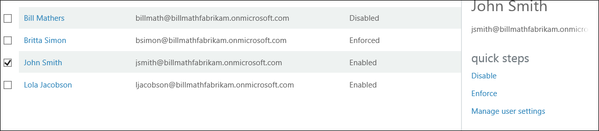

<properties 
	pageTitle="云中的 Azure Multi-Factor Authentication 入门" 
	description="这是与 Azure Multi-Factor Authentication 相关的页面，介绍如何在云中开始使用 Azure MFA。" 
	services="multi-factor-authentication" 
	documentationCenter="" 
	authors="billmath" 
	manager="swadhwa" 
	editor="curtand"/>

<tags 
	ms.service="multi-factor-authentication" 
	ms.date="07/02/2015" 
	wacn.date="09/15/2015"/>

# 云中的 Azure 多重认证入门

既然我们已经决定要在云中使用多重认证，那么现在就开始吧！ 请注意，如果你对 Office 365 使用多重认证或者对 Azure 管理员使用多重认证，则可以跳到步骤 3。本文还将说明

1. **注册 Azure 订阅**
	- 如果你还没有 Azure 订阅，需要注册一个订阅。如果你是新手，只是在摸索如何使用 Azure MFA，你可以使用试用版订阅

2. **为用户启用多重认证** 
    - 通过 Office 365 或 Azure 门户为用户启用 Azure MFA。有关操作方法的信息，请参阅后面的部分。

3. **向用户发送电子邮件户，以通知他们有关 MFA 的信息**
	- 在用户为其帐户启用多重认证后，建议你向他们发送一封电子邮件，以通知相关的操作。系统将在用户下次登录时提示完成相应的过程，因此这样能让他们做好心理准备。有关示例电子邮件模板，请参阅后面的部分。

## 为用户启用多重认证

Azure 多重认证中的用户帐户具有以下三种不同状态：

状态 | 说明 |受影响的非浏览器应用| 说明 
:-------------: | :-------------: |:-------------: |:-------------: |
已禁用 | 未加入多重认证的新用户的默认状态。|否|用户当前未使用多重认证。
Enabled |用户已加入多重认证。|否。它们将继续工作，直到注册过程完成。|用户已启用多重认证，但尚未完成注册过程。这些用户在下次登录时，系统将提示其完成注册过程。
强制|用户已加入，并已完成使用多重认证前的注册过程。|是的。除非创建及使用应用密码，否则将无法工作。 | 用户不一定完成了注册。如果他们已完成注册过程，表示他们正在使用多重认证。否则，在他们下次登录时，系统将提示其完成注册过程
创建身份验证提供程序或者将许可证分配给用户后，接下来我们要为目录中的用户启用 MFA。可以使用以下过程为用户启用 MFA。

### 启用 Multi-Factor Authentication
--------------------------------------------------------------------------------
1.  以管理员身份登录 Azure 管理门户。
2.  在左侧单击“Active Directory”。
3.  在“目录”下单击要为其启用此功能的用户的目录。
4.  在顶部单击“用户”。
5.  在页面底部，单击“管理 Multi-Factor Auth”。
6.  找到要为其启用多重认证的用户。你可能需要在顶部切换视图。确保用户的状态为“已禁用”，并勾选其名称旁边的框。
7.  此时将在右侧显示两个选项：“启用”和“管理用户设置”。单击“启用”。此时将显示一个弹出窗口，其中指定你需要对用户执行的后续步骤。单击“启用 Multi-Factor Auth”。
8.  启用用户后，建议你向这些用户发送一封电子邮件，告知他们如何使用非浏览器应用而不会被锁定。

若要使用 Windows PowerShell 更改用户的状态，可以使用以下代码。你可以将 `$st.State` 更改为前述任一状态。

		$st = New-Object -TypeName Microsoft.Online.Administration.StrongAuthenticationRequirement
		$st.RelyingParty = "*"
		$st.State = “Enabled”
		$sta = @($st)
		Set-MsolUser -UserPrincipalName bsimon@contoso.com -StrongAuthenticationRequirements $sta

## 向最终用户发送电子邮件

启用用户后，建议发送电子邮件给用户，通知他们需要提供联系信息。以下是可以使用的电子邮件模板，其中包含供用户观看的视频链接。

		Subject: ACTION REQUIRED: Your password for Outlook and other apps needs updated

		Body:

		For added security, we have enabled multi-factor authentication for your account. 

		Action Required: You will need to complete the enrollment steps below to make your account secure with multi-factor authentication.  

		What to expect once MFA is enabled:

		Multi-factor authentication requires a password that you know and a phone that you have in order to sign into browser applications and to access Office 365, Azure portals.

		For Office 365 non-browser applications such as outlook, lync, a mail client on your mobile device etc, a special password called an app password is required instead of your account password to sign in. App passwords are different than your account password, and are generated during the multi-factor authentication set up process. 

		Please follow these enrollment steps to avoid interruption of your Office 365 service:

			1.  Sign in to the Office 365 Portal at http://portal.microsoftonline.com.
			2.  Follow the instructions to set up your preferred multi-factor authentication method when signing into Office 365 using a web browser. 
			3.  Create one app password for each device.
			4.  Enter the same app password in all applicable apps on that device e.g. Outlook, Mail client, Lync, Word, Powerpoint, Excel, CRM etc. 
			5.  Update your Office client applications or other mobile applications to use an app password.

		You can visit http://aka.ms/mfasetup to create app passwords or change your MFA Setting.  Please bookmark this.

		NOTE: Before entering an app password, you will need to clear the sign-in information (delete sign-in info), restart the application,   and sign-in with the username and app password. Follow the steps documented : http://technet.microsoft.com/library/dn270518.aspx#apppassword.

		Watch a video showing these steps at http://g.microsoftonline.com/1AX00en/175.

		Best Regards,
		Your Administrator

## 后续步骤
在云中设置多重认证后，接下来可以转到[配置 Azure Multi-Factor Authentication](/documentation/articles/multi-factor-authentication-whats-next) 以继续执行后续步骤。

<!---HONumber=69-->