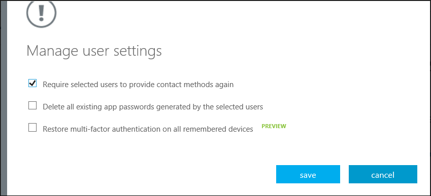
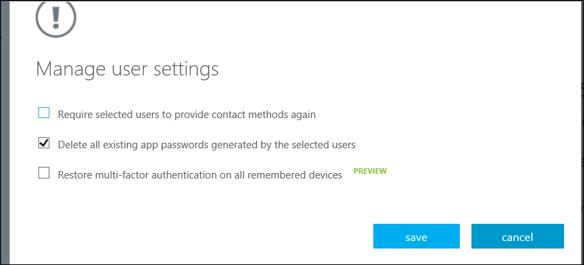

<properties 
	pageTitle="Azure Multi-Factor Authentication 报告" 
	description="本文介绍如何更改用户设置，例如，强制用户再次完成验证过程。" 
	documentationCenter="" 
	services="multi-factor-authentication" 
	authors="billmath" 
	manager="swadhwa" 
	editor="curtand"/>

<tags 
	ms.service="multi-factor-authentication" 
	ms.date="07/02/2015" 
	wacn.date="09/15/2015"/>

# 管理云中 Azure Multi-Factor Authentication 的用户设置

作为管理员，你可以管理以下用户和设备设置。

- [要求选定的用户再次提供联系方法](#require-selected-users-to-provide-contact-methods-again)
- [删除用户现有的应用密码](#delete-users-existing-app-passwords)
- [还原用户所有已暂停设备上的 MFA（公共预览版）](#restore-mfa-on-all-suspended-devices-for-a-user)

如果计算机或设备丢失、被盗或你需要删除用户访问权限，则此项设置将很有用。

## 要求选定的用户再次提供联系方法

此项设置将强制用户在登录时再次完成注册过程。请注意，如果用户拥有应用密码，则非浏览器应用将继续工作。你也可以通过选择“ 删除选定用户生成的所有现有应用密码”来删除用户的应用密码。

### 如何要求用户再次提供联系方法

<ol>
<li>登录到 Azure 管理门户。</li>
<li>在左侧单击“Active Directory”。</li>
<li>在“目录”下，单击被要求再次提供联系方法的用户对应的目录。</li>
<li>在顶部单击“用户”。</li>
<li>在页面底部，单击“管理 Multi-Factor Auth”。此时将打开“Multi-Factor Authentication”页。
<li>找到要管理的用户，并勾选其名称旁边的框。你可能需要在顶部切换视图。</li>
<li>此时会在右侧显示“管理用户设置”链接。单击此链接。</li>
<li>勾选“要求选定的用户再次提供联系方法”。</li>

<li>单击“保存”。</li>
<li>单击“关闭”</li>

## 删除用户现有的应用密码

这会删除用户创建的所有应用密码。与这些应用密码关联的非浏览器应用将会停止工作，直到创建新应用密码为止。

### 如何删除用户现有的应用密码

<ol>
<li>登录到 Azure 管理门户。</li>
<li>在左侧单击“Active Directory”。</li>
<li>在“目录”下，单击你要删除其应用密码的用户对应的目录。</li>
<li>在顶部单击“用户”。</li>
<li>在页面底部，单击“管理 Multi-Factor Auth”。此时将打开“Multi-Factor Authentication”页。
<li>找到要管理的用户，并勾选其名称旁边的框。你可能需要在顶部切换视图。</li>
<li>此时会在右侧显示“管理用户设置”链接。单击此链接。</li>
<li>勾选“删除选定用户生成的所有现有应用密码”。</li>

<li>单击“保存”。</li>
<li>单击“关闭”。</li>

## 还原用户所有已暂停设备上的 MFA

管理员可以重置用户设备和浏览器上的 Multi-Factor Authentication。这可以通过还原用户设备和浏览器的 Multi-Factor Authentication 来实现。这样做会取消用户所有设备和浏览器的暂停状态。

### 如何还原用户所有已暂停设备上的 MFA

<ol>
<li>登录到 Azure 管理门户。</li>
<li>在左侧单击“Active Directory”。</li>
<li>在“目录”下，单击要为其还原 MFA 的用户对应的目录。</li>
<li>在顶部单击“用户”。</li>
<li>在页面底部，单击“管理 Multi-Factor Auth”。此时将打开“Multi-Factor Authentication”页。
<li>找到要管理的用户，并勾选其名称旁边的框。你可能需要在顶部切换视图。</li>
<li>此时会在右侧显示“管理用户设置”链接。单击此链接。</li>
<li>勾选“还原所有已暂停设备上的 Multi-Factor Authentication”。</li>

<li>单击“保存”。</li>
<li>单击“关闭”。</li>

<!---HONumber=69-->