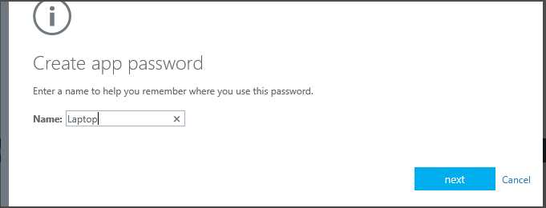
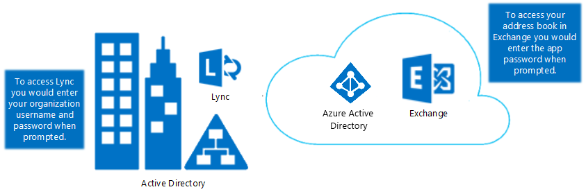

<properties 
	pageTitle="Azure Multi-Factor Authentication - 后续步骤" 
	description="这个有关 Azure Multi-Factor Authentication 的页面介绍了使用 MFA 可以执行的后续步骤。其中包括报告、欺诈警报、一次性跳过、自定义语音消息、缓存，受信任的 IP 和应用密码。" 
	services="multi-factor-authentication" 
	documentationCenter="" 
	authors="billmath" 
	manager="swadhwa" 
	editor="curtand"/>

<tags 
	ms.service="multi-factor-authentication" 
	ms.date="07/02/2015" 
	wacn.date="12/17/2015"/>

# 配置 Azure 多重身份验证

在启动并运行 Azure 多重身份验证后，可以参考以下文章来对其进行管理。该文章涵盖各种主题，可让你充分利用 Azure 多重身份验证。请注意，并非所有版本的 Azure 多重身份验证都提供这些功能。

功能| 说明| 涵盖的内容
:------------- | :------------- | :------------- | 
[应用密码](#app-passwords)|应用密码允许非MFA(多重身份验证)感知应用程序跳过多重身份验证并继续工作。|有关应用密码的信息。
[暂停记住的设备和浏览器的多重身份验证（公共预览版）](#suspend-multi-factor-authentication-for-remembered-devices-and-browsers-public-preview)|可让你在用户使用多重身份验证成功登录后的设置天数内暂停多重身份验证。|有关启用此功能和设置天数的信息。
<table class="table table-bordered table-striped table-condensed">
   <tr>
      <th>功能</th>
      <th>说明</th>
      <th>涵盖的内容</th>
   </tr>
   <tr>
      <td><a href="#app-passwords">应用密码</a></td>
      <td>应用密码允许非 MFA 感知应用程序跳过多重身份验证并继续工作</td>
      <td>有关应用密码的信息 </td>
   </tr>
   <tr>
      <td><a href="#suspend-multi-factor-authentication-for-remembered-devices-and-browsers-public-preview">暂停记住的设备和浏览器的多重身份验证（公共预览版）</a></td>
      <td>可让你在用户使用 MFA 成功登录后的设置天数内暂停 MFA</td>
      <td>有关启用此功能和设置天数的信息</td>
   </tr>

</table>

## 应用密码

在 Office 2010 或更低版本和 Apple Mail 等某些应用中，无法使用多重身份验证。若要使用这些应用，你需要使用“应用密码”来替换传统密码。应用密码可让应用程序跳过多重身份验证并继续工作。

>[AZURE.NOTE]适用于 Office 2013 客户端的现代身份验证
>
> Office 2013 客户端（包括 Outlook）现在支持新的身份验证协议，并且可以启用对多重身份验证的支持。这意味着一旦启用后，就不需要对 Office 2013 客户端使用应用密码。有关详细信息，请参阅 [Office 2013 现代身份验证公共预览版发布声明](https://blogs.office.com/2015/03/23/office-2013-modern-authentication-public-preview-announced/)。

### 有关应用密码的重要事项

下面是你应该知道的有关应用密码的重要事项列表。

身份验证体验|对于基于浏览器的应用|对于非基于浏览器的应用
:------------- | :------------- | :------------- 
<ul><li>身份验证的第一个因素在本地执行</li><li>第二个因素是由云标识执行的基于电话的方法。</li><ul><li>管理员和用户可以使用应用密码来登录。

- 用户可能有多个应用密码，从而增加了密码被盗的可能性。由于应用密码很难记住，因此用户可能会将密码写下来。不建议这么做并应阻止这么做，因为使用应用密码登录只需进行单重身份验证。
- 缓存密码并在本地方案中使用该密码的应用可能会启动失败，因为超出组织 ID 范畴的应用密码是不可识别的。一个示例是 Exchange 电子邮件，这些电子邮件位于本地但存档邮件位于云中。同一密码将无法正常工作。
- 实际的密码将自动生成，并非由用户提供。这是因为自动生成的密码会使攻击者更难进行猜测，因而更安全。
- 目前，每个用户有 40 个密码的限制。系统将提示你删除旧应用密码（现有的应用密码之一），以便创建新的应用密码。

### 应用密码命名指南
建议应用密码名称应能反映使用应用密码的设备。例如，如果你有一台安装了非浏览器应用（如 Outlook、Word 和 Excel）的便携式计算机，则只需创建一个名为 Laptop 的应用密码，即可在所有这些应用程序中使用该应用密码。虽然你可以为所有这些应用程序创建单独的密码，但不建议这样做。建议的方式是每个设备使用一个应用密码。

### 联合 (SSO) 应用密码
Azure AD 支持与本地 Windows Server Active Directory 域服务 (AD DS) 联合。如果你的组织与 Azure AD 联合 (SSO) 并且你要使用 Azure 多重身份验证，则以下是你在使用应用密码时应了解的重要信息。这仅适用于联合 (SSO) 客户。

- 应用密码由 Azure AD 进行验证，从而绕过了联合。仅在设置应用密码时，才会主动使用联合。
- 与被动流程不同，对于联合 (SSO) 用户，我们从不转到标识提供者 (IdP)。密码将存储在组织 ID 中。如果用户离开公司，则该信息必须通过 DirSync 实时流到组织 ID 中。帐户禁用/删除可能需要长达 3 小时才能同步，从而延迟了 Azure AD 中应用密码的禁用/删除。
- 应用密码不遵循“本地客户端访问控制”设置
- 本地身份验证日志记录/审核功能不可用于应用密码
- 对于 Microsoft Lync 2013 客户端，更多最终用户培训是必需的。有关必需的步骤，请参阅如何将电子邮件中的密码更改为应用密码。
- 在对客户端使用多重身份验证时，某些先进的体系结构设计可能需要将组织用户名和密码与应用密码结合使用，具体取决于进行身份验证的位置。对于针对本地基础结构进行身份验证的客户端，你会使用组织用户名和密码。对于针对 Azure AD 进行身份验证的客户端，你会使用应用密码。

例如，假设你有一个由下列内容组成的体系结构：

- 你要将 Active Directory 的本地实例与 Azure AD 联合
- 你要使用 Exchange Online
- 你要使用本地专用的 Lync
- 你要使用 Azure 多重身份验证

 在这些情况下，你必须执行以下操作：

- 登录到 Lync 时，使用你组织的用户名和密码。
- 当尝试通过连接到 Exchange Online 的 Outlook 客户端访问通讯簿时，请使用应用密码。

### 允许用户创建应用密码
默认情况下，用户无法创建应用密码。为此，必须启用此功能。若要允许用户创建应用密码，请使用以下过程。

#### 允许用户创建应用密码

1. 登录到 Azure 管理门户。
2. 在左侧单击“Active Directory”。
3. 在“目录”下单击要为其启用此功能的用户的目录。
4. 在顶部单击“用户”。
5. 在页面底部，单击“管理多重身份验证”。此时将打开“Multi-Factor Authentication”页。
6. 在“Multi-Factor Authentication”页的顶部，单击“服务设置”。
7. 确保选中了“允许用户创建用于登录到非浏览器应用程序的应用密码”旁边的单选按钮。

### 创建应用密码
用户可以在最初注册时创建应用密码。注册过程结束时，系统将提供一个选项用于创建应用密码。

此外，用户日后还可以通过在 Azure 门户和 Office 365 门户中更改设置来创建应用密码。

### 在 Office 365 门户中创建应用密码
--------------------------------------------------------------------------------

1. 登录到 Office 365 门户
2. 在右上角选择设置小组件
3. 在左侧选择“其他安全性验证”
4. 在右侧，选择“更新用于帐户安全性的电话号码”
5. 在验证页的顶部选择应用密码
6. 单击“创建”
7. 输入应用密码的名称，然后单击“下一步”
8. 将应用密码复制到剪贴板，然后将它粘贴到你的应用。

### 在 Azure 门户中创建应用密码
--------------------------------------------------------------------------------
1. 登录到 Azure 管理门户
3. 在顶部，右键单击你的用户名并选择“其他安全性验证”。
5. 在验证页的顶部选择应用密码
6. 单击“创建”
7. 输入应用密码的名称，然后单击“下一步”
8. 将应用密码复制到剪贴板，然后将它粘贴到你的应用。

### 在没有 Office 365 或 Azure 订阅的情况下创建应用密码
--------------------------------------------------------------------------------
1. 登录到 [https://myapps.microsoft.com](https://myapps.microsoft.com)	
2. 在顶部选择配置文件。
3. 单击你的用户名并选择“其他安全性验证”。
5. 在验证页的顶部选择应用密码
6. 单击“创建”
7. 输入应用密码的名称，然后单击“下一步”
8. 将应用密码复制到剪贴板，然后将它粘贴到你的应用。

## 暂停记住的设备和浏览器的多重身份验证（公共预览版）

使用暂停记住的设备和浏览器的多重身份验证功能，管理员能够为用户提供相关选项，使其在成功执行 MFA 后，将 MFA 暂停一定的天数。这是面向所有 MFA 用户的免费功能，可以帮助用户提高可用性。但是，由于允许用户暂停 MFA，此功能可能会降低帐户安全性。

若要确保用户帐户受到保护，用户应还原你的设备的多重身份验证，以防发生以下两种情况之一：

- 如果你的公司帐户受到安全威胁
- 如果记住的设备丢失或被盗

> [AZURE.NOTE]此功能通过浏览器 Cookie 缓存方式实现。如果你没有启用浏览器 Cookie，则此功能无法实现。

### 如何启用/禁用和设置暂停对已记住设备的 MFA

<ol>
<li>登录到 Azure 管理门户。</li>
<li>在左侧单击“Active Directory”。</li>
<li>在 Active Directory 下，单击你要设置记住的设备的多重身份验证的目录。</li>
<li>在选择的目录上，单击“配置”。</li>
<li>在“多重身份验证”部分中，单击“管理服务设置”。</li>
<li>在“服务设置”页上的“管理用户设备设置”下，选择/取消选择“允许用户通过记住其设备暂停多重身份验证”选项。</li>

<li>设置你希望允许暂停的天数。默认值为 14 天。</li>
<li>单击“保存”。</li>
<li>单击“关闭”。</li>

<!---HONumber=69-->