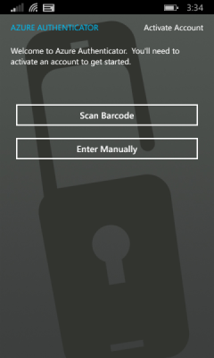
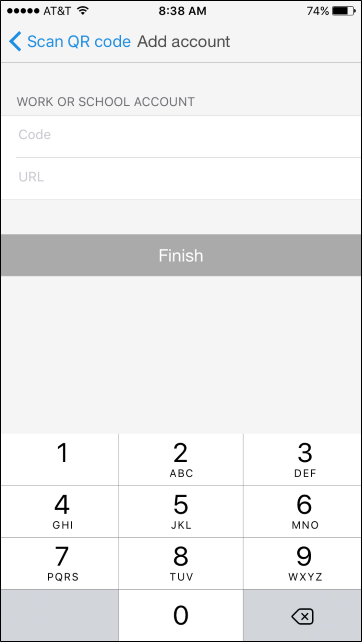

<properties
	pageTitle="在 Azure 多重身份验证中使用移动应用作为联系方法 | Azure"
	description="本文介绍了如何使用移动应用作为 Azure 多重身份验证的主要联系方法。"
	services="multi-factor-authentication"
	documentationCenter=""
	authors="billmath"
	manager="stevenp"
	editor="curtland"/>

<tags
	ms.service="multi-factor-authentication"
	ms.workload="identity"
	ms.tgt_pltfrm="na"
	ms.devlang="na"
	ms.topic="article"
	ms.date="08/30/2016"
	ms.author="billmath"
	wacn.date="02/17/2017"/>  

# 在 Azure 多重身份验证中使用移动应用作为联系方法

如果要使用 Microsoft Authenticator 应用作为主要联系方法，可以参考本文。本文介绍如何设置 Azure 多重身份验证，以使用移动应用作为主要联系方法。

Microsoft Authenticator 应用可用于 [Windows Phone](http://go.microsoft.com/fwlink/?Linkid=825071)、[Android](http://go.microsoft.com/fwlink/?Linkid=825072) 和 [iOS](http://go.microsoft.com/fwlink/?Linkid=825073)。

> [AZURE.NOTE] 如果你选择使用 “Mobile app” 来作为联系方式并且你使用的是 Android 系统的手机，在安装 “Azure Authentication App” 后系统还会提示安装 “Google Play Services”， 这个 “Google Play Services” 目前在中国无法使用。

## 使用 Microsoft Authenticator 作为联系方法

1. 在“其他安全性验证”屏幕上，从下拉列表中选择“移动应用”。
2. 选择“接收验证通知”或“使用验证码”，然后选择“Set up”。

	  

3. 在已安装 Microsoft Authenticator 应用的手机上，打开应用并选择 **+** 以添加帐户。
4. 指定要添加工作帐户或学校帐户。这将打开 QR 码扫描仪。如果相机未正常工作，可以选择手动输入公司信息。有关详细信息，请参阅[手动添加帐户](#add-an-account-manually)。

	  

	  

5. 扫描与用于配置移动应用的屏幕一起显示的 QR 码图片。选择“完成”关闭 QR 码屏幕。

	  

	如果无法获取要扫描的 QR 码，请手动输入信息。

	  

6. 在手机上完成激活后，选择“Contact me”。此步骤会将通知或验证码发送到手机。选择“验证”。

	  

7. 如果公司需要 PIN 才能批准登录验证，请输入它。

	  

8. 完成 PIN 条目后，选择“关闭”。此时，验证应已成功。
9. 建议输入手机号码，以免无法访问移动应用。通过下拉列表指定国家/地区，然后在国家/地区名称旁边的框中输入手机号码。选择“下一步”。
10. 选择“完成”。

## 手动添加帐户 
如果要手动添加帐户，请执行以下操作：

1. 选择“手动输入帐户”按钮。

	  

	  

2. 如果帐户已启用 Azure 多重身份验证，请输入显示条形码的同一页面上所提供的代码和 URL。此信息将会填入移动应用上的“代码”和“URL”框中。

	  

3. 激活完成后，选择“Contact me”。此步骤会将通知或验证码发送到手机。选择“验证”。

<!---HONumber=Mooncake_1010_2016-->
