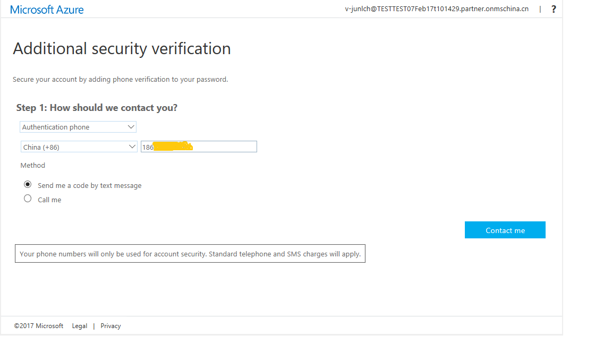
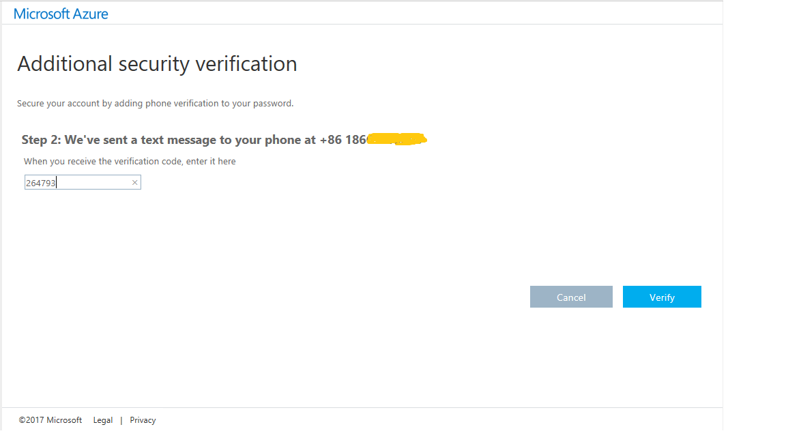
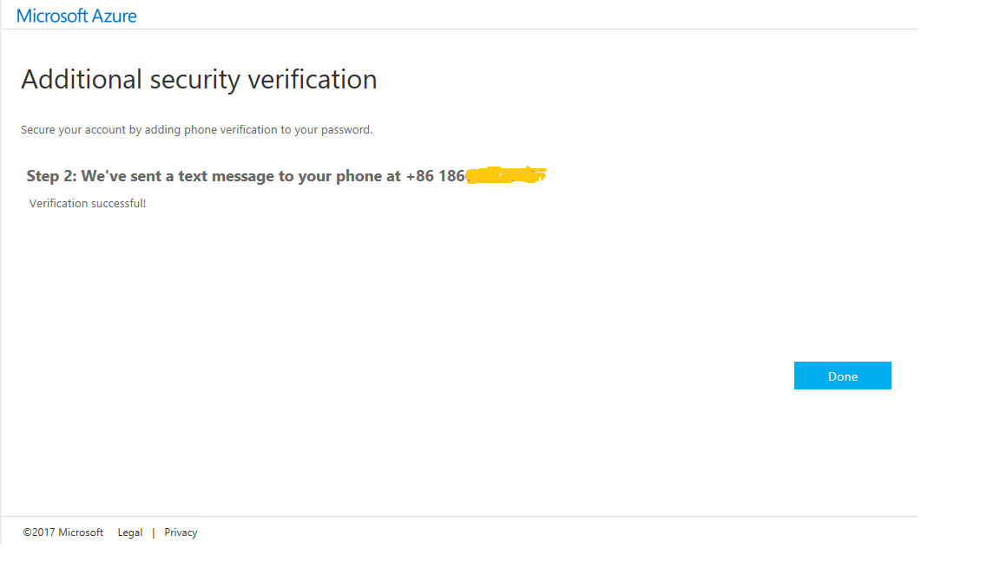

<properties 
	pageTitle="在 Azure MFA 中使用手机作为联系方法" 
	description="本页说明用户如何使用手机作为 Azure MFA 的主要联系方法。" 
	services="multi-factor-authentication" 
	documentationCenter="" 
	authors="billmath" 
	manager="stevenp" 
	editor="curtland"/>

<tags 
	ms.service="multi-factor-authentication" 
	ms.date="08/04/2016"
	wacn.date="09/12/2016"/>

# 在 Azure 多重身份验证中使用手机作为联系方法

如果要使用手机作为主要联系方法，你可以参考本文。本文将会引导你设置多重身份验证，以使用手机通话或短信作为联系方法。

## 使用手机作为联系方法
<ol>
<li>从下拉列表中选择“Authentication phone”</li>

<li>通过下拉列表指定你的国家/地区，然后输入你的手机号码。</li>
<li>选择想要使用的手机通信模式 - 短信或呼叫。</li>
<li>单击“下一步”。</li>
<li>单击“Contact me”按钮。随后将向你的手机发起呼叫。请务必随身携带手机。根据你选择的模式（短信或呼叫），响应将有所不同。
		<ul><li>如果你选择了短信模式，将通过短信发送 6 位代码给你。请在浏览器显示的框中输入此代码。</li>
		<li>如果你选择了呼叫模式，你将收到电话呼叫。请使用电话上的 # 号接听此呼叫。</li></ul>

<li>输入你收到的验证码，单击“Verify”（验证）。</li>

<li>单击“Done”（完成）。</li>

 

<!---HONumber=Mooncake_0905_2016-->