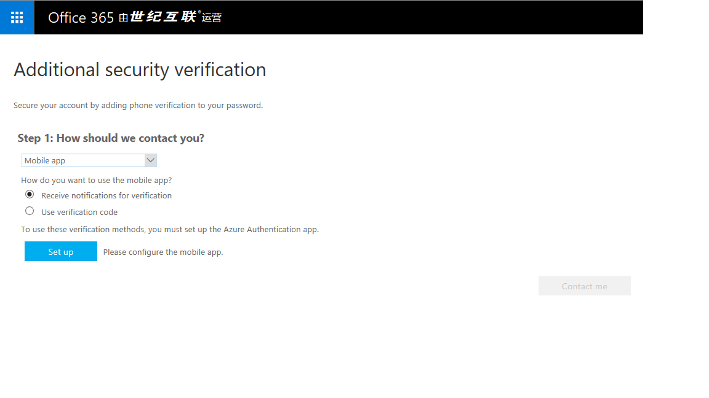
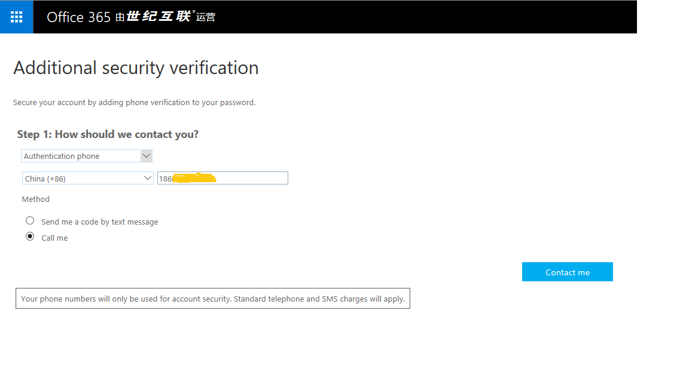
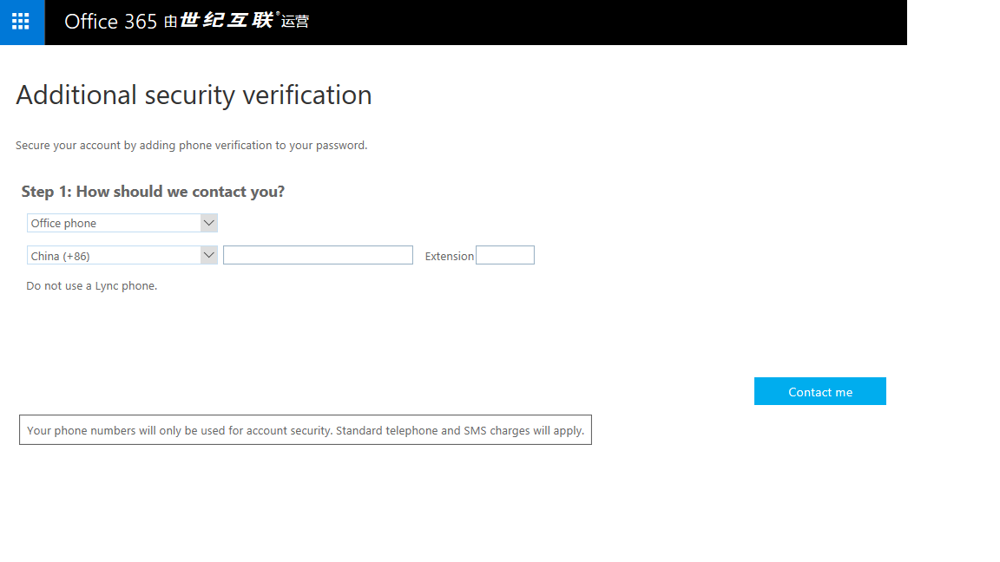

<properties
    pageTitle="为工作或学校帐户设置双重验证"
    description="公司配置 Azure 多重身份验证时，会提示你注册双重验证。了解如何进行设置。"
    services="multi-factor-authentication"
    keywords="如何使用 azure 目录, 云中的 active directory, active directory 教程"
    documentationcenter=""
    author="kgremban"
    manager="femila"
    editor="pblachar" />
<tags
    ms.assetid="46f83a6a-dbdd-4375-8dc4-e7ea77c16357"
    ms.service="multi-factor-authentication"
    ms.workload="identity"
    ms.tgt_pltfrm="na"
    ms.devlang="na"
    ms.topic="article"
    ms.date="11/23/2016"
    wacn.date="02/17/2017"
    ms.author="kgremban" />  

# 将我的帐户设置为使用双重验证
双重验证是一种额外的安全步骤，可使帐户更难被其他人攻破，从而帮助保护帐户。如果正在阅读本文，可能会收到来自工作或学校管理员的有关多重身份验证的电子邮件。或者，也许会在尝试登录时收到消息，要求你设置其他安全性验证。如果是这种情况，**在完成自动注册过程之前将无法登录**。

本文可帮助你设置**工作或学校帐户**。如果想为自己的个人 Microsoft 帐户启用双重验证，请参阅[关于双重验证](https://support.microsoft.com/zh-cn/help/12408/microsoft-account-about-two-step-verification)。

## 确定如何使用多重身份验证
双重验证的工作原理是在登录时提示你输入两条标识。首先，我们会像往常一样要求你输入用户名和密码。然后，我们会联系已知的属于你的电话，并确认登录尝试是否合法。

若要开始设置过程，请尝试按往常的方式登录帐户。如果管理员已将帐户配置为使用双重验证，系统会提示你开始自动注册过程。单击“立即设置”开始执行此过程。

  

注册过程中的第一个问题是你希望我们如何与你联系。查看表中的选项，然后使用相应的链接转到每种方法的设置步骤。

| 联系方法 | 说明 |
| --- | --- |
| [移动应用](#use-a-mobile-app-as-the-contact-method) |- **接收验证通知。** 此选项会将通知推送到智能手机或平板电脑上的验证器应用。查看通知，如果该通知合法，则在应用中选择“身份验证”。进行身份验证之前，工作或学校可能要求输入 PIN。 - **使用验证码。** 在此模式下，验证器应用会生成每隔 30 秒更新的验证码。在登录界面中输入最新的验证码。 Microsoft Authenticator 应用可用于 [Windows Phone](http://go.microsoft.com/fwlink/?Linkid=825071)、[Android](http://go.microsoft.com/fwlink/?Linkid=825072) 和 [IOS](http://go.microsoft.com/fwlink/?Linkid=825073)。 |
| [移动电话呼叫或短信](#use-your-mobile-phone-as-the-contact-method) |- **电话呼叫**会向提供的电话号码进行自动语音呼叫。接听电话并按电话拨号键盘中的 # 进行身份验证。 - **短信**会发送包含验证码的短信。按照短信中的提示，回复短信或在登录界面中输入提供的验证码。 |
| [办公电话呼叫](#use-your-office-phone-as-the-contact-method) |向提供的电话号码进行自动语音呼叫。接听电话并按电话拨号键盘中的 # 进行身份验证。 |

> [AZURE.NOTE] Android 系统中使用 “Mobile app” 来验证需要安装 “Azure Authentication App”，装好后系统还会提示安装 “Google Play Services”， 这个目前在中国无法使用。

## 使用移动应用作为联系方法 
使用此方法需要在电话或平板上安装验证器应用。本文中的步骤基于 Microsoft Authenticator 应用，该应用可用于 [Windows Phone](http://go.microsoft.com/fwlink/?Linkid=825071)、[Android](http://go.microsoft.com/fwlink/?Linkid=825072) 和 [IOS](http://go.microsoft.com/fwlink/?Linkid=825073)。

1. 从下拉列表中选择“Mobile app”。
2. 选择“接收验证通知”或“使用验证码”，然后选择“设置”。

      

3. 在手机或平板电脑上，打开应用并选择“+”添加帐户。（在 Android 设备上，选择三个点，然后选择“添加帐户”。）
4. 指定要添加工作帐户或学校帐户。随即会打开手机上的 QR 码扫描程序。如果相机未正常工作，可以选择手动输入公司信息。有关详细信息，请参阅[手动添加帐户](#add-an-account-manually)。
5. 扫描与用于配置移动应用的屏幕一起显示的 QR 码图片。选择“完成”关闭 QR 码屏幕。

      

6. 在手机上完成激活后，选择“Contact me”。此步骤会将通知或验证码发送到手机。选择“验证”。
7. 如果公司需要 PIN 才能批准登录验证，请输入它。

      

8. 完成 PIN 条目后，选择“关闭”。此时，验证应已成功。
9. 建议输入手机号码，以免无法访问移动应用。通过下拉列表指定国家/地区，然后在国家/地区名称旁边的框中输入手机号码。选择“下一步”。
10. 单击“Done”（完成）。

### 手动添加帐户
如果想要手动将帐户添加到移动应用，请按照下列步骤操作，而不要使用 QR 读取器。

1. 选择“手动输入帐户”按钮。
2. 输入显示条形码的同一页面上提供的代码和 URL。此信息将会填入移动应用上的“代码”和“URL”框中。

      

3. 激活完成后，选择“与我联系”。此步骤会将通知或验证码发送到手机。选择“验证”。

## 使用移动电话作为联系方法 
1. 从下拉列表中选择“Authentication phone”。

      

2. 从下拉列表中选择国家/地区，然后输入手机号码。
3. 选择想要使用移动电话的方法 - 短信或呼叫。
4. 选择“Contact me”以验证电话号码。根据所选的模式，我们会发送短信或拨打电话。按照屏幕上提供的说明，选择“验证”。
5. 单击“Done”（完成）。

## 使用办公电话作为联系方法 
1. 从下拉列表中选择“Office phone”

      

2. 会使用公司联系人信息自动填充电话号码框。如果号码错误或丢失，请联系管理员进行更改。
3. 选择“Contact me”以验证手机号码。我们会呼叫你的电话号码。按照屏幕上提供的说明，选择“验证”。
4. 单击“Done”（完成）。

## 后续步骤
- 更改首选选项并[管理双重验证的设置](/documentation/articles/multi-factor-authentication-end-user-manage-settings/)
- 查看[Microsoft Authenticator 应用](/documentation/articles/multi-factor-authentication-microsoft-authenticator/)文章，了解快速、安全的身份验证（即便没有手机网络服务）。

<!---HONumber=Mooncake_0103_2017-->
