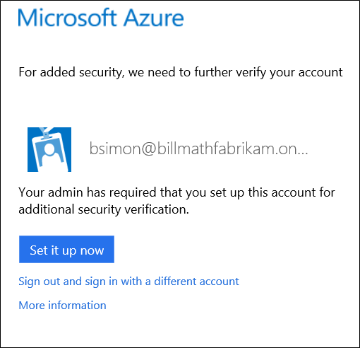

<properties 
	pageTitle="首次使用 Azure 多Multi-Factor Authentication 登录" 
	description="本页介绍用户首次登录时的体验。" 
	services="multi-factor-authentication"
	keywords="如何使用 azure 目录, 云中的 active directory, active directory 教程" 
	documentationCenter="" 
	authors="billmath" 
	manager="stevenp" 
	editor="curtland"/>

<tags 
	ms.service="multi-factor-authentication" 
	ms.date="05/12/2016" 
	wacn.date="04/13/2016"/>

# Azure 多重身份验证的设置体验

 当管理员已将你的帐户配置为要求必须同时使用密码和手机响应以验证你的身份时，将使用其他安全性验证设置。如果管理员已将你的帐户配置为需要其他安全性验证，则**你在完成自动注册过程之前将无法登录**。

## 确定如何使用多重身份验证

 在配置帐户后首次登录时，系统将提示你开始进行自动注册过程。可以通过单击“立即设置”开始执行此过程。

使用注册过程，你可以指定首选的验证方法。该方法可以是下表中所列的任何一种。如需更多信息（包括演练），只要单击其中一种方法即可。

方法|说明
:------------- | :------------- | 
[移动电话呼叫](/documentation/articles/multi-factor-authentication-end-user-first-time-mobile-phone/)| 向身份验证电话拨打自动语音呼叫。用户接听电话，并按电话键盘上的 # 进行身份验证。此电话号码将不会同步到本地 Active Directory。
[手机短信](/documentation/articles/multi-factor-authentication-end-user-first-time-mobile-phone/)|向用户发送包含验证码的短信。系统会提示用户使用验证码回复短信或在登录界面中输入验证码。
[办公电话呼叫](/documentation/articles/multi-factor-authentication-end-user-first-time-office-phone/)|向用户拨打自动语音呼叫。用户接听电话，并按电话键盘上的 # 进行身份验证。
[移动应用](/documentation/articles/multi-factor-authentication-end-user-first-time-mobile-app/)|将通知推送到用户的智能手机或平板电脑上的 Multi-Factor Authentication 移动应用。用户在应用中点击“验证”进行身份验证。此外，该应用还可以用作进行脱机身份验证的 OTP 令牌。用户在登录屏幕上输入该令牌进行身份验证。 
 Multi-Factor Authentication 应用可以使用 2 种不同模式运行，以提供 Multi-Factor Authentication 服务所能提供的附加安全性。这两种模式是：<li>**通知** - Multi-Factor Authentication 应用可防止对帐户进行未经授权的访问并停止欺诈性事务。此功能是使用推送到你的手机或已注册设备上的推送通知来完成的。你可以直接查看通知，如果该通知是合法的，则选择“身份验证”。否则，你可以选择“拒绝”或选择拒绝并报告欺诈性通知。有关报告欺诈性通知的信息，请参阅“如何针对 Multi-Factor Authentication 使用拒绝并报告欺诈功能”。</li>
<li>**一次性密码** - 在此模式下，Multi-Factor Authentication 应用可用作生成 OATH 验证码所需的软件令牌。然后可以将此验证码与用户名和密码一起输入，进行第二种形式的身份验证。</li> 
 Azure 验证器应用可用于 [Windows Phone](http://www.windowsphone.com/zh-cn/store/app/azure-authenticator/03a5b2bf-6066-418f-b569-e8aecbc06e50)、[Android](https://play.google.com/store/apps/details?id=com.azure.authenticator) 和 [IOS](https://itunes.apple.com/us/app/azure-authenticator/id983156458)。

 

<!---HONumber=Mooncake_0530_2016-->