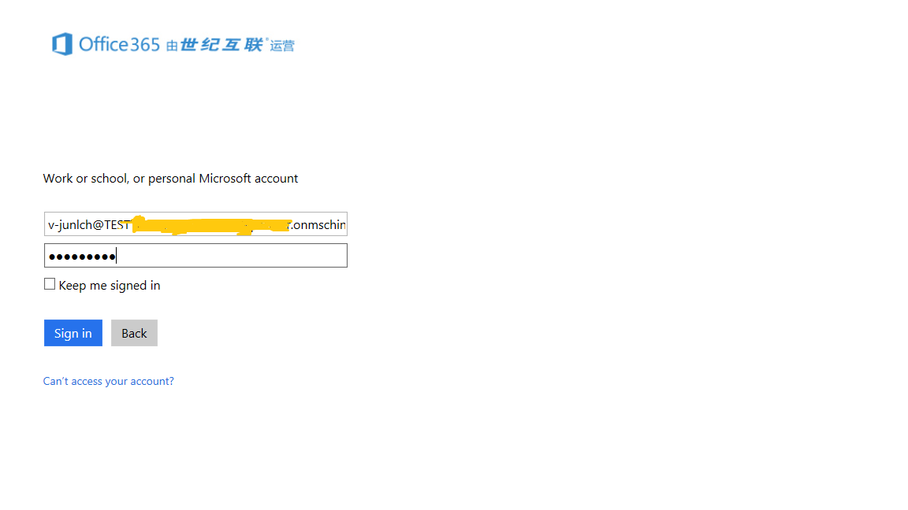
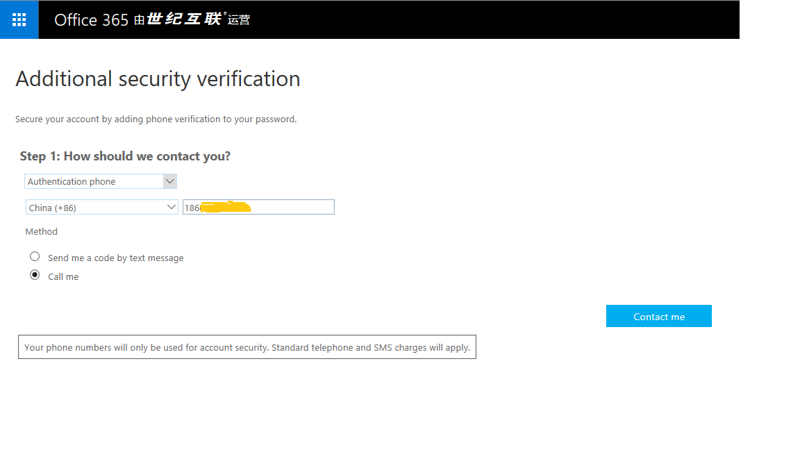
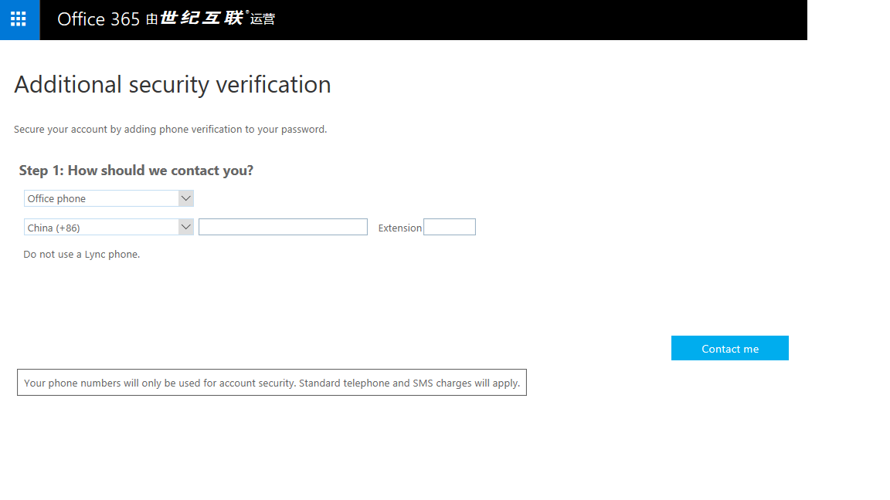
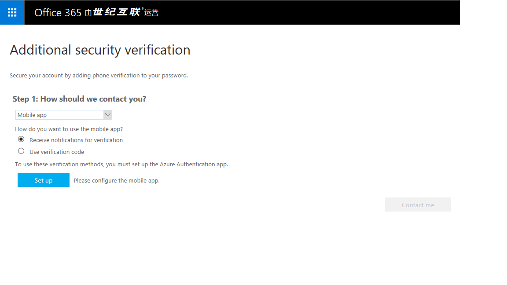
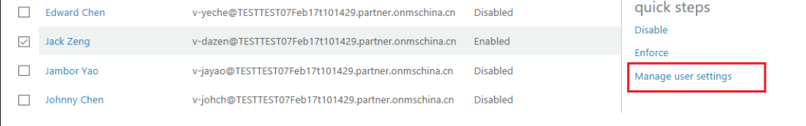
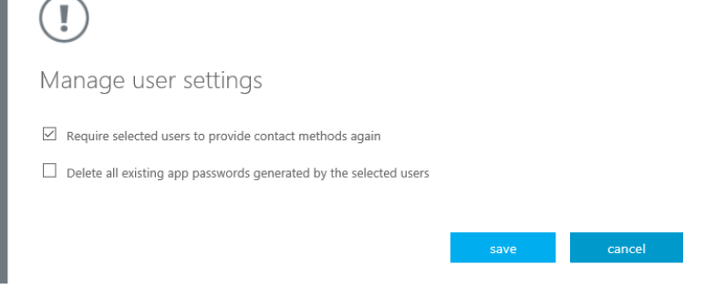

<properties
    pageTitle="管理多重身份验证设置 |Microsoft 文档"
    description="管理 Azure 多重身份验证的使用方式包括更改联系信息或配置设备。"
    services="multi-factor-authentication"
    keywords="多重身份验证客户端, 身份验证问题, 相关性 ID"
    documentationcenter=""
    author="kgremban"
    manager="femila"
    editor="yossib"
    translationtype="Human Translation" />
<tags
    ms.assetid="d3372d9a-9ad1-4609-bdcf-2c4ca9679a3b"
    ms.service="multi-factor-authentication"
    ms.workload="identity"
    ms.tgt_pltfrm="na"
    ms.devlang="na"
    ms.topic="article"
    ms.date="02/23/2017"
    wacn.date="04/24/2017"
    ms.author="kgremban"
    ms.sourcegitcommit="a114d832e9c5320e9a109c9020fcaa2f2fdd43a9"
    ms.openlocfilehash="588a90188774fc5b968695337be8dc9789616d11"
    ms.lasthandoff="04/14/2017" />

# 管理多重身份验证设置
本文回答有关如何更新多重身份验证或多重身份验证的设置的问题。 如果在登录帐户时遇到问题，请参阅[使用多重身份验证时遇到问题](/documentation/articles/multi-factor-authentication-end-user-troubleshoot/)获取疑难解答帮助。

## 哪里可以找到设置页
具体取决于公司设置 Azure 多重身份验证的方式，可在其中几个位置更改设置，例如电话号码。

如果 IT 管理员发出特定的 URL 或步骤管理多重身份验证，请按照这些说明进行操作。 否则，以下说明应适用于其他所有人。 如果按照这些步骤操作，但未看到相同的选项，这意味着工作场所或学校自定义了它们自己的门户。 向管理员寻求指向 Azure 多重身份验证门户的链接。

1. 登录到 [https://login.partner.microsoftonline.cn](https://login.partner.microsoftonline.cn)  

      

    输入用户帐户和密码，然后单击 “Sign in”。    

2. 选择所需的验证。

    - 默认值为“身份验证电话”，你可以选择接收短信或通话。
        
		  

    - 也可以选择“办公电话”。
    
             
    
    - 还可以选择“移动电话”，以便安装执行验证的“Azure 身份验证应用”。
    
         

## 我想要更改我的电话号码，或添加次要号码

若要更改电话号码，可执行以下步骤。

1. 登录 [Azure 经典管理门户](https://manage.windowsazure.cn/)

2. 从 Active Directory 进入“多重身份验证”配置页。

3. 单击“管理用户设置”。 将会有一个弹出页。

      

4. 选择页面上的“要求选定用户重新提供联系方式”。

      

5. 单击“保存”。

现在，当你下次登录 [https://login.partner.microsoftonline.cn](https://login.partner.microsoftonline.cn) 时，就可以选择新的验证方法或电话号码。

## 如何从旧设备清除 Microsoft Authenticator 并将其迁移到新设备？
从设备上卸载该应用或重置设备时，不会删除应用在后端的激活。 有关详细信息，请参阅 [Microsoft Authenticator](/documentation/articles/microsoft-authenticator-app-how-to/)。

## 后续步骤
- 在[使用多重身份验证时遇到问题](/documentation/articles/multi-factor-authentication-end-user-troubleshoot/)中获得疑难解答提示和帮助
- 为不支持多重身份验证的任何应用设置[应用密码](/documentation/articles/multi-factor-authentication-end-user-app-passwords/)。

<!---Update_Description: wording update -->