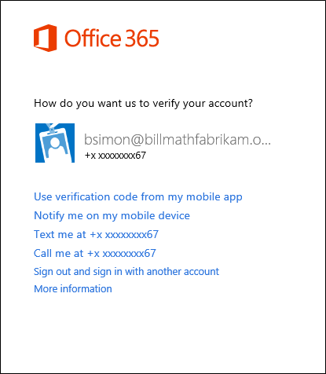

<properties 
	pageTitle="在 Multi-Factor Authentication 中使用替代方法登录" 
	description="本页介绍用户如何在 Azure MFA 中使用替代方法登录。" 
	services="multi-factor-authentication" 
	documentationCenter="" 
	authors="billmath" 
	manager="stevenpo" 
	editor="curtland"/>

<tags 
	ms.service="multi-factor-authentication" 
	ms.date="05/12/2016" 
	wacn.date="06/06/2016"/>

# 在多重身份验证中使用替代方法登录

以下部分将会说明当你的主要方法不可用时，如何使用替代方法进行登录。

## 使用替代方法登录

<ol>

<li>使用你的用户名和密码登录到 Office 365 等应用程序或服务。</li>
<li>选择使用不同的验证选项。系统会显示不同的选项供你选择。看到的选项数目取决于你设置了多少个选项。</li>

<li>选择一种替代方法并登录。</li>

 
<!---HONumber=Mooncake_0530_2016-->