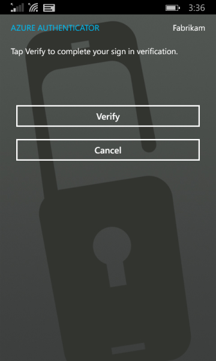

<properties 
	pageTitle="在 Azure Multi-Factor Authentication 中使用通知登录到移动应用" 
	description="本页介绍用户如何在 Azure MFA 中使用移动应用通知登录。" 
	services="multi-factor-authentication" 
	documentationCenter="" 
	authors="billmath" 
	manager="stevenpo" 
	editor="curtland"/>

<tags 
	ms.service="multi-factor-authentication" 
	ms.date="05/12/2016"
	wacn.date="06/06/2016"/>

# 在 Azure 多重身份验证中使用通知登录到移动应用

以下信息介绍在系统向你发送通知后，你在移动应用上使用多重身份验证的体验。

## 使用发送到移动应用的通知登录

<ol>

<li>使用你的用户名和密码登录到 Office 365 等应用程序或服务。</li>
<li>Microsoft 将发送一条通知。</li>

<li>请接听电话并按验证键。</li>

<li>现在你应已登录。</li>

 
<!---HONumber=Mooncake_0530_2016-->