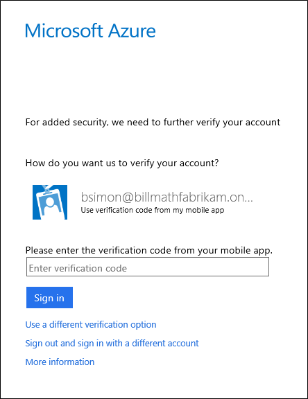

<properties 
	pageTitle="在 Azure Multi-Factor Authentication 中使用验证码登录到移动应用" 
	description="本页介绍用户如何在 Azure MFA 中使用移动应用验证码登录。" 
	services="multi-factor-authentication" 
	documentationCenter="" 
	authors="billmath" 
	manager="stevenpo" 
	editor="curtland"/>

<tags 
	ms.service="multi-factor-authentication" 
	ms.date="05/12/2016" 
	wacn.date="06/06/2016"/>

# 在 Azure 多重身份验证中使用验证码登录到移动应用

以下信息介绍当你使用验证码执行身份验证时，在移动应用上使用多重身份验证的体验。

## 使用移动应用中的验证码登录

<ol>

<li>使用你的用户名和密码登录到 Office 365 等应用程序或服务。</li>
<li>Microsoft 将提示你输入验证码。</li>

<li>打开手机上的 Azure 验证器应用，然后在登录框中输入该代码。</li>

<li>现在你应已登录。</li>

 
<!---HONumber=Mooncake_0530_2016-->