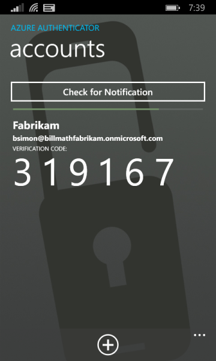

<properties
    pageTitle="使用双重验证的 Azure MFA 登录体验 | Azure"
    description="本页将提供有关在何处查看 Azure MFA 支持的各种登录方法的指导。"
    keywords="用户身份验证, 登录体验, 使用手机登录, 使用办公电话登录"
    services="multi-factor-authentication"
    documentationcenter=""
    author="kgremban"
    manager="femila"
    editor="pblachar" />
<tags
    ms.assetid="b310b762-471b-4b26-887a-a321c9e81d46"
    ms.service="multi-factor-authentication"
    ms.workload="identity"
    ms.tgt_pltfrm="na"
    ms.devlang="na"
    ms.topic="article"
    ms.date="12/15/2016"
    wacn.date="02/20/2017"
    ms.author="kgremban" />  

# Azure 多重身份验证的登录体验
> [AZURE.NOTE]
本页提供的以下文档演示了典型的登录体验。如需登录帮助，请参阅[使用 Azure 多重身份验证时遇到问题](/documentation/articles/multi-factor-authentication-end-user-manage-settings/)
>
>

## 登录体验怎样？
根据登录和使用多重身份验证的方式，体验可能会有所不同。本部分将提供有关预期登录体验的信息。请选择最能描述正在执行操作的一项：

| 正在执行什么操作？ | 说明 |
|:--- |:--- |
| [使用手机或办公电话登录](#signing-in-with-mobile-or-office-phone) |这是使用手机或办公电话登录时可以预期的情况。 |
| [使用通知通过 Microsoft Authenticator 应用登录](#signing-in-with-the-microsoft-authenticator-app-using-notification) |这是将通知与 Microsoft Authenticator 应用配合使用时可以预期的情况。 |
| [使用验证码通过 Microsoft Authenticator 应用登录](#signing-in-with-the-microsoft-authenticator-app-using-verification-code) |这是将验证码与 Microsoft Authenticator 应用配合使用时可以预期的情况。 |
| [使用替代方法登录](#signing-in-with-an-alternate-method) |说明使用替代方法时可以预期的情况。 |

## 使用手机或办公电话登录  

以下信息介绍在使用手机或办公电话执行多重身份验证时的体验。

### 使用办公电话或手机呼叫登录
- 使用用户名和密码登录到 Office 365 等应用程序或服务。
- Microsoft 将会拨打客户电话。
- 请接听电话并按 # 键。
- 现在，应该已登录。

## 使用通知通过 Microsoft Authenticator 应用登录  
以下信息介绍在系统向用户发送通知后，用户在 Microsoft Authenticator 应用上使用多重身份验证的体验。

### 使用发送的通知通过 Microsoft Authenticator 应用登录
- 使用用户名和密码登录到 Office 365 等应用程序或服务。
- Microsoft 将发送通知。

- 请接听电话并按验证键。如果公司需要 PIN，系统会在此处要求用户输入。

  

  

- 现在，应该已登录。

## 使用验证码通过 Microsoft Authenticator 应用登录  

以下信息介绍在使用验证码执行身份验证时，通过 Microsoft Authenticator 应用使用多重身份验证的体验。

### 使用验证码通过 Microsoft Authenticator 应用登录
- 使用用户名和密码登录到 Office 365 等应用程序或服务。
- Microsoft 将提示输入验证码。

  

- 在手机上打开 Microsoft Authenticator 应用，然后在登录框中输入验证码。

  

- 现在，应该已登录。

## 使用替代方法登录  
以下部分介绍当主要方法不可用时如何使用替代方法进行登录。

### 使用替代方法登录
- 使用用户名和密码登录到 Office 365 等应用程序或服务。
- 选择使用不同的验证选项。系统将显示不同的选项选择。显示的选项数取决于设置的选项数。

- 选择替代方法并登录。

<!---HONumber=Mooncake_0213_2017-->
<!--Update_Description: wording update-->