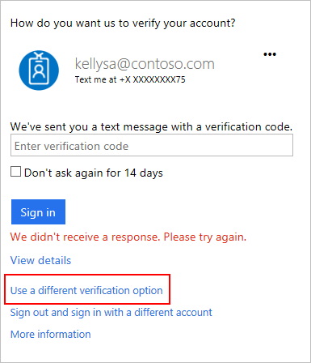

<properties
	pageTitle="双重验证故障排除 | Azure"
	description="本文档向用户提供有关如何解决 Azure 多重身份验证问题的信息。"
	services="multi-factor-authentication"
	keywords = "multifactor authentication 客户端, 身份验证问题, 相关性 ID"
	documentationCenter=""
	authors="kgremban"
	manager="femila"
	editor="yossib"/>  

<tags
	ms.service="multi-factor-authentication"
	ms.workload="identity"
	ms.tgt_pltfrm="na"
	ms.devlang="na"
	ms.topic="article"
	ms.date="10/10/2016"
	wacn.date="11/16/2016"
	ms.author="kgremban"/>  

# 执行双重验证时遇到问题

本文讨论了执行双重验证时可能会遇到的一些问题。如果此处没有包含你遇到的问题，请在注释部分中提供详细的反馈以便我们可以改进。

## 我的手机丢失或被盗

有两种方法可以返回你的帐户。第一种方法是使用你的备用身份验证电话号码进行登录（如果已设置了该电话号码）。第二种方法是要求管理员清除你的设置。

如果你的手机已丢失或被盗，也建议你让管理员重置你的应用密码并清除所有已记住的设备。如果你的管理员不确定如何完成此操作，请向他们推荐以下文章：[管理用户和设备](/documentation/articles/multi-factor-authentication-manage-users-and-devices/#delete-users-existing-app-passwords/)。

### 使用备用电话号码

如果设置了多个验证选项，包括辅助电话号码或另一设备上的验证器应用，则可以使用其中之一进行登录。

若要使用备用电话号码进行登录，请执行以下步骤：

1. 像往常一样进行登录。
2. 当提示进一步验证你的帐户时，选择“使用其他验证选项”。

	  

3. 选择你有权访问的电话号码。

	  

4. 在返回到你的帐户后，[管理你的设置](/documentation/articles/multi-factor-authentication-end-user-manage-settings/)以更改身份验证电话号码。

>[AZURE.IMPORTANT]
>必须配置辅助身份验证电话号码。如果你的主电话号码和移动应用位于同一手机上，并且你的手机丢失或被盗，则你需要第三个选项。

### 清除你的设置

如果未配置辅助身份验证电话号码，则必须联系管理员以寻求帮助。让管理员清除你的设置，以便在你下次登录时再次提示你[设置帐户](/documentation/articles/multi-factor-authentication-end-user-first-time/)。

## 我的手机上未收到短信或呼叫

如果你可以尝试登录但没有收到短信或电话呼叫，可能有多个原因。如果你的手机过去成功收到过短信或电话呼叫，则可能是手机提供商有问题，而不是你的帐户有问题。请确保你的手机信号良好，并且如果尝试接收短信，请确保你的手机和服务计划支持短信。

如果你等待短信或呼叫已过去了几分钟，则进入你的帐户的最快方法是尝试其他选项。

1. 在等待你验证的页面上选择“使用其他验证选项”。

	  

2. 选择要使用的电话号码或发送方式。

	如果你收到了多个验证码，则只有最新的一个验证码才起作用。

如果你没有配置其他方法，请联系管理员并要求他们清除你的设置。你下次登录时，会再次提示你[设置多重身份验证](/documentation/articles/multi-factor-authentication-end-user-first-time/)。

如果经常因为手机信号弱而导致延迟，建议在你的智能手机上使用 [Microsoft Authenticator 应用](/documentation/articles/multi-factor-authentication-microsoft-authenticator/)。该应用可以生成用来登录的随机安全代码，这些代码不需要手机信号或 Internet 连接。

## 应用密码不起作用

首先，请确保正确输入应用密码。如果仍然无法解决问题，请尝试登录并[创建新的应用密码](/documentation/articles/multi-factor-authentication-end-user-app-passwords/)。如果还是不起作用，请与管理员联系并让他们[删除现有应用密码](/documentation/articles/multi-factor-authentication-manage-users-and-devices/#delete-users-existing-app-passwords/)，然后你可以创建一个新密码。

## 我找不到我的问题的解答。

如果你已尝试了这些故障排除步骤但仍然存在问题，请联系管理员或者联系为你设置多重身份验证的人员。他们应当能够为你提供帮助。

另外，你还可以将问题发布到 [Azure AD 论坛](https://social.msdn.microsoft.com/Forums/zh-cn/home?forum=WindowsAzureAD)或者[联系支持人员](https://support.microsoft.com/zh-cn/contactus)，我们将尽快答复你的问题。

如果你联系支持人员，请提供以下信息：

- **用户 ID** - 你尝试登录时使用的是哪个电子邮件地址？
- **错误的一般描述** - 你看到的确切错误消息是什么？ 如果没有任何错误消息，请详细描述你所发现的意外行为。
- **页面** - 你看到错误时位于哪个页面（包括 URL）？
- **ErrorCode** - 你收到的具体错误代码。
- **SessionId** - 你收到的具体会话 ID。
- **相关性 ID** - 用户看到错误时所生成的相关性 ID 代码。
- **时间戳** - 你看到错误时的精确日期和时间（包括时区）是多少？

其中许多信息可以在登录页上找到。当未及时验证你的登录时，请选择“查看详细信息”。

  

提供这些信息将有助于我们尽快为你解决问题。

## 相关主题
- [管理双重验证设置](/documentation/articles/multi-factor-authentication-end-user-manage-settings/)
- [Microsoft Authenticator 应用程序常见问题解答](/documentation/articles/multi-factor-authentication-app-faq/)

<!---HONumber=Mooncake_1107_2016-->
