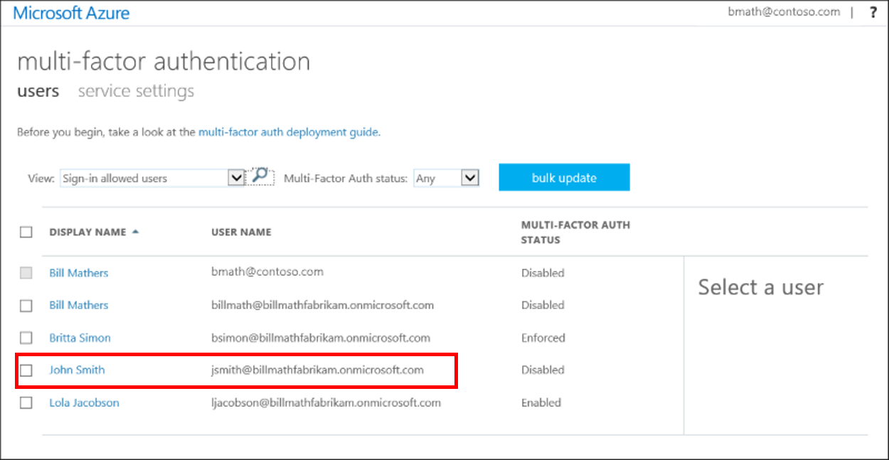

<properties
    pageTitle="云中的 Azure MFA 入门 | Azure"
    description="Azure 多重身份验证页介绍了如何在云中开始使用 Azure MFA。"
    services="multi-factor-authentication"
    documentationcenter=""
    author="kgremban"
    manager="femila"
    editor="yossib" />
<tags
    ms.assetid="6b2e6549-1a26-4666-9c4a-cbe5d64c4e66"
    ms.service="multi-factor-authentication"
    ms.workload="identity"
    ms.tgt_pltfrm="na"
    ms.devlang="na"
    ms.topic="get-started-article"
    ms.date="01/04/2017"
    wacn.date="02/20/2017"
    ms.author="kgremban" />

# 云中的 Azure 多重身份验证入门
本文就如何在云中开始使用 Azure 多重身份验证提供指导。

> [AZURE.NOTE]
以下文档介绍如何使用 **Azure 经典管理门户**启用用户。若要了解如何为 O365 用户设置 Azure 多重身份验证，请参阅 [为 Office 365 用户设置多重身份验证](https://support.office.com/article/Set-up-multi-factor-authentication-for-Office-365-users-8f0454b2-f51a-4d9c-bcde-2c48e41621c6?ui=en-us&rs=en-us&ad=US)。

  

## 先决条件
若要为用户启用 Azure 多重身份验证，必须满足以下先决条件。

[注册 Azure 订阅](/pricing/1rmb-trial/) - 如果没有 Azure 订阅，则需要注册一个订阅。对于只是在摸索如何使用 Azure MFA 的新手，可以使用试用版订阅。

## 为用户打开多重身份验证
若要开始要求用户打开多重身份验证，请将用户状态从“禁用”更改为“启用”。有关用户状态的详细信息，请参阅 [Azure 多重身份验证中的用户状态](/documentation/articles/multi-factor-authentication-get-started-user-states/)

可以使用以下过程为用户启用 MFA。

### 启用多重身份验证
1. 以管理员身份登录 [Azure 经典管理门户](https://manage.windowsazure.cn)。
2. 在左侧单击“Active Directory”。
3. 在“目录”下，选择要为其启用此功能的用户的目录。

4. 在顶部单击“用户”。
5. 在页面底部，单击“管理多重身份验证”。此时会打开新的浏览器选项卡。

6. 找到要为其启用双重验证的用户。你可能需要在顶部切换视图。确保状态为“已禁用”。

7. **勾选**其名称旁边的框。
8. 在右侧，单击“启用”。

9. 单击“启用 Multi-Factor Auth”。

10. 请注意，用户状态已从“禁用”更改为“启用”。

启用用户后，应通过电子邮件通知他们。下次尝试登录时，系统会提示他们为帐户注册双重验证。

## 使用 PowerShell 自动打开双重验证
若要使用 [Azure AD PowerShell](/documentation/articles/powershell-install-configure/) 更改[状态](/documentation/articles/multi-factor-authentication-whats-next/)，可以使用以下代码。可以将 `$st.State` 更改为以下状态之一：

- 已启用
- 强制
- 已禁用

可以选择使用 PowerShell 批量启用用户。目前，Azure 经典管理门户未提供批量启用功能，需要单独选择每个用户。如果有许多用户，则此任务会十分繁琐。使用以下代码创建 PowerShell 脚本后，可循环访问用户列表并启用这些用户。

        $st = New-Object -TypeName Microsoft.Online.Administration.StrongAuthenticationRequirement
        $st.RelyingParty = "*"
        $st.State = “Enabled”
        $sta = @($st)
        Set-MsolUser -UserPrincipalName bsimon@contoso.com -StrongAuthenticationRequirements $sta

下面是一个示例：

    $users = "bsimon@contoso.com","jsmith@contoso.com","ljacobson@contoso.com"
    foreach ($user in $users)
    {
        $st = New-Object -TypeName Microsoft.Online.Administration.StrongAuthenticationRequirement
        $st.RelyingParty = "*"
        $st.State = “Enabled”
        $sta = @($st)
        Set-MsolUser -UserPrincipalName $user -StrongAuthenticationRequirements $sta
    }

有关详细信息，请参阅 [Azure 多重身份验证中的用户状态](/documentation/articles/multi-factor-authentication-get-started-user-states/)

## 后续步骤
现在，已在云中设置 Azure 多重身份验证，接下来可以配置和设置部署。有关更多详细信息，请参阅[配置 Azure 多重身份验证](/documentation/articles/multi-factor-authentication-whats-next/)。

<!---HONumber=Mooncake_0213_2017-->
<!--Update_Description: wording update-->