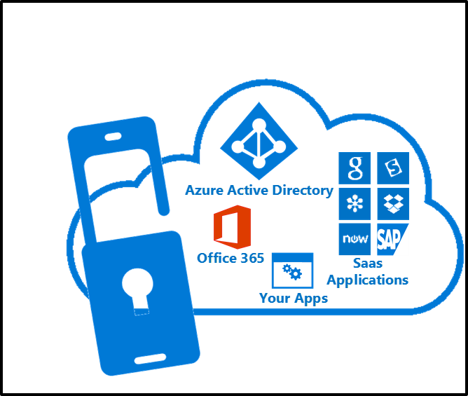
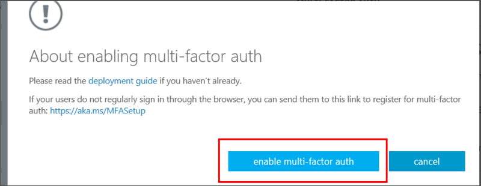

<properties 
	pageTitle="云中的 Azure Multi-Factor Authentication 入门" 
	description="这是与 Azure Multi-Factor Authentication 相关的页面，介绍如何在云中开始使用 Azure MFA。" 
	services="multi-factor-authentication" 
	documentationCenter="" 
	authors="billmath" 
	manager="femila" 
	editor="curtand"/>

<tags 
	ms.service="multi-factor-authentication" 
	ms.date="08/15/2016" 
	wacn.date="09/19/2016"/>

# 云中的 Azure Multi-Factor Authentication 入门
以下文章介绍如何在云中开始使用 Azure 多重身份验证。

> [AZURE.NOTE]  以下文档介绍如何通过 **Azure 经典管理门户**启用用户。若要了解如何为 O365 用户设置 Azure 多重身份验证，请参阅 [Setup multi-factor authentication for Office 365（为 Office 365 设置多重身份验证）](https://support.office.com/zh-cn/article/%e8%ae%be%e7%bd%ae%e5%a4%9a%e9%87%8d%e8%ba%ab%e4%bb%bd%e9%aa%8c%e8%af%81%e6%9c%89%e5%85%b3-Office-365-%e7%94%a8%e6%88%b7-8f0454b2-f51a-4d9c-bcde-2c48e41621c6?ui=zh-CN&rs=zh-CN&ad=CN)。

## 先决条件
若要为用户启用 Azure 多重身份验证，必须满足以下先决条件。

- [注册 Azure 订阅](/pricing/1rmb-trial-full/?form-type=identityauth) - 如果没有 Azure 订阅，则需要注册一个订阅。对于只是在摸索如何使用 Azure MFA 的新手，可以使用试用版订阅
2. [创建 Azure 多重身份验证提供程序](/documentation/articles/multi-factor-authentication-get-started-auth-provider/)并将其分配到目录，或者[将许可证分配给用户](/documentation/articles/multi-factor-authentication-get-started-assign-licenses/)。

> [AZURE.NOTE]  许可证将提供给拥有 Azure MFA、Azure AD Premium 或企业移动性套件 (EMS) 的用户。Azure AD Premium 和 EMS 中包含 MFA。如果你有足够的许可证，则不需要创建 Auth 提供程序。
		

## 为用户启用多重身份验证
若要为某个用户启用多重身份验证，只需将该用户的状态从已禁用更改为已启用。有关用户状态的详细信息，请参阅 [User States in Azure Multi-Factor Authentication（Azure 多重身份验证中的用户状态）](/documentation/articles/multi-factor-authentication-get-started-user-states/)。

可以使用以下过程为用户启用 MFA。

### 启用 Multi-Factor Authentication
--------------------------------------------------------------------------------
1.  以管理员身份登录到 **Azure 经典管理门户**。
2.  在左侧单击“Active Directory”。
3.  在“目录”下单击要为其启用此功能的用户的目录。

4.  在顶部单击“用户”。
5.  在页面底部，单击“管理 Multi-Factor Auth”。

6.  此时将打开一个新的浏览器选项卡。找到要为其启用多重身份验证的用户。你可能需要在顶部切换视图。确保状态为“已禁用”。

7.  **勾选**其名称旁边的框。
7.  在右侧，单击“启用”。

8.  单击“启用 Multi-Factor Auth”。

9.  你应会注意到，用户的状态已从“已禁用”更改为“已启用”。

10.  启用用户后，建议你通过电子邮件通知他们。它还应该通知他们如何使用其非浏览器应用以避免被锁定。

## 使用 PowerShell 自动启用多重身份验证

若要使用 [Azure AD PowerShell](/documentation/articles/powershell-install-configuremd) 更改[状态](/documentation/articles/multi-factor-authentication-whats-next/)，可以使用以下代码。可以将 `$st.State` 更改为以下状态之一：

- Enabled
- 强制
- 已禁用

> [AZURE.IMPORTANT]  请注意，如果直接从“禁用”状态进入“强制”状态，非新式验证客户端将停止工作，因为用户未经历 MFA 注册并获取[应用密码](/documentation/articles/multi-factor-authentication-whats-next/#app-passwords)。如果使用非新式验证客户端并且需要应用密码，建议从“已禁用”状态更改为“已启用”状态。这样，用户便可以注册并获取其应用密码。
		
		$st = New-Object -TypeName Microsoft.Online.Administration.StrongAuthenticationRequirement
		$st.RelyingParty = "*"
		$st.State = “Enabled”
		$sta = @($st)
		Set-MsolUser -UserPrincipalName bsimon@contoso.com -StrongAuthenticationRequirements $sta

使用 PowerShell 是批量启用用户的选项。Azure 门户中目前未提供批量启用功能，需要单独选择每个用户。如果用户数量众多，则这项任务就很繁琐。使用上述代码创建 PowerShell 脚本可以循环访问用户列表并启用这些用户。下面是一个示例：
    
    $users = "bsimon@contoso.com","jsmith@contoso.com","ljacobson@contoso.com"
    foreach ($user in $users)
    {
    	$st = New-Object -TypeName Microsoft.Online.Administration.StrongAuthenticationRequirement
    	$st.RelyingParty = "*"
    	$st.State = “Enabled”
    	$sta = @($st)
    	Set-MsolUser -UserPrincipalName $user -StrongAuthenticationRequirements $sta
    }

有关用户状态的详细信息，请参阅 [User States in Azure Multi-Factor Authentication（Azure 多重身份验证中的用户状态）](/documentation/articles/multi-factor-authentication-get-started-user-states/)。

## 后续步骤
现在你已在云中安装 Multi-Factor Authentication，可以配置和设置部署。请参阅 [Configuring Azure Multi-Factor Authentication（配置 Azure 多重身份验证）](/documentation/articles/multi-factor-authentication-whats-next/)。

<!---HONumber=Mooncake_0912_2016-->