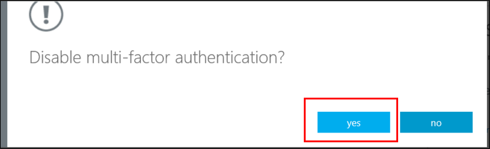

<properties 
	pageTitle="Microsoft Azure Multi-Factor Authentication 用户状态" 
	description="在 Azure MFA 中了解用户状态信息。" 
	services="multi-factor-authentication" 
	documentationCenter="" 
	authors="billmath" 
	manager="stevenpo" 
	editor="curtand"/>

<tags 
	ms.service="multi-factor-authentication" 
	ms.date="05/12/2016" 
	wacn.date="06/14/2016"/>

# Azure Multi-Factor Authentication 中的用户状态

Azure Multi-Factor Authentication 中的用户帐户具有以下三种不同状态：

状态 | 说明 |受影响的非浏览器应用| 说明 
:-------------: | :-------------: |:-------------: |:-------------: |
已禁用 | 未加入 Multi-Factor Authentication 的新用户的默认状态。|否|用户未使用 Multi-Factor Authentication。
Enabled |用户已加入 Multi-Factor Authentication。|否。它们继续工作，直到注册过程完成。|用户已启用 Multi-Factor Authentication，但尚未完成注册过程。这些用户在下次登录时，系统将提示其完成注册过程。
强制|用户已加入，并已完成使用 Multi-Factor Authentication 前的注册过程。|是的。应用需要应用密码。 | 用户不一定完成了注册。如果他们已完成注册过程，表示他们正在使用 Multi-Factor Authentication。否则，在用户下次登录时，系统将提示其完成注册过程。

## 更改用户状态
用户状态更改取决于其是否已针对 MFA 进行设置，以及用户是否已完成整个过程。当为用户打开 MFA，用户的状态从禁用更改为启用。状态已更改为启用的用户登录并完成过程后，其状态将更改为强制。

### 查看用户的状态
--------------------------------------------------------------------------------
1.  以管理员身份登录到 **Azure 经典管理门户**。
2.  在左侧单击“Active Directory”。
3.  在“目录”下单击要为其启用此功能的用户的目录。

4.  在顶部单击“用户”。
5.  在页面底部，单击“管理 Multi-Factor Auth”。

6.  此时将打开一个新的浏览器选项卡。你可以查看用户状态。

###将状态从已禁用更改为已启用
1.  以管理员身份登录到 **Azure 经典管理门户**。
2.  在左侧单击“Active Directory”。
3.  在“目录”下单击要为其启用此功能的用户的目录。

4.  在顶部单击“用户”。
5.  在页面底部，单击“管理 Multi-Factor Auth”。

6.  此时将打开一个新的浏览器选项卡。找到要为其启用 Multi-Factor Authentication 的用户。你可能需要在顶部切换视图。确保状态为“已禁用”。

7.  **勾选**其名称旁边的框。
7.  在右侧，单击“启用”。

8.  单击“启用 Multi-Factor Auth”。

9.  你应会注意到，用户的状态已从“已禁用”更改为“已启用”。

10.  启用用户后，建议你通过电子邮件通知他们。它还应该通知他们如何使用其非浏览器应用以避免被锁定。

### 将状态从已启用/强制更改为已禁用
1.  以管理员身份登录到 **Azure 经典管理门户**。
2.  在左侧单击“Active Directory”。
3.  在“目录”下单击要为其启用此功能的用户的目录。

4.  在顶部单击“用户”。
5.  在页面底部，单击“管理 Multi-Factor Auth”。

6.  此时将打开一个新的浏览器选项卡。找到你要禁用的用户。你可能需要在顶部切换视图。确保状态为“已禁用”或“强制”。
7.  **勾选**其名称旁边的框。
7.  在右侧，单击“禁用”。

8.  系统会提示你确认此操作。单击“是”。

9.  然后，你应会看到该操作已成功。单击“关闭”。

<!---HONumber=Mooncake_0606_2016-->