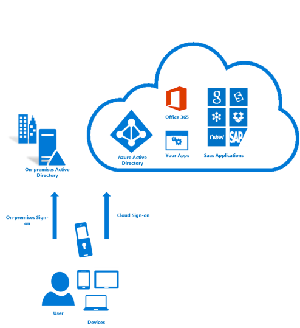

<properties
    pageTitle="Azure 多重身份验证- 工作原理"
    description="Azure 多重身份验证可帮助保护对数据和应用程序的访问，同时可以满足用户对简单登录过程的需求。 它通过要求第二种形式的身份验证提供额外的安全性，并通过一系列简单的身份验证选项提供增强式身份验证。"
    services="multi-factor-authentication"
    documentationcenter=""
    author="kgremban"
    manager="femila"
    editor="curtland"
    translationtype="Human Translation" />
<tags
    ms.assetid="d14db902-9afe-4fca-b3a5-4bd54b3d8ec5"
    ms.service="multi-factor-authentication"
    ms.workload="identity"
    ms.tgt_pltfrm="na"
    ms.devlang="na"
    ms.topic="article"
    ms.date="02/10/2017"
    wacn.date="04/24/2017"
    ms.author="kgremban"
    ms.sourcegitcommit="a114d832e9c5320e9a109c9020fcaa2f2fdd43a9"
    ms.openlocfilehash="2763aea6d6b12357fa4e4030b2346734659aac8c"
    ms.lasthandoff="04/14/2017" />

# Azure 多重身份验证的工作原理
多重身份验证的安全性在于它的分层方法。 破坏多重身份验证系统对于攻击者来说是巨大的挑战。 即使攻击者设法得到用户的密码，如果没有同时占有可信设备也没有用处。 如果用户丢失了设备，捡到该设备的人也无法使用它，除非他（她）也知道该用户的密码。

Azure 多重身份验证可帮助保护对数据和应用程序的访问，同时可以满足用户对简单登录过程的需求。它通过要求第二种形式的身份验证提供额外的安全性，并通过一系列简单的身份验证选项提供增强式身份验证。

- 电话呼叫 
- 短信
- 移动应用通知 - 允许用户选择偏好的方法
- 移动应用验证码

## 可用于多重身份验证的方法
当用户登录时，系统会将额外的身份验证发送给该用户。  以下是可用于这种二次身份验证的方法列表。

| 验证方法 | 说明 |
| --- | --- |
| 电话呼叫 |向用户的注册手机拨打电话，要求他们按 # 号或输入 PIN 来验证其登录。 |
| 短信 |将包含 6 位数代码的短信发送到用户的移动电话。  输入此代码即可完成验证过程。 |
| 移动应用通知 |将验证请求发送到用户的智能手机，要求他们通过在移动应用中选择“验证”来完成验证。 如果你将应用通知选作主要验证方法，则会发生这种情况。  如果用户在未登录时收到通知，他们可以选择将通知举报为欺诈。 |
| 移动应用验证码 |在用户的智能手机上运行的移动应用将显示一个每隔 30 秒钟更改一次的 6 位数字验证码。 用户找到最新代码，并在登录页上输入该代码，以完成验证过程。 如果将验证码选作主要验证方法，则会发生这种情况。 |
Azure 多重身份验证为云和服务器提供了可选择的验证方法。 这表示可以选择用户可使用的方法：电话呼叫、信息、应用通知或应用代码。 有关更多信息，请参阅[可选择的验证方法](/documentation/articles/multi-factor-authentication-whats-next/#selectable-verification-methods/)。

## 后续步骤

- 阅读有关 [Azure 多重身份验证的不同版本和使用方法](/documentation/articles/multi-factor-authentication-versions-plans/)的信息

- 选择是否将 Azure MFA 部署[在云中](/documentation/articles/multi-factor-authentication-get-started-cloud/)

<!--Update_Description: wording update-->