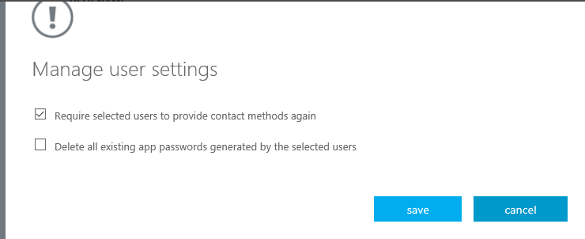
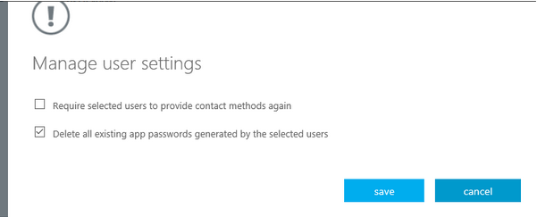

<properties
    pageTitle="管理员管理用户和设备 - Azure MFA | Azure"
    description="本文介绍如何更改用户设置，例如，强制用户再次完成验证过程。"
    documentationcenter=""
    services="multi-factor-authentication"
    author="kgremban"
    manager="femila"
    editor="yossib"
    translationtype="Human Translation" />
<tags
    ms.assetid="aac3b922-7cc1-428c-9044-273579aa7b5a"
    ms.service="multi-factor-authentication"
    ms.workload="identity"
    ms.tgt_pltfrm="na"
    ms.devlang="na"
    ms.topic="article"
    ms.date="02/23/2017"
    wacn.date="04/24/2017"
    ms.author="kgremban"
    ms.sourcegitcommit="a114d832e9c5320e9a109c9020fcaa2f2fdd43a9"
    ms.openlocfilehash="06a48b2cf7cdec38c354b3ae4e8f5192d363d66d"
    ms.lasthandoff="04/14/2017" />

# 管理云中 Azure 多重身份验证的用户设置
作为管理员，可以管理以下用户和设备设置：

- 要求选定的用户再次提供联系方法
- 删除用户现有的应用密码

## 要求选定的用户再次提供联系方法
此项设置将强制用户在登录时再次完成注册过程。 请注意，如果用户拥有应用密码，则非浏览器应用将继续工作。  你也可以通过选择“删除选定用户生成的所有现有应用密码”来删除用户的应用密码 。

### 如何要求用户再次提供联系方法
1. 登录到 Azure 经典管理门户。
2. 在左侧单击“Active Directory”。
3. 在“目录”下，单击被要求再次提供联系方法的用户对应的目录。
4. 在顶部单击“用户”。
5. 在页面底部，单击“管理多重身份验证”。 此时将打开“多重身份验证”页。
6. 找到要管理的用户，并勾选其名称旁边的框。 你可能需要在顶部切换视图。
7. 右侧将显示“管理用户设置”链接。 请单击此按钮。
8. 选中“要求选定用户重新提供联系方式”。
   
9. 单击“保存”。
10. 单击“关闭”

## 删除用户现有的应用密码
这会删除用户创建的所有应用密码。 与这些应用密码关联的非浏览器应用将会停止工作，直到创建新应用密码为止。

### 如何删除用户现有的应用密码
1. 登录到 Azure 经典管理门户。
2. 在左侧单击“Active Directory”。
3. 在“目录”下，单击你要删除其应用密码的用户对应的目录。
4. 在顶部单击“用户”。
5. 在页面底部，单击“管理多重身份验证”。 此时将打开“多重身份验证”页。
6. 找到要管理的用户，并勾选其名称旁边的框。 你可能需要在顶部切换视图。
7. 右侧将显示“管理用户设置”链接。 请单击此按钮。
8. 选中“删除选定用户生成的所有现有应用密码”。
   
9. 单击“保存”。
10. 单击“关闭”。

<!--Update_Description: wording update-->