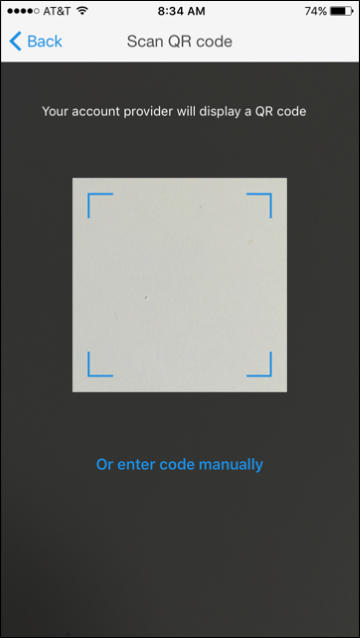
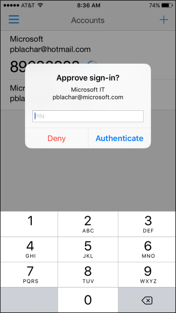
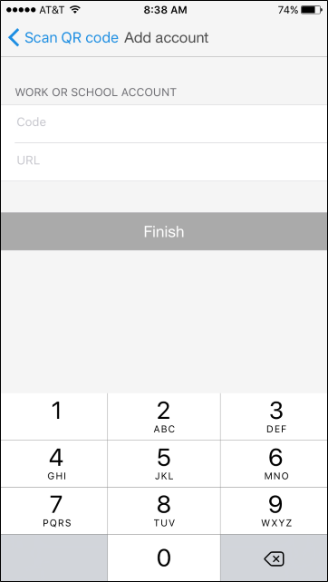

<properties
	pageTitle="手机版 Microsoft Authenticator 应用 | Azure"
	description="了解如何升级到最新版本的 Azure Authenticator。"
	services="multi-factor-authentication"
	documentationCenter=""
	authors="billmath"
	manager="femila"
	editor="curtland"/>

<tags
	ms.service="multi-factor-authentication"
	ms.workload="identity"
	ms.tgt_pltfrm="na"
	ms.devlang="na"
	ms.topic="article"
	ms.date="08/22/2016"
	wacn.date="11/28/2016"
	ms.author="kgremban"/>  

# Microsoft Authenticator

Microsoft Authenticator 应用在 Azure 帐户（例如，bsimon@contoso.partner.onmschina.cn）、本地工作帐户（例如，bsimon@contoso.com）或 Microsoft 帐户（例如，bsimon@outlook.com）中提供附加安全级别。

该应用以下面两种方式之一工作：

- **通知**。该应用通过将通知推送到智能手机或平板电脑，可帮助防止对帐户进行未经授权的访问，以及停止欺诈性交易。可以直接查看通知，如果该通知是合法的，则选择“验证”。否则，可以选择“拒绝”。有关拒绝通知的信息，请参阅“如何针对多重身份验证使用拒绝并报告欺诈功能”。

- **密码及验证码**。该应用可用作生成 OAuth 验证码所需的软件令牌。出现提示时，在登录屏幕中输入该应用提供的代码，以及用户名和密码。验证码提供了第二种形式的身份验证。

随着 Microsoft Authenticator 应用的发布，将取代旧的 Azure Authenticator 应用。可以继续使用 Azure Authenticator 应用，不过，如果决定过渡到新的 Microsoft Authenticator 应用，本文可提供帮助。

## 安装应用

Microsoft Authenticator 应用可用于 [Windows Phone](http://go.microsoft.com/fwlink/?Linkid=825071)、[Android](http://go.microsoft.com/fwlink/?Linkid=825072) 和 [IOS](http://go.microsoft.com/fwlink/?Linkid=825073)。

## 将帐户添加到应用

对于要添加到 Microsoft Authenticator 应用的每个帐户，使用以下过程之一。

### 使用 QR 码扫描仪将帐户添加到应用

1. 转到安全验证设置屏幕。有关如何访问此屏幕的信息，请参阅[更改安全设置](/documentation/articles/multi-factor-authentication-end-user-manage-settings/)。

2. 选择“配置”。

	  

	这将显示一个有 QR 码的屏幕。

	  

3. 打开 Microsoft Authenticator 应用。在“帐户”屏幕上，选择 **+**，然后指定要添加工作帐户或学校帐户。

	  

	  

4. 使用相机扫描该 QR 码，然后选择“完成”以关闭该 QR 码屏幕。

	  

	如果相机不能正常工作，可以手动输入 QR 码和 URL。有关详细信息，请参阅[手动将帐户添加到应用](#add-an-account-to-the-app-manually)。

5. 稍候片刻，帐户即会激活。激活完成后，选择“与我联系”。此时会将通知或验证码发送到手机。选择“验证”。

	  

6. 如果公司需要 PIN 才能批准登录验证，请输入它。

	  

7. 完成 PIN 条目后，选择“关闭”。此时，验证应已成功。
8. 建议输入手机号码，以免无法访问应用。通过下拉列表指定国家/地区，然后在国家/地区名称旁边的框中输入手机号码。选择“下一步”。
9. 此时，已设置联系方法。现在可以为非浏览器应用（例如，Outlook 2010 或更低版本）设置应用密码。如果不使用这些应用，请选择“完成”。否则，继续执行下一步。

	  

10. 如果正在使用非浏览器应用，请复制提供的应用密码，然后将该密码粘贴到这些应用。有关在单个应用（例如 Outlook 和 Lync）上执行的步骤，请参阅“如何将电子邮件中的密码更改为应用密码”和“如何将应用程序中的密码更改为应用密码”。
11. 选择“完成”。

	现在应会在“帐户”屏幕上看到新帐户。

	  

### 手动将帐户添加到应用

1. 转到安全验证设置屏幕。有关如何访问此屏幕的信息，请参阅[更改安全设置](/documentation/articles/multi-factor-authentication-end-user-manage-settings/)。

2. 选择“配置”。

	  

	这将显示一个有 QR 码的屏幕。记下该代码和 URL。

	  

3. 打开 Microsoft Authenticator 应用。在“帐户”屏幕上，选择 **+**，然后指定要添加工作帐户或学校帐户。

	  

	  

4. 在扫描仪中，选择“手动输入代码”。

	  

5. 在应用的相应框中输入该代码和 URL。

	  

	  

6. 稍候片刻，帐户即会激活。激活完成后，选择“与我联系”。此时会将通知或验证码发送到手机。选择“验证”。

现在应会在“帐户”屏幕上看到新帐户。

  

### 使用 Touch ID 将帐户添加到应用

iOS 上的 Microsoft Authenticator 应用支持 Touch ID。Azure 多重身份验证允许组织对设备要求提供 PIN。使用 Touch ID，iOS 用户无需输入 PIN。而是可以扫描其指纹，然后选择“批准”。

使用 Microsoft Authenticator 设置 Touch ID 的过程很简单。已完成使用 PIN 的普通验证问题。如果设备支持 Touch ID，Microsoft Authenticator 将自动为该帐户设置它。

  

随后，需要验证登录时，请选择收到的推送通知，并扫描指纹而不是输入 PIN。

  

## 卸载旧的 Azure Authentication 应用

将所有帐户添加到新应用后，可以从手机中卸载旧应用。

## 删除帐户

若要从 Microsoft Authenticator 应用中删除帐户，请选择帐户，然后选择“删除”。

  

<!---HONumber=Mooncake_1010_2016-->
