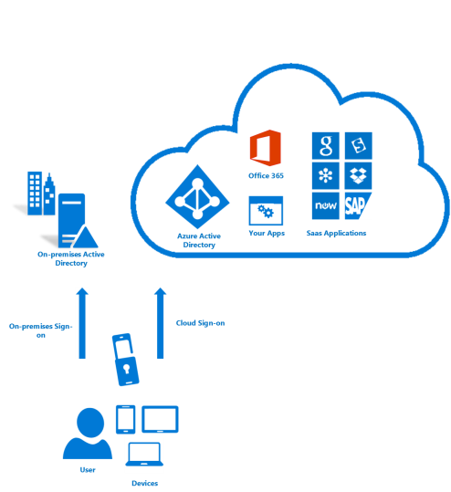

<properties
	pageTitle="什么是 Azure 多重身份验证？| Azure"
	description="本主题介绍什么是多重身份验证 (MFA)、为何使用 MFA，以及有关多重身份验证客户端和不同方法和可用版本的详细信息。Azure 多重身份验证是要求使用多种方式（而不仅仅是用户名和密码）对你的身份进行验证的一种方法。它为用户登录和事务提供了附加的安全层。"
	keywords="MFA 简介, mfa 概述, 什么是 mfa"
	services="multi-factor-authentication"
	documentationCenter=""
	authors="billmath"
	manager="stevenpo"
	editor="curtland"/>  

<tags
	ms.service="multi-factor-authentication"
	ms.workload="identity"
	ms.tgt_pltfrm="na"
	ms.devlang="na"
	ms.topic="article"
	ms.date="10/13/2016"
	wacn.date="12/30/2016"
	ms.author="kgremban"/>  

# 什么是 Azure 多重身份验证？
多重身份验证 (MFA) 是需要使用多个验证方法的身份验证方法，为用户登录和事务额外提供一层重要的安全保障。它需要以下验证方法中的两种或更多种来进行工作：

- 你知道的某样东西（通常为密码）
- 你具有的某样东西（无法轻易复制的可信设备，如电话）
- 你自身的特征（生物辨识系统）

 &#160;&#160;&#160;&#160;&#160; &#160;&#160;&#160;&#160;&#160; &#160;&#160;&#160;&#160;&#160; &#160;&#160;&#160;&#160;&#160; &#160;&#160;&#160;&#160;&#160;

Azure 多重身份验证是要求使用多种方式（而不仅仅是用户名和密码）对你的身份进行验证的一种方法。它为用户登录和事务提供了附加的安全层。

Azure 多重身份验证可帮助保护对数据和应用程序的访问，同时可以满足用户对简单登录过程的需求。它通过各种简单的验证选项（例如电话、短信、移动应用通知或验证码）和第三方 OATH 令牌）来提供强大的身份验证。

##为何使用 Azure 多重身份验证？

与以往相比，联网的用户越来越长。通过智能手机、平板电脑、笔记本电脑和台式个人电脑，人们可以使用各种不同的选项随时连接网络和保持联系。人们可以从任何位置访问他们的帐户与应用程序，这意味着，他们可以提高工作效率并为客户提供更好的服务。

Azure 多重身份验证是一个易于使用、可缩放且可靠的解决方案，可提供另一种身份验证方法，使你的用户永远受到保护。

| | |
:-------------: | :-------------: | :-------------: | :-------------: |
**易用**|**可缩放**|**始终受保护**|**可靠**

- **易用** - Azure 多重身份验证的设置和使用都很方便。Azure 多重身份验证提供额外的保护功能，可让用户使用和管理他们自己的设备，并且在许多情况下，只要单击几下鼠标就能完成设置。
- **可缩放** - Azure 多重身份验证利用云技术并与本地 AD 和自定义应用相集成。这种保护甚至可以延伸到高事务量的任务关键型方案。
- **始终受保护** - Azure 多重身份验证使用最高行业标准提供强大的身份验证功能。
- **可靠** - 我们保证 Azure 多重身份验证的可用性达到 99.9%。当服务无法接收或处理多重身份验证的身份验证请求时，即会将服务视为不可用。

## Azure 多重身份验证的工作原理

多因素身份验证的安全性在于它的分层方法。破坏多因素身份验证系统对于攻击者来说是巨大的挑战。即使攻击者设法得到用户的密码，如果没有同时占有可信设备也没有用处。如果用户丢失了设备，捡到该设备的人也无法使用它，除非他（她）也知道该用户的密码。

Azure 多重身份验证可帮助保护对数据和应用程序的访问，同时可以满足用户对简单登录过程的需求。它通过要求第二种形式的身份验证提供额外的安全性，并通过一系列简单的身份验证选项提供增强式身份验证：

- 电话呼叫
- 短信
- 移动应用通知 - 允许用户选择偏好的方法
- 移动应用验证码
- 第三方 OATH 令牌

## 可用于多重身份验证的方法
当用户登录时，系统会将额外的身份验证发送给该用户。以下是可用于这种二次身份验证的方法列表。

验证方法 | 说明
------------- | ------------- |
电话呼叫 | 向用户的智能手机拨打电话，要求他们按 # 号来验证其登录。这样就会完成验证过程。此选项可配置，并可以更改为你指定的代码。
短信 | 将包含 6 位数代码的短信发送到用户的智能手机。输入此代码即可完成验证过程。
移动应用通知 | 将验证请求发送到用户的智能手机，要求他们通过在移动应用中选择“验证”来完成验证。如果你将应用通知选作主要验证方法，则会发生这种情况。如果用户在未登录时收到通知，他们可以选择将通知举报为欺诈。</li> 
 Microsoft Authenticator 应用可用于 [Windows Phone](http://go.microsoft.com/fwlink/?Linkid=825071)、[Android](http://go.microsoft.com/fwlink/?Linkid=825072) 和 [IOS](http://go.microsoft.com/fwlink/?Linkid=825073)。
移动应用的验证码 | 将验证码发送到用户智能手机中运行的移动应用。如果将验证码选作主要验证方法，则会发生这种情况。</li> 
 Microsoft Authenticator 应用可用于 [Windows Phone](http://go.microsoft.com/fwlink/?Linkid=825071)、[Android](http://go.microsoft.com/fwlink/?Linkid=825072) 和 [IOS](http://go.microsoft.com/fwlink/?Linkid=825073)。

## 可用的 Azure 多重身份验证版本
Azure 多重身份验证有三个不同的版本。下表较详细地描述了每个版本。

版本 | 说明
------------- | ------------- |
适用于 Office 365 的多重身份验证 | 此版本专门与 Office 365 应用程序配合使用，可以从 Office 365 门户进行管理。因此，管理员现在可以借助多重身份验证来保护其 Office 365 资源。Office 365 订阅随附了此版本。
面向 Azure 管理员的多重身份验证 | 适用于 Office 365 的多重身份验证功能的相同子集将免费提供给所有 Azure 管理员使用。Azure 订阅的每个管理员帐户现在可以通过启用这项核心多重身份验证功能来获得更多的保护。因此，如果某个管理员想要访问 Azure 门户预览以创建 VM 和网站以及管理存储、移动服务或任何其他 Azure 服务，则可在其管理员帐户中添加多因素身份验证。
Azure 多重身份验证 | 多重身份验证提供最丰富的功能集。它通过 Azure 管理门户、高级报告及支持一系列本地和云应用程序来提供其他配置选项。Azure 多重身份验证随附在 Azure Active Directory Premium 和企业移动套件中。

## 版本功能比较
下表提供了 Azure 多重身份验证各版本中可用的功能列表。

功能 | 适用于 Office 365 的多重身份验证（随附在 Office 365 SKU 中）|面向 Azure 管理员的多重身份验证（随附在 Azure 订阅中） | Azure 多重身份验证（随附在 Azure AD Premium 和企业移动套件中）
------------- | :-------------: |:-------------: |:-------------: |
管理员可以使用 MFA 保护帐户| * | *（仅适用于 Azure 管理员帐户）|*
将移动应用用作第二个因素|* | * | *
将电话呼叫用作第二个因素|* | * | *
将短信用作第二个因素|* | * | *
不支持 MFA 的客户端的应用密码|* | * | *
管理员控制身份验证方法| *|* | *
PIN 模式| | | *
欺诈警报| | | *
MFA 报告| | | *
一次性跳过| | | *
通话的自定义问候语| | | *
可自定义来电者 ID| | | *
事件确认| | | *
受信任的 IP| | | *
记住受信任的设备的 MFA |* | * | *
MFA SDK | | | *需要 Multi-Factor Auth 提供程序和完整的 Azure 订阅
对使用 MFA 服务器的本地应用程序进行 MFA| | | *

## 如何获取 Azure 多重身份验证

如果你想要获取 Azure 多重身份验证提供的完整功能，而不只是针对 Office 365 用户和 Azure 管理员提供的功能，可以使用多个选项：

1.	购买 Azure 多重身份验证许可证并将其分配给用户。
2.	购买随附了 Azure 多重身份验证的许可证（例如 Azure Active Directory Premium、Enterprise Mobility Suite 或 Enterprise Cloud Suite）并将其分配给用户。
3.	在 Azure 订阅中创建 Azure 多重身份验证提供程序。如果还没有 Azure 订阅，可以注册 Azure 试用版订阅。在试用过期之前，需要将试用订阅转换为常规订阅。

使用 Azure 多重身份验证提供程序时，有两种使用模式（通过 Azure 订阅计费）可用：

- **按用户**。适用于想要为固定数目的、需要定期进行身份验证的员工启用多重身份验证的企业。
- **按身份验证**。适用于想要为大量的、不定期需要身份验证的外部用户启用多重身份验证的企业。

Azure 多重身份验证为云和服务器提供了可选择的验证方法。这表示你可以选择在多重身份验证中用户可使用哪些方法。当前此功能在多重身份验证的云版本的公共预览中可用。有关更多信息，请参阅[可选择的验证方法](/documentation/articles/multi-factor-authentication-whats-next/#selectable-verification-methods/)。

有关价格详细信息，请参阅 [Azure MFA 定价](/pricing/details/multi-factor-authentication/)。

选择最适合你的组织的按用户或按使用量模式。

## 选择适合自己的多因素安全解决方案

因为 Azure 多重身份验证的种类繁多，我们必须从几个重点来判断，以便找出最合适的版本。这些重点包括：

-	[我要保护什么](#what-am-i-trying-to-secure)
-	[用户位于何处](#where-are-the-users-located)

以下部分将提供有关如何做出判断的指导。

### 我要保护什么？ 

为了确定适当的多重身份验证解决方案，首先我们必须回答一个问题：试图使用第二种身份验证方法来保护什么？它是 Azure 中的应用程序， 还是远程访问系统之类的系统？通过判断我们尝试保护的项目，就可以找出要在何处启用多重身份验证这个问题的答案。

你想要保护什么| 云中的多重身份验证|多重身份验证服务器
------------- | :-------------: | :-------------: |
第一方 Microsoft 应用|* |* |
应用库中的 Saas 应用|* |* |
通过 Azure AD 应用代理发布的 IIS 应用程序|* |* |
不是通过 Azure AD 应用代理发布的 IIS 应用程序 | |* |
VPN、RDG 等远程访问系统| |* |

### 用户位于何处 

接下来，不论是云中的多重身份验证还使用 MFA 服务器的本地多重身份验证，只要根据用户的所在位置，我们就能确定合适的解决方案。

用户位置| 解决方案
------------- | :------------- |
Azure Active Directory| 云中的多重身份验证|
Azure AD 和使用 AD FS 联合身份验证的本地 AD| 云中的 MFA 和 MFA 服务器都是可用选项
Azure AD 和使用 DirSync、Azure AD Sync、Azure AD Connect 的本地 AD - 没有密码同步|云中的 MFA 和 MFA 服务器都是可用选项
Azure AD 和使用 DirSync、Azure AD Sync、Azure AD Connect 的本地 AD - 包含密码同步|云中的多重身份验证
本地 Active Directory|多重身份验证服务器

下表是云中多重身份验证和多重身份验证服务器的功能比较。

 | 云中的多重身份验证 | 多重身份验证服务器
------------- | :-------------: | :-------------: |
将移动应用通知用作第二个因素 | ● | ● |
将移动应用验证码用作第二个因素 | ● | ●
将电话呼叫用作第二个因素 | ● | ●
将单向短信用作第二个因素 | ● | ●
将双向短信用作第二个因素 | | ●
将硬件令牌用作第二个因素 | | ●
不支持 MFA 的客户端的应用密码 | ● |  
管理员控制身份验证方法 | ● | ●
PIN 模式 | | ●
欺诈警报 | ● | ●
MFA 报告 | ● | ●
一次性跳过 | | ●
通话的自定义问候语 | ● | ●
可自定义的来电者 ID | ● | ●
受信任的 IP | ● | ●
记住受信任的设备的 MFA| ● |  
条件性访问 | ● | ●
缓存 | | ●

在确定是要使用云多重身份验证还是本地 MFA 服务器后，接下来可以开始设置并使用 Azure 多重身份验证。**选择代表你的方案的图标！**

 

<!---HONumber=Mooncake_1107_2016-->
