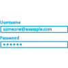

<properties
    pageTitle="了解 Azure MFA 中的多重身份验证 | Azure"
    description="Azure 多重身份验证概念、使用 MFA 的原因、有关多重身份验证客户端以及其他可用方法和版本的详细信息。 "
    keywords="MFA 简介, mfa 概述, 什么是 mfa"
    services="multi-factor-authentication"
    documentationcenter=""
    author="kgremban"
    manager="femila"
    editor="yossib"
    translationtype="Human Translation" />
<tags
    ms.assetid="c40d7a34-1274-4496-96b0-784850c06e9b"
    ms.service="multi-factor-authentication"
    ms.workload="identity"
    ms.tgt_pltfrm="na"
    ms.devlang="na"
    ms.topic="article"
    ms.date="02/13/2017"
    wacn.date="04/24/2017"
    ms.author="kgremban"
    ms.sourcegitcommit="a114d832e9c5320e9a109c9020fcaa2f2fdd43a9"
    ms.openlocfilehash="87f86bdf928aa40f37d22a2718c939d6c4d0a06a"
    ms.lasthandoff="04/14/2017" />

# 什么是多重身份验证？
多重身份验证是需要多种验证方法的身份验证方法，可为用户登录和事务额外提供一层重要的安全保障。 它的工作原理是需要以下两种或多种验证方法：

- 用户知道的某样东西（通常为密码）
- 用户具有的某样东西（无法轻易复制的可信设备，如电话）
- 用户自身的特征（生物辨识系统）

 &nbsp;&nbsp;&nbsp;&nbsp;&nbsp; &nbsp;&nbsp;&nbsp;&nbsp;&nbsp; &nbsp;&nbsp;&nbsp;&nbsp;&nbsp; &nbsp;&nbsp;&nbsp;&nbsp;&nbsp; &nbsp;&nbsp;&nbsp;&nbsp;&nbsp;

Azure 多重身份验证 (MFA) 是 Microsoft 的多重身份验证解决方案。 Azure MFA 可帮助保护对数据和应用程序的访问，同时满足用户对简单登录的需求。 它通过一系列的验证方法（包括电话呼叫、 短信或移动应用验证）提供强身份验证。

## 为何使用 Azure 多重身份验证？
与以往相比，联网的用户越来越多。 通过智能手机、平板电脑、笔记本电脑和台式个人电脑，人们可以使用各种不同的选项随时连接网络和保持联系。 人们可以从任何位置访问他们的帐户和应用程序，这意味着他们可以提高工作效率并为客户提供更好的服务。

Azure 多重身份验证是一个易于使用、可扩展且可靠的解决方案，可提供另一种身份验证方法，使用户永远受到保护。

|  |  |  |  |
|:---:|:---:|:---:|:---:|
| **易用** |**可缩放** |**始终受保护** |**可靠** |

- **易于使用** - Azure 多重身份验证的设置和使用都很方便。 Azure 多重身份验证附带的额外保护允许用户管理自己的设备。 最重要的是，在许多情况下，仅需几次单击即可完成设置。
- **可缩放** - Azure 多重身份验证可利用云技术的强大功能，并与本地 AD 和自定义应用集成。 这种保护甚至可以延伸到高事务量的任务关键型方案。
- **始终受保护** - Azure 多重身份验证使用最高行业标准提供强大的身份验证功能。
- **可靠** - 我们保证 Azure 多重身份验证的可用性达到 99.9%。 服务无法接收或处理多重身份验证的身份验证请求时，会将其视为不可用。

## 后续步骤

- 了解 [Azure 多重身份验证的工作原理](/documentation/articles/multi-factor-authentication-how-it-works/)

- 阅读有关 [Azure 多重身份验证的不同版本和使用方法](/documentation/articles/multi-factor-authentication-versions-plans/)的信息

<!---Update_Description: wording update -->