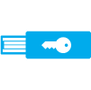

<properties
    pageTitle="了解 Azure MFA 中的多重身份验证 | Azure"
    description="本主题介绍什么是 Azure 多重身份验证，为何使用 MFA，有关多重身份验证客户端的更多信息，以及可用的不同方法和版本。"
    keywords="MFA 简介, mfa 概述, 什么是 mfa"
    services="multi-factor-authentication"
    documentationcenter=""
    author="kgremban"
    manager="femila"
    editor="yossib" />
<tags
    ms.assetid="c40d7a34-1274-4496-96b0-784850c06e9b"
    ms.service="multi-factor-authentication"
    ms.workload="identity"
    ms.tgt_pltfrm="na"
    ms.devlang="na"
    ms.topic="article"
    ms.date="01/23/2017"
    wacn.date="03/14/2017"
    ms.author="kgremban" />  

# 什么是多重身份验证？
双重验证是需要多种验证方法的身份验证方法，可为用户登录和事务额外提供一层重要的安全保障。它的工作原理是需要以下两种或多种验证方法：

- 用户知道的某样东西（通常为密码）
- 用户具有的某样东西（无法轻易复制的可信设备，如电话）
- 用户自身的特征（生物辨识系统）

 &#160;&#160;&#160;&#160;&#160; &#160;&#160;&#160;&#160;&#160; &#160;&#160;&#160;&#160;&#160; &#160;&#160;&#160;&#160;&#160; &#160;&#160;&#160;&#160;&#160;

Azure 多重身份验证 (MFA) 是 Microsoft 的双重验证解决方案。Azure MFA 可帮助保护对数据和应用程序的访问，同时满足用户对简单登录的需求。它通过一系列的验证方法（包括电话呼叫、 短信或移动应用验证）提供强身份验证。

## 为何使用 Azure 多重身份验证？
与以往相比，联网的用户越来越多。通过智能手机、平板电脑、笔记本电脑和台式个人电脑，人们可以使用各种不同的选项随时连接网络和保持联系。人们可以从任何位置访问他们的帐户和应用程序，这意味着他们可以提高工作效率并为客户提供更好的服务。

Azure 多重身份验证是一个易于使用、可扩展且可靠的解决方案，可提供另一种身份验证方法，使用户永远受到保护。

|  |  |  |  |
|:---:|:---:|:---:|:---:|
| **易用** |**可缩放** |**始终受保护** |**可靠** |

- **易于使用** - Azure 多重身份验证的设置和使用都很方便。Azure 多重身份验证附带的额外保护允许用户管理自己的设备。最重要的是，在许多情况下，仅需几次单击即可完成设置。
- **可缩放** - Azure 多重身份验证可利用云技术的强大功能，并与本地 AD 和自定义应用集成。这种保护甚至可以延伸到高事务量的任务关键型方案。
- **始终受保护** - Azure 多重身份验证使用最高行业标准提供强大的身份验证功能。
- **可靠** - 我们保证 Azure 多重身份验证的可用性达到 99.9%。服务无法接收或处理双重验证的身份验证请求时，会将其视为不可用。

## Azure 多重身份验证的工作原理
双重验证的安全性在于其分层方法。破坏多重身份验证方法对于攻击者来说是一项巨大的挑战。即使攻击者设法得到用户的密码，但如果没有可信设备，也是毫无用处的。如果用户设备丢失，捡到该设备的人也无法使用，除非他（她）也知道用户的密码。

## 可用于多重身份验证的方法
用户登录时，系统会向用户发送额外的身份验证请求。以下是可用于此二次身份验证的方法列表。

| 验证方法 | 说明 |
| --- | --- |
| 电话呼叫 |向用户的手机拨打电话，询问以验证他们是否正在登录。按 # 键完成验证过程。此选项可配置，并可以更改为指定的代码。 |
| 短信 |将包含 6 位数代码的短信发送到用户的智能手机。输入此代码以完成验证过程。 |
| 移动应用通知 |将验证请求发送到用户的智能手机，要求他们从移动应用中选择“验证”完成验证。如果应用程序通知是主要验证方法，则会发生这种情况。如果用户在未登录时收到通知，他们可以选择将其举报为欺诈。 |
| 移动应用的验证码 |用户设备上的移动应用会生成验证码。如果选择验证码作为主要验证方法，则会发生这种情况。 |

对于移动应用验证方法，Azure 多重身份验证使用智能手机的第三方身份验证应用。但是，我们建议使用 Microsoft Authenticator 应用，该应用可用于 [Windows Phone](http://go.microsoft.com/fwlink/?Linkid=825071)、[Android](http://go.microsoft.com/fwlink/?Linkid=825072) 和 [IOS](http://go.microsoft.com/fwlink/?Linkid=825073)。

## Azure 多重身份验证的可用版本
Azure 多重身份验证有三个不同版本。

| 版本 | 说明 |
| --- | --- |
| 适用于 Office 365 的多重身份验证 |此版本专门与 Office 365 应用程序配合使用，可以从 Office 365 门户进行管理。因此，管理员现在可以使用双重验证来帮助保护其 Office 365 资源。此版本是 Office 365 订阅的一部分。 |
| 面向 Azure 管理员的多重身份验证 |免费向所有 Azure 管理员提供适用于 Office 365 的同一组双重验证功能。Azure 订阅的每个管理员帐户可以启用此功能，以实现额外的保护。因此，如果管理员要访问 Azure 门户预览以创建 VM 或网站、管理存储或任何其他 Azure 服务，可将 MFA 添加到其管理员帐户。 |
| Azure 多重身份验证 | Azure 多重身份验证（也称为“完整” 版本）提供了最丰富的功能集。它通过 [Azure 经典管理门户](https://manage.windowsazure.cn)、高级报告以及对一系列本地和云应用程序的支持，提供额外的配置选项。Azure 多重身份验证随附在 Azure Active Directory Premium 和企业移动性套件中，可在云中或本地进行部署。查看以下内容，了解[获取 Azure 多重身份验证的其他方法](/documentation/articles/multi-factor-authentication/#how-to-get-azure-multi-factor-authentication/)。 |

## 版本功能比较
下表提供了 Azure 多重身份验证的各个版本中可用的功能列表。

> [AZURE.NOTE]
此比较表讨论了每个版本的多重身份验证的部分功能。如果拥有完整的 Azure 多重身份验证服务，某些功能可能不可用，具体取决于是否在云中使用 MFA。

| 功能 | 适用于 Office 365 的多重身份验证 | 面向 Azure 管理员的多重身份验证 | Azure 多重身份验证 |
| --- |:---:|:---:|:---:|
| 使用 MFA 保护管理员帐户 |● |● （仅适用于 Azure 管理员帐户） |● |
| 将移动应用用作第二个因素 |● |● |● |
| 将电话呼叫用作第二个因素 |● |● |● |
| 将短信用作第二个因素 |● |● |● |
| 不支持 MFA 的客户端的应用密码 |● |● |● |
| 管理员控制验证方法 |● |● |● |
| PIN 模式 | | |● |
| 欺诈警报 | | |● |
| MFA 报告 | | |● |
| 一次性跳过 | | |● |
| 通话的自定义问候语 | | |● |
| 通话的自定义呼叫方 ID | | |● |
| 事件确认 | | |● |
| 受信任的 IP | | |● |
| 记住受信任的设备的 MFA |● |● |● |
| MFA SDK | | |● 需要多重身份验证提供程序和完整的 Azure 订阅 |
| 适用于本地应用程序的 MFA | | |● |

## 如何获取 Azure 多重身份验证 
如果希望使用 Azure 多重身份验证提供的完整功能，有以下几种方法：

1. 购买 Azure 多重身份验证许可证并将其分配给用户。
2. 购买随附了 Azure 多重身份验证的许可证（例如 Azure Active Directory Premium、企业移动性套件或企业云套件）并将其分配给用户。
3. 在 Azure 订阅中创建 Azure 多重身份验证提供程序。使用 Azure 多重身份验证提供程序时，可选择两种使用模式（通过 Azure 订阅计费）：
   - **按用户**。适用于要为固定数量、需要定期进行身份验证的员工启用双重验证的企业。
   - **按身份验证**。适用于要为大量的、需要不定期进行身份验证的外部用户启用双重验证的企业。

Azure 多重身份验证为云和服务器提供了可选择的验证方法。这表示可以选择用户可使用的方法：电话呼叫、信息、应用通知或应用代码。有关详细信息，请参阅 [可选择的验证方法](/documentation/articles/multi-factor-authentication-whats-next/#selectable-verification-methods/)。

有关定价的详细信息，请参阅 [Azure MFA 定价](/pricing/details/multi-factor-authentication/)。

## 后续步骤
若要开始使用 Azure 多重身份验证，第一步是选择云中的 MFA。

<!---HONumber=Mooncake_0306_2017-->
<!---Update_Description: wording update -->