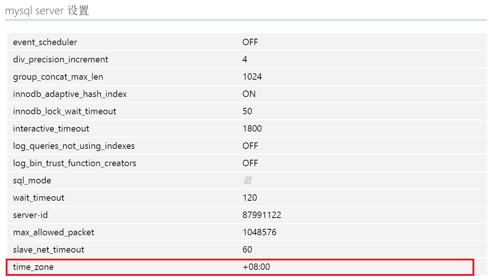

<properties linkid="" urlDisplayName="" pageTitle="Time zone configuration on MySQL on Azure – Microsoft Azure Cloud" metaKeywords="Azure Cloud, technical documentation, documents and resources, MySQL, database, beginner’s guide, Azure MySQL, MySQL PaaS, Azure MySQL PaaS, Azure MySQL Service, Azure RDS" description="Time zone configuration on MySQL on Azure" metaCanonical="" services="MySQL" documentationCenter="Services" title="" authors="" solutions="" manager="" editor="" />

<tags ms.service="mysql" ms.date="" wacn.date="01/14/2015"/>

## Time zone configuration on MySQL on Azure

MySQL Database on Azure currently supports changing the time zone by modifying the parameter settings. To change the time zone, you can sign in to the [Azure Management Portal](https://manage.windowsazure.cn), select “MySQL server configuration” within “**Configuration**”, and then select time\_zone. MySQL on Azure currently defaults to using UTC (Coordinated Universal Time) as the system time. You can configure offsets to update the time. For example, “+10:00” corresponds to the UTC+10 time zone, while “-06:00” corresponds to the UTC-6 time zone.

See [Setting MySQL Database on Azure server parameters](/documentation/articles/mysql-database-advanced-settings) for the specific intervals and details of other parameters.

For example, if you are changing to Beijing time, you can set the time\_zone parameter in the diagram below to: +08:00.

>[AZURE.NOTE] **Named time zones such as "Europe/Helsinki", "US/Eastern" or "MET" are not currently supported.**
*

<!---HONumber=Acom_0218_2016_MySql-->