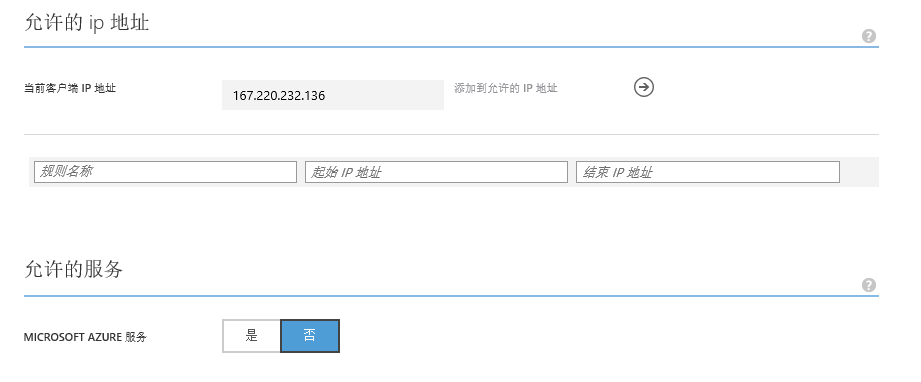
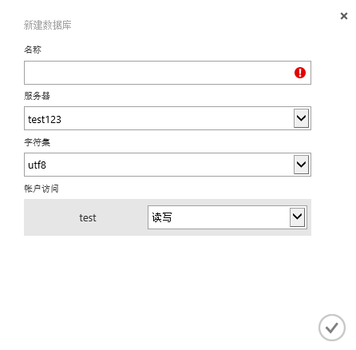

<properties linkid="" urlDisplayName="" pageTitle="MySQL 数据库 on Azure数据库入门 - Azure 微软云" metaKeywords="Azure 云,技术文档,文档与资源,MySQL,数据库,入门指南,Azure MySQL, MySQL PaaS,Azure MySQL PaaS, Azure MySQL Service, Azure RDS" description="快速入门指南帮助您迅速了解MySQL 数据库 on Azure，让您几分钟内轻松创建、连接、迁移、监控管理您的MySQL数据库。您根据入门指南中的步骤操作，将成功建立使用属于您的MySQL数据库。" metaCanonical="" services="MySQL" documentationCenter="Services" title="" authors="" solutions="" manager="" editor="" />  

<tags ms.service="mysql" ms.date="07/05/2016" wacn.date="07/05/2016" wacn.lang="cn" />

> [AZURE.LANGUAGE]
- [中文](/documentation/articles/mysql-database-get-started/)
- [English](/documentation/articles/mysql-database-enus-get-started/)

#MySQL 数据库 on Azure数据库入门

在本教程帮助您将了解如何使用Azure管理门户迅速创建，连接，配置MySQL 数据库 on Azure。完成本教程后，您将在Azure上拥有一个示例MySQL数据库服务器，并了解如何使用管理门户执行基本管理任务。

###目录
- [步骤一：登陆Azure管理门户，创建MySQL服务器](#step1)
- [步骤二：配置防火墙](#step2)
- [步骤三：设置备份时间](#step3)
- [步骤四：创建数据库](#step4)
- [步骤五：连接数据库](#step5)
- [步骤六：数据迁移(可选)](#step6)
- [后续步骤](#nextstep)

##步骤一：登陆Azure管理门户，创建MySQL服务器
1.	登陆到Azure 管理门户, 在右侧导航条选中MySQL 数据库 on Azure。 
2.	单击页面底部的“新建”，单击“新建”后，屏幕上将会出现一个显示可创建内容的列表。
3.	单击“MySQL 数据库 on Azure”, 点击快速创建
 

>[AZURE.NOTE]**您的用户名称是以“服务器名称%用户名”组成，当您连接数据库时请注意填写用户名全称。**

输入创建一个新的服务器需要的参数然后点击创建。一两分钟后您就有了一个新的MySQL服务器。

>[AZURE.NOTE]**强烈建议您将Azure服务放在同一个区域，选择一个最靠近您的位置。**

##步骤二：配置防火墙
首次从您的客户端连MySQL 数据库 on Azure之前你需要配置防火墙，将您的客户端公网IP地址（也可以是IP地址段）加入到白名单中。在管理门户上，点击您的实例，然后点击“配置”，可以通过以下界面完成IP地址添加。

 

默认您在Azure上的其他服务（包括在Azure上的VM）允许访问您的MySQL数据库，您无需再手动添加IP地址。您也可以更改此默认功能，在“允许的服务”中，“Azure 服务”一项选择“否”

##步骤三：设置备份时间
MySQL 数据库 on Azure支持两种备份形式：按需备份和每日定时备份。您可以选中您的MySQL服务器，点击“配置”进行每日备份时间的设置。您可以通过下拉菜单选择自动备份时间。

##步骤四：创建数据库
在一个MySQL服务器中，用户可创建多个数据库，数量上没有限制，但是多个数据库会共享服务器资源。您可以选定MySQL服务器，点击“数据库”，点击左下角“新建”进行数据库的创建。

##步骤五： 连接数据库
您可以通过查看管理门户的”仪表盘”获取server地址，通过应用程序连接您在MySQL 数据库 on Azure的数据库。
>[AZURE.NOTE]MySQL 数据库 on Azure支持SSL连接，如果你的应用与MySQL数据库不在同一个Azure数据中心，我们建议你用SSL连接以增强安全性。

##步骤六：数据迁移（可选）
如果您需要把数据库从别的地方迁移到MySQL 数据库 on Azure，当数据量大的情况下建议您通过以下步骤完成迁移。
- 第一步，把数据从现在的数据库导出到一个文件（比如用mysqldump工具）。
- 第二步，将数据库导出文件传输到您在Azure上的某台VM上。您可以用您熟悉的数据传输工具（比如FTP等），您也可以用[AzCopy](/documentation/articles/storage-use-azcopy/)这一工具（用AzCopy需要先把文件传输到一个存储blob，再传至VM）。
- 第三步，把数据从您的Azure VM上导入到您的MySQL 数据库 on Azure。**这样可以降低连接中途断开而导致迁移失败的可能性**。

##后续步骤
完成上述步骤，您即建立了MySQL 数据库 on Azure数据库，也对管理门户有所了解。接下来，您可以尝试其他功能，如查看数据库使用情况，数据库的备份和恢复，版本的升级降级等等。

如果您在操作中遇到问题，可以查看管理门户帮助指南，也可以联系技术支持，或在[MSDN论坛](https://social.msdn.microsoft.com/Forums/zh-cn/home?forum=AzureMySQLRDS)上提出您的问题。

