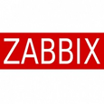

<properties linkid="" urlDisplayName="" pageTitle="使用Azure资源管理器模板部署MySQL PaaS - Azure微软云" metaKeywords="Azure云, 技术文档, 文档与资源, MySQL, 数据库, 资源管理器, ARM, ARM Template, Azure MySQL, MySQL PaaS, Azure MySQL PaaS, Azure MySQL Service, Azure RDS" description="本文介绍如何通过Azure资源管理器模板（ARM Template）快速部署MySQL PaaS以及其它热门应用。" metaCanonical="" services="MySQL" documentationCenter="Services" title="" authors="" solutions="" manager="" editor="" />  

<tags ms.service="mysql" ms.date="03/14/2017" wacn.date="03/14/2017" wacn.lang="cn" />

> [AZURE.LANGUAGE]
- [中文](/documentation/articles/mysql-database-armtemplate-deploymysql/)

#使用Azure资源管理器模板部署MySQL PaaS

本文介绍如何通过Azure资源管理器模板（ARM Template）快速部署MySQL PaaS以及其它热门应用。

##了解Azure资源管理器模板

资源管理器模板是一个JavaScript对象表示法（JSON）文件，用于定义一个或多个要部署到资源组的资源。它也会定义所部署资源之间的依赖关系。使用模板能够以一致方式反复部署资源。有关资源管理器和资源管理器模板的更多信息，请参阅《[Azure资源管理器概述](https://docs.microsoft.com/zh-cn/azure/azure-resource-manager/resource-group-overview)》。

##利用资源管理器模板部署MySQL PaaS

本节介绍如何将PowerShell与ARM Template配合使用，实现MySQL PaaS在Azure上的部署。你的模板可以是本地文件或是可通过URI访问的外部文件。如果模板驻留在存储帐户中，你可以限制对该模板的访问，并在部署过程中提供共享访问签名（SAS）令牌。

若要快速开始进行部署，请使用以下PowerShell命令（以Azure PowerShell 1.0.0+版本为例）：

	New-AzureRmResourceGroup -Name ExampleResourceGroup -Location "chinaeast"
	
	New-AzureRmResourceGroupDeployment -Name ExampleDeployment -ResourceGroupName ExampleResourceGroup -TemplateFile c:\MyTemplates\example.json

这些命令会创建一个资源组，并将模板部署到该资源组。模板文件是本地文件。如果此操作成功，则你会获得所需的全部部署资源。

以下内容为一个相对完整的资源管理器模板，采用JSON文件格式。你可以修改此模板，以符合具体需要。

	{
	  "$schema": "http://schema.management.azure.com/schemas/2015-01-01/deploymentTemplate.json#",
	  "contentVersion": "1.0.0.0",
	  "parameters": {
	    "mysqlServerName": {
	      "type": "string",
	      "metadata": {
	        "description": "MySql 服务器的名字. 最大长度为64个字母数字字符. 请通过 @mysqlServerName.mysqldb.chinacloudapi.cn访问MySql数据库. 管理配置MySql数据库请访问 https://manage.windowsazure.cn"
	      }
	    },
	    "mysqlServerSku": {
	      "type": "string",
	      "defaultValue": "MS2",
	      "allowedValues": [
	        "MS1", "MS2", "MS3", "MS4", "MS5", "MS6"
	      ],
	      "metadata": {
	        "description": "MySql 服务器的性能版本，价格详情请访问 https://www.azure.cn/pricing/details/mysql/"
	      }
	    },
	    "mysqlServerVersion": {
	      "type": "string",
	      "allowedValues": [
	        "5.6", "5.7", "5.5"
	       ],
	      "defaultValue": "5.6",
	      "metadata": {
	        "description": "MySQL服务器版本. "
	      }
	    },
	    "mysqlUserName": {
	      "type": "string",
	      "metadata": {
	        "description": "MySql 服务器登录名。登录名格式为 ‘MySQL服务器名%登录名’，长度小于16个字符。用户名和密码规范请参考： http://dev.mysql.com/doc/refman/5.6/en/user-names.html"
	      }
	    },
	    "mysqlPassword": {
	      "type": "securestring",
	      "metadata": {
	        "description": "MySql 服务器登录密码。长度必须大于8个字符，小于64个字符。用户名和密码规范请参考： http://dev.mysql.com/doc/refman/5.6/en/user-names.html"
	      }
	    },
	    "mysqldatabaseName": {
	      "type": "string",
	      "metadata": {
	        "description": "数据库名字。必须小于64个字符，其它命名规范请参考: http://dev.mysql.com/doc/refman/5.6/en/identifiers.html"
	      }
	    }
	  },
	
	  "resources": [   
	    {
	      "type": "Microsoft.MySql/servers",
	      "name": "[parameters('mysqlServerName')]",
	      "apiVersion": "2015-09-01",
	      "location": "[resourceGroup().location]",
	      "tags": {
	        "displayName": "[parameters('mysqlServerName')]"
	      },
	      "sku": { "name": "[parameters('mysqlServerSku')]" },
	      "properties": {
	        "Charset": "utf8",
	        "Collation": "utf8_general_ci",
	        "version": "[parameters('mysqlServerVersion')]",
	        "AllowAzureServices": true
	      },
	      "resources": [
	        {
	          "name": "[parameters('mysqlUserName')]",
	          "type": "users",
	          "apiVersion": "2015-09-01",
	          "dependsOn": [
	            "[concat('Microsoft.MySql/servers/', parameters('mysqlServerName'))]"
	          ],
	          "properties": {
	            "password": "[parameters('mysqlPassword')]"
	          }
	        },
	        {
	          "name": "[parameters('mysqldatabaseName')]",
	          "type": "databases",
	          "tags": {
	            "displayName": "[parameters('mysqldatabaseName')]"
	          },
	          "apiVersion": "2015-09-01",
	          "dependsOn": [
	            "[concat('Microsoft.MySql/servers/', parameters('mysqlServerName'))]"
	          ],
	          "properties": { },
	          "resources": [
	            {
	              "name": "[parameters('mysqlUserName')]",
	              "type": "privileges",
	              "apiVersion": "2015-09-01",
	              "dependsOn": [
	                "[concat('Microsoft.MySql/servers/', parameters('mysqlServerName'), '/users/', parameters('mysqlUserName'))]",
	                "[concat('Microsoft.MySql/servers/', parameters('mysqlServerName'), '/databases/', parameters('mysqldatabaseName'))]"
	              ],
	              "properties": {
	                "level": "ReadWrite"
	              }
	            }
	          ]
	        }
	      ]
	    }
	  ]
	}

##发布ARM Template至Azure镜像市场

你可以发布自定义的ARM Template至Azure镜像市场，以便最终用户能够实现各项云服务的一键部署。有关如何向Azure镜像市场发布ARM Template的详细指南，请参阅《[Azure镜像市场发布商指南](https://market.azure.cn/Documentation/article/publishguide/)》。

Azure镜像市场是一个镜像仓库，用于第三方ISV发布其镜像类软件，并使Azure付费用户创建新虚机实例并下载需要的第三方镜像使用。此功能可以帮助将寻求基于云的创新解决方案的公司，与开发创新解决方案的Azure ISV合作伙伴直接连接到一起。

用户在镜像市场能够更容易的寻找，获取和使用在Azure平台上构建并充分测试的应用程序，并能够确信应用程序能够受到信任并在Azure上平滑运行。

通过镜像市场能够为独立软件供应商带来新的业务渠道和用户，同时大幅度简化软件推广，管理和部署的难度。我们强烈建议您利用镜像来部署相关应用。只需几个点击，便可快速获得与镜像一致的系统环境或软件。您从此无需费心基础结构及环境配置，便捷地为每个业务平台创建即用型的运行环境。

##镜像市场上的明星产品

###服网LNMP集群 w/ MySQL PaaS-1.0

上海服网提供的LNMP依托于Azure最新ARM构架，全部集群化部署（默认双机部署）。全部虚拟机已加入高可用组，自动分配到不同的Nginx版本1.10.1，架构适用于经典Nginx前后端分离（Nginx动静分离）。

[了解更多](https://market.azure.cn/Vhd/Show?vhdId=12005&version=14150)

[立即部署](https://market.azure.cn/VM/Launch?vhdId=12005&version=14150)（需[登录镜像市场](https://market.azure.cn/Sign/Login?url=%2fVhd%2fShow%3fvhdId%3d12005%26version%3d14150)）

###WordPress-4.6.1（Web应用 + MySQL PaaS）

WordPress是一种使用非常广泛的CMS系统。本应用是根据Azure Resource Manager模板创建的。通过该ARM模板可以快速建立web应用和MySQL数据库，部署WordPress网站源代码。网站和数据库后期的维护可以通过管理门户进行，数据安全，高可用，管理也更加便捷。

[了解更多](https://market.azure.cn/Vhd/Show?vhdId=12006&version=14125)

[立即部署](https://market.azure.cn/VM/Launch?vhdId=12006&version=14125)（需[登录镜像市场](https://market.azure.cn/Sign/Login?url=%2fVhd%2fShow%3fvhdId%3d12006%26version%3d14125)）

###zabbix-2.2.2（Ubuntu 14.04 LTS/OpenLogic 7.2）

zabbix(http://www.zabbix.com) 是一款企业级的开源的免费网络监视工具，能有效监控Windows、Linux和Unix的主机状态，交换机路由器等网络设置，打印机等。

[了解更多](https://market.azure.cn/Vhd/Show?vhdId=12009&version=14123)

[立即部署](https://market.azure.cn/VM/Launch?vhdId=12009&version=14123)（需[登录镜像市场](https://market.azure.cn/Sign/Login?url=%2fVhd%2fShow%3fvhdId%3d12009%26version%3d14123)）