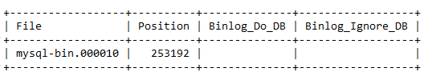
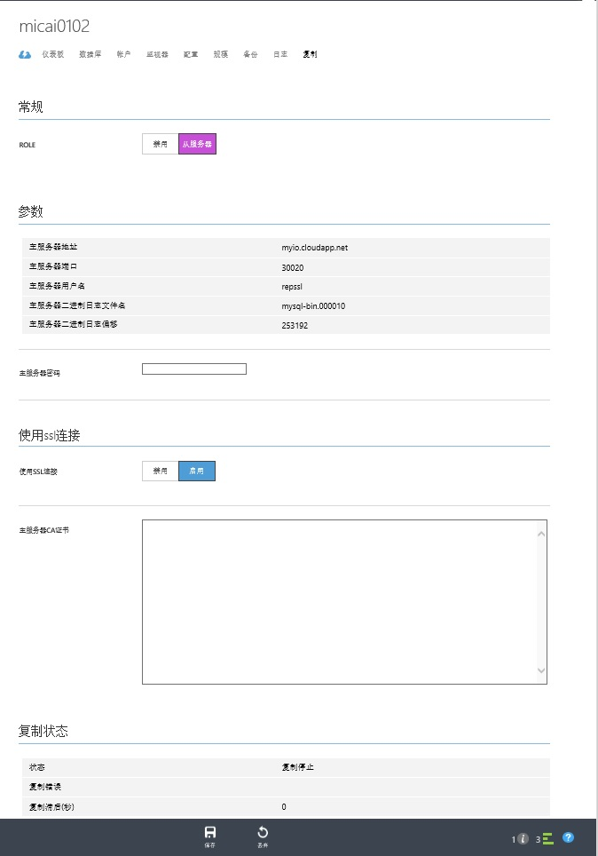
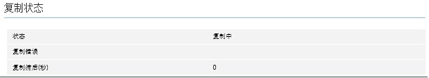

<properties linkid="" urlDisplayName="" pageTitle="如何配置数据同步复制到MySQL Database on Azure- Azure 微软云" metaKeywords="Azure 云,技术文档,文档与资源,MySQL,数据库,服务限制,数据复制，Azure MySQL, MySQL PaaS,Azure MySQL PaaS, Azure MySQL Service, Azure RDS" description="帮助您了解如何通过数据同步功能将本地MySQL实例复制到云端。" metaCanonical="" services="MySQL" documentationCenter="Services" title="" authors="" solutions="" manager="" editor="" />

<tags ms.service="mysql" ms.date="07/05/2016" wacn.date="07/05/2016" wacn.lang="cn" />

> [AZURE.LANGUAGE]
- [中文](/documentation/articles/mysql-database-data-replication/)
- [English](/documentation/articles/mysql-database-enus-data-replication/)

#如何配置数据同步复制到MySQL Database on Azure

MySQL Database on Azure支持从服务器模式和标准的MySQL数据复制。你可以用这个功能把数据库数据从运行在自己本地或者其他地方的MySQL服务器自动同步到运行在MySQL Database on Azure上的从服务器。

##配置步骤
1.	确认主MySQL服务器上的系统变量lower_case_table_names 为1。 如果不是必须设置为1。这是因为MySQL数据复制要求主从服务器端该参数的值必须一致,而在MySQL On Azure上，该参数为1。 
mysql> SET GLOBAL lower_case_table_names = 1;
2.	将主服务器设为只读模式
mysql> FLUSH TABLES WITH READ LOCK;
mysql> SET GLOBAL read_only = ON;
3.	在主服务器端运行sql 命令 “show master status” 从而获取当前的二进制日志文件名和偏移。 返回结果应该类似于

4.	把主服务器上的所有用户的数据库导出,比如你可以用mysqldump工具。
mysqldump --databases <数据库名>  --single-transaction --order-by-primary -r <备份文件名> --routines -h<服务器地址>  -P<端口号> –u<用户名>  -p<密码>
注意：mysql服务器内置的库包括mysql库和test库不需要导出。
5.	数据库导出完成后将主MySQL服务器重新设为可读写模式
mysql> SET GLOBAL read_only = OFF;
mysql> UNLOCK TABLES;  
6.	在主MySQL服务器上建一个用于数据复制的账号并设置权限。
CREATE USER '<your user>'@'%' IDENTIFIED BY '<your password\>';
GRANT REPLICATION SLAVE ON \*.\* TO '<your user\>'@'%';
7.	登录Azure管理门户，在MySQL　Database on Azure上创建一个新的MySQL服务器。
8.	在新创建的MySQL服务器上逐个创建主服务器上的所有用户的数据库。
9.	在新创建的MySQL服务器上创建需要的用户账号。这是因为用户账号信息不会被复制。
10.	把从主服务器上的导出的用户数据库的数据导入到新创建的MySql服务器中。如果数据文件很大建议先把数据文件上传到Azure上的虚拟机然后从虚拟机导入到MySql服务器中。虚拟机应该和新创建的MySQL服务器在同一个数据中心。具体步骤如下。

	1)	上传mysql.exe工具到虚拟机。

	2)	将数据库导出的文件上传到虚拟机上。如果备份文件很大，可以压缩后上传。

	3)	登录到虚拟机，通过mysql.exe连接新创建的MySQL服务器.
mysql -h<服务器地址>  -P<端口号> –u<用户名>  -p<密码>

	4)	运行下列sql命令，导入备份文件中的数据。
source <备份文件名>;

	5)	重复执行 3) -> 6)，直到将所有用户数据库中的数据导入到MySQL服务器中。

11.	将新创建的MySQL服务器设置为从服务器

	1)	选定新创建的MySQL服务器,点击“复制”页。

	2)	将角色更改为“从服务器”,然后填入主服务器参数。

	i.	对于主服务器二进制日志文件名和偏移,请填入我们在步骤2.获取的结果。

	ii.	如果使用SSL连接,请在使用SSL连接处选择启用。然后打开主服务器CA证书,将它的所有内容拷贝到主服务器CA证书输入框中。
	3)	配置好所有信心后点击保存。

>[AZURE.NOTE] **注意:为保证数据的安全性，我们强烈建议使用SSL。**

12.	配置成功后,底部的复制状态应该为复制中。

>[AZURE.NOTE] ** 注意:
- 当MySQL服务器的复制角色配置为从服务器以后,该服务器处于只读模式。
- 当MySQL服务器的复制角色配置为从服务器以后, 除角色外，复制页面所有主服务器参数不可更改。如果有输入错误,只有先将复制角色配置为禁止，然后重新配置从服务器参数。
- 我们推荐将主服务器的binlog_format参数设置为 Mixed或者Row, 从而避免因为使用unsafe statement,例如 sysdate()而引发的数据复制错误.**

##数据复制的限制
1. 不会复制主服务器端针对账户和权限的变动。如果你在主服务器端新建了一个账户而且这个账户需要访问从服务器，那么你需要在MySQL Database on Azure上自己新建一个同样的账户。

2. 主从服务器的版本必须一致。例如都是MySQL5.5 或者都是MySQL5.6。

##数据复制错误的解决
如果复制因为遭遇任何问题而停止，复制状态会更新为复制错误。您可以通过查看复制错误字段,获取与该错误相关的详细信息。
导致复制出错的常见情况包括:
- 从服务器端max_allowed_packet参数的值小于主服务器的该参数的值。该参数指定了MySQL服务器上所允许的DML的最大大小。如果从服务器端该参数的值小于主服务器端， 那么就有可能存在一些DML可以在主服务器端成功执行,而无法在从服务器上执行，从而导致错误。 请确保主从服务器的max_allowed_packet 值一致。

- 将复制角色更改为从服务器时，主服务器参数输入错误。这会导致从服务器无法连接主服务器。

- 主从服务器中数据不一致。例如复制尝试往从服务器中插入一条已经存在的记录。引发该错误的原因可能有多种:

	1) 主服务器上的某些DML没有被记录到二进制日志文件。例如，在主服务器上执行该DML之前，执行了SET sql_log_bin=0

	2)在复制角色更改为从服务器之前，对其进行了错误的写入操作。

	3)在更改复制角色为从服务器时，二进制日志文件名或者偏移量输入错误。

一旦出现数据复制错误,请按照下列步骤解决:

1.	通过Azure管理门户,将该MySQL的复制角色更改为禁止。从而使该MySQL进入可读写模式。

2.	根据复制错误字段,分析错误原因，解决错误。 例如设置max_allowed_packet,使它和主服务器一致,在从服务器上更改导致复制失败的记录。

3.	通过Azure管理门户，重新将该MySQL的复制角色更改为从服务器。

	1)	主服务器二进制日志文件名和偏移是之前复制执行到的主服务器二进制日志文件名和偏移。如果之前不存在二进制日志文件名或者偏移量输入错误,不建议更改。

	2)	因为安全原因,当前不会显示之前输入的主服务器密码和主服务器CA证书。如果不作任何更改,MySQL仍然使用之前输入的密码和CA证书。

	3)	其他主服务器参数字段显示之前输入的相应的参数值。如果没有错误,无需更改。
