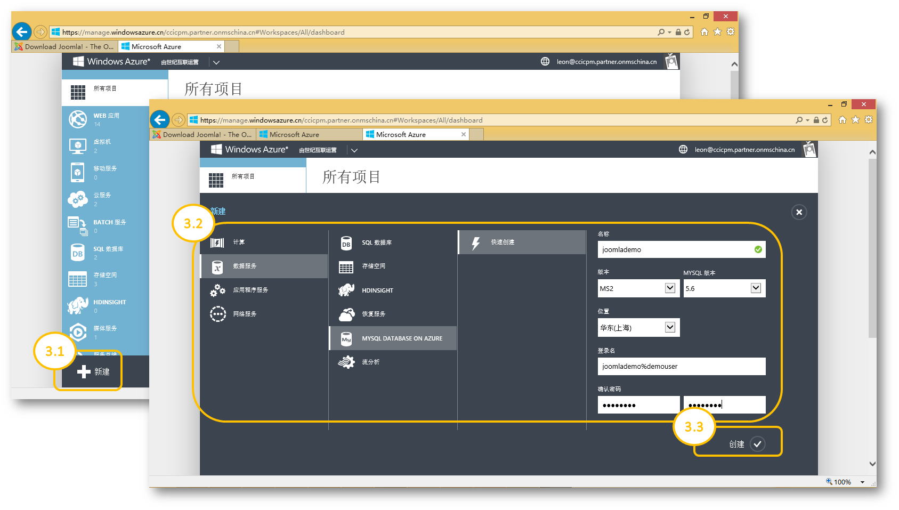
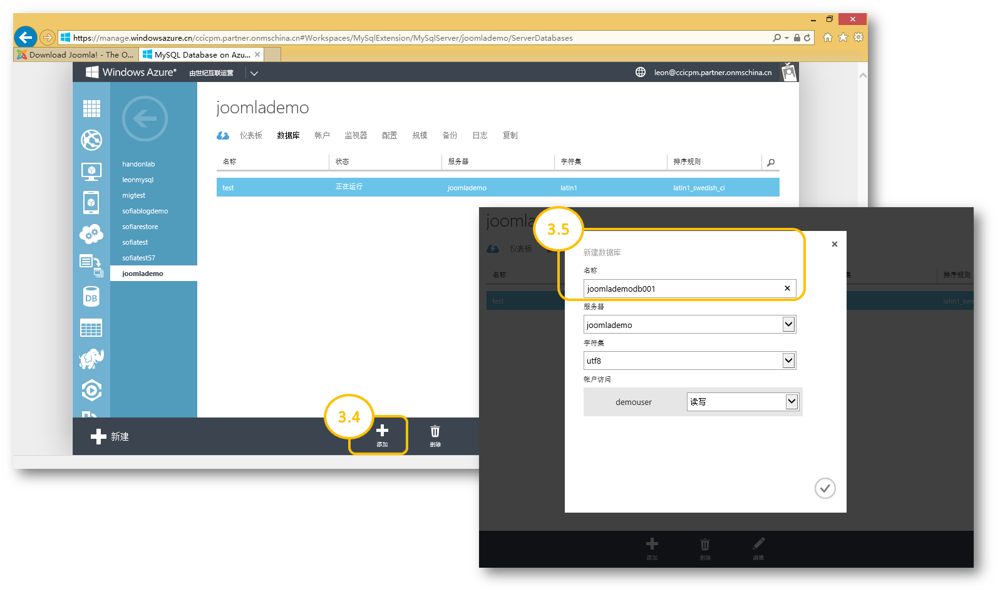
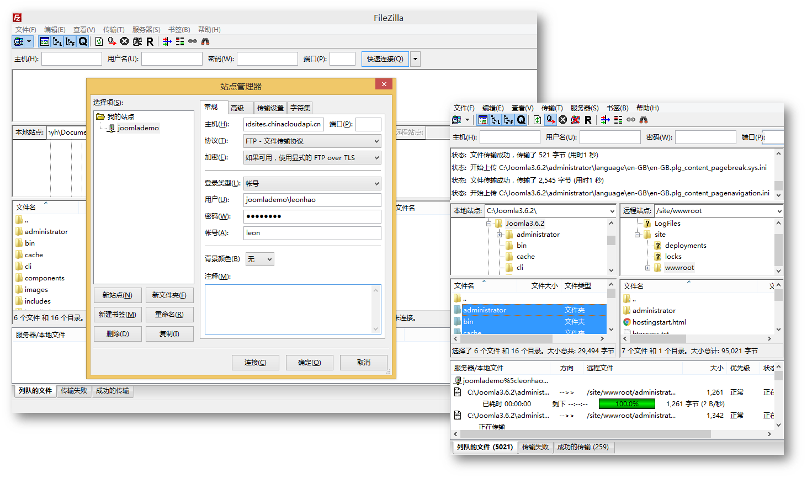
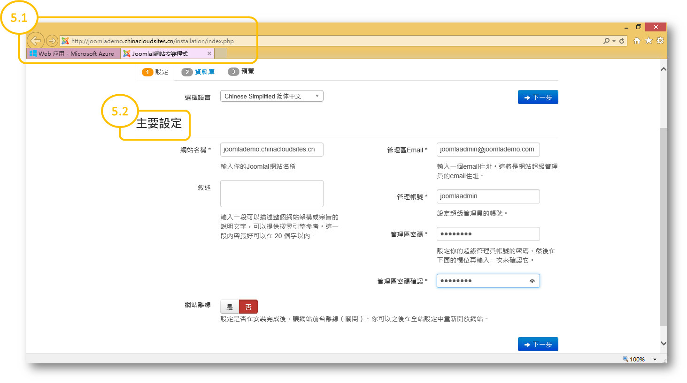
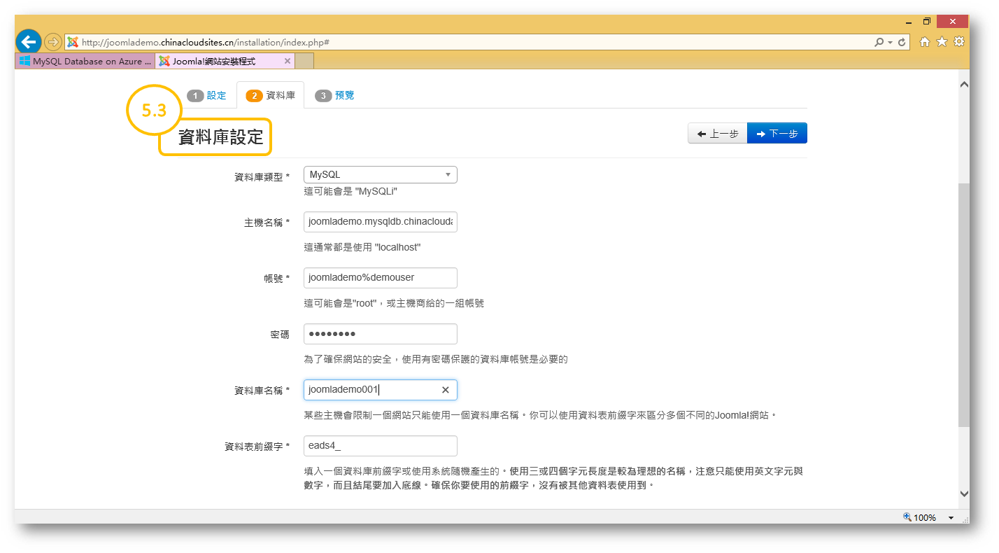
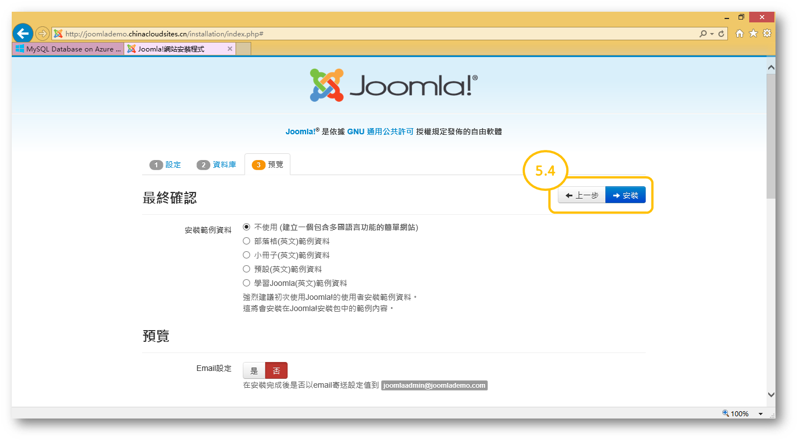
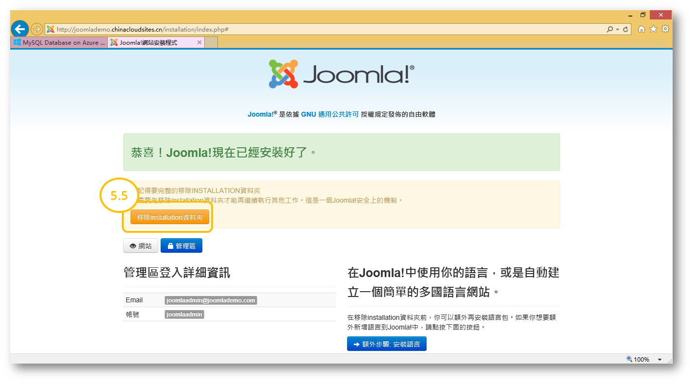

<properties
    linkid=""
    urlDisplayName=""
    pageTitle="Use MySQL Database on Azure to deploy Joomla! apps – Microsoft Azure Cloud"
    metaKeywords="Azure Cloud, technical documentation, documents and resources, MySQL, database, Joomla, Joomla!, Azure MySQL, MySQL PaaS, Azure MySQL PaaS, Azure MySQL Service, Azure RDS"
    description="This article explains in detail the process for using MySQL PaaS services to deploy Joomla! apps."
    metaCanonical=""
    services="MySQL"
    documentationCenter="Services"
    authors="v-chenyh"
    solutions=""
    manager=""
    editor="" />
<tags
    ms.service="mysql_en"
    ms.author="v-chenyh"
    ms.topic="article"
    ms.date="09/22/2016"
    wacn.date="09/22/2016"
    wacn.lang="en" />

> [AZURE.LANGUAGE]
- [中文](/documentation/articles/mysql-database-joomla-setup/)
- [English](/documentation/articles/mysql-database-enus-joomla-setup/)

#Use MySQL Database on Azure to deploy Joomla! apps

Joomla! is a package of free, open-source content management systems that can be used to build commercial websites, personal blogs, information management systems, and web services. Joomla!’s range of uses can also be expanded through secondary development. This course helps you understand how to use MySQL Database on Azure to deploy Joomla! apps.

##Step 1: Download the latest version of the Joomla! installation package and extract it.

1.1 Click the download button on the download page of the official Joomla! website ([Joomla! 3.6.2 download page](https://www.joomla.org/download.html)).

1.2 Save the installation package locally and extract it (the installation package downloaded in this example is Joomla\_3.6.2-Stable-Full\_Package.zip, and it is extracted to C:\Joomla3.6.2).

##Step 2: Create a web app

2.1 Sign in to the [Azure Classic Management Portal](https://manage.windowsazure.cn/), then click on the “New” button in the bottom-left corner.

2.2 Click “Compute > Web App > Quick Create” in that order, then enter the URL (the URL for the website created in this example is joomlademo.chinacloudsites.cn).

2.3 Click on “Create Web App” and wait for Azure to complete the operation.

##Step 3: Create a MySQL Database on Azure server and database

3.1 Sign in to the [Azure Classic Management Portal](https://manage.windowsazure.cn/), then click on the “New” button in the bottom-left corner.

3.2 Click on “Data Services > MySQL Database on Azure > Quick Create” in that order, enter the server name, select the server version and location, then create the database username and password for sign-in (the address for the database we will create in this example is joomlademo.mysqldb.chinacloudapi.cn, and the username is joomlademo%demouser).

3.3 Click on “Create” and wait for Azure to complete the operation.

3.4 After the server creation is complete, go to the database management page for the server and click the “Add” button at the bottom to create the database.

3.5 Enter the database name to finish creating the database (the name of the database created in this example is joomlademodb001).

##Step 4: Upload all the content that you extracted in Step 1 to the /site/wwwroot directory of the web app you created in Step 2.

>You can complete this step using an FTP tool such as FileZilla and the FTP access details obtained from the web app’s dashboard. However, it is important to note that the files and folders in the C:\Joomla3.6.2 directory should be saved directly to the /wwwroot directory, rather than the /wwwroot/joomla3.6.2 directory.

##Step 5: Visit the website created in Step 2, then use a browser to configure Joomla! and complete the installation.

5.1 Open the browser, then enter the URL of the web [app] created in Step 2; or click directly on the URL provided on the Azure Classic Management Portal website dashboard page (if the previous steps were completed correctly, this should take you to the Joomla! installation process page).

5.2 Set the website name and administrator account details (using the URL provided on the Azure Classic Management Portal web app dashboard), then click on “Next.”

5.3 Configure the database type, host name (use the server address provided on the Classic Management Portal website MySQL Database on Azure service dashboard), account (use the user account created in Step 3.2, taking care to use the format servername%username, or username@servername), and database name (use the database name created in Step 3.5), then click “Next.”

5.4 If connection to the server is successful, the Joomla! installation procedure will proceed to Step 3: Preview. At this point, you should check all the settings to confirm that there are no errors, and then click on “Install” to finish deploying the Joomla! app.

5.5 Lastly, you need to click on “Delete the installation folder” on the installation successful page, so that you can continue to perform other operations.

<!--HONumber=May17_HO3-->