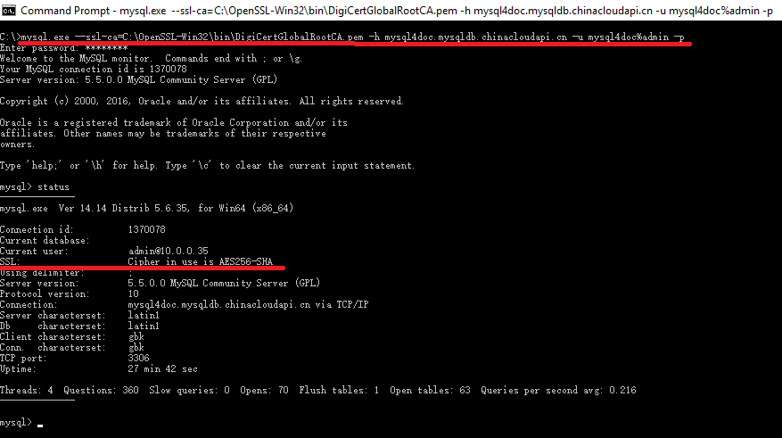
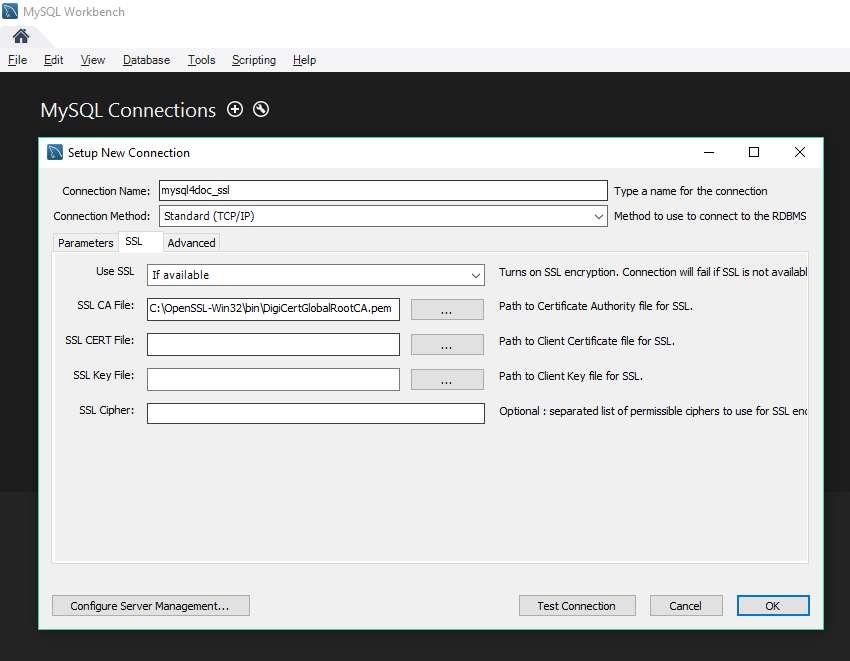

<properties linkid="" urlDisplayName="" pageTitle="Use SSL to securely access MySQL Database on Azure – Azure cloud" metaKeywords="Azure Cloud, technical documentation, documents and resources, MySQL, database, connection pool, Azure MySQL, MySQL PaaS, Azure MySQL PaaS, Azure MySQL Service, Azure RDS" description="Using Secure Sockets Layer (SSL) SSL encryption to access databases helps ensure that your access is secure. This article explains how to download and configure SSL certificates. MySQL Database on Azure currently supports the use of public keys to perform encryption and verification on the server side." metaCanonical="" services="MySQL" documentationCenter="Services" title="" authors="" solutions="" manager="" editor="" />

<tags ms.service="mysql_en" ms.date="04/12/2017" wacn.date="04/12/2017" wacn.lang="en" />

> [AZURE.LANGUAGE]
- [中文](/documentation/articles/mysql-database-ssl-connection/)
- [English](/documentation/articles/mysql-database-enus-ssl-connection/)

# Use SSL to securely access MySQL Database on Azure

Using Secure Sockets Layer (SSL) encryption to access databases helps ensure that your access is secure. This article explains how to download and configure SSL certificates. MySQL Database on Azure currently supports the use of public keys to perform encryption and verification on the server side.

When you create a MySQL Database on Azure instance, we strongly recommend that you put the database instance in the same region as other Azure services. This helps ensure their security even if you do not use SSL encryption.

## Step 1: Download cert file to your local drive

Visit DigiCert official site to download DigiCertGlobalRootCA.cer Root CA. <[Click to download](https://www.digicert.com/CACerts/DigiCertGlobalRootCA.crt)>

## Step 2: Download and install OpenSSL
<[Click to download](http://slproweb.com/download/Win32OpenSSL_Light-1_1_0e.exe)>

## Step 3: Move local file to OpenSSL directory

Move the Root CA downloaded in Step 1 to …\OpenSSL-Win32\bin directory.

## Step 4: Transform the cert file into pem format

The downloaded cert file is in cer format. Use openssl.exe commandline tool installed in Step 2 to transform it into pem format:

	OpenSSL>x509 -inform DEV -in DigiCertGlobalRootCA.cer -out DigiCertGlobalRootCA.pem

## Step 5: Bind the pem cert file with your application

Bind the pem file generated in Step 4 with your application. This article provides examples of how to bind the file with mysql command line interface and MySQL Workbench GUI tool.

### Initiate SSL connection via mysql command line interface

Take example of mysql.exe command line interface. When creating SSL connection, please use --ssl-ca parameter to define cert file:

	mysql.exe --ssl-ca=C:\OpenSSL-Win32\bin\DigiCertGlobalRootCA.pem -h mysql4doc.mysqldb.chinacloudapi.cn -u mysql4doc%admin -p

After successfully connected to the server, use status command to verify SSL connection. If SSL parameter shows "Cipher in use", it means the SSL connection is successfully created.

>[AZURE.NOTE] **MySQL Database on Azure created an SSL secure connection between the proxy server and the client, so while SSL-related global variables or session variables on the server remain set to DISABLED, the entire communication process has actually already been encrypted with TLSv1.**

### Initiate SSL connection via MySQL Workbench GUI tool

MySQL Workbench is a commonly used GUI tool for DBMS. You can configure SSL connection through SSL tab of **Setup New Connection** or **Manage Server Connections** dialogue box.

> **Notes**
> 
> 1. In the **Use SSL** field, select **If available**. Otherwise this may cause the configuration to fail. You may see **SSL not enabled** during the test connection process, but disregard this. Click **OK** to connect to the database.
>
> 2. MySQL Workbench 6.3.5 uses SSL encryption by default, but involves certain compatibility issues. For specific solutions, see [Common client compatibility issues](/documentation/articles/mysql-database-compatibilityinquiry/).

> **Tip:** The current certificate supports MySQL.exe 5.5.44 and 5.6.25 and subsequent versions.

### Configure by using functions

Here is a Python example of configuring SSL connection.

![python SSL access][5]

<!--Image references-->

[5]: ./media/mysql-database-ssl-connection/ssl-005.png