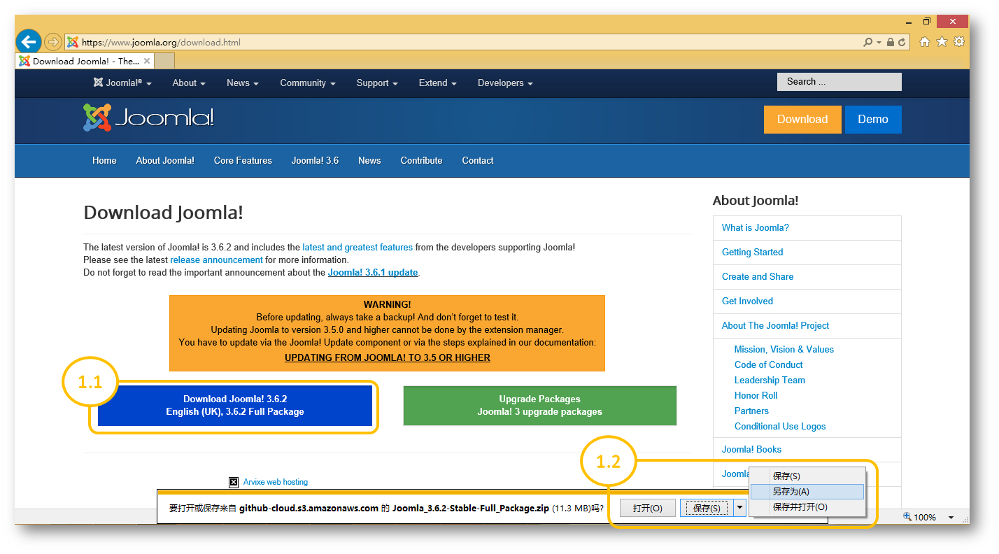

<properties linkid="" urlDisplayName="" pageTitle="使用MySQL Database on Azure部署Joomla!应用 - Azure微软云" metaKeywords="Azure云, 技术文档, 文档与资源, MySQL, 数据库, Joomla, Joomla!, Azure MySQL, MySQL PaaS, Azure MySQL PaaS, Azure MySQL Service, Azure RDS" description="本文详细解释了如何使用MySQL PaaS服务部署Joomla!应用的相关步骤。" metaCanonical="" services="MySQL" documentationCenter="Services" title="" authors="" solutions="" manager="" editor="" />  

<tags ms.service="mysql" ms.date="09/22/2016" wacn.date="09/22/2016" wacn.lang="cn" />

> [AZURE.LANGUAGE]
- [中文](/documentation/articles/mysql-database-joomla-setup/)
- [English](/documentation/articles/mysql-database-enus-joomla-setup/) 

#使用MySQL Database on Azure部署Joomla!应用

Joomla!是一套自由、开放源代码的内容管理系统，可用来搭建商业网站、个人blog、资讯管理系统、Web服务等，还可进行二次开发以扩充使用范围。本教程帮助您了解如何使用MySQL Database on Azure服务部署Joomla!应用。

##步骤1：下载最新版Joomla!安装包并解压缩

1.1 在Joomla!官方网站下载页面上单击下载按钮（[Joomla! 3.6.2下载页面](https://www.joomla.org/download.html)）。

1.2 将安装包保存到本地并解压缩（本例中下载的安装包为Joomla\_3.6.2-Stable-Full\_Package.zip，解压至C:\Joomla3.6.2）。

##步骤2：创建WEB应用

2.1 登录[Azure经典管理门户](https://manage.windowsazure.cn/)，单击左下角“新建”按钮。

2.2 依次单击“计算 > WEB应用 > 快速创建”，并输入URL（本例中，我们创建的网站URL为joomlademo.chinacloudsites.cn）。

2.3 单击“创建WEB应用”，静待Azure完成操作。

##步骤3：创建MySQL Database on Azure服务器与数据库

3.1 登录[Azure经典管理门户](https://manage.windowsazure.cn/)，单击左下角“新建”按钮。

3.2 依次单击“数据服务 > MYSQL DATABASE ON AZURE > 快速创建”，输入服务器名称，选择服务器版本与位置，创建数据库用户登录名和密码（本例中，我们创建的数据库服务器地址为joomlademo.mysqldb.chinacloudapi.cn，用户为joomlademo%demouser）。

3.3 单击“创建”，静待Azure完成操作。

 
3.4 服务器完成创建后，进入该服务器的数据库管理页面，单击底部“添加”按钮创建数据库。

3.5 输入数据库名称，完成数据库的创建（本例中创建的数据库名称为joomlademodb001）。

##步骤4：将步骤1中解压出来的全部内容上传至步骤2所创建WEB应用的/site/wwwroot目录下

>可以使用FileZilla等FTP工具完成此步骤，FTP访问信息可从WEB应用的仪表板上获取。但需注意的是，C:\Joomla3.6.2目录下的文件和文件夹应当直接存放在/wwwroot目录下，而非/wwwroot/joomla3.6.2目录下。

##步骤5：访问步骤2创建的网站，通过浏览器配置Joomla!并完成安装

5.1 打开浏览器，输入您在第2步中创建的WEB URL；或者直接点击Azure经典管理门户网站仪表板页面提供的URL（如果前序步骤正确，此时应进入Joomla!安装程序页面）。

5.2 配置网站名称（使用经典管理门户网站WEB应用仪表板提供的URL）、管理员账号等信息，然后单击“下一步”。

5.3 配置数据库类型、主机名称（使用经典管理门户网站MySQL Database on Azure服务仪表板提供的服务器地址）、账号（使用步骤3.2创建的用户账号，注意格式必须为servername%username，或者username@servername）、数据库名称（使用步骤3.5创建的数据库名称），然后单击“下一步”。

5.4 如果服务器连接成功，则Joomla!安装程序进入第三步：预览；您可在此处检查各种设置，确认无误后单击“安装”即可完成Joomla!应用的部署。

5.5 最后，您需要在安装成功的页面上单击“移除安装文件夹”，以便继续执行其它操作。

