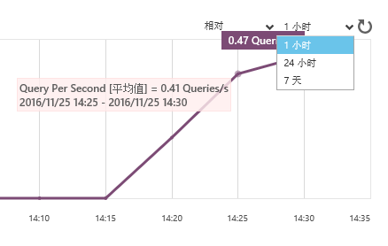
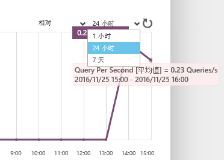
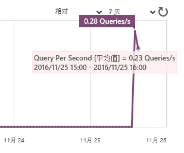

<properties linkid="" urlDisplayName="" pageTitle="监视MySQL 数据库 on Azure数据库 - Azure 微软云" metaKeywords="Azure 云,技术文档,文档与资源,MySQL,数据库,监视,性能指标,Azure MySQL, MySQL PaaS,Azure MySQL PaaS, Azure MySQL Service, Azure RDS" description="MySQL 数据库 on Azure 为用户提供核心性能指标的监控,您可以通过Azure管理门户的仪表盘进行查看。" metaCanonical="" services="MySQL" documentationCenter="Services" title="" authors="" solutions="" manager="" editor="" />

<tags ms.service="mysql" ms.date="11/25/2016" wacn.date="11/25/2016" wacn.lang="cn" />

> [AZURE.LANGUAGE]
- [中文](/documentation/articles/mysql-database-operation-monitoring-metrics/)

#使用监视器监控核心性能指标

在MySQL Database on Azure管理界面上选择数据库，然后点击“监视器”选项卡即可实时监控该数据库的核心性能指标。

| 性能指标 | 描述 |
| ------------- | ------------- |
| CPU Utilization | CPU使用量的峰值 |
| Query Per Second | 每秒查询数量的平均值 |
| Peak Query Per Second | 每秒查询数量的峰值 |
| Select Per Second | 每秒Select查询数量的平均值 |
| Peak Select Per Second | 每秒Select查询数量的峰值 |
| Update Per Second | 每秒Update查询数量的平均值 |
| Peak Update Per Second | 每秒Update查询数量的峰值 |
| Insert Per Seconds | 每秒Insert查询数量的平均值 |
| Peak Insert Per Seconds | 每秒Insert查询数量的峰值 |
| Delete Per Second | 每秒Delete查询数量的平均值 |
| Peak Delete Per Second | 每秒Delete查询数量的峰值 |
| Replace Per Second | 每秒Replace查询数量的平均值 |
| Peak Replace Per Second | 每秒Replace查询数量的峰值 |
| Slow Query Per Second | 每秒慢查询的数量 |
| Slow Queries | 5分钟或1小时内的慢查询数 |
| Successful Connections | 5分钟或1小时内的成功连接数 |
| Throttled Connections | 5分钟或1小时内被抑制的连接数 |
| Network in | 数据传入流量 |
| Network out | 数据传出流量 |
| Storage | 占用的存储空间 |
| Replication Lag In Seconds | 复制延迟（秒） |
| Faild Connections | 5分钟或1小时内的失败连接数 |
| Concurrent Connections | 5分钟或1小时内的同时连接数 |

监视器提供1小时、24小时、7天等三种时间范围选项。以Query Per Second（每秒查询数量的平均值）为例：

- 若选择1小时，则鼠标移至曲线时将显示5分钟内的平均每秒查询数量。

	

- 若选择24小时，则鼠标移至曲线时将显示1小时内的平均每秒查询数量。

	

- 若选择7天，则鼠标移至曲线时将显示1小时内的平均每秒查询数量，但相邻两个刻度（一天）之间将有24个统计值。

	