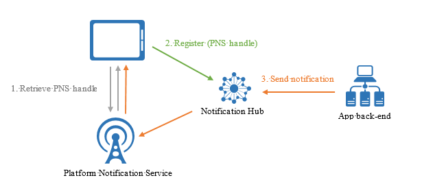

<properties
	pageTitle="注册管理"
	description="本主题说明如何向通知中心注册设备以接收推送通知。"
	services="notification-hubs"
	documentationCenter=".net"
	authors="wesmc7777"
	manager="dwrede"
	editor=""/>

<tags
	ms.service="notification-hubs"
	ms.date="04/11/2016"
	wacn.date="05/18/2016"/>

# 注册管理

##概述

本主题说明如何向通知中心注册设备以接收推送通知。本主题将概要介绍注册，然后介绍注册设备的两种主要模式：直接从设备向通知中心注册，以及通过应用程序后端注册。

##什么是设备注册

向通知中心注册设备是通过使用“注册”或“安装”来完成的。

#### 注册
注册是通知中心的子实体，它将设备的平台通知服务 (PNS) 句柄与标记（有时还包括模板）相关联。PNS 句柄可能是 ChannelURI、设备令牌或 GCM 注册 ID。标记用于将通知路由到一组正确的设备句柄。有关详细信息，请参阅[路由和标记表达式](/documentation/articles/notification-hubs-routing-tag-expressions/)。模板用于实现按注册转换。有关详细信息，请参阅[模板](/documentation/articles/notification-hubs-templates/)。

#### 安装
安装是增强型的注册，包含推送相关的属性包。它是最新且最佳的设备注册方式。但是，客户端 .NET SDK（[用于后端操作的通知中心 SDK](https://www.nuget.org/packages/Microsoft.Azure.NotificationHubs/)）目前不支持安装。这意味着，如果你要从客户端设备本身注册，则必须使用[通知中心 REST API](https://msdn.microsoft.com/library/mt621153.aspx) 方法来支持安装。如果使用后端服务，则应能够使用[用于后端操作的通知中心 SDK](https://www.nuget.org/packages/Microsoft.Azure.NotificationHubs/)。

以下是使用安装的一些主要优点：

* 创建或更新安装是完全幂等的。因此可以重试该操作，而不需要顾虑重复注册的情况。
* 安装模型可让你轻松地执行每次推送（以特定设备为目标）。每次执行基于安装的注册时，都会自动添加一个系统标记 **"$InstallationId:[installationId]"**。因此，你无需编写任何额外的代码，就能对此标记调用 send 以针对特定的设备。
* 使用安装还能执行部分注册更新。可以使用 [JSON-Patch standard](https://tools.ietf.org/html/rfc6902) 以 PATCH 方法来请求部分安装更新。当你想要更新注册中的标记时，此方法特别有用。你不需要删除整个注册，然后重新发送前面的所有标记。

安装可以包含以下属性。有关完整的安装属性列表，请参阅[使用 REST API 创建或覆盖安装](https://msdn.microsoft.com/library/azure/mt621153.aspx)或[安装属性](https://msdn.microsoft.com/library/azure/microsoft.azure.notificationhubs.installation_properties.aspx)。

	// Example installation format to show some supported properties
	{
	    installationId: "",
	    expirationTime: "",
	    tags: [],
	    platform: "",
	    pushChannel: "",
	    ………
	    templates: {
	        "templateName1" : {
				body: "",
				tags: [] },
			"templateName2" : {
				body: "",
				// Headers are for Windows Store only
				headers: {
					"X-WNS-Type": "wns/tile" }
				tags: [] }
	    },
	    secondaryTiles: {
	        "tileId1": {
	            pushChannel: "",
	            tags: [],
	            templates: {
	                "otherTemplate": {
	                    bodyTemplate: "",
	                    headers: {
	                        ... }
	                    tags: [] }
	            }
	        }
	    }
	}

 

请务必注意，注册和安装默认情况下不再过期。

注册与安装必须包含每个设备/通道的有效 PNS 句柄。由于只能在设备上的客户端应用中获取 PNS 句柄，因此有一种模式是直接在该设备上使用客户端应用进行注册。另一方面，与标记相关的安全性考虑和业务逻辑可能要求你在应用后端管理设备注册。

#### 模板

如果你使用[模板](/documentation/articles/notification-hubs-templates/)，则设备安装还会保存与设备关联的、采用 JSON 格式的所有模板（请参阅上面的示例）。模板名称有助于将目标指向相同设备的不同模板。

请注意，每个模板名称将映射到一个模板主体和一组可选的标记。此外，每个平台可能有附加的模板属性。对于 Windows 应用商店（使用 WNS）和 Windows Phone 8（使用 MPNS），模板中还可能会有一组附加标头。对于 APNs，可以将过期属性设为常量或模板表达式。有关完整的安装属性列表，请参阅[使用 REST 创建或覆盖安装](https://msdn.microsoft.com/library/azure/mt621153.aspx)主题。

#### Windows 应用商店应用的辅助磁贴

对于 Windows 应用商店客户端应用程序，将通知发送到辅助磁贴与将通知发送到主磁贴相同。安装中也支持此行为。请注意，辅助磁贴具有不同的 ChannelUri，客户端应用上的 SDK 会在后台处理此 ChannelUri。

SecondaryTiles 字典使用的 TileId 与在 Windows 应用商店应用中创建 SecondaryTiles 时使用的 TileId 相同。与主 ChannelUri 一样，辅助磁贴的 ChannelUri 可随时更改。为了使通知中心中的安装保持更新，设备必须使用辅助磁贴的当前 ChannelUri 刷新这些安装。

##从设备管理注册

从客户端应用管理设备注册时，后端只负责发送通知。客户端应用使 PNS 句柄保持最新状态，并且会注册标记。下图演示了此模式。

设备首先从 PNS 检索 PNS 句柄，然后直接向通知中心进行注册。注册成功之后，应用后端即可发送以该注册为目标的通知。有关如何发送通知的详细信息，请参阅[路由和标记表达式](/documentation/articles/notification-hubs-routing-tag-expressions/)。
请注意，在此情况下，将只使用“侦听”权限从设备访问通知中心。有关详细信息，请参阅[安全性](/documentation/articles/notification-hubs-security/)。

从设备注册是最简单的方法，但存在一些缺点。
第一个缺点是客户端应用只能在它处于活动状态时更新其标记。例如，如果用户有两台设备要注册与体育团队相关的标记，则当第一台设备注册附加标记（例如，Seahawks）时，第二台设备将不会收到有关 Seahawks 的通知，直到第二次在第二台设备上执行应用程序为止。更概括地说，如果标记受多个设备的影响，则从后端管理标记是理想的选择。
从客户端应用管理注册的第二个缺点是，由于应用可能会受到攻击，因此保护特定标记的注册需要格外小心，如“标记级安全性”部分中所述。

#### 使用安装从设备向通知中心注册的示例代码 

此时，仅支持使用[通知中心 REST API](https://msdn.microsoft.com/library/mt621153.aspx) 执行此操作。

你也可以使用 [JSON-Patch standard](https://tools.ietf.org/html/rfc6902) 以 PATCH 方法更新安装。

	class DeviceInstallation
	{
	    public string installationId { get; set; }
	    public string platform { get; set; }
	    public string pushChannel { get; set; }
	    public string[] tags { get; set; }
	}

    private async Task<HttpStatusCode> CreateOrUpdateInstallationAsync(DeviceInstallation deviceInstallation,
		 string hubName, string listenConnectionString)
    {
        if (deviceInstallation.installationId == null)
            return HttpStatusCode.BadRequest;

        // Parse connection string (https://msdn.microsoft.com/library/azure/dn495627.aspx)
        ConnectionStringUtility connectionSaSUtil = new ConnectionStringUtility(listenConnectionString);
        string hubResource = "installations/" + deviceInstallation.installationId + "?";
        string apiVersion = "api-version=2015-04";

        // Determine the targetUri that we will sign
        string uri = connectionSaSUtil.Endpoint + hubName + "/" + hubResource + apiVersion;

        //=== Generate SaS Security Token for Authorization header ===
		// See, https://msdn.microsoft.com/library/azure/dn495627.aspx
        string SasToken = connectionSaSUtil.getSaSToken(uri, 60);

        using (var httpClient = new HttpClient())
        {
            string json = JsonConvert.SerializeObject(deviceInstallation);

            httpClient.DefaultRequestHeaders.Add("Authorization", SasToken);

            var response = await httpClient.PutAsync(uri, new StringContent(json, System.Text.Encoding.UTF8, "application/json"));
            return response.StatusCode;
        }
    }

    var channel = await PushNotificationChannelManager.CreatePushNotificationChannelForApplicationAsync();

    string installationId = null;
    var settings = ApplicationData.Current.LocalSettings.Values;

    // If we have not stored a installation id in application data, create and store as application data.
    if (!settings.ContainsKey("__NHInstallationId"))
    {
        installationId = Guid.NewGuid().ToString();
        settings.Add("__NHInstallationId", installationId);
    }

    installationId = (string)settings["__NHInstallationId"];

    var deviceInstallation = new DeviceInstallation
    {
        installationId = installationId,
        platform = "wns",
        pushChannel = channel.Uri,
        //tags = tags.ToArray<string>()
    };

    var statusCode = await CreateOrUpdateInstallationAsync(deviceInstallation, 
						"<HUBNAME>", "<SHARED LISTEN CONNECTION STRING>");

    if (statusCode != HttpStatusCode.Accepted)
    {
        var dialog = new MessageDialog(statusCode.ToString(), "Registration failed. Installation Id : " + installationId);
        dialog.Commands.Add(new UICommand("OK"));
        await dialog.ShowAsync();
    }
    else
    {
        var dialog = new MessageDialog("Registration successful using installation Id : " + installationId);
        dialog.Commands.Add(new UICommand("OK"));
        await dialog.ShowAsync();
    }

   

#### 使用注册从设备向通知中心注册的示例代码

这些方法为调用它们的设备创建或更新注册。这意味着，若要更新句柄或标记，必须覆盖整个注册。请记住，注册是暂时性的，因此，你始终应使用具有特定设备所需的当前标记的可靠存储。

	// Initialize the Notification Hub
	NotificationHubClient hub = NotificationHubClient.CreateClientFromConnectionString(listenConnString, hubName);

	// The Device id from the PNS
    var pushChannel = await PushNotificationChannelManager.CreatePushNotificationChannelForApplicationAsync();

    // If you are registering from the client itself, then store this registration id in device
	// storage. Then when the app starts, you can check if a registration id already exists or not before
	// creating.
	var settings = ApplicationData.Current.LocalSettings.Values;

	// If we have not stored a registration id in application data, store in application data.
	if (!settings.ContainsKey("__NHRegistrationId"))
	{
		// make sure there are no existing registrations for this push handle (used for iOS and Android)	
		string newRegistrationId = null;
		var registrations = await hub.GetRegistrationsByChannelAsync(pushChannel.Uri, 100);
		foreach (RegistrationDescription registration in registrations)
		{
			if (newRegistrationId == null)
			{
				newRegistrationId = registration.RegistrationId;
			}
			else
			{
				await hub.DeleteRegistrationAsync(registration);
			}
		}

		newRegistrationId = await hub.CreateRegistrationIdAsync();

        settings.Add("__NHRegistrationId", newRegistrationId);
	}
     
    string regId = (string)settings["__NHRegistrationId"];

    RegistrationDescription registration = new WindowsRegistrationDescription(pushChannel.Uri);
    registration.RegistrationId = regId;
    registration.Tags = new HashSet<string>(YourTags);

	try
	{
		await hub.CreateOrUpdateRegistrationAsync(registration);
	}
	catch (Microsoft.WindowsAzure.Messaging.RegistrationGoneException e)
	{
		settings.Remove("__NHRegistrationId");
	}

## 从后端管理注册

从后端管理注册需要编写附加代码。每次设备中的应用启动时，该应用都必须为后端提供已更新的 PNS 句柄（以及标记和模板），然后后端必须在通知中心上更新此句柄。下图演示了此设计。

从后端管理注册的优点是即使在设备上的相应应用处于非活动状态也能修改注册标记，并且在向其注册添加标记之前能够对客户端应用进行身份验证。

#### 使用安装从后端向通知中心注册的示例代码

客户端设备仍会像前面一样获取其 PNS 句柄及相关的安装属性，然后在可以执行注册和授权标记等的后端上调用自定义 API。后端可以利用[适用于后端操作的通知中心 SDK](https://www.nuget.org/packages/Microsoft.Azure.NotificationHubs/)。

你也可以使用 [JSON-Patch standard](https://tools.ietf.org/html/rfc6902) 以 PATCH 方法更新安装。
 

	// Initialize the Notification Hub
	NotificationHubClient hub = NotificationHubClient.CreateClientFromConnectionString(listenConnString, hubName);

    // Custom API on the backend
    public async Task<HttpResponseMessage> Put(DeviceInstallation deviceUpdate)
    {

        Installation installation = new Installation();
        installation.InstallationId = deviceUpdate.InstallationId;
        installation.PushChannel = deviceUpdate.Handle;
        installation.Tags = deviceUpdate.Tags;

        switch (deviceUpdate.Platform)
        {
            case "mpns":
                installation.Platform = NotificationPlatform.Mpns;
                break;
            case "wns":
                installation.Platform = NotificationPlatform.Wns;
                break;
            case "apns":
                installation.Platform = NotificationPlatform.Apns;
                break;
            case "gcm":
                installation.Platform = NotificationPlatform.Gcm;
                break;
            default:
                throw new HttpResponseException(HttpStatusCode.BadRequest);
        }

        // In the backend we can control if a user is allowed to add tags
        //installation.Tags = new List<string>(deviceUpdate.Tags);
        //installation.Tags.Add("username:" + username);

        await hub.CreateOrUpdateInstallationAsync(installation);

        return Request.CreateResponse(HttpStatusCode.OK);
    }

#### 使用注册 ID 从设备向通知中心注册的示例代码

从应用后端可以对注册执行基本 CRUDS 操作。例如：

	var hub = NotificationHubClient.CreateClientFromConnectionString("{connectionString}", "hubName");
            
	// create a registration description object of the correct type, e.g.
	var reg = new WindowsRegistrationDescription(channelUri, tags);

	// Create
	await hub.CreateRegistrationAsync(reg);

	// Get by id
	var r = await hub.GetRegistrationAsync<RegistrationDescription>("id");

	// update
	r.Tags.Add("myTag");

	// update on hub
	await hub.UpdateRegistrationAsync(r);

	// delete
	await hub.DeleteRegistrationAsync(r);

后端必须处理注册更新之间的并发性。服务总线为注册管理提供了乐观并发控制。在 HTTP 级别，这是通过对注册管理操作使用 ETag 来实现的。Microsoft SDK 以透明方式使用此功能，如果由于并发原因拒绝了更新，则会引发异常。应用后端负责处理这些异常并在需要时重试更新。
<!---HONumber=Mooncake_0503_2016-->