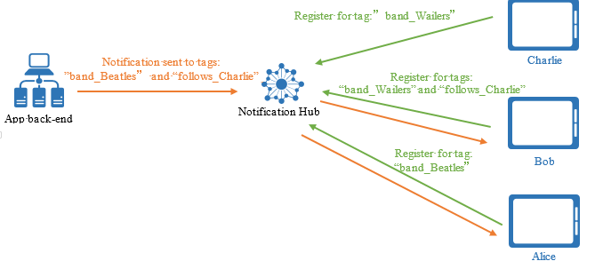
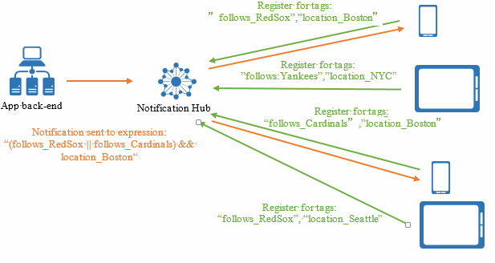

<properties
	pageTitle="路由和标记表达式"
	description="本主题介绍 Azure 通知中心的路由和标记表达式。"
	services="notification-hubs"
	documentationCenter=".net"
	authors="wesmc7777"
	manager="dwrede"
	editor=""/>

<tags
	ms.service="notification-hubs"
	ms.date="03/28/2016"
	wacn.date="05/31/2016"/>

# 路由和标记表达式

##概述

通过通知中心发送推送通知时，使用标记表达式可以定向到特定的设备集或更具体的注册。

## 定向到特定注册

定向到特定注册的唯一方法是将这些注册与标记相关联，然后定向到这些标记。如[注册管理](/documentation/articles/notification-hubs-registration-management/)中所述，应用要接收推送通知，必须在通知中心内注册设备句柄。在通知中心内创建注册后，应用程序后端便可向它发送推送通知。应用程序后端可以通过以下方式选择要将特定通知定向到的注册：

1. **广播**：通知中心内的所有注册均将收到通知。
2. **标记**：包含指定标记的所有注册将收到通知。
3. **标记表达式**：其标记集匹配指定表达式的所有注册将收到通知。

## 标记

标记可以是任意字符串，最多 120 个字符，可以包含字母数字和以下非字母数字字符：“\_”、“@”、“#”、“.”、“:”、“-”。以下示例显示了一个应用程序，你可以从中接收有关特定乐队的 toast 通知。在此方案中，路由通知的一种简便方法是使用代表不同乐队的标记（如下图所示）为注册添加标签。

在此图中，标记为 **Beatles** 的消息仅传送到使用标记 **Beatles** 注册的平板电脑。

有关针对标记创建注册的详细信息，请参阅[注册管理](/documentation/articles/notification-hubs-registration-management/)。

你可以使用 [Azure 通知中心](https://www.nuget.org/packages/Microsoft.Azure.NotificationHubs/) SDK 中 `Microsoft.Azure.NotificationHubs.NotificationHubClient` 类的 send notifications 方法将通知发送到标记。你还可以使用 Node.js 或推送通知 REST API。下面是使用 SDK 的示例。

	Microsoft.Azure.NotificationHubs.NotificationOutcome outcome = null;

	// Windows 8.1 / Windows Phone 8.1
	var toast = @"<toast><visual><binding template=""ToastText01""><text id=""1"">" +
	"You requested a Beatles notification</text></binding></visual></toast>";
	outcome = await Notifications.Instance.Hub.SendWindowsNativeNotificationAsync(toast, "Beatles");

	// Windows 10
	toast = @"<toast><visual><binding template=""ToastGeneric""><text id=""1"">" +
	"You requested a Wailers notification</text></binding></visual></toast>";
	outcome = await Notifications.Instance.Hub.SendWindowsNativeNotificationAsync(toast, "Wailers");

标记不必进行预配，并且可以参考多个特定于应用的概念。例如，此示例应用程序的用户可以对乐队发表评论，并且不仅想要接收有关其喜爱乐队的评论的 toast，而且想要接收来自其好友的所有评论（不管他们在对哪个乐队发表评论）的 toast。下图显示了此方案的示例：

在此图中，Alice 对于 Beatles 的更新感兴趣，而 Bob 对于 Wailers 的更新感兴趣。Bob 还对 Charlie 的评论感兴趣，而 Charlie 对 Wailers 感兴趣。当发送有关 Charlie 对 Beatles 的评论的通知时，Alice 和 Bob 都将收到它。

虽然你可以在标记中对多个关注进行编码（例如，“band\_Beatles”或“follows\_Chanrlie”），但标记只是简单的字符串，并不是具有值的属性。只有存在或缺少特定标记时，才会匹配某一注册。

有关如何使用标记发送到相关组的完整分步教程，请参阅[突发新闻](/documentation/articles/notification-hubs-windows-store-dotnet-send-breaking-news/)。

## 使用标记定向到用户

使用标记的另一种方法就是标识特定用户的所有设备。可以使用包含用户 ID 的标记来标记注册，如下图所示：

在此图中，标记为 uid:Alice 的消息将传到标记为 uid:Alice 的所有注册，也即 Alice 的所有设备。

##标记表达式

存在这样的情况：通知必须定向到一个注册集，该注册集不由单个标记标识，而是由标记上的布尔表达式进行标识。

考虑这样一个体育应用程序，它将向波士顿的所有用户发送有关红袜队和红雀队之间的比赛的提醒。如果客户端应用注册了有关感兴趣的球队和位置的标记，则通知应定向到波士顿中对红袜队或红雀队感兴趣的所有用户。此条件可以用以下布尔表达式表示：

	(follows_RedSox || follows_Cardinals) && location_Boston

标记表达式可以包含所有布尔运算符，如 AND (&&)、OR (||) 和 NOT (!)。标记表达式还可以包含括号。标记表达式在只包含 OR 的情况下限制为 20 个标记；否则限制为 6 个标记。

下面是通过 SDK 使用标记表达式发送通知的示例。

	Microsoft.Azure.NotificationHubs.NotificationOutcome outcome = null;

	String userTag = "(location_Boston && !follows_Cardinals)";	

	// Windows 8.1 / Windows Phone 8.1
	var toast = @"<toast><visual><binding template=""ToastText01""><text id=""1"">" +
	"You want info on the Red Socks</text></binding></visual></toast>";
	outcome = await Notifications.Instance.Hub.SendWindowsNativeNotificationAsync(toast, userTag);

	// Windows 10
	toast = @"<toast><visual><binding template=""ToastGeneric""><text id=""1"">" +
	"You want info on the Red Socks</text></binding></visual></toast>";
	outcome = await Notifications.Instance.Hub.SendWindowsNativeNotificationAsync(toast, userTag);

<!---HONumber=Mooncake_0523_2016-->