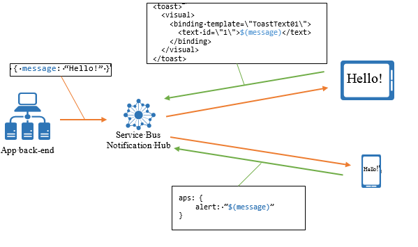

<properties
	pageTitle="模板"
	description="本主题介绍 Azure 通知中心的模板。"
	services="notification-hubs"
	documentationCenter=".net"
	authors="wesmc7777"
	manager="dwrede"
	editor=""/>

<tags
	ms.service="notification-hubs"
	ms.date="03/28/2016"
	wacn.date="05/18/2016"/>

# 模板

##概述

模板可让客户端应用程序指定它想要接收的确切通知格式。使用模板，应用可以实现几个不同的优点，其中包括：

* 平台不可知的后端

* 个性化通知

* 客户端版本独立性

* 易于本地化

本部分提供两个深入的示例，介绍如何使用模板跨平台向你的所有设备发送与平台无关的通知，以及介绍如何针对每台设备对广播通知进行个性化设置。

##使用跨平台模板

发送推送通知的标准方法是向平台通知服务（WNS、APNS）发送要传出的每个通知的特定负载。例如，若要向 APNS 发送警报，负载将是以下格式的 Json 对象：

	{"aps": {"alert" : "Hello!" }}

若要在 Windows 应用商店应用程序中发送类似的 toast 消息，XML 负载将如下所示：

	<toast>
	  <visual>
	    <binding template="ToastText01">
	      <text id="1">Hello!</text>
	    </binding>
	  </visual>
	</toast>

你可以为 MPNS (Windows Phone) 和 GCM (Android) 平台创建类似的负载。

此要求将强制应用后端针对每个平台生成不同的负载，并有效地使后端负责应用的表示层部分。某些考虑因素包括本地化和图形布局（尤其针对 Windows 应用商店应用，其中包含不同磁贴类型的通知）。

使用通知中心模板功能，客户端应用可以创建称为模板注册的特殊注册，其中除了包含标记集外，还包含一个模板。无论你使用安装（首选）还是注册，通知中心模板功能都能使客户端应用将设备与模板相关联。在前面的负载示例中，唯一的与平台无关的信息就是实际警报消息 (Hello!)。模板是一组指令，指示通知中心如何针对该特定客户端应用的注册来设置与平台无关的消息的格式。在前面的示例中，与平台无关的消息是单个属性：**message = Hello!**。

下图演示了上述过程：

iOS 客户端应用注册的模板如下所示：

	{"aps": {"alert": "$(message)"}}

Windows 应用商店客户端应用的相应模板为：

	<toast>
		<visual>
			<binding template="ToastText01">
				<text id="1">$(message)</text>
			</binding>
		</visual>
	</toast>

请注意，实际消息将替换表达式 $(message)。每当通知中心向此特定注册发送消息时，此表达式将指示通知中心构建遵循此模板并用常用值替换的消息。

如果你使用的是安装模型，则安装“templates”键会保存多个模板的 JSON。如果你使用的是注册模型，则客户端应用程序可以创建多个注册以使用多个模板；例如，例如，用于警报消息的模板和用于磁贴更新的模板。客户端应用程序还可以混合使用本机注册（不带模板的注册）和模板注册。

通知中心将针对每个注册发送一条通知，而不考虑这些注册是否属于同一客户端应用。可以使用此行为将与平台无关的通知转换成其他通知。例如，可以将发送到通知中心的同一条与平台无关的消息无缝地转换成 toast 警报和磁贴更新，而无需让后端知道这一情况。请注意，如果在短时间内发送多个通知，某些平台（例如 iOS）可能会将这些通知合并发送到同一台设备。

##使用模板进行个性化设置

使用模板的另一个优点就是能够使用通知中心对通知执行基于注册的个性化设置。例如，假设某个天气应用需要显示一个磁贴，其中提供特定地点的天气情况。用户可以选择摄氏度或华氏度，以及一天或五天的天气预报。使用模板，每个客户端应用安装可以注册所需的格式（1 天摄氏度、1 天华氏度、5 天摄氏度、5 天华氏度），并让后端发送一条消息，其中包含填充这些模板所需的全部信息（例如，使用摄氏度和华氏度的五天天气预报）。

使用摄氏温度的一天天气预报模板如下所示：

	<tile>
	  <visual>
	    <binding template="TileWideSmallImageAndText04">
	      <image id="1" src="$(day1_image)" alt="alt text"/>
	      <text id="1">Seattle, WA</text>
	      <text id="2">$(day1_tempC)</text>
	    </binding>  
	  </visual>
	</tile>

发送到通知中心的消息包含以下属性：

<table border="1">
<tr><td>day1_image</td><td>day2_image</td><td>day3_image</td><td>day4_image</td><td>day5_image</td></tr>
<tr><td>day1_tempC</td><td>day2_tempC</td><td>day3_tempC</td><td>day4_tempC</td><td>day5_tempC</td></tr>
<tr><td>day1_tempF</td><td>day2_tempF</td><td>day3_tempF</td><td>day4_tempF</td><td>day5_tempF</td></tr>
</table> 

通过使用此模式，后端只需发送一条消息，而不必为应用用户存储特定的个性化选项。下图演示了此方案：

##如何注册模板

若要使用安装模型（首选）或注册模型来注册模板，请参阅[注册管理](/documentation/articles/notification-hubs-registration-management/)。

##模板表达式语言

模板限定为 XML 或 JSON 文档格式。此外，只能在特定位置放置表达式；例如，对于 XML 放置节点属性或值，对于 JSON 放置字符串属性值。

下表显示了模板中允许使用的语言：

| 表达式 | 说明 |
|------------|-------------|
| $(prop) | 对具有给定名称的事件属性的引用。属性名称不区分大小写。此表达式将解析为属性的文本值，如果该属性不存在，则解析为空字符串。 |
| $(prop, n) | 同上，但会在 n 个字符处对文本进行显式剪切，例如，$(title, 20) 会在 20 个字符处对 title 属性的内容进行剪切。 |
| .(prop, n) | 同上，但会在剪切后的文本后面添加三个点作为后缀。剪切后的字符串以及后缀的总大小不超过 n 个字符。对输入属性“This is the title line”使用 .(title, 20) 会生成 **This is the title…** |
| %(prop) | 类似于 $(name)，不过其输出已经过 URI 编码。 |
| #(prop) | 在 JSON 模板中使用（例如，用于 iOS 和 Android 模板）。  此函数的工作方式与前面指定的 $(prop) 完全相同，但在 JSON 模板（例如 Apple 模板）中使用时例外。在此示例中，如果此函数未由“{”、“}”括起来（例如，‘myJsonProperty’ : ‘#(name)’），它将按 Javascript 格式（例如，regexp: (0&#124;(&#91;1-9&#93;&#91;0-9&#93;*))(\.&#91;0-9&#93;+)?((e&#124;E)(+&#124;-)?&#91;0-9&#93;+)?）求值结果为数字，则输出 JSON 是一个数字。  例如，‘badge : ‘#(name)’ 将变为 ‘badge’ : 40（而不是 ‘40‘）。|
| ‘text’ 或 “text” | 一个文本。文本包含以单引号或双引号括住的任意文本。|
| expr1 + expr2 | 用于将两个表达式联接成单个字符串的串联运算符。

表达式可以采用上述任一格式。

使用连接时，必须使用 {} 括住整个表达式。例如，{$(prop) + ‘ - ’ + $(prop2)}。|

例如，下面所示不是有效的 XML 模板：

	<tile>
	  <visual>
	    <binding $(property)>
	      <text id="1">Seattle, WA</text>
	    </binding>  
	  </visual>
	</tile>

如前所述，使用串联时，表达式必须用大括号括住。例如：

	<tile>
	  <visual>
	    <binding template="ToastText01">
	      <text id="1">{'Hi, ' + $(name)}</text>
	    </binding>  
	  </visual>
	</tile>

<!---HONumber=Mooncake_0503_2016-->