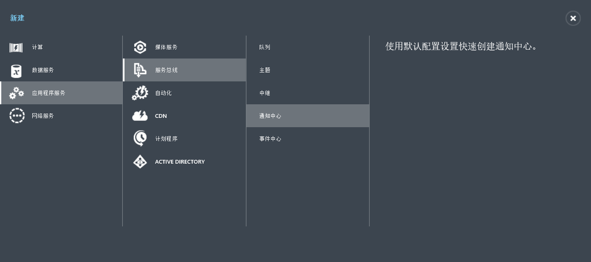
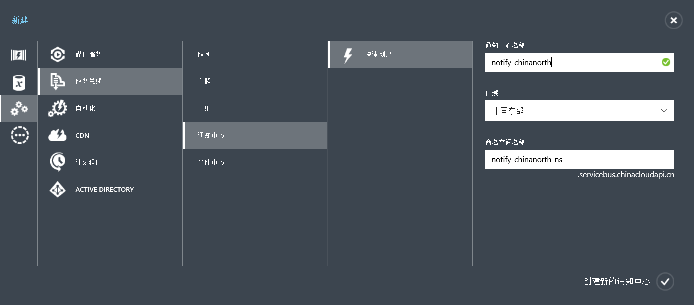

<properties
	pageTitle="在 Windows Phone 上借助 Azure 通知中心发送推送通知 | Azure"
	description="在本教程中，你将了解如何使用 Azure 通知中心将通知推送到 Windows Phone 8 或 Windows Phone 8.1 Silverlight 应用程序。"
	services="notification-hubs"
	documentationCenter="windows"
	keywords="推送通知,push notification,windows phone 推送"
	authors="wesmc7777"
	manager="dwrede"
	editor="dwrede"/>

<tags
	ms.service="notification-hubs"
	ms.date="03/10/2016"
	wacn.date="05/31/2016"/>
	
	
# 在 Windows Phone 上借助 Azure 通知中心发送推送通知

[AZURE.INCLUDE [notification-hubs-selector-get-started](../includes/notification-hubs-selector-get-started.md)]

##概述

> [AZURE.NOTE] 若要完成本教程，你必须有一个有效的 Azure 帐户。如果你没有帐户，只需花费几分钟就能创建一个试用帐户。有关详细信息，请参阅 [Azure 试用](/pricing/free-trial/)。

本教程演示如何使用 Azure 通知中心将推送通知发送到 Windows Phone 8 或 Windows Phone 8.1 Silverlight 应用程序。如果你要以 Windows Phone 8.1（非 Silverlight）为目标，请参阅 [Windows Universal](/documentation/articles/notification-hubs-windows-store-dotnet-get-started/) 版本。
在本教程中，你将创建一个空白 Windows Phone 8 应用，它使用 Microsoft 推送通知服务 (MPNS) 接收推送通知。完成后，你将能够使用通知中心将推送通知广播到运行你的应用的所有设备。

> [AZURE.NOTE] 通知中心 Windows Phone SDK 不支持将 Windows 推送通知服务 (WNS) 与 Windows Phone 8.1 Silverlight 应用配合使用。若要将 WNS（而不是 MPNS）与 Windows Phone 8.1 Silverlight 应用配合使用，请遵循使用 REST API 的 [通知中心 - Windows Phone Silverlight 教程]。

本教程演示使用通知中心的简单广播方案。

##先决条件

本教程需要的内容如下：

+ [Visual Studio 2012 Express for Windows Phone] 或更高版本。

完成本教程是学习有关 Windows Phone 8 应用的所有其他通知中心教程的先决条件。

##创建通知中心

1.  单击“应用程序服务”->“服务总线”->“通知中心”

2.单击“快速创建”，填上“名称”，选择“区域”

##将你的应用程序连接到通知中心

1. 在 Visual Studio 中创建一个新的 Windows Phone 8 应用程序。

   	![Visual Studio - 新建项目 - Windows Phone 应用][13]

	在 Visual Studio 2013 Update 2 或更高版本中，必须改为创建 Windows Phone Silverlight 应用程序。

	![Visual Studio - 新建项目 - 空白应用 - Windows Phone Silverlight][11]

2. 在 Visual Studio 中，右键单击该解决方案，然后单击“管理 NuGet 包”。

	此时将显示“管理 NuGet 包”对话框。

3. 搜索 `WindowsAzure.Messaging.Managed`，单击“安装”，然后接受使用条款。

	![Visual Studio - NuGet 包管理器][20]

	此时将使用 <a href="http://nuget.org/packages/WindowsAzure.Messaging.Managed/">WindowsAzure.Messaging.Managed NuGet 包</a>下载、安装并添加对 Windows 的 Azure 消息传送库的引用。

4. 打开文件 App.xaml.cs 并添加以下 `using` 语句：

        using Microsoft.Phone.Notification;
        using Microsoft.WindowsAzure.Messaging;

5. 在 App.xaml.cs 中 **Application\_Launching** 方法的顶部添加以下代码：

	    var channel = HttpNotificationChannel.Find("MyPushChannel");
        if (channel == null)
        {
            channel = new HttpNotificationChannel("MyPushChannel");
            channel.Open();
            channel.BindToShellToast();
        }

        channel.ChannelUriUpdated += new EventHandler<NotificationChannelUriEventArgs>(async (o, args) =>
        {
            var hub = new NotificationHub("<hub name>", "<connection string>");
            var result = await hub.RegisterNativeAsync(args.ChannelUri.ToString());

            System.Windows.Deployment.Current.Dispatcher.BeginInvoke(() =>
            {
                MessageBox.Show("Registration :" + result.RegistrationId, "Registered", MessageBoxButton.OK);
            });
        });

    >[AZURE.NOTE] 值 **MyPushChannel** 是用于查找 [HttpNotificationChannel](https://msdn.microsoft.com/library/windows/apps/microsoft.phone.notification.httpnotificationchannel.aspx) 集合中现有通道的索引。如果不存在，则使用该名称创建新条目。
    
    确保插入你的中心名称以及在前一部分中获取的名为 **DefaultListenSharedAccessSignature** 的连接字符串。
    此代码从 MPNS 检索应用的通道 URI，然后将该通道 URI 注册到你的通知中心。它还保证每次启动应用程序时都在通知中心注册通道 URI。

	>[AZURE.NOTE]本教程将一个 toast 通知发送到设备。而当你发送磁贴通知时，必须在通道上调用 **BindToShellTile** 方法。若要同时支持 toast 通知和磁贴通知，请同时调用 **BindToShellTile** 和 **BindToShellToast**。

6. 在解决方案资源管理器中，展开“属性”，打开 `WMAppManifest.xml` 文件，单击“功能”选项卡并确保选中 **ID\_CAP\_PUSH\_NOTIFICATION** 功能。

   	![Visual Studio - Windows Phone 应用功能][14]

   	这样可确保你的应用程序可收到推送通知。如果没有它，则将无法成功向应用发送推送通知。

7. 按 `F5` 键以运行应用。

	随后应用中将显示注册消息。

8. 关闭应用。

   >[AZURE.NOTE] 若要接收 toast 推送通知，则应用程序不得在前台运行。

##从后端发送推送通知

你可以使用通知中心通过公共 <a href="http://msdn.microsoft.com/library/windowsazure/dn223264.aspx">REST 接口</a>从任意后端发送推送通知。在本教程中，你将使用 .NET 控制台应用程序来发送推送通知。

有关如何从与通知中心集成的 ASP.NET WebAPI 后端来发送推送通知的示例，请参阅 [Azure 通知中心 - 使用 .NET 后端通知用户](/documentation/articles/notification-hubs-aspnet-backend-windows-dotnet-notify-users/)。

有关如何使用 [REST API](https://msdn.microsoft.com/library/azure/dn223264.aspx) 发送推送通知的示例，请参阅[如何通过 Java 使用通知中心](/documentation/articles/notification-hubs-java-backend-how-to/)和[如何通过 PHP 使用通知中心](/documentation/articles/notification-hubs-php-backend-how-to/)。

1. 右键单击解决方案，选择“添加”和“新建项目...”，然后在“Visual C#”下依次单击“Windows”、“控制台应用程序”和“确定”。

   	![Visual Studio - 新建项目 - 控制台应用程序][6]

	这会将新的 Visual C# 控制台应用程序添加到解决方案。你也可以在单独的解决方案中进行此项操作。

2. 依次单击“工具”、“库包管理器”、“包管理器控制台”。

	这会显示包管理器控制台。

3.  在“包管理器控制台”窗口中，将“默认项目”设置为新的控制台应用程序项目，然后在控制台窗口中执行以下命令：

        Install-Package Microsoft.Azure.NotificationHubs

	这将使用 <a href="http://www.nuget.org/packages/Microsoft.Azure.NotificationHubs/">Microsoft.Azure.Notification Hubs NuGet 程序包</a>添加对 Azure 通知中心 SDK 的引用。

4. 打开 `Program.cs` 文件 ，并添加以下 `using` 语句：

        using Microsoft.Azure.NotificationHubs;

5. 在 `Program` 类中，添加以下方法：

        private static async void SendNotificationAsync()
        {
            NotificationHubClient hub = NotificationHubClient
				.CreateClientFromConnectionString("<connection string with full access>", "<hub name>");
            string toast = "<?xml version="1.0" encoding="utf-8"?>" +
                "<wp:Notification xmlns:wp="WPNotification">" +
                   "<wp:Toast>" +
                        "<wp:Text1>Hello from a .NET App!</wp:Text1>" +
                   "</wp:Toast> " +
                "</wp:Notification>";
            await hub.SendMpnsNativeNotificationAsync(toast);
        }

	确保将 `<hub name>` 占位符替换为出现在门户中的通知中心名称。此外，使用你在“配置通知中心”部分中获取的名称为 **DefaultFullSharedAccessSignature** 的连接字符串替换连接字符串占位符。

	>[AZURE.NOTE]确保你使用的是具有**完全**访问权限的连接字符串，而不是具有**侦听**访问权限的连接字符串。侦听访问字符串无权发送推送通知。

6. 在 `Main` 方法中添加以下行：

         SendNotificationAsync();
		 Console.ReadLine();

7. 在 Windows Phone 模拟器正在运行且应用已关闭的情况下，将控制台应用程序项目设置为默认启动项目，然后按 `F5` 键运行应用。

	你将会收到 toast 推送通知。点击 toast 标题可加载应用。

可以在 MSDN 上的 [toast 目录]和[磁贴目录]主题中找到所有可能的负载。

##后续步骤

在这个简单的示例中，你已将推送通知广播到所有 Windows Phone 8 设备。

若要针对特定客户，请参考教程[使用通知中心将通知推送到用户]。

如果要按兴趣组划分用户，可以阅读[使用通知中心发送突发新闻]。

在[通知中心指南]中了解有关如何使用通知中心的更多信息。

<!-- Images. -->
[6]: ./media/notification-hubs-windows-phone-get-started/notification-hub-create-console-app.png
[7]: ./media/notification-hubs-windows-phone-get-started/notification-hub-create-from-portal.png
[8]: ./media/notification-hubs-windows-phone-get-started/notification-hub-create-from-portal2.png
[9]: ./media/notification-hubs-windows-phone-get-started/notification-hub-select-from-portal.png
[10]: ./media/notification-hubs-windows-phone-get-started/notification-hub-select-from-portal2.png
[11]: ./media/notification-hubs-windows-phone-get-started/notification-hub-create-wp-silverlight-app.png
[12]: ./media/notification-hubs-windows-phone-get-started/notification-hub-connection-strings.png

[13]: ./media/notification-hubs-windows-phone-get-started/notification-hub-create-wp-app.png
[14]: ./media/notification-hubs-windows-phone-get-started/mobile-app-enable-push-wp8.png
[15]: ./media/notification-hubs-windows-phone-get-started/notification-hub-pushauth.png
[20]: ./media/notification-hubs-windows-phone-get-started/notification-hub-windows-universal-app-install-package.png
[213]: ./media/notification-hubs-windows-phone-get-started/notification-hub-create-console-app.png

<!-- URLs. -->
  [Visual Studio 2012 Express for Windows Phone]: https://go.microsoft.com/fwLink/p/?LinkID=268374

  [通知中心指南]: http://msdn.microsoft.com/zh-cn/library/jj927170.aspx
  [toast 目录]: http://msdn.microsoft.com/library/windowsphone/develop/jj662938(v=vs.105).aspx
  [磁贴目录]: http://msdn.microsoft.com/library/windowsphone/develop/hh202948(v=vs.105).aspx
  [使用通知中心将通知推送到用户]:  /documentation/articles/notification-hubs-aspnet-backend-windows-dotnet-notify-users/
  [使用通知中心发送突发新闻]: /documentation/articles/notification-hubs-windows-store-dotnet-send-breaking-news/
  [toast 目录]: http://msdn.microsoft.com/zh-cn/library/windowsphone/develop/jj662938(v=vs.105).aspx
  [磁贴目录]: http://msdn.microsoft.com/zh-cn/library/windowsphone/develop/hh202948(v=vs.105).aspx
[通知中心 - Windows Phone Silverlight 教程]: https://github.com/Azure/azure-notificationhubs-samples/tree/master/PushToSLPhoneApp
  [MPNS 身份验证模式]: http://msdn.microsoft.com/library/windowsphone/develop/ff941099.aspx
<!---HONumber=Mooncake_0523_2016-->