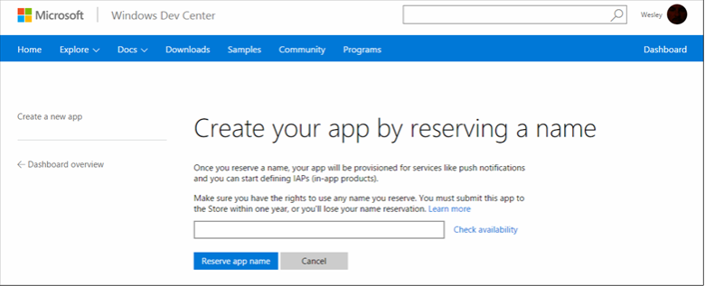
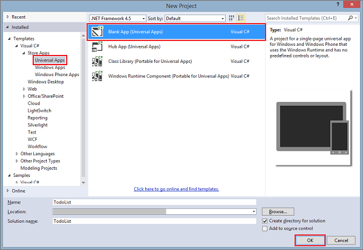
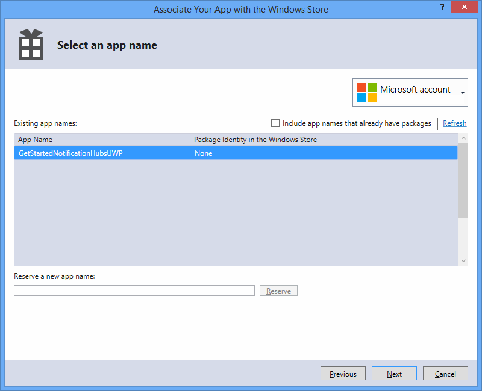
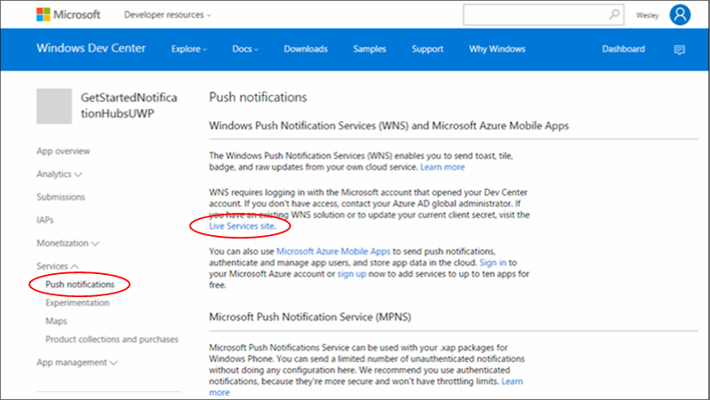
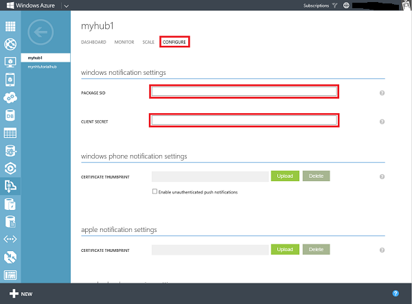

<properties
	pageTitle="用于 Windows 通用平台应用的 Azure 通知中心入门 | Azure"
	description="在本教程中，将学习如何使用 Azure 通知中心将通知推送到 Windows 通用平台应用程序。"
	services="notification-hubs"
	documentationCenter="windows"
	authors="wesmc7777"
	manager="erikre"
	editor="erikre"/>  

<tags
	ms.service="notification-hubs"
	ms.workload="mobile"
	ms.tgt_pltfrm="mobile-windows"
	ms.devlang="dotnet"
	ms.topic="hero-article"
	ms.date="07/21/2016"
	ms.author="wesmc"
   	wacn.date="10/27/2016"/>  

# 用于 Windows 通用平台应用的通知中心入门

[AZURE.INCLUDE [notification-hubs-selector-get-started](../../includes/notification-hubs-selector-get-started.md)]

##概述

本教程说明如何使用 Azure 通知中心将推送通知发送到通用 Windows 平台 (UWP) 应用。

在本教程中，你将创建一个空白 Windows 应用商店应用，它使用 Windows 推送通知服务 (WNS) 接收推送通知。完成后，你将能够使用通知中心将推送通知广播到运行你的应用的所有设备。

## 开始之前

[AZURE.INCLUDE [notification-hubs-hero-slug](../../includes/notification-hubs-hero-slug.md)]

可以在 GitHub 上的[此处](https://github.com/Azure/azure-notificationhubs-samples/tree/master/dotnet/GetStartedWindowsUniversal)找到本教程的已完成代码。

##先决条件

本教程需要的内容如下：

+ [Microsoft Visual Studio Community 2015](https://www.visualstudio.com/products/visual-studio-community-vs) 或更高版本

+ [已安装通用 Windows 应用开发工具](https://msdn.microsoft.com/windows/uwp/get-started/get-set-up)

+ 一个有效的 Azure 帐户 如果没有帐户，只需花费几分钟就能创建一个试用帐户。有关详细信息，请参阅 [Azure 1 元试用](/pricing/1rmb-trial/?WT.mc_id=A0E0E5C02&amp;returnurl=http%3A%2F%2Fazure.microsoft.com%2Fen-us%2Fdocumentation%2Farticles%2Fnotification-hubs-windows-store-dotnet-get-started%2F/)。

+ 有效的 Windows 应用商店帐户

完成本教程是学习有关 Windows 通用平台应用的所有其他通知中心教程的先决条件。

##为 Windows 应用商店注册应用程序

若要将推送通知发送到 UWP 应用，必须将应用关联到 Windows 应用商店。然后必须将通知中心配置为与 WNS 集成。

1. 如果尚未注册应用，请导航到 [Windows 开发人员中心](https://dev.windows.com/overview)，使用你的 Microsoft 帐户登录，然后单击“创建新应用”。

2. 键入应用的名称，然后单击“保留应用名称”。

   	

   	此操作为应用创建一个新的 Windows 应用商店注册。

3. 在 Visual Studio 中，使用“空白应用”模板来创建一个新的 Visual C# 应用商店应用项目，然后单击“确定”。

   	  

4. 接受目标和最低平台版本的默认值。

5. 在“解决方案资源管理器”中，右键单击 Windows 应用商店应用项目，单击“应用商店”，然后单击“将应用与应用商店关联...”。

   	

   	此时将显示“将应用与 Windows 应用商店关联”向导。

6. 在该向导中，单击“登录”，然后使用你的 Microsoft 帐户登录。

7. 单击在第 2 步中注册的应用，单击“下一步”，然后单击“关联”。

   	

   	这会将所需的 Windows 应用商店注册信息添加到应用程序清单中。

8. 返回新应用的“Windows 开发人员中心”页，依次单击“服务”和“推送通知”，然后单击“Windows 推送通知服务(WNS)和 Azure 移动应用”下的“Live 服务网站”。

   	  

9. 在应用的注册页上，记下位于“Windows 应用商店”平台设置中的“应用程序密码”和“包安全标识符(SID)”。

   	  

 	> [AZURE.WARNING]
	应用程序密钥和程序包 SID 是重要的安全凭据。请勿将这些值告知任何人或随你的应用程序分发它们。

##配置通知中心

[AZURE.INCLUDE [notification-hubs-portal-create-new-hub](../../includes/notification-hubs-portal-create-new-hub.md)]

<ol start="6">
<li>
选择“通知服务”<b></b>选项和“Windows (WNS)”<b></b>选项。然后在“安全密钥”<b></b>字段中输入“应用程序密码”<b></b>。输入在之前部分从 WNS 获取的“包 SID”<b></b>值，然后单击“保存”<b></b>。

</li>
</ol>

   	

你的通知中心现在已配置为使用 WNS，并且你有连接字符串用于注册你的应用程序和发送通知。

##将你的应用连接到通知中心

1. 在 Visual Studio 中，右键单击该解决方案，然后单击“管理 NuGet 包”。

	此时将显示“管理 NuGet 包”对话框。

2. 搜索 `WindowsAzure.Messaging.Managed`，单击“安装”，然后接受使用条款。

	![][20]  

	此时将使用 <a href="http://nuget.org/packages/WindowsAzure.Messaging.Managed/">WindowsAzure.Messaging.Managed NuGet 包</a>下载、安装并添加对 Windows 的 Azure 消息传送库的引用。

3. 打开 App.xaml.cs 项目文件并添加以下 `using` 语句。

        using Windows.Networking.PushNotifications;
        using Microsoft.WindowsAzure.Messaging;
		using Windows.UI.Popups;

4. 另外在 App.xaml.cs 中，将以下 **InitNotificationsAsync** 方法定义添加到 **App** 类中：

	    private async void InitNotificationsAsync()
        {
            var channel = await PushNotificationChannelManager.CreatePushNotificationChannelForApplicationAsync();

            var hub = new NotificationHub("< your hub name>", "<Your DefaultListenSharedAccessSignature connection string>");
			var result = await hub.RegisterNativeAsync(channel.Uri);

            // Displays the registration ID so you know it was successful
            if (result.RegistrationId != null)
            {
                var dialog = new MessageDialog("Registration successful: " + result.RegistrationId);
                dialog.Commands.Add(new UICommand("OK"));
                await dialog.ShowAsync();
            }

        }

    此代码从 WNS 检索应用的通道 URI，然后将该通道 URI 注册到你的通知中心。

    >[AZURE.NOTE] 确保将“your hub name”占位符替换为出现在 Azure 门户预览中的通知中心名称。此处，使用在之前部分中从通知中心的“访问策略”页获取的 **DefaultListenSharedAccessSignature** 连接字符串替换连接字符串占位符。

5. 在 App.xaml.cs 中 **OnLaunched** 事件处理程序的上方，添加对新 **InitNotificationsAsync** 方法的以下调用：

        InitNotificationsAsync();

    这保证每次启动应用程序时都在通知中心注册通道 URI。

6. 按 **F5** 键以运行应用。此时将显示包含注册密钥的弹出对话框。

   	![][19]  

你的应用现在已能够接收 toast 通知。

##发送通知 

在 [Azure 门户预览](https://portal.azure.cn/)中使用通知中心的“测试发送”按钮（如以下屏幕中所示）来发送通知，可以在应用中快速地测试通知的接收情况。

  

通常，推送通知是在后端服务（例如，移动服务，或者使用兼容库的 ASP.NET）中发送的。如果你的后端没有可用的库，则你也可以使用 REST API 直接发送通知消息。

在本教程中，为了保持内容的简单性，我们只会演示如何在控制台应用程序（而不是后端服务）中，使用通知中心的 .NET SDK 发送通知，以此测试你的客户端应用。建议你接下来学习[使用通知中心向用户推送通知]教程，以了解如何从 ASP.NET 后端发送通知。不过，可以使用以下方法来发送通知：

* **REST 接口**：可以使用 [REST 接口](http://msdn.microsoft.com/zh-cn/library/windowsazure/dn223264.aspx)在任何后端平台上支持通知。

* **Azure 通知中心 .NET SDK**：在 Visual Studio 的 Nuget 包管理器中，运行 [Install-Package Microsoft.Azure.NotificationHubs](https://www.nuget.org/packages/Microsoft.Azure.NotificationHubs/)。

* **Node.js**：[如何通过 Node.js 使用通知中心](/documentation/articles/notification-hubs-nodejs-push-notification-tutorial/)。

* **Azure Mobile Apps**：有关如何从通知中心集成的 Azure 移动服务发送通知的示例，请参阅[为 Mobile Apps 添加推送通知](/documentation/articles/app-service-mobile-windows-store-dotnet-get-started-push/)。

* **Java/PHP**：有关如何使用 REST API 发送通知的示例，请参阅“如何通过 Java/PHP 使用通知中心”([Java](/documentation/articles/notification-hubs-java-push-notification-tutorial/) | [PHP](/documentation/articles/notification-hubs-php-push-notification-tutorial/))。

## （可选）通过控制台应用发送通知

若要使用 .NET 控制台应用程序发送通知，请遵循以下步骤。

1. 右键单击解决方案，选择“添加”和“新建项目...”，然后在“Visual C#”下依次单击“Windows”、“控制台应用程序”和“确定”。

   	![][13]

	这会将新的 Visual C# 控制台应用程序添加到解决方案。你也可以在单独的解决方案中进行此项操作。

2. 在 Visual Studio 中，依次单击“工具”、“NuGet 包管理器”和“包管理器控制台”。

	这会在 Visual Studio 中显示“包管理器控制台”。

3. 在“包管理器控制台”窗口中，将“默认项目”设置为新的控制台应用程序项目，然后在控制台窗口中执行以下命令：

        Install-Package Microsoft.Azure.NotificationHubs

	这将使用 <a href="http://www.nuget.org/packages/Microsoft.Azure.NotificationHubs/">Microsoft.Azure.Notification Hubs NuGet 包</a>添加对 Azure 通知中心 SDK 的引用。

	

4. 打开文件 Program.cs 并添加以下 `using` 语句：

        using Microsoft.Azure.NotificationHubs;

5. 在 **Program** 类中，添加以下方法：

        private static async void SendNotificationAsync()
        {
            NotificationHubClient hub = NotificationHubClient
				.CreateClientFromConnectionString("<connection string with full access>", "<hub name>");
            var toast = @"<toast><visual><binding template=""ToastText01""><text id=""1"">Hello from a .NET App!</text></binding></visual></toast>";
            await hub.SendWindowsNativeNotificationAsync(toast);
        }

   	确保将“hub name”占位符替换为出现在 Azure 门户预览中的通知中心名称。此外，使用在“配置通知中心”部分中的通知中心的“访问策略”页获取的 **DefaultFullSharedAccessSignature** 连接字符串替换连接字符串占位符。

	>[AZURE.NOTE]确保你使用的是具有**完全**访问权限的连接字符串，而不是具有**侦听**访问权限的连接字符串。侦听访问字符串无权发送通知。

6. 在 **Main** 方法中添加以下行：

         SendNotificationAsync();
		 Console.ReadLine();

7. 在 Visual Studio 中，右键单击控制台应用程序项目，然后单击“设为启动项目”，将它设置为启动项目。然后按 **F5** 键运行应用程序。

   	![][14]

	所有已注册的设备将会收到 toast 通知。单击或点击 toast 标题可加载应用。

你可以在 MSDN 上的 [toast 目录]、[磁贴目录]和[锁屏提醒]主题中找到所有支持的负载。

##后续步骤

在这个简单示例中，你将使用门户或控制台应用将广播通知发送到所有 Windows 设备。建议下一步学习[使用通知中心向用户推送通知]教程。它将显示如何使用标记从 ASP.NET 后端将通知发送到目标特定的用户。

如果要按兴趣组划分用户，可以阅读[使用通知中心发送突发新闻]。

若要了解有关通知中心的更多常规信息，请参阅[通知中心指南](/documentation/articles/notification-hubs-push-notification-overview/)。

<!-- Images. -->

[13]: ./media/notification-hubs-windows-store-dotnet-get-started/notification-hub-create-console-app.png
[14]: ./media/notification-hubs-windows-store-dotnet-get-started/notification-hub-windows-toast.png
[19]: ./media/notification-hubs-windows-store-dotnet-get-started/notification-hub-windows-reg.png
[20]: ./media/notification-hubs-windows-store-dotnet-get-started/notification-hub-windows-universal-app-install-package.png

<!-- URLs. -->

[使用通知中心向用户推送通知]: /documentation/articles/notification-hubs-aspnet-backend-windows-dotnet-notify-users/
[使用通知中心发送突发新闻]: /documentation/articles/notification-hubs-windows-store-dotnet-send-breaking-news/

[toast 目录]: http://msdn.microsoft.com/zh-cn/library/windows/apps/hh761494.aspx
[磁贴目录]: http://msdn.microsoft.com/zh-cn/library/windows/apps/hh761491.aspx
[锁屏提醒]: http://msdn.microsoft.com/zh-cn/library/windows/apps/hh779719.aspx

<!---HONumber=Mooncake_1017_2016-->
