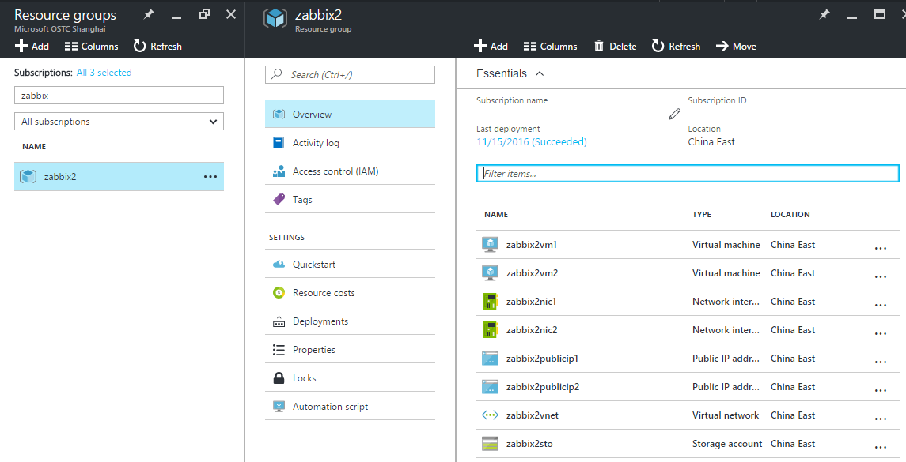
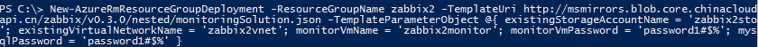
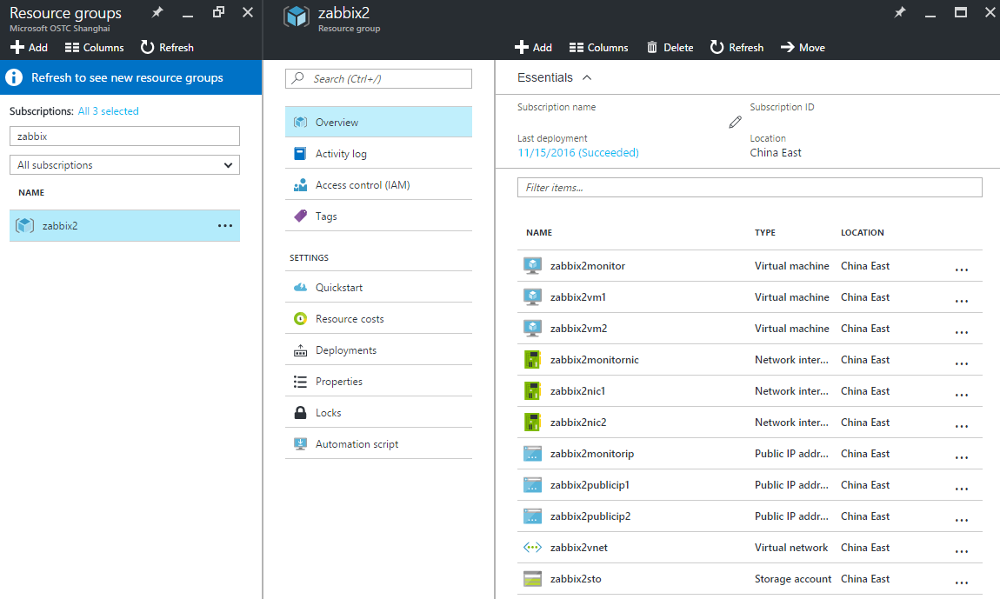
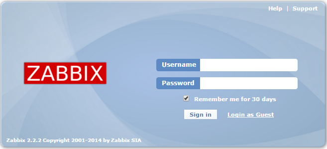
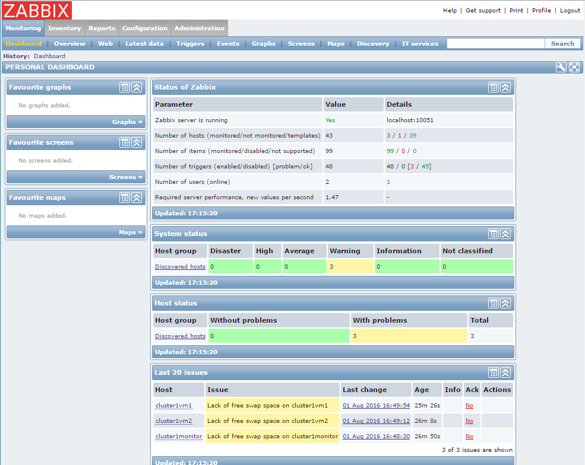

<properties
   pageTitle="使用 Azure 资源管理器自动部署 Zabbix 监控服务"
   description="本文介绍如何使用 Azure 资源管理器自动部署 Zabbix 监控服务"
   services="open-source"
   documentationCenter=""
   authors=""
   manager=""
   editor=""/>

<tags
   ms.service="open-source-website"  
   ms.date=""
   wacn.date="05/11/2017"/>

# 使用 Azure 资源管理器自动部署 Zabbix 监控服务

## 目录

- [介绍](#introduction)
- [准备步骤](#preparation-steps)
- [部署样例集群模板](#cluster-deployment)
- [部署监控解决方案模板](#monitor-solution-deployment)
- [访问监控服务器网页前端](#portal-view)

## 介绍
[Zabbix](https://www.zabbix.org/) 是一个的企业级的开源监控解决方案，它支持从服务器、虚拟机和网络设备大规模采集数据并进行实时监控。

Zabbix 解决方案主要包括客户端 (agent)、服务端 (server) 与网页前端 (web frontend) 三个部分：客户端安装在工作机器上，用于监控数据的采集；服务端一般安装在专用的一台监控服务器上，用于数据的存储与处理；网页前端用于向用户提供网页交互界面，在本文的提供的解决方案中，网页前端与服务端安装在同一台监控服务器上。

本文主要介绍通过 Azure 资源管理器部署 Azure 资源管理模板，实现自动搭建 Zabbix 监控服务。关于如何手动在 Azure Linux 虚拟机上搭建 Zabbix 监控服务，请参阅[在 Azure Linux 虚拟机上手动安装配置 Zabbix 监控服务](/documentation/articles/open-source-azure-virtual-machines-linux-configure-zabbix-1/)。

## 说明

本文中的解决方案基于 Azure 资源管理模板 (Azure Resource Manager template) 的部署，因此仅支持 Azure [资源管理器](/documentation/articles/resource-manager-deployment-model) (Azure Resource Manager) 模式，不支持 Azure 服务管理 (Azure Service Management) 模式。

本文主要涉及两个 Azure 资源管理模板：集群部署模板与监控解决方案模板。集群部署模板支持搭建一个虚拟机集群；监控解决方案模板支持部署监控服务器，并安装监控客户端到集群中的虚拟机上（目前支持自动安装客户端到连接到特定虚拟子网络的所有虚拟机上）。

本文旨在提供一个完整集群监控的案例，因此将首先演示部署一个虚拟机样例集群，然后通过部署监控解决方案模板，实现对该集群中虚拟机的监控。如果需要实现对现有虚拟机集群的监控，可以直接跳到部署监控解决方案模板的部分。

文中监控解决方案模板目前支持如下操作系统：

服务端与网页前端: Ubuntu 14.04 LTS

客户端: Ubuntu 14.04 LTS, Ubuntu 16.04 LTS, CentOS 7.1

## 准备步骤
* 如果您选择 Azure PowerShell 方式操作 Azure 资源管理模板，那么请参考[如何安装和配置 Azure PowerShell](/documentation/articles/powershell-install-configure/) 中的说明在本地计算机上安装 Azure PowerShell。然后打开 Azure PowerShell 命令提示符，通过运行以下命令并遵循提示进行 Azure 帐户的交互式登录体验，来使用[工作或学校 ID 登录](/documentation/articles/xplat-cli-connect/#use-the-log-in-method)：

        Login-AzureRmAccount -EnvironmentName AzureChinaCloud

* 如果您选择 Azure CLI 方式操作 Azure 资源管理模板，那么请[安装 Azure CLI](/documentation/articles/xplat-cli-install/)。然后通过如下命令切换至资源管理器模式：

        azure config mode arm

    然后，通过运行以下命令并遵循提示进行 Azure 帐户的交互式登录体验，来使用[工作或学校 ID 登录](/documentation/articles/xplat-cli-connect/#use-the-log-in-method)：

        azure login -e AzureChinaCloud

##开始部署
### 部署样例集群模板
本节将介绍如何通过命令行部署样例集群模板，从而搭建一个虚拟机集群，如果需要对现有集群进行监控，请跳转到下一节“部署监控解决方案模板”。

为了创建集群中的虚拟机以及其他资源，首先需要创建一个 Azure 资源组（Resource Group），可以通过如下命令，其中 <ResourceGroupName> 为待创建的资源组名称，<Location> 为资源组位置，如 "China East"。

PowerShell:

    New-AzureRmResourceGroup -Name <ResourceGroupName> -Location <Location>

Azure Cli:

    azure group create <ResourceGroupName> <Location>

然后通过如下命令部署样例集群模板。

PowerShell:

    New-AzureRmResourceGroupDeployment -ResourceGroupName <ResourceGroupName> -TemplateUri http://msmirrors.blob.core.chinacloudapi.cn/zabbix/v0.3.0/nested/clusterNodes.json -TemplateParameterObject @{ resourcePrefix = '<ClusterName>'; adminUsername = 'cluster1Admin'; adminPassword = 'password1#$%'; vmCount = 2 }

Azure Cli:

    azure group deployment create <ResourceGroupName> --template-uri http://msmirrors.blob.core.chinacloudapi.cn/zabbix/v0.3.0/nested/clusterNodes.json -p "{\"resourcePrefix\": {\"value\": \"<ClusterName>\"},\"adminUsername\": {\"value\": \"cluster1Admin\"},\"adminPassword\":{\"value\": \"password1#$%\"},\"vmCount\": {\"value\": 2}}"

其中PowerShell命令中的 -TemplateParameterObject 选项与 Azure Cli 命令中的 -p 选项用于指定部署时的模板参数。
各参数含义如下：

resourcePrefix: 集群中资源的名称前缀，您应该选择一个唯一的名称（如 test001），以避免资源名冲突  
adminUsername: 集群虚拟机的管理员用户名  
adminPassword: 集群虚拟机的管理员密码  
vmCount: 集群中虚拟机数 (可选，默认为2)  

部署时间大约需要 3 分钟。

使用PowerShell部署的一个例子如下：

部署完成后，在门户(portal.azure.cn)上找到该资源组，然后可以看到部署结果：

其中新生成了存储账号 zabbix2sto，和虚拟网络 zabbix2vnet，需要在下面步骤中用到。

## 部署监控解决方案模板
本节将介绍如何部署监控解决方案模板，实现对现有集群中虚拟机的监控。

通过如下命令部署监控解决方案模板,<Storage> 为前文中创建的存储账号名，<Vnet> 填写前文中创建的虚拟网络名，<MonitorVM> 为将要创建的虚拟机名，该名称需要唯一。

PowerShell:

    New-AzureRmResourceGroupDeployment -ResourceGroupName <ResourceGroupName> -TemplateUri http://msmirrors.blob.core.chinacloudapi.cn/zabbix/v0.3.0/nested/monitoringSolution.json -TemplateParameterObject @{ existingStorageAccountName = '<Storage>'; existingVirtualNetworkName = '<Vnet>'; monitorVmName = '<MonitorVM>'; monitorVmPassword = 'password1#$%'; mysqlPassword = 'password1#$%' }

Azure Cli:

    azure group deployment create <ResourceGroupName> --template-uri http://msmirrors.blob.core.chinacloudapi.cn/zabbix/v0.3.0/nested/monitoringSolution.json -p "{\"existingStorageAccountName\": {\"value\": \"<Storage>\"},\"existingVirtualNetworkName\": {\"value\": \"<Vnet>\"},\"monitorVmName\":{\"value\": \"<MonitorVM>\"},\"monitorVmPassword\": {\"value\": \"password1#$%\"}, \"mysqlPassword\": {\"value\": \"password1#$%\"}}"

其中 PowerShell 命令中的 -TemplateParameterObject 选项与 Azure Cli 命令中的 -p 选项用于指定部署时的模板参数。
各参数含义如下：

existingStorageAccountName: 监控服务器使用的存储账号，必须已经存在并位于同一资源组当中，可以在已部署的资源列表中看到，通常为 ’<ClusterName>sto’  

existingVirtualNetworkName: 监控服务器将要连接到的虚拟网络名，必需已经存在并位于同一资源组当中，可以在已部署的资源列表中看到，通常为 ’<ClusterName>vnet’  

existingSubnetName: 监控服务器所连接到的虚拟网络子网络名，Zabbix 监控客户端也会被安装到连接到该子网络的所有虚拟机上(可选，默认值为 ’default’)  

monitorVmName: 监控服务器虚拟机的名称  

monitorVmUsername: 监控服务器虚拟机的管理员用户名(可选，默认为 ’monitoruser’)  

monitorVmPassword: 监控服务器虚拟机的管理员密码  

mysqlHost: Zabbix 服务端所使用的 MySql 数据库主机名。如果值为 ’localhost’，则会在监控服务器上创建新的 MySql 实例；如果指定其他值，则视为连接到已有 MySql 服务器（可选，默认为 ’localhost’）  

mysqlDbName: Zabbix 服务端所使用的 MySql 数据库名(可选，默认为 ’zabbixdb’)  

mysqlUser: Zabbix 服务端所使用的 MySql 数据库用户名（可选，默认为 ’zabbixuser’）  

mysqlPassword: Zabbix 服务端所使用的 MySql 数据库密码  

smtpServer: 邮件通知服务所使用的 smtp 服务器名，如为空则不启用邮件通知服务（可选，默认为空）  

smtpUser: 邮件通知服务所使用的 smtp 用户名，如为空则不启用邮件通知服务（可选，默认为空）  

smtpPassword: 邮件通知服务所使用的 smtp 密码（可选，默认为空）  

notificationReceiver: 邮件通知服务的收件人地址（可选，默认为空）  

注意，如果使用预先建好的 MySql 服务器，则需要在 ’mysqlHost’ 参数中指定 MySql 服务器地址，并保证 ’mysqlUser’ 参数与 ’mysqlPassword’ 参数所对应的用户已经存在，且对 ’mysqlDbName’ 参数所指定的数据库有写权限。
部署时间大约需要 13 分钟。

使用 PowerShell 部署的一个例子如下：

部署完成后可以在门户上看到新增的监控服务器 zabbix2monitor:

## 访问监控服务器网页前端
监控解决方案资源管理模板部署成功后，可以在通过查看输出参数中 serverPublicEndpoint 一项，获取监控服务器的前端入口。

PowerShell:

    Outputs                 : 
    Name             Type                       Value     
    ===============  =========================  ==========
    serverPublicEndpoint  String                     http://cluster1monitor.chinaeast.cloudapp.chinacloudapi.cn/zab/

Azure Cli:

    data:    Outputs            :
    data:    Name                  Type    Value

    data:    --------------------  ------  --------------------------------------------------------------
    data:    serverPublicEndpoint  String  http://cluster1monitor.chinaeast.cloudapp.chinacloudapi.cn/zab/

使用浏览器访问网页前端入口地址，如果看到如下界面则表示服务器端配置正常。

输入默认用户名 Admin,与默认密码 zabbix 后可打开如下管理界面，之后可以进行修改密码和其他的 Zabbix 配置。

