<properties
   pageTitle="在 Azure 平台配置可用性集 | Azure"
   description="本文介绍如何在创建虚拟机同时创建可用性集、以及如何将现有的虚拟机添加到可用性集"
   services="open-source"
   documentationCenter=""
   authors=""
   manager=""
   editor=""/>

<tags
   ms.service="open-source-website"  
   ms.date=""
   wacn.date="06/14/2016"/>

# 在 Azure 平台配置可用性集

## 目录
- [在创建虚拟机同时创建可用性集](#create-new-availability-set)
- [将现有的虚拟机添加到可用性集](#add-to-availability-set)
- [服务高可用	](#service-high-availability)

可用性集(Availability Set)帮助您的业务在虚拟机停机维护的时候仍然可用。将两个或更多相似配置的虚拟机放置于一个可用性集中以提供冗余，实现应用程序或者服务的高可用。
结合可用性集和负载均衡，可以实现服务一直高可用。

要将您的虚拟机放置于可用性集中，有两种方式：

1. 在创建虚拟机同时创建可用性集。然后再创建新的虚拟机时加入到可用性集中来。

2. 将现有的虚拟机添加到可用性集。

接下来我们来看这两种方式的具体过程。

## 在创建虚拟机同时创建可用性集

1. 登录 [Azure 管理控制台](http://manage.windowsazure.cn)输入用户名密码。

2. 点击左下角“新建” -- > “计算“ -- > “虚拟机” -- > “从库中“。

	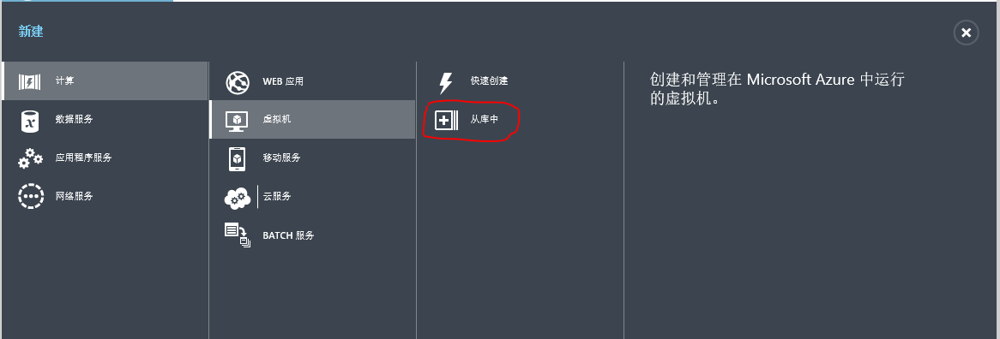

3. 选择映像，然后继续下一步。

	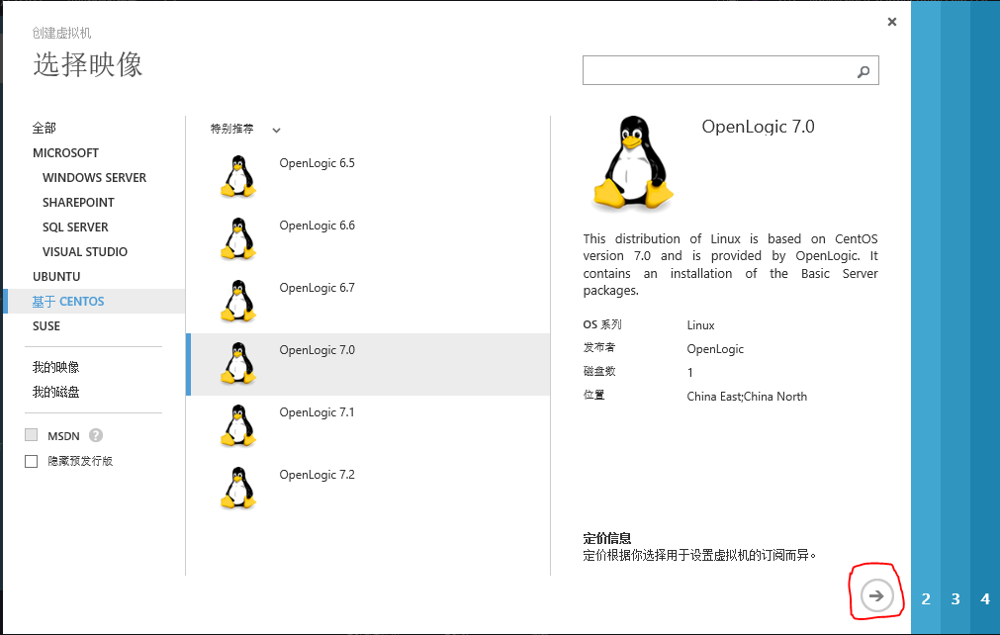

4. 输入虚拟机名，选择规格，输入 OS 用户名，密码，继续下一步。

	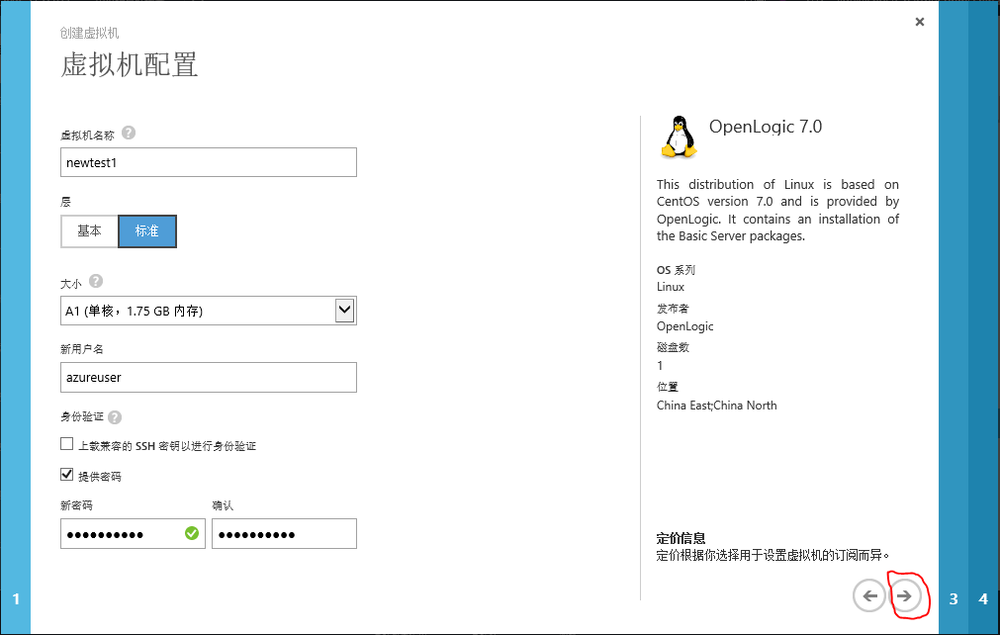

5. 选择”创建新云服务“，输入云服务 DNS 名称，我这里输入newtest1, 之后直接访问 newtest1.chinacloudap.cn 即可访问到此虚拟机，当然也可使用此虚拟机的公网 IP 地址；选择区域，注意如果想让此虚拟机加入到自己定义的虚拟网络的话，要先创建虚拟网络然后在这里选择自己定义的虚拟网络。虚拟网络可以理解成自定义的网络，可以设置子网，IP 范围，网关等；使用自动生成的存储账号；选择“创建可用性集“，输入可用性集名称；添加终结点。也可以创建后虚拟机后再添加。终结点可以理解成这台虚拟机要对外开放的端口；然后继续下一步。

	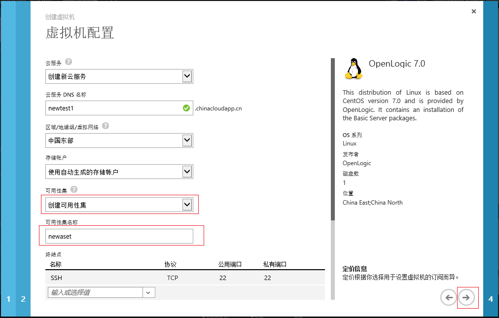

6. 创建。

	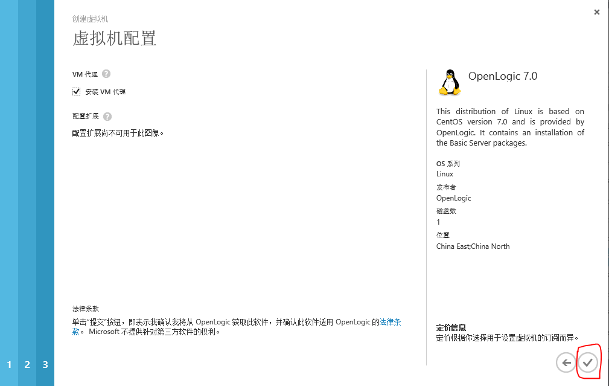

7. 创建好此虚拟机后找到它，点击”配置“，可以看到我们创建好的可用性集。

	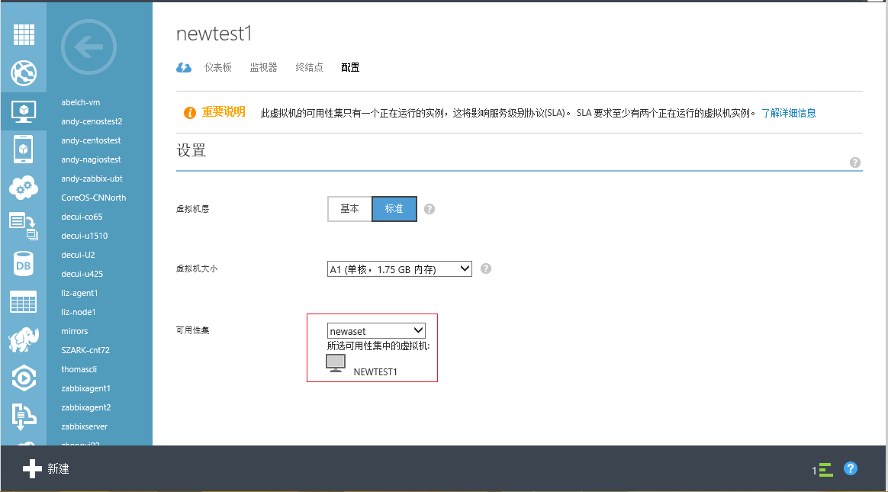

8. 这时可以创建新的虚拟机，再加入到此可用性集里来。但是，在创建虚拟机时必须选择之前的虚拟机所创建的云服务，才能选择到和之前虚拟机所处的同样一个可用性集。也就是说，要想处于同样的可用性集，必须处于同样的云服务。

	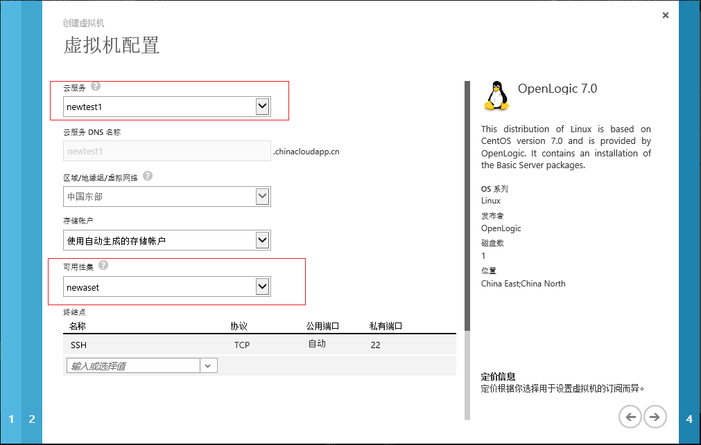

## 将现有的虚拟机添加到可用性集

1. 同样的，要想处于同样的可用性集，必须处于同样的云服务。还是以上面创建的云服务 newtest1 为例子，假设现有一台虚拟机，它的云服务同样是 newtest1, 我们在此虚拟机控制面板的”配置“里，可以看到”选择可用性集”。

	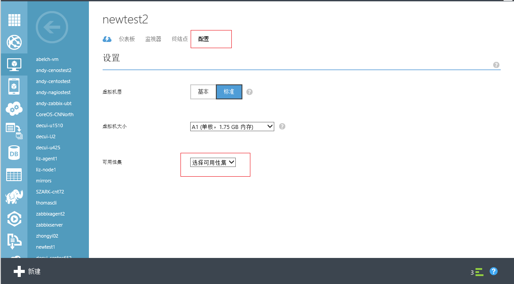

2. 选择我们之前创建的可用性集 newatest。

	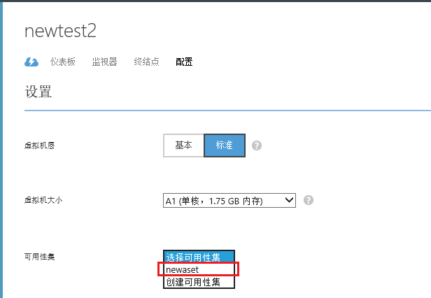

3. 点击保存。

	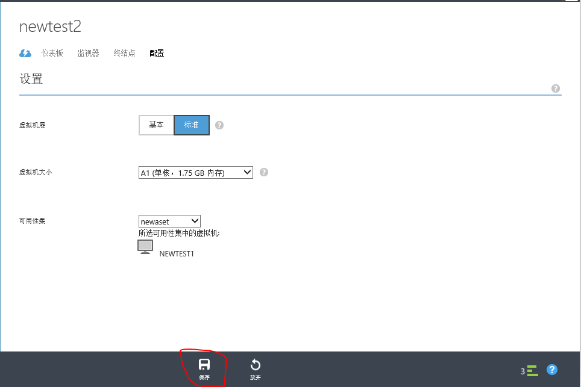

4. 之后我们可以看到此可用性集有了两个虚拟机了。

	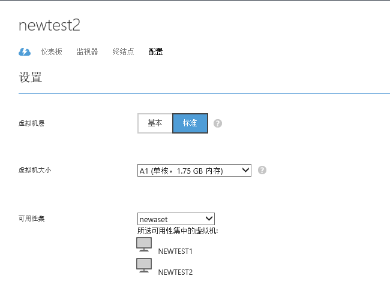

5. 我们检查下这两台虚拟机的云服务的详细信息。首先是 newtest1 的控制面板的“仪表板”下查看到的信息：

	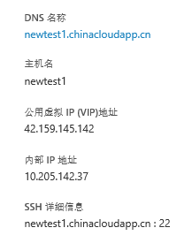

	然后看newtest2的信息

	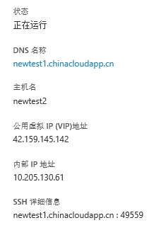

	所以我们连接newtest1.chinacloudapp.cn:22即是连接到newtest1, 连接newtest1.chinacloudapp.cn:49559即是连接到newtest2。

## 服务高可用

1. 我们演示如何利用负载均衡集和可用性集做 HTTP 80 服务的高可用。首先给 newtest1 添加一个终结点。选择“终结点”—“添加“。

	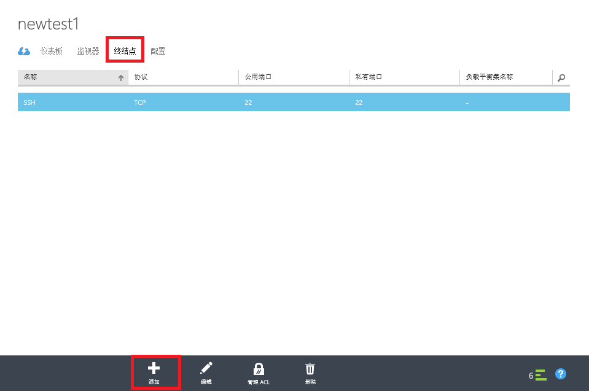

2. 选择”添加独立终结点“，继续。

	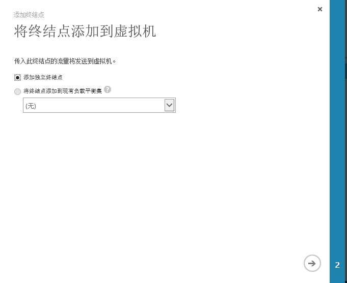

3. 选择 HTTP， 勾选“创建负载平衡集“， 继续下一步。

	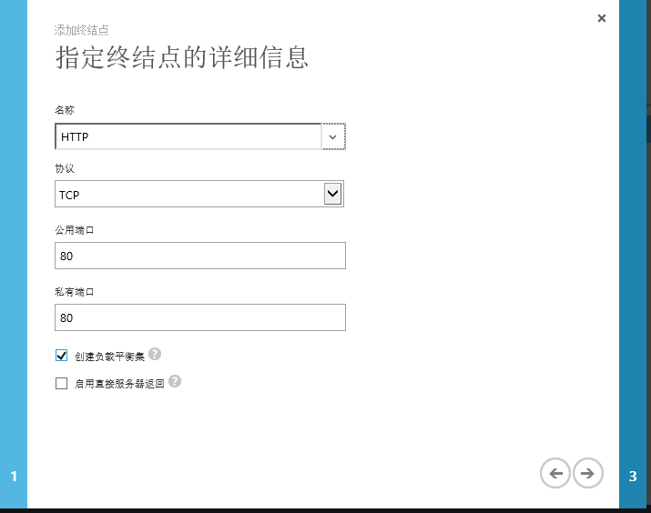

4. 设置负载均衡集名字，确认添加。

	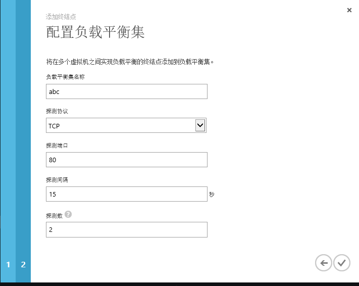

5. 之后我们去到 newtest2, 添加终节点时选择“将终结点添加到现有负载均衡集“，选择我们在 newtest1 上创建的负载均衡集名字，然后继续。

	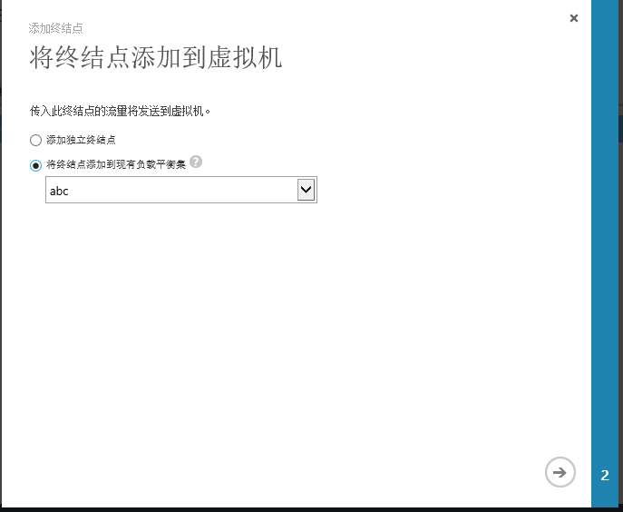

6. 设置终结点名字，确认即可创建。

	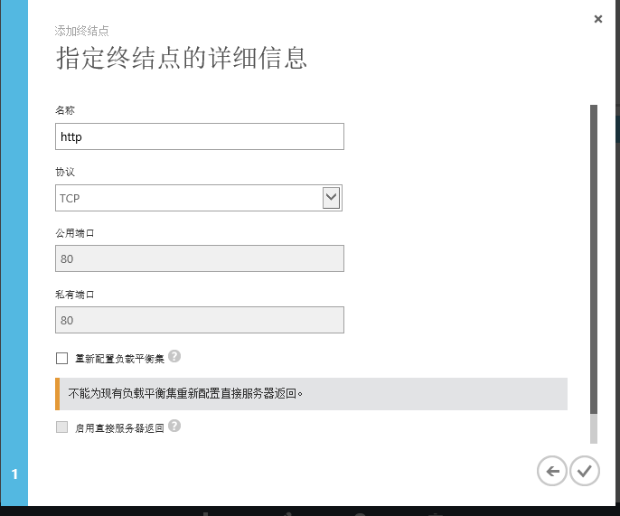

7. SSH 连接到两台虚拟机，安装后 HTTP SERVER 并启动。比如 CentOS 是

		sudo yum install httpd
		sudo service httpd start

8. 在 newtest1 执行 echo “newtest1” > /var/www/html/index.html。 在 newtest2 执行 echo “newtest2” > /var/www/html/index.html。

9. 在浏览器访问[http://newtest1.chinacloudapp.cn/](http://newtest1.chinacloudapp.cn/) 结果如下:

	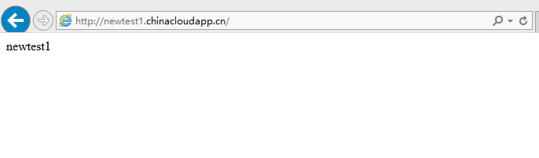

10. 过15秒（之前创建负载均衡集时设置的探测间隔）重新访问[http://newtest1.chinacloudapp.cn](http://newtest1.chinacloudapp.cn) 发现结果如下:

	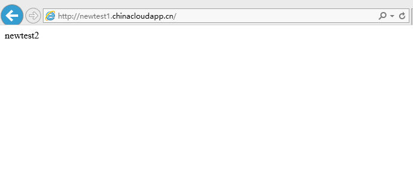

11. 停掉虚拟机 newtest1。

	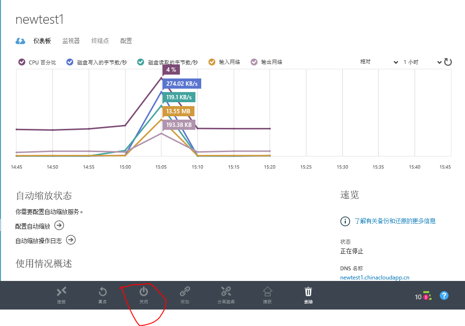

12. 再度访问[http://newtest1.chinacloudapp.cn](http://newtest1.chinacloudapp.cn/) 还是能够访问。

	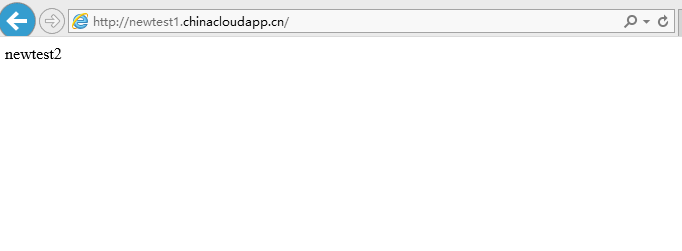

	配置成功。

