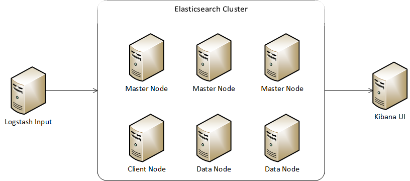

<properties
	pageTitle="在 Azure 虚拟机上快速搭建 ELK 集群 | Azure "
	description="了解如何在 Azure 虚拟机上快速搭建 ELK 集群"
	services="open-resource"
	documentationCenter=""
	authors="lizzha"
	manager=""
	editor="lizzha"/>

<tags
	ms.service="open-source-website"
	ms.date=""
	wacn.date="08/09/2016"/>

#在 Azure 虚拟机上快速搭建 ELK 集群

ELK 是 [Elasticsearch](https://www.elastic.co/products/elasticsearch)、[Logstash](https://www.elastic.co/products/logstash)、[Kibana](https://www.elastic.co/products/kibana) 三个开源软件的组合，是目前在实时数据检索和分析领域非常受欢迎的开源解决方案。本文介绍了如何通过 Azure 资源管理器在 Azure 虚拟机上快速搭建 ELK 集群。 
>[AZURE.NOTE]说明目前脚本仅支持 CentOS 7.2。

##准备步骤 

- 如果你选择 Azure PowerShell 方式搭建 ELK，那么请按[如何安装和配置 Azure PowerShell](/documentation/articles/powershell-install-configure/)中的说明在本地计算机上安装 Azure PowerShell。然后打开 Azure PowerShell 命令提示符，通过运行以下命令并遵循提示进行 Azure 帐户的交互式登录体验，来使用[工作或学校 ID 登录](/documentation/articles/xplat-cli-connect/)：    

		Login-AzureRmAccount -EnvironmentName AzureChinaCloud

	然后你需要创建一个 Azure 资源组( Resource Group )，创建 Azure 虚拟机和搭建 ELK 都在该资源组中进行，运行以下命令创建位于中国东部( 也可改成中国北部 "China North" )的 Azure 资源组：

		New-AzureRmResourceGroup -Name <YOUR-RESOURCE-GROUP-NAME> -Location "China East"

- 如果你选择 Azure CLI 方式搭建 ELK，那么请[安装 Azure CLI](/documentation/articles/xplat-cli-install/)。然后请确保你是处于[资源管理器模式](/documentation/articles/resource-manager-deployment-model/)下，可通过运行以下命令来验证：
		
		azure config mode arm

	现在，通过运行以下命令并遵循提示进行 Azure 帐户的交互式登录体验，来使用[工作或学校 ID 登录](/documentation/articles/xplat-cli-connect)： 
 
		azure login -e AzureChinaCloud -u <your account>

	然后你需要创建一个 Azure 资源组( Resource Group )，创建 Azure 虚拟机和搭建 ELK 都在该资源组中进行，运行以下命令创建位于中国东部( 也可改成中国北部"China North" )的 Azure 资源组：  

		azure group create <YOUR-RESOURCE-GROUP-NAME> "China East"

##开始动手

PowerShell脚本运行注意事项
>[AZURE.WARNING]
PowerShell 脚本运行注意事项  

需要以管理员权限运行 PowerShell，使用之前需运行如下命令： 

`Set-ExecutionPolicy -ExecutionPolicy Unrestricted `
 

###在Azure虚拟机上搭建ELK集群
默认情况下，以下步骤将创建多台 CentOS 虚机，包含：

1. 多个 Elasticsearch 节点

	a. 三个 master 节点

	b. 一个 client 节点

	c. 二个 data 节点

2. 一个 Kibana 节点

3. 一个 Logstash 节点

	 

**以下是通过资源管理器来部署 ELK 集群的步骤**

1. 下载资源模板参数文件 [azuredeploy.parameters.json](https://mirrors.blob.core.chinacloudapi.cn/elkcentos/azuredeploy.parameters.json)

2. 编辑参数文件 azuredeploy.parameters.json，设置需要的参数。以下是主要的参数介绍： 

	- adminUsername：虚拟机的用户名 

	- adminPassword：虚拟机用户的密码 

	- vmClientNodeCount：Elasticsearch client 节点的个数，默认为 1 

	- vmDataNodeCount：Elasticsearch master 节点的个数，默认为 2 

	- vmSizeMasterNodes：Elasticsearch master 节点的虚拟机大小，默认为 Standard_D2_v2 

	- vmSizeClientNodes：Elasticsearch client 节点的虚拟机大小，默认为 Standard_D2_v2 

	- vmSizeDataNodes：Elasticsearch data 节点的虚拟机大小，默认为 Standard_D2_v2 

	- logstashPluginName：要按装的 Logstash 插件的名称，如果不需要安装 Logstash 插件，则设成 "na" 

	- encodedConfigString：Logstash 配置文件内容的 base64 编码字符串。 

		可以通过在 Linux 机器上运行以下命令来生成：`cat /yourpath/logstash.conf | base64 `

		或通过 PowerShell 命令来生成： 

		`$Content = Get-Content -Path 'Yourpath\logstash.conf' -Encoding Byte `

		`$Base64 = [System.Convert]::ToBase64String($Content) `

		如果不需配置 Logstash ，则设成 "na"

3. 用 Azure Powershell 或者 Azure CLI 来部署模板 

	在 Azure PowerShell 中运行如下命令

		PS D:\elk-centos> $TemplateUri = "https://mirrors.blob.core.chinacloudapi.cn/elkcentos/azuredeploy.json" 

		PS D:\elk-centos> New-AzureRmResourceGroupDeployment -Name deployelk -ResourceGroupName <YOUR-RESOURCE-GROUP-NAME> -TemplateParameterFile .\azuredeploy.parameters.json -TemplateUri $TemplateUri -DeploymentDebugLogLevel All -Verbose 

	>[AZURE.NOTE]你可以通过指定可选参数 "-DeploymentDebugLogLevel All -Verbose" 来输出更多的部署日志，这可能有助于你诊断在部署过程中发生的错误。如果 PowerShell 返回这个参数不存在，请更新 Azure Powershell 到最新版本。   

	*或者*
   
	在安装好 Azure CLI 的机器上，运行如下命令

		TemplateUri="https://mirrors.blob.core.chinacloudapi.cn/elkcentos/azuredeploy.json" 

		azure group deployment create <YOUR-RESOURCE-GROUP-NAME> deployelk --template-uri $TemplateUri -e azuredeploy.parameters.json -vv

4. 等待部署完成，由于需要安装的包都只有国外的源，所以部署完成可能会需要较长时间。当部署完成时， PowerShell 或 CLI 会输出 "ProvisioningState : Succeeded" 的信息

5. 通过 PowerShell 或者 CLI 来获取 Kibana 节点的 Public IP 地址

	在 Azure PowerShell 中运行如下命令

		PS D:\elk-centos> Get-AzureRmPublicIpAddress -Name elasticsearch-kibana-pip -ResourceGroupName <YOUR-RESOURCE-GROUP-NAME> 

	*或者*

	在安装好 Azure CLI 的机器上， 运行如下命令

		azure network public-ip show -g <YOUR-RESOURCE-GROUP-NAME> -n elasticsearch-kibana-pip 

6. 用浏览器打开页面 http://"elasticsearch-kibana-pip":5601 ( 将 "elasticsearch-kibana-pip" 替换成实际的 IP 地址 ), 访问 Kibana 主页