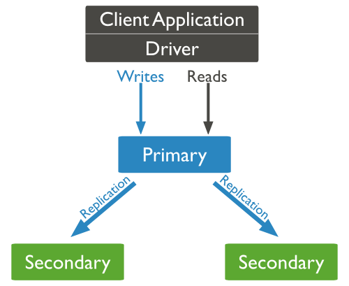
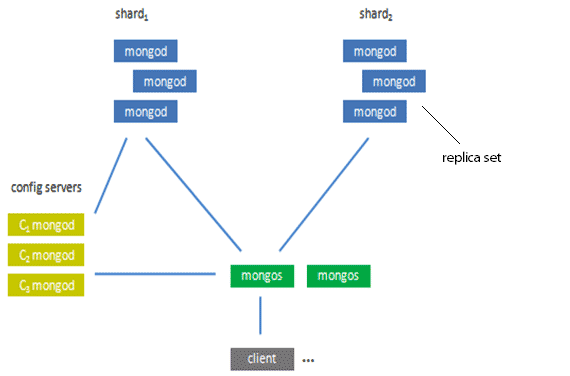

<properties
	pageTitle="在 Azure 虚拟机上快速搭建 MongoDB 集群 | Azure "
	description="了解如何在 Azure 虚拟机上快速搭建 MongoDB 集群"
	services="open-resource"
	documentationCenter=""
	authors=""
	manager=""
	editor="Lingli"/>

<tags
	ms.service="open-source-mongodb"
	wacn.date="06/20/2016"/>

#在 Azure 虚拟机上快速搭建 MongoDB 集群

[MongoDB](https://www.mongodb.org/) 是目前在 NoSQL 市场上非常受欢迎的一个数据库，本文介绍如何使用 Azure PowerShell 和 Azure CLI 在 Azure 虚拟机上搭建单节点 MongoDB（测试使用）和包含主从复制以及分片集群的多节点 MongoDB（生产环境使用）。

>[AZURE.NOTE]说明目前脚本仅支持 CentOS (6.5, 6.6, 6.7, 7.0, 7.1, 7.2)。

##准备步骤 

- 如果你选择 Azure PowerShell 方式搭建 MongoDB，那么请按[如何安装和配置 Azure PowerShell](/documentation/articles/powershell-install-configure/)中的说明在本地计算机上安装 Azure PowerShell。然后打开 Azure PowerShell 命令提示符，通过运行以下命令并遵循提示进行 Azure 帐户的交互式登录体验，来使用[工作或学校 ID 登录](/documentation/articles/xplat-cli-connect/#use-the-log-in-method)：    

		Login-AzureRmAccount -EnvironmentName AzureChinaCloud

然后你需要创建一个 Azure 资源组( Resource Group )，创建 Azure 虚拟机和搭建 MongoDB 都在该资源组中进行，运行以下命令创建 Azure 资源组：

		New-AzureRmResourceGroup -Name "YOUR-RESOURCE-GROUP-NAME" -Location "China East"

- 如果你选择 Azure CLI 方式搭建 MongoDB，那么请[安装 Azure CLI](/documentation/articles/xplat-cli-install/)。然后请确保你是处于[资源管理器模式](/documentation/articles/resource-manager-deployment-model/)下，可通过运行以下命令来验证：
		
		azure config mode asm

现在，通过运行以下命令并遵循提示进行 Azure 帐户的交互式登录体验，来使用[工作或学校 ID 登录](/documentation/articles/xplat-cli-connect/#use-the-log-in-method)： 
 
		azure login -e AzureChinaCloud -u <your account>

然后你需要创建一个 Azure 资源组( Resource Group )，创建 Azure 虚拟机和搭建 MongoDB 都在该资源组中进行，运行以下命令创建 Azure 资源组：  

		zure group create "YOUR-RESOURCE-GROUP-NAME" "China East"

##开始动手

>[AZURE.NOTE]参数使用注意事项
>VmName: 需保证唯一性，该参数将作为 DNS 前缀。  
>DNSNamePrefix：必须小写，需保证唯一性，该参数将作为 DNS 前缀。  
>ZabbixServerIPAddress：可选项，指定 Zabbix 服务器地址，安装 MongoDB 过程中会在虚拟机上自动安装 Zabbix agent。      

PowerShell脚本运行注意事项
>[AZURE.WARNING]PowerShell 脚本运行注意事项  
需要以管理员权限运行 PowerShell，使用之前需运行如下命令：  
Set-ExecutionPolicy -ExecutionPolicy Unrestricted  

###1.在Azure虚拟机上搭建单节点 MongoDB
默认情况下，以下脚本将创建1台 CentOS 虚机，构成一个单节点 MongoDB。
以下将介绍两种方式搭建 MongoDB：
**Azure PowerShell 方式** 
你需要下载 PowerShell 脚本 [mongodb-singlenode-deploy.ps1](http://mirrors.blob.core.chinacloudapi.cn/mongodb/mongodb-singlenode-deploy.ps1)，按照以下示例运行 mongodb-install-centos.ps1 脚本，即可在资源组 rg1 中生成一台 CentOS 虚拟机，接着会在该虚机上安装单节点 MongoDB。  

		PS C:\mongodb> .\mongodb-singlenode-deploy.ps1 -ResourceGroupName rg1 -AdminUserName azureuser -AdminPassword “YOUR-PASSWORD”  -CentosVersion 6.5 -VmName mongodbserver

创建过程大概需要6分钟，运行成功后会出现如下提示：    

		Deploy MongoDB on VM mongodb11 (CentOS 6.5) in China North successfully.
		To connect using the mongo shell:
		% mongo mongodbserver.chinanorth.cloudapp.chinacloudapi.cn:27017/test
  

**Azure CLI 方式**   
你需要在安装好 Azure CLI 的机器上，运行如下命令下载 azuredeploy.parameters-mongodb-centos.json 参数配置文件：  

		wget http://msmirrors.blob.core.chinacloudapi.cn/mongodb/mongodb-single-node/azuredeploy.parameters.json -O azuredeploy.parameters.json

接着修改 azuredeploy.parameters.json 参数配置文件:  

		vi azuredeploy.parameters.json 

然后运行如下命令即可安装 CentOS 虚拟机和单节点 MongoDB，创建过程大概需要6分钟：  

		$TemplateUri="http://msmirrors.blob.core.chinacloudapi.cn/mongodb/mongodb-single-node/azuredeploy.json"
		azure group deployment create rg1 DeployMongoDB --template-uri $TemplateUri –e azuredeploy.parameters.json
 

按照上述任意一种方式创建完 MongoDB 后，即可使用如下命令连接 MongoDB:  
  
		mongo mongodbserver.chinanorth.cloudapp.chinacloudapi.cn:27017/test 

你也可以直接登录 MongoDB 服务器进行其它操作，更多操作请参考 [MongoDB 官方帮助文档](https://docs.mongodb.com/manual/mongo/)。  
###2.	在Azure虚拟机上搭建包含主从复制节点的 MongoDB    
默认情况下，以下脚本将创建3台 CentOS 虚机，组成一个 MongoDB 复制集，该复制集将包含一个 Pirmary 节点和2个 Secondary 节点，架构如下图所示：  

    

以下将介绍两种方式搭建 MongoDB：  

**Azure PowerShell 方式**  

你需要下载 PowerShell 脚本 [mongodb-replica-set-deploy.ps1](http://mirrors.blob.core.chinacloudapi.cn/mongodb/mongodb-replica-set-deploy.ps1)，按照以下示例运行 mongodb-replica-set-deploy.ps1 脚本，即可在资源组 rg1 中生成多台 CentOS 虚拟机，接着会在该虚机上搭建具备主从复制节点的 MongoDB。    

		PS C:\mongodb>.\mongodb-replica-set-deploy.ps1 -ResourceGroupName rg1 -CentosVersion 7.2 -AdminUsername azureuser -AdminPassword “YOUR-PASSWORD” -MongoUsername mongoadmin -MongoPassword “YOUR-PASSWORD” -DNSNamePrefix mongoreplicaset
    
创建过程大概需要10分钟，运行成功后会出现如下提示：   

	Deploy MongoDB Replica Set successfully.
	To connect primary node using the mongo shell:
	% mongo mongoreplicaset.chinanorth.cloudapp.chinacloudapi.cn:27017
	To connect secondary node0 using the mongo shell:
	% mongo mongoreplicasetsecondary0.chinanorth.cloudapp.chinacloudapi.cn:27017
	To connect secondary node1 using the mongo shell:
	% mongo mongoreplicasetsecondary1.chinanorth.cloudapp.chinacloudapi.cn:27017
  
**Azure CLI 方式** 

你需要在安装好 Azure CLI 的机器上，运行如下命令下载 azuredeploy.parameters.json 参数配置文件：  

		wget http://msmirrors.blob.core.chinacloudapi.cn/mongodb/mongodb-replica-set-centos/azuredeploy.parameters.json -O azuredeploy.parameters.json

接着修改 azuredeploy.parameters.json 参数配置文件:  

		vi azuredeploy.parameters.json

然后运行如下命令即可在资源组 rg1 中生成多台 CentOS 虚拟机，接着会在该虚机上搭建具备主从复制节点的 MongoDB，创建过程大概需要10分钟。  

		$TemplateUri="http://msmirrors.blob.core.chinacloudapi.cn/mongodb/mongodb-replica-set-centos/azuredeploy.json"
		azure group deployment create rg1 DeployMongoDB --template-uri $TemplateUri -e azuredeploy.parameters.json
 

按照上述任意一种方式创建完 MongoDB 后，即可使用如下命令连接 MongoDB 主服务器: 
 
		mongo mongodbserver.chinanorth.cloudapp.chinacloudapi.cn:27017/test 
  
你也可以直接登录 MongoDB 服务器查看状态，运行如下命令：  

		$ mongo -u mongoadmin -p “YOUR-PASSWORD” admin --eval 'rs.status()'
		MongoDB shell version: 3.2.6
		connecting to: admin
		{
        "set" : "mongoreplicaset",
        "date" : ISODate("2016-05-10T03:20:25.066Z"),
        "myState" : 1,
        "term" : NumberLong(1),
        "heartbeatIntervalMillis" : NumberLong(2000),
        "members" : [
                {
                        "_id" : 0,
                        "name" : "139.217.21.42:27017",
                        "health" : 1,
                        "state" : 1,
                        "stateStr" : "PRIMARY",
                        "uptime" : 3765,
                        "optime" : {
                                "ts" : Timestamp(1462846679, 2),
                                "t" : NumberLong(1)
                        },
                        "optimeDate" : ISODate("2016-05-10T02:17:59Z"),
                        "electionTime" : Timestamp(1462846678, 2),
                        "electionDate" : ISODate("2016-05-10T02:17:58Z"),
                        "configVersion" : 3,
                        "self" : true
                },
                {
                        "_id" : 1,
                        "name" : "10.0.1.4:27017",
                        "health" : 1,
                        "state" : 2,
                        "stateStr" : "SECONDARY",
                        "uptime" : 3746,
                        "optime" : {
                                "ts" : Timestamp(1462846679, 2),
                                "t" : NumberLong(1)
                        },
                        "optimeDate" : ISODate("2016-05-10T02:17:59Z"),
                        "lastHeartbeat" : ISODate("2016-05-10T03:20:24.901Z"),
                        "lastHeartbeatRecv" : ISODate("2016-05-10T03:20:23.267Z"),
                        "pingMs" : NumberLong(1),
                        "configVersion" : 3
                },
                {
                        "_id" : 2,
                        "name" : "10.0.1.5:27017",
                        "health" : 1,
                        "state" : 2,
                        "stateStr" : "SECONDARY",
                        "uptime" : 3746,
                        "optime" : {
                                "ts" : Timestamp(1462846679, 2),
                                "t" : NumberLong(1)
                        },
                        "optimeDate" : ISODate("2016-05-10T02:17:59Z"),
                        "lastHeartbeat" : ISODate("2016-05-10T03:20:24.899Z"),
                        "lastHeartbeatRecv" : ISODate("2016-05-10T03:20:23.721Z"),
                        "pingMs" : NumberLong(1),
                        "configVersion" : 3
                }
        ],
        "ok" : 1
		}
  
###3.	在 Azure 虚拟机上搭建 MongoDB 分片集群  
默认情况下，以下脚本将创建11台 CentOS 虚机，包含：2台 router 服务器, 3台 config 服务器，2个分片，每个分片带有1个 Priamry 节点和2个 Secondary 节点，总计11个节点，架构如下图所示：  

   

**Azure PowerShell 方式**  

你需要下载PowerShell脚本 [mongodb-sharding-deploy.ps1](http://mirrors.blob.core.chinacloudapi.cn/mongodb/mongodb-sharding-deploy.ps1)，按照以下示例运行 mongodb-sharding-deploy.ps1 脚本，即可在资源组rg1中生成多台 CentOS 虚拟机，接着会在该虚机上搭建具备主从复制节点及分片集群的 MongoDB，创建过程大概需要1小时15分钟。  

		PS C:\mongodb>.\mongodb-sharding-deploy.ps1 -ResourceGroupName rg1 -CentosVersion 7.2 -AdminUsername azureuser -AdminPassword “YOUR-PASSWORD” -MongoUsername mongoadmin -MongoPassword “YOUR-PASSWORD” -DNSNamePrefix mongoshard
  

**Azure CLI 方式**  
你需要在安装好 Azure CLI 的机器上，运行如下命令下载 azuredeploy.parameters-mongodb-centos.json 参数配置文件：  

		wget http://msmirrors.blob.core.chinacloudapi.cn/mongodb/mongodb-sharding-centos/azuredeploy.parameters.json -O azuredeploy.parameters.json
  

接着修改 azuredeploy.parameters.json 参数配置文件:   

		vi azuredeploy.parameters.json   

然后运行如下命令即可在资源组 rg1 中生成多台 CentOS 虚拟机，接着会在该虚机上搭建具备主从复制节点及分片集群的 MongoDB，创建过程大概需要1 小时15分钟。   
	
		$TemplateUri="http://msmirrors.blob.core.chinacloudapi.cn/mongodb/mongodb-sharding-centos/azuredeploy.json"
		azure group deployment create rg1 DeployMongoDB --template-uri $TemplateUri -e azuredeploy.parameters.json

按照上述任意一种方式创建完 MongoDB 后，即可使用如下命令连接 MongoDB 主服务器:   

		mongo mongodbserver.chinanorth.cloudapp.chinacloudapi.cn:27017/test   

你也可以直接登录 MongoDB 服务器查看状态，运行如下命令：    

		$mongo -u mongoadmin -p “YOUR-PASSWORD”  --eval 'db.runCommand({listshards:1})'
		MongoDB shell version: 3.2.6
		connecting to: admin
		{
        "shards" : [
                {
                        "_id" : "repset1",
                        "host" : "repset1/10.0.0.100:27017,10.0.0.4:27017,10.0.0.5:27017"
                },
                {
                        "_id" : "repset2",
                        "host" : "repset2/10.0.0.110:27017,10.0.0.6:27017,10.0.0.7:27017"
                }
        ],
        "ok" : 1
		}
