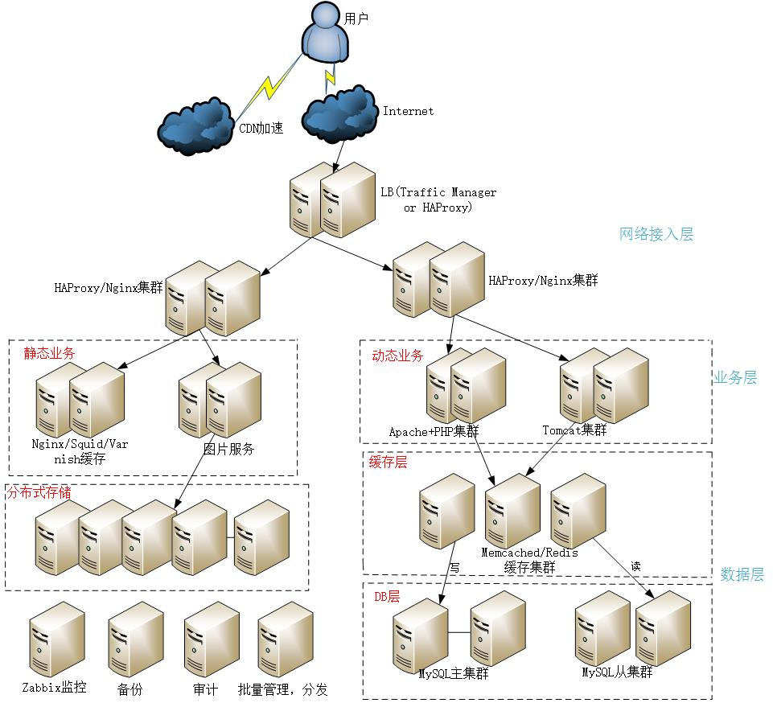
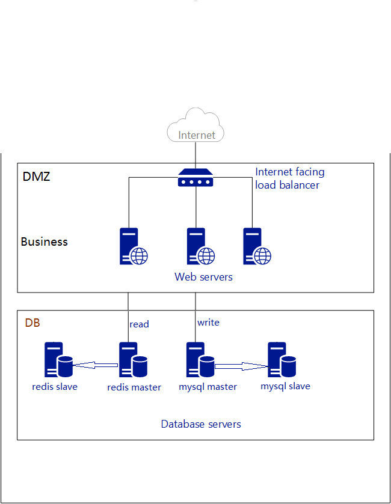
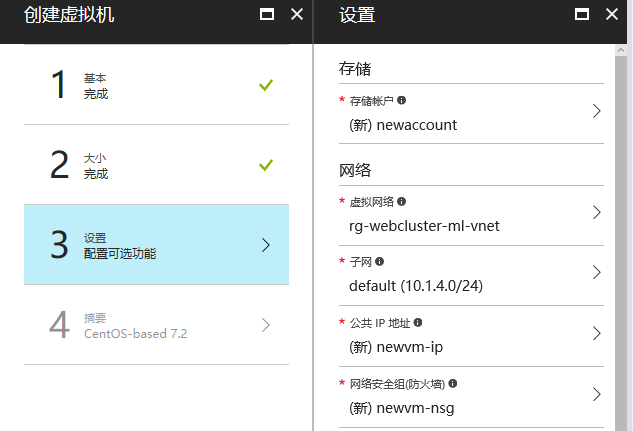
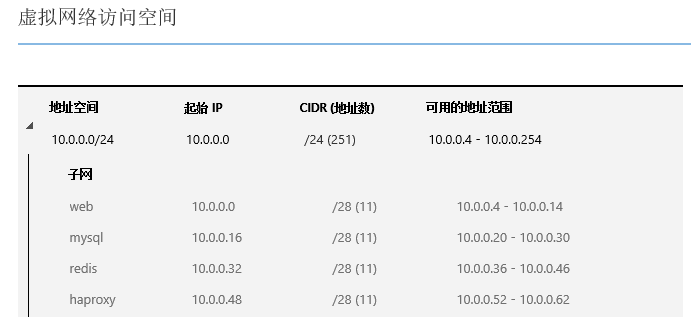
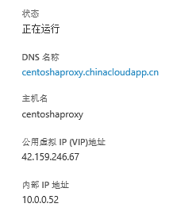
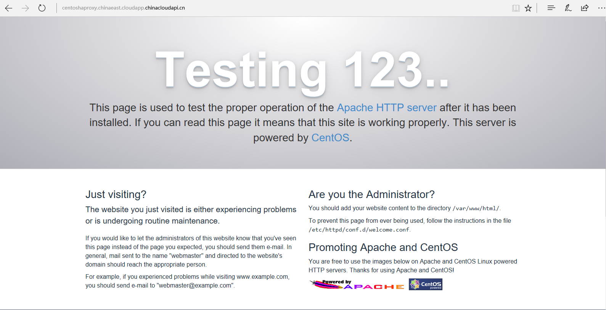
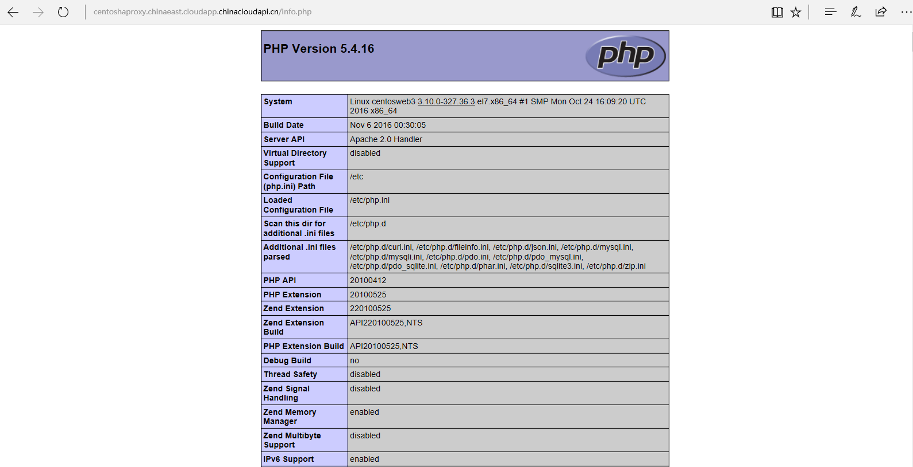
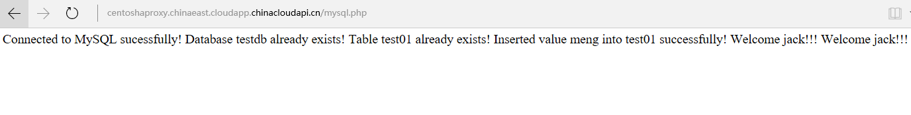

<properties
   pageTitle="构建网站集群 | Azure"
   description="本文介绍如何构建大规模网站集群，考虑将网站架构的各个模块解耦，服务化，做到整体水平扩展，支持高并发，大流量的访问。"
   services="open-source"
   documentationCenter=""
   authors=""
   manager=""
   editor=""/>

<tags
   ms.service="open-source-website"  
   ms.date=""
   wacn.date="06/14/2016"/>

# 构建网站集群

构建大规模网站集群，考虑将网站架构的各个模块解耦，服务化，做到整体水平扩展，支持高并发，大流量的访问。
下面是一个简单的示意图。

 

可以看到我们将网站进行了简单的分层：网络接入层，业务层，数据层。根据实际情况的不同，还可以做更多的分层，比如有文件层，提供分布式存储解决方案，数据层再细分为缓存层，DB 层。

网络接入层主要是流量负载均衡（LB）和安全两块，LB 常见的开源产品有 LVS, HAPROXY, NGINX 等，也可以使用 Azure 的 Traffic Manager 来做，还可以有多层负载均衡。
安全比如入口防火墙，防 DDOS 攻击等。

业务层可以是 WEB 服务器加应用程序服务器，而对于静态文件的访问可以利用 Azure 的 CDN 技术，加速访问。除了 CDN，静态文件的缓存可以用 Nginx, Squid, Varnish 等。网络接入层的 LB 做动静分离，对于动态文件的执行，数据流沿着 WEB+APP+DB 这样的访问逻辑。

数据层要有缓存服务器减轻数据库服务器的访问压力，常用的缓存服务有 Memcached, Redis 等，也可以使用 Azure 的 Redis 服务； 数据库服务可以用 RDBMS， NOSQL， 还可以用 Azure 提供的数据库服务。

这样架构的业务系统可以水平扩展，比如加入更多的 WEB 服务器和应用程序服务器，应对更大规模的流量，而无需对架构做大的调整。当数据库服务成为主要的瓶颈，加入更多的缓存集群，读写分离，数据库集群做分库分表等。

下面结合 Azure 做一个简单的演示.
整体架构是1台 LB + 3台 WEB + 2台 MYSQL + 2台 Redis. 
MySQL 是一主一从，提供数据写服务； Redis 也是一主一从，提供数据读服务。
用户在浏览器地址栏输入 LB 的地址即可访问。 LB 会做负载均衡，WEB Servers 处理请求，数据库 MySQL + Redis 提供数据服务。如果有自己的域名，请参考下面后续步骤进行设置。
 

1. 虚拟网络

	不管是 MySQL 的主从，还是 Redis 的主从，建议让主从这两台服务器处于同一个子网下。比较好的一种网络划分方式是1台LB + 3台WEB + 2台MYSQL + 2台Redis 都处于同一个虚拟网络下，但是各自位于不同的子网。比如3台 WEB 位于子网A，2台 MYSQL 位于子网B，2台 Redis 位于子网C，1台 LB 位于子网D。

	Azure 有提供虚拟网络的服务，可以让不同的虚拟机处于同一个子网下。请参考[虚拟网络链接](/documentation/articles/virtual-networks-create-vnet-classic-portal/)创建虚拟网络，并创建四个子网。

	创建好虚拟网络后，在创建3台 WEB 虚拟机时选择同一个虚拟网络的子网A，在创建 MYSQL 主从虚拟机时选择同一个虚拟网络的子网B，在创建 Redis 主从虚拟机时选择同一个虚拟网络的子网C，创建 LB 虚拟机时选择同一个虚拟网络的子网D。如下图即为创建虚拟机时选择虚拟网络和子网的界面。

	
 

	>[AZURE.WARNING] 注意： 如果你希望虚拟机使用虚拟网络，则必须在创建虚拟机时指定虚拟网络。创建虚拟机后，不能将它加入虚拟网络。 

	我的虚拟机及网络基本信息如下：
	<table border="1">
	<tr>
	    <th>角色</th>
	    <th>主机名</th>
	    <th>OS</th>
	    <th>IP地址/掩码</th>
	    <th>软件</th>
	</tr>
	<tr>
	    <td>LB</td>
	    <td>centoshaproxy</td>
	    <td>CentOS 7.0</td>
	    <td>10.0.0.52/28</td>
	    <td>Haproxy 1.6.3</td>
	</tr>
	<tr>
	    <td>Web server 1</td>
	    <td>centosweb1</td>
	    <td>CentOS 7.0</td>
	    <td>10.0.0.4/28</td>
	    <td>Apache 2.4+php5</td>
	</tr>
	<tr>
	    <td>Web server 2</td>
	    <td>centosweb2</td>
	    <td>CentOS 7.0</td>
	    <td>10.0.0.5/28</td>
	    <td>Apache 2.4+php5</td>
	</tr>
	<tr>
	    <td>Web server 3</td>
	    <td>centosweb3</td>
	    <td>CentOS 7.0</td>
	    <td>10.0.0.6/28</td>
	    <td>Apache 2.4+php5</td>
	</tr>
	<tr>
	    <td>Mysql master</td>
	    <td>centosmysql1</td>
	    <td>CentOS 7.0</td>
	    <td>10.0.0.20/28</td>
	    <td>Mysql 5.6</td>
	</tr>
	<tr>
	    <td>Mysql slave</td>
	    <td>centosmysql2</td>
	    <td>CentOS 7.0</td>
	    <td>10.0.0.21/28</td>
	    <td>Mysql 5.6</td>
	</tr>
	<tr>
	    <td>Redis master</td>
	    <td>centosredis1</td>
	    <td>CentOS 7.0</td>
	    <td>10.0.0.36/28</td>
	    <td>Redis 3.0.7</td>
	</tr>
	<tr>
	    <td>Redis slave</td>
	    <td>centosredis2</td>
	    <td>CentOS 7.0</td>
	    <td>10.0.0.37/28</td>
	    <td>Redis 3.0.7</td>
	</tr>
	</table>

 
	

	>[AZURE.WARNING] 不想让这些服务器处于同一虚拟网络的话可以忽略创建虚拟网络这步，那么我们建议让这些服务器位于同一个数据中心，比如区域都位于中国东部或中国北部，以降低网络延迟。在创建虚拟机时选择区域，让它们的区域保持一致，都是中国东部或者中国北部。用各自虚拟机的公网 IP 替代上面表格中的IP地址。

2. 创建虚拟机

	创建虚拟机和连接虚拟机的操作请参考[Azure Linux VM tutorial](/documentation/articles/virtual-machines-linux-tutorial-portal-rm/)。

3. LB的安装配置

	我们使用 haproxy 来作负载均衡，下面的步骤演示 haproxy 的安装配置过程。 

	3.1 打开此 LB 虚拟机的访问端口80。请参考[创建终结点](/documentation/articles/virtual-machines-set-up-endpoints/)。

	3.2 下载软件包[http://www.haproxy.org/download/1.6/src/haproxy-1.6.3.tar.gz](http://www.haproxy.org/download/1.6/src/haproxy-1.6.3.tar.gz) 并上传至 LB 虚拟机。然后 SSH 连接到此 LB 虚拟机，去到此软件包所在目录下，执行如下命令： 

		$sudo tar zxvf haproxy-1.6.3.tar.gz
		$cd haproxy-1.6.3
		$sudo yum install gcc
		$sudo make TARGET=linux2628 PREFIX=/usr/local/haproxy
		$sudo make install PREFIX=/usr/local/haproxy

	3.3 去到/usr/local/haproxy目录，执行命令

		sudo vi haproxy.cfg 

	确保文件内容和下面一致：

		global         
		       maxconn 4096           
		       chroot /usr/local/haproxy
		        uid 99                 
		        gid 99               
		       daemon                  
		       pidfile /usr/local/haproxy/haproxy.pid  
		
		defaults             
		       log    global
		        log     127.0.0.1       local3        
		       mode    http         
		       option  httplog       
		        option  dontlognull  
		        option  httpclose    
		       retries 3           
		       option  redispatch   
		       maxconn 2000                     
		       timeout connect     5000           
		       timeout client     50000          
		       timeout server     50000          
		
		frontend http-in                       
		       bind *:80
		        mode    http 
		        option  httplog
		        log     global
		        default_backend httppool 
		       
		backend httppool                    
		       balance source
		        server  centosweb1 10.0.0.4:80  weight 5 check inter 2000 rise 2 fall 3
		        server  centosweb2 10.0.0.5:80  weight 5 check inter 2000 rise 2 fall 3
		        server  centosweb3 10.0.0.6:80  weight 5 check inter 2000 rise 2 fall 3

	>[AZURE.WARNING]注意上面红色标注的部分为3台WEB的IP地址，请根据您的实际情况填写: 如果3台WEB与此LB在同一个虚拟网络的不同子网下，这里可以填写私有IP地址，否则请填写3台WEB的实际公网IP地址。

 

4. Redis 的安装和主从设置

	如果使用 Azure 提供的 Redis 服务，请参考链接[Azure Redis tutorial](/documentation/services/redis-cache/)。

	如果是自己搭建，请参考下面步骤。

	4.1在两台 redis 虚拟机上打开6379端口。6379端口是 Redis 的默认端口。请参考链接[创建终结点](/documentation/articles/virtual-machines-set-up-endpoints/)打开端口。

	4.2 SSH 连接到 redis master 即 centosredis1 虚拟机上，编辑文件 install_redis.sh, 确保文件内容和下面一致：

		#!/bin/bash
		
		#download redis
		cd /usr/local
		for((i=1;i<=5;i++))
		do
		wget http://download.redis.io/releases/redis-3.0.7.tar.gz
		if [[ $? -ne 0 ]];then
		if [[ $i == 5 ]];then
		echo "tried 5 times to download redis but failed. exit. try again later."
		exit 1
		fi
		continue
		else
		echo "download redis successfully"
		break
		fi
		done
		
		#install redis
			tar xzvf redis-3.0.7.tar.gz
			ln -s redis-3.0.7 redis
			cd redis
			yum install gcc -y
			make
		
		#ocnfigure redis
			cp redis.conf /etc/
			sed -i 's/daemonize no/daemonize yes/' /etc/redis.conf
			cd src
		
		#start redis
			/usr/local/redis/src/redis-server /etc/redis.conf

	4.3 然后执行命令

		sudo bash install_redis.sh

	4.4 SSH 连接到 redis slave 即 centosredis2 虚拟机上，编辑文件 install_redis.sh, 确保文件内容和下面一致：  
 		
		#!/bin/bash
		masterIP=$1
		
		#download redis
		cd /usr/local
		for((i=1;i<=5;i++))
		do
		wget http://download.redis.io/releases/redis-3.0.7.tar.gz
		if [[ $? -ne 0 ]];then
		if [[ $i == 5 ]];then
		echo "tried 5 times to download redis but failed. exit. try again later."
		exit 1
		fi
		continue
		else
		echo "download redis successfully"
		break
		fi
		done
		
		#install redis
		tar xzvf redis-3.0.7.tar.gz
		ln -s redis-3.0.7 redis
		cd redis
		yum install gcc -y
		make
		
		#ocnfigure redis
		cp redis.conf /etc/
		sed -i 's/daemonize no/daemonize yes/' /etc/redis.conf
		cd src
		#/usr/local/redis/src/redis-server /etc/redis.conf  
		sed -i "s/# slaveof <masterip> <masterport>/slaveof $masterIP 6379/" /etc/redis.conf
		#/usr/local/redis/src/redis-cli shutdown
		
		#start redis
		/usr/local/redis/src/redis-server /etc/redis.conf

	4.5 然后执行命令

		sudo bash install_redis.sh masterIP

	>[AZURE.IMPORTANT] 注意：其中的 masterIP 指的是您的 redis master 的 IP 地址，请根据您的具体情况设置:如果 redis 这两台机器在同一个子网下，这里可以填 redis master 的私有 IP 地址，否则请填写 redis master 的公网 IP 地址。

	比如我运行

		sudo bash install_redis.sh 10.0.0.36  
	
	其中10.0.0.36是我 redis master 的 IP 地址。

	4.6 去到 redis master 即 centosredis1 虚拟机，执行下面命令： 

		$sudo /usr/local/redis/src/redis-cli 
		127.0.0.1:6379> set hello world
		OK
		127.0.0.1:6379> get hello
		"world"
		127.0.0.1:6379>
		
	4.7 去到 redis slave 即 centosredis2 虚拟机，执行下面命令：

		$sudo /usr/local/redis/src/redis-cli 
		127.0.0.1:6379> get hello
		"world"
		127.0.0.1:6379>

	如果得到上面类似输出，表明 redis 主从复制成功。这样 redis master 即 centosredis1 的 IP 地址即为对外访问的接口。

5. MySQL的安装和主从设置

	如果使用 Azure 提供的 MySQL 服务，请参考文档[Azure MySQL tutorial](/documentation/articles/mysql-database-get-started/)。

	如果是自己搭建，请参考下面步骤。

	5.1. 在两台机器上都打开3306端口。请参考链接[创建终结点](/documentation/articles/virtual-machines-set-up-endpoints/)。
	
	5.2. SSH 连接到 mysql master 即 centosmysql1 虚拟机，编辑文件 install_mysql.sh, 确保内容和下面一致：　

		#!/bin/bash
		mysqlPassword=$1
		
		#get repo
		yum install wget -y
		for((i=1;i<=5;i++))
		do
		wget http://repo.mysql.com/mysql-community-release-el6-5.noarch.rpm
		if [[ $? -ne 0 ]];then
		if [[ $i == 5 ]];then
		echo "tried 5 times to download repo but failed. exit. try again later."
		exit 1
		fi
		continue
		else
		echo "download repo successfully"
		break
		fi
		done
		yum localinstall -y mysql-community-release-el6-5.noarch.rpm
		
		#install mysql 5.6
		for((i=1;i<=5;i++))
		do
		yum install -y mysql-community-server
		if [[ $? -ne 0 ]];then
		if [[ $i == 5 ]];then
		echo "tried 5 times to install mysql server but failed. exit. try again later."
		exit 10
		fi
		yum clean all
		continue
		else
		echo "installed mysql server successfully."
		break
		fi
		done
		
		#configure my.cnf
		sed -i '/\[mysqld\]/a server-id = 1\nlog_bin = /var/lib/mysql/mysql-bin.log' /etc/my.cnf
		
		#start mysql,httpd
		service mysqld start
		
		#set mysql root password
		mysqladmin -uroot password "$mysqlPassword" 2> /dev/null
		
		#grant privileges
		mysql -uroot -p$mysqlPassword -e "grant replication slave on *.* to 'repluser'@'%' identified by 'replpass';grant all privileges on *.* to 'root'@'%' identified by '$mysqlPassword';flush privileges;"

	5.3. 然后执行命令

		sudo bash install_mysql.sh mysqlPassword

	>[AZURE.IMPORTANT] 注意：其中的 mysqlPassword 指的是您的 mysql root 密码，请根据您的具体情况设置。

	比如您运行

		sudo bash install_lamp.sh s3cret  

	那么 s3cret 就是您的 mysql root 密码.

	5.4. SSH 连接到 mysql slave 即 centosmysql2 虚拟机，编辑文件 install_mysql.sh, 确保文件内容和如下一致：

		#!/bin/bash
		
		mysqlPassword=$1
		masterIP=$2
		
		#get repo
		yum install wget -y
		for((i=1;i<=5;i++))
		do
		wget http://repo.mysql.com/mysql-community-release-el6-5.noarch.rpm
		if [[ $? -ne 0 ]];then
		if [[ $i == 5 ]];then
		echo "tried 5 times to download repo but failed. exit. try again later."
		exit 1
		fi
		continue
		else
		echo "download repo successfully"
		break
		fi
		done
		yum localinstall -y mysql-community-release-el6-5.noarch.rpm
		
		#install mysql 5.6
		for((i=1;i<=5;i++))
		do
		yum install -y mysql-community-server
		if [[ $? -ne 0 ]];then
		if [[ $i == 5 ]];then
		echo "tried 5 times to install mysql server but failed. exit. try again later."
		exit 10
		fi
		yum clean all
		continue
		else
		echo "installed mysql server successfully."
		break
		fi
		done
		
		#configure my.cnf
		sed -i '/\[mysqld\]/a server-id = 2\nlog_bin = /var/lib/mysql/mysql-bin.log\nreplicate-ignore-db = mysql' /etc/my.cnf
		
		#start mysql,httpd
		service mysqld start
		
		#set mysql root password
		mysqladmin -uroot password "$mysqlPassword" 2> /dev/null
		
		#grant privileges
		mysql -uroot -p$mysqlPassword -e "grant all privileges on *.* to 'root'@'%' identified by '$mysqlPassword';flush privileges;"
		
		#configure slave
		mysql -uroot -p$mysqlPassword -e "change master to master_host='$masterIP',master_user='repluser',master_password='replpass';start slave;"
		slaveStatus=`mysql -uroot -p$mysqlPassword -e "show slave status\G" |grep -i "Running: Yes"|wc -l`
		if [[ $slaveStatus -ne 2 ]];then
		echo "master-slave replication issue!"
		else
		echo "master-slave configuration succeeds! "
		fi

	5.5 然后执行命令

		sudo bash install_mysql.sh mysqlPassword masterIP　
	
	>[AZURE.IMPORTANT] 注意：其中的 mysqlPassword 指的是您的 mysql root 密码， masterIP 指的是mysql，master 的 IP 地址，请根据您的具体情况设置。
	
	比如我运行

		sudo bash install_lamp.sh s3cret 10.0.0.20

	那么 s3cret 就是我的 mysql root 密码，而10.0.0.20是我 centosmysql1 的私有 IP 地址。如果您的 mysql master 和 mysql slave 都位于同一个子网下，这里可以填 mysql master 的私有 IP 地址，否则请使用 mysql master 的公网 IP 地址。

	5.6. 请查看上一个步骤的命令输出结果。如果有类似
		
		master-slave configuration succeeds!

	输出，表明 mysql 主从配置成功，否则配置出错，需要排错。 至此 mysql master 即 centosmysql1 的 IP 地址即为对外访问的接口。

	5.7 注意我这里配置 mysql 主从复制的时候，并没有把 mysql master 虚拟机上名字为 mysql 的数据库复制到从库， 您可以根据具体的需求进行配置。

6. Web Server 的选择

	我们使用 apache+php。

	6.1 首先打开每台 web 的访问端口80。 请参考[创建终结点](/documentation/articles/virtual-machines-set-up-endpoints/)。

	6.2 每台 web 的操作步骤都是一样的，下面以一台 web 为例。SSH 连接到 centosweb1, 编辑文件 install_apache.sh, 确保文件内容和下面一致： 
		
		#!/bin/bash
		
		mysqlPassword=$1
		masterIP=$2
		insertValue=$3
		
		if [[ $# -ne 3 ]];then
		echo "Usage: `basename $0` mysqlPassword mysqlMasterIP insertValue"
		exit
		fi
		
		#install apache 2.4 php5
		yum install httpd php php-mysql -y
		
		
		#start httpd
		service httpd start
		
		#auto-start 
		chkconfig httpd on
		chkconfig firewalld off
		service firewalld stop
		
		#set selinux
		sed -i 's/^SELINUX=.*/SELINUX=disabled/' /etc/sysconfig/selinux
		setenforce 0
		
		#create test php page
		cat > /var/www/html/info.php <<EOF
		<?php
		phpinfo();
		?>
		EOF
		
		#create test php-mysql page
		cat > /var/www/html/mysql.php <<EOF
		<?php
		\$conn = mysql_connect('$masterIP', 'root', '$mysqlPassword');
		if (!\$conn) {
		    die('Could not connect:' . mysql_error());
		}
		echo 'Connected to MySQL sucessfully!';
		
		if(mysql_query("create database testdb")){
		    echo "    Created database testdb successfully!";
		}else{
		    echo "    Database testdb already exists!";
		}
		
		\$db_selected = mysql_select_db('testdb',\$conn);
		
		if(mysql_query("create table test01(name varchar(10))")){
		    echo "    Created table test01 successfuly!";
		}else{
		    echo "    Table test01 already exists!";
		}
		
		if(mysql_query("insert into test01 values ('$insertValue')")){
		    echo "    Inserted value $insertValue into test01 successfully!";
		}else{
		    echo "    Inserted value $insertValue into test01 failed!";
		}
		
		\$result = mysql_query("select * from testdb.test01");
		while(\$row = mysql_fetch_array(\$result))
		{
		echo "    Welcome ";
		echo \$row["name"];
		echo "!!!";
		}
		
		mysql_close(\$conn)
		?>
		EOF

	6.3 然后执行命令

        sudo bash install_apache.sh mysqlPassword mysqlMasterIP insertValue
	
	>[AZURE.IMPORTANT] 注意：其中的 mysqlPassword 指的是您的 mysql master 的 root 密码，请根据您的具体情况设置； mysqlMasterIP 指的是您的 mysql master 的 IP 地址，如果 mysql master 和这台 web 处于同一个虚拟网络的不同子网下，此时可以填写 mysql master 的私有 IP 地址，否则请填写 mysql master 公网 IP 地址； insertValue 指的是您要往 mysql 测试表中写入的值，这个值在访问http://centoshaproxy.chinacloudapp.cn/mysql.php 会显示出来。

	比如我运行

		sudo bash install_apache.sh s3cret 10.0.0.20 jack
   
	s3cret 是我的 mysql master root 密码，10.0.0.20是我的 mysql master 的 IP 地址，jack 就是要写入 mysql 测试表中的值。

	6.4 在其他两台web上重复上述6.2-6.3步骤。

7. 在 LB 即 centoshaproxy 虚拟机上执行下面命令，启动 haproxy 进程。
	
		sudo /usr/local/haproxy/sbin/haproxy -f /usr/local/haproxy/haproxy.cfg

8. 访问网站。
	
	到了这步，直接访问 LB 的地址即可访问此网站。 LB 的 DNS 地址是在创建虚拟机时自己设定的，比如虚拟机的 DNS 地址又叫云服务地址，类似XXXXX.chinacloudapp.cn

	8.1 登录 Azure 管理控制台，选择‘虚拟机’-- > 找到 centoshaproxy, 单击它 -- > 选择‘仪表板’， 在右下方即可看到此台机器的 DNS 地址，公网 IP，私有 IP 等信息。如下图。

	
 
	8.2 直接浏览器里输入[http://centoshaproxy.chinacloudapp.cn](http://centoshaproxy.chinacloudapp.cn) 或者输入 centoshaproxy 的公网 IP ， [http://42.159.246.67](http://42.159.246.67) 如果出现下图，表明负载均衡以及 web server 运行正常。
 
	

	8.3 浏览器里输入[http://centoshaproxy.chinacloudapp.cn/info.php](http://centoshaproxy.chinacloudapp.cn/info.php) 如果出现下图表明 web server php 工作正常。

	
 
	8.4 浏览器里输入[http://centoshaproxy.chinacloudapp.cn/mysql.php](http://centoshaproxy.chinacloudapp.cn/mysql.php) 如果出现类似下图，表明访问 mysql 数据库正常。 
 
	

	8.5 此时如果刷新浏览器，会再次往数据库写入值。至此网站基本配置已经成功。应用程序在开发时，可以实现从 redis 中读取数据，往 mysql 中写入数据；如果 redis 中没有要读取的数据，则从 mysql 中读取，再把此数据写入 redis，下次直接从 redis 中读取即可。

	8.6 如果测试完毕想要删除这些测试数据库和表，只需在 mysql master 即 centosmysql1 虚拟机上执行以下命令:
		
		$mysql -uroot -p

	输入 mysql root 密码后执行
		
		drop database testdb;
	
	即可。

	>[AZURE.IMPORTANT] 注意：我们强烈建议您在测试完毕无误后去到三台 web, 把/var/www/html/mysql.php删除掉，因为它里面包含了 mysql master root 的明文密码。

9. 域名设置

	如果在访问时想要使用自己的域名，请参考[使用自定义域名](/documentation/articles/cloud-services-custom-domain-name/)。

10. 注意事项

	Azure 的虚拟机创建时默认只打开了22端口，所以一定要记得检查是否有把相应的服务端口打开。请参考[创建终结点](/documentation/articles/virtual-machines-set-up-endpoints/)。
	监控，备份，安全等有相关的专题，可参考具体页面。

