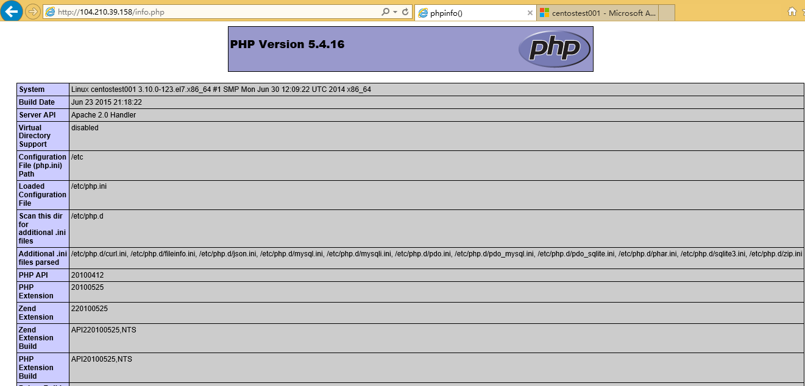
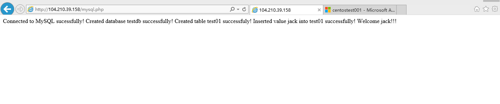

<properties
	pageTitle="在 Azure Linux 虚拟机上快速搭建单机版 LAMP 网站"
	description="了解如何在 Azure Linux 虚拟机上快速搭建单机版 LAMP 网站"
	services="open-source"
	documentationCenter=""
	authors=""
	manager=""
	editor=""/>

<tags
	ms.service="open-source-website"
	ms.date=""
	wacn.date="06/14/2016"/>

# 在 Azure Linux 虚拟机上快速搭建单机版 LAMP 网站

## 目录

- [安装 LAMP](#install_lamp)
- [访问网站](#visit_website)

LAMP 通常表示 Linux+Apache+MySQL/MariaDB+Perl/PHP/Python，LAMP 的各个组件不是一成不变的，并不局限于它最初的选择。作为一个解决方案套件，LAMP 非常适合构建动态网站和网站应用程序。

## 安装 LAMP

本文档的 LAMP 代指 Linux+Apache2+MySQL+php5 且各示例步骤基于 Azure 环境下的 LINUX 虚拟机。如果您还没有 Azure 下的 LINUX 虚拟机，请参考 [Azure Linux VM tutorial](/documentation/articles/virtual-machines-linux-classic-createportal/). 创建 LINUX 虚拟机。

连接到您的 LINUX 虚拟机。如果这是您第一次使用 Azure 的 LINUX 虚拟机，请参考 [Azure Linux VM tutorial](/documentation/articles/virtual-machines-linux-classic-createportal/) 连接到虚拟机。

不同的 LINUX 发行版在安装 LAMP 时有少许的不同。请根据您的 LINUX 版本选择对应的步骤。

**Redhat base Linux**: (以 CentOS 7.0, 64-bit system, MySQL Server 5.6, apache 2.4, php5 为例)

编辑文件 install_lamp.sh, 确保文件内容和下面的一致：

	#!/bin/bash
	
	mysqlPassword=$1
	insertValue=$2
	
	#get repo
	yum install wget -y
	for((i=1;i<=5;i++))
	do
	wget http://repo.mysql.com/mysql-community-release-el6-5.noarch.rpm
	if [[ $? -ne 0 ]];then
	if [[ $i == 5 ]];then
	echo "tried 5 times to download repo but failed. exit. try again later."
	exit 1
	fi
	continue
	else
	echo "download repo successfully"
	break
	fi
	done
	yum localinstall -y mysql-community-release-el6-5.noarch.rpm
	
	#install mysql 5.6
	for((i=1;i<=5;i++))
	do
	yum install -y mysql-community-server
	if [[ $? -ne 0 ]];then
	if [[ $i == 5 ]];then
	echo "tried 5 times to install mysql server but failed. exit. try again later."
	exit 10
	fi
	yum clean all
	continue
	else
	echo "installed mysql server successfully."
	break
	fi
	done
	
	#install apache 2.4 php5
	yum install httpd php php-mysql -y
	
	
	#start mysql,httpd
	service mysqld start
	service httpd start
	
	#set mysql root password
	mysqladmin -uroot password "$mysqlPassword" 2> /dev/null
	
	#restart mysql
	service mysqld restart
	
	#auto-start 
	chkconfig mysqld on
	chkconfig httpd on
	chkconfig firewalld off
	service firewalld stop
	
	#create test php page
	cat > /var/www/html/info.php <<EOF
	<?php
	phpinfo();
	?>
	EOF
	
	#create test php-mysql page
	cat > /var/www/html/mysql.php <<EOF
	<?php
	\$conn = mysql_connect('localhost', 'root', '$mysqlPassword');
	if (!\$conn) {
	    die('Could not connect:' . mysql_error());
	}
	echo 'Connected to MySQL sucessfully!';
	
	if(mysql_query("create database testdb")){
	    echo "    Created database testdb successfully!";
	}else{
	    echo "    Database testdb already exists!";
	}
	
	\$db_selected = mysql_select_db('testdb',\$conn);
	
	if(mysql_query("create table test01(name varchar(10))")){
	    echo "    Created table test01 successfuly!";
	}else{
	    echo "    Table test01 already exists!";
	}
	
	if(mysql_query("insert into test01 values ('$insertValue')")){
	    echo "    Inserted value $insertValue into test01 successfully!";
	}else{
	    echo "    Inserted value $insertValue into test01 failed!";
	}
	
	\$result = mysql_query("select * from testdb.test01");
	while(\$row = mysql_fetch_array(\$result))
	{
	echo "    Welcome ";
	echo \$row["name"];
	echo "!!!";
	}
	
	mysql_close(\$conn)
	?>
	EOF

然后执行下面命令。注意：其中的 mysqlPassword 指的是您的 mysql root 密码，请根据您的具体情况设置；insertValue 指的是您要往 mysql 测试表中写入的值，这个值在访问 [http://yourwebsite/mysql.php](#) 会显示出来。

比如您运行 `bash install_lamp.sh s3cret jack` 那么 s3cret 就是您的 mysql root 密码，jack 就是要写入 mysql 测试表中的值。

	#bash install_lamp.sh mysqlPassword insertValue

**Ubuntu Linux**: (以 Ubuntu 14.04, 64-bit system, MySQL 5.5, apache 2.4, php5 为例)

编辑文件 install_lamp.sh, 确保文件内容和下面的一致：

	#!/bin/bash
	apt-get -y update
	
	# set up a silent install of MySQL
	dbpass=$1
	insertValue=$2
	
	export DEBIAN_FRONTEND=noninteractive
	echo mysql-server-5.6 mysql-server/root_password password $dbpass | debconf-set-selections
	echo mysql-server-5.6 mysql-server/root_password_again password $dbpass | debconf-set-selections
	
	# install the LAMP stack
	apt-get -y install apache2 mysql-server php5 php5-mysql  
	
	# create test PHP page
	echo \<center\>\<h1\>My Demo App\</h1\>\<br/\>\</center\> > /var/www/html/info.php
	echo \<\?php phpinfo\(\)\; \?\> >> /var/www/html/info.php
	
	#create test php-mysql page
	cat > /var/www/html/mysql.php <<EOF
	<?php
	\$conn = mysql_connect('localhost', 'root', '$dbpass');
	if (!\$conn) {
	    die('Could not connect:' . mysql_error());
	}
	echo 'Connected to MySQL sucessfully!';
	
	if(mysql_query("create database testdb")){
	    echo "    Created database testdb successfully!";
	}else{
	    echo "    Database testdb already exists!";
	}
	
	\$db_selected = mysql_select_db('testdb',\$conn);
	
	if(mysql_query("create table test01(name varchar(10))")){
	    echo "    Created table test01 successfuly!";
	}else{
	    echo "    Table test01 already exists!";
	}
	
	if(mysql_query("insert into test01 values ('$insertValue')")){
	    echo "    Inserted value $insertValue into test01 successfully!";
	}else{
	    echo "    Inserted value $insertValue into test01 failed!";
	}
	
	\$result = mysql_query("select * from testdb.test01");
	while(\$row = mysql_fetch_array(\$result))
	{
	echo "    Welcome ";
	echo \$row["name"];
	echo "!!!";
	}
	
	mysql_close(\$conn)
	?>
	EOF

然后执行下面命令。注意：其中的 mysqlPassword 指的是您的 mysql root 密码，请根据您的具体情况设置；insertValue 指的是您要往 mysql 测试表中写入的值，这个值在访问 [http://yourwebsite/mysql.php](#) 会显示出来。

比如您运行 `bash install_lamp.sh s3cret jack` 那么 s3cret 就是您的 mysql root 密码，jack 就是要写入 mysql 测试表中的值。

	#bash install_lamp.sh mysqlPassword insertValue

**SUSE Linux**: (以 SLES 12, 64-bit system, MySQL Server 5.6, apache 2.4, php5 为例)

编辑文件 install_lamp.sh, 确保文件内容和下面的一致：

	#!/bin/bash
	mysqlPassword=$1
	insertValue=$2
	
	#download repo
	for((i=1;i<=5;i++))
	do
	wget http://dev.mysql.com/get/mysql57-community-release-sles12-7.noarch.rpm
	if [[ $? -ne 0 ]];then
	if [[ $i == 5 ]];then
	echo "tried 5 times to download repo but failed. exit. try again later."
	exit 1
	fi
	continue
	else
	echo "download repo successfully"
	break
	fi
	done
	
	#install mysql 5.6
	rpm -ivh mysql57-community-release-sles12-7.noarch.rpm
	rpm --import /etc/RPM-GPG-KEY-mysql
	zypper modifyrepo -d mysql57-community
	zypper modifyrepo -e mysql56-community
	zypper refresh
	
	for((i=1;i<=5;i++))
	do
	zypper install -y mysql-community-server
	if [[ $? -ne 0 ]];then
	if [[ $i == 5 ]];then
	echo "tried 5 times to install mysql server but failed. exit. try again later."
	exit 10
	fi
	continue
	else
	echo "installed mysql server successfully."
	break
	fi
	done
	
	#install apache2 php5
	zypper install -y apache2 apache2-mod_php5 php5-mysql
	
	#auto-start
	systemctl enable mysql
	systemctl enable apache2
	
	#start
	a2enmod php5
	systemctl start apache2
	systemctl start mysql
	
	#set mysql root password
	mysqladmin -uroot password "$mysqlPassword" 2> /dev/null
	
	#create test php page
	cat > /srv/www/htdocs/info.php <<EOF
	<?php
	phpinfo();
	?>
	EOF
	
	#create test php-mysql page
	cat > /srv/www/htdocs/mysql.php <<EOF
	<?php
	\$conn = mysql_connect('127.0.0.1', 'root', '$mysqlPassword');
	if (!\$conn) {
	    die('Could not connect:' . mysql_error());
	}
	echo 'Connected to MySQL sucessfully!';
	
	if(mysql_query("create database testdb")){
	    echo "    Created database testdb successfully!";
	}else{
	    echo "    Database testdb already exists!";
	}
	
	\$db_selected = mysql_select_db('testdb',\$conn);
	
	if(mysql_query("create table test01(name varchar(10))")){
	    echo "    Created table test01 successfuly!";
	}else{
	    echo "    Table test01 already exists!";
	}
	
	if(mysql_query("insert into test01 values ('$insertValue')")){
	    echo "    Inserted value $insertValue into test01 successfully!";
	}else{
	    echo "    Inserted value $insertValue into test01 failed!";
	}
	
	\$result = mysql_query("select * from testdb.test01");
	while(\$row = mysql_fetch_array(\$result))
	{
	echo "    Welcome ";
	echo \$row["name"];
	echo "!!!";
	}
	
	mysql_close(\$conn)
	?>
	EOF

然后执行下面命令。注意：其中的 mysqlPassword 指的是您的 mysql root 密码，请根据您的具体情况设置；insertValue 指的是您要往 mysql 测试表中写入的值，这个值在访问 [http://yourwebsite/mysql.php](#) 会显示出来。

比如您运行 `bash install_lamp.sh s3cret jack` 那么 s3cret 就是您的 mysql root 密码，jack 就是要写入 mysql 测试表中的值。

	#bash install_lamp.sh mysqlPassword insertValue

## 访问网站

打开虚拟机 80 端口。请参考[创建终结点](/documentation/articles/virtual-machines-linux-classic-setup-endpoints/)打开端口

现在您可以在浏览器里输入网址 [http://yourcloudservice.chinacloudapp.cn/info.php](#) 访问了。其中 ‘yourcloudservice’ 是您的云服务地址，在创建虚拟机时由您定义的。也可以输入 [http://虚拟机公网IP/info.php](#) 访问。访问结果类似下图:

此图表明 PHP 已经正常安装，APACHE 软件能与 PHP 正常工作。

网址 [http://yourcloudservice.chinacloudapp.cn/mysql.php](#) 用来检测 MYSQL 是否正常安装，PHP 能否正常操作数据库，对数据库的读写是否正常。结果类似下图:

此图表明数据库读写操作均正常。从输出中我们可以看到创建了数据库名为 testdb, 创建了表名为 test01,插入了一条数据，值为 jack. 这个 jack 就是在执行命令 `bash install_lamp.sh mysqlPassword insertValue` 时的 insertValue, 这里 insertValue 被 jack 代替。如果刷新浏览器，会再次插入 jack 的值到 test01 表。

如果测试完毕想要删除这些测试数据库和表，只需在 LINUX 虚拟机上执行以下命令:

	#mysql -uroot -p

输入 mysql root 密码后执行

	drop database testdb;

即可。

注意：我们强烈建议您在测试完毕无误后把 mysql.php 删除掉，因为它里面包含了 mysql root 的明文密码。

如果是 Redhat, Ubuntu Linux, mysql.php 在 /var/www/html/ 路径下，如果是 SUSE LINUX, mysql.php 在 /srv/www/htdocs/ 路径下。

如果您想使用您自己的域名作为网站的 URL，而不是用虚拟机的云服务名字的话，请参考[使用自定义域名](/documentation/articles/cloud-services-custom-domain-name/)。

