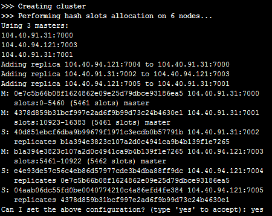
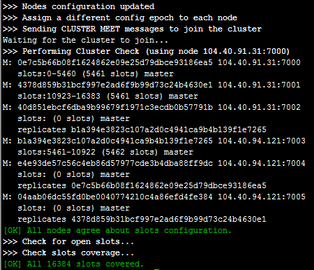

<properties
   pageTitle="在 Azure Linux 虚拟机上配置 Redis 集群 | Azure"
   description="本文档介绍如何在 Azure Linux 虚拟机上安装配置免费的 Redis 集群。"
   services="open-source"
   documentationCenter=""
   authors=""
   manager=""
   editor=""/>

<tags
   ms.service="open-source-website"  
   ms.date=""
   wacn.date="06/14/2016"/>

# 在 Azure Linux 虚拟机上配置 Redis 集群

## 目录

- [介绍](#introduction)
- [安装Redis](#install)
- [复制](#copy)
- [配置复制](#config-copy)
- [Redis 集群](#redis-cluster)
- [配置 Redis 集群](#config-redis-cluster)

## 介绍

Redis 是开源的(BSD 许可)，内存数据结构化存储(in-memory data structure store)，可用作数据库，缓存和消息中间件。它支持多种类型的数据结构，比如字符串，散列，列表，集合，有序集合与范围查询(sorted sets with range queries)，bitmaps, hyperloglogs 以及 geospatial indexes with radius queries。

Redis 内置了复制，LUA 脚本，LRU 驱动时间，事务和不同级别的磁盘持久化，并通过 Sentinel 和自动分区提供高可用性。

本文档介绍如何在 Azure Linux 虚拟机上安装配置免费的 Redis 集群。

Azure 有提供收费的 Redis 服务，请参考 [Azure Redis tutorial](/documentation/services/redis-cache/) 获取详细信息。

## 安装 Redis

如果您还没有 Azure 下的 LINUX 虚拟机，请参考 [Azure Linux VM tutorial](/documentation/articles/virtual-machines-linux-tutorial-portal-rm/) 创建 LINUX 虚拟机。

连接到您的 LINUX 虚拟机。如果这是您第一次使用 Azure 的 LINUX 虚拟机，请参考
 [Azure Linux VM tutorial](/documentation/articles/virtual-machines-linux-tutorial-portal-rm/) 连接到虚拟机。

不同的 LINUX 发行版在安装 Redis 时有少许的不同。请根据您的 LINUX 版本选择对应的步骤。

1. 准备

    Redhat base Linux: ( 以 CentOS 7.0, 64-bit system, Redis 3.0.7 为例)  
    安装 wget 和 gcc
    
        $sudo yum install wget -y
        $sudo yum install gcc -y
    
    Ubuntu Linux: (以 Ubuntu 14.04, 64-bit system, Redis 3.0.7 为例)  
    安装 gcc 和 make
    
        $sudo apt-get update 
        $sudo apt-get install gcc -y
        $sudo apt-get install make -y
    
    SUSE Linux: (以 SLES 12, 64-bit system, Redis 3.0.7 为例)  
    安装 gcc
    
        $sudo zypper install gcc -y

2. 安装和启动 Redis. (下面2-5 步骤对于 RHEL, Ubuntu 和 SUSE 来讲都是一样的. 以 CentOS 7.0, 64-bit system, Redis 3.0.7 为例)

        $cd /usr/local
        $sudo wget http://download.redis.io/releases/redis-3.0.7.tar.gz
        $sudo tar xzvf redis-3.0.7.tar.gz
        $sudo ln -s redis-3.0.7 redis
        $cd redis
        $sudo make
        
        $sudo cp redis.conf /etc/
        $sudo sed -i 's/daemonize no/daemonize yes/' /etc/redis.conf
        $cd src
        $sudo ./redis-server /etc/redis.conf                    #start redis daemon

3. 查看 redis daemon (如果能看到类似下列信息，表明 Redis 正常工作)

        $sudo ./redis-cli 
        127.0.0.1:6379> set foo bar
        OK
        127.0.0.1:6379> get foo
        "bar"
        127.0.0.1:6379>

4. 打开6379端口。6379端口是 Redis 的默认端口。请参考[创建终结点](/documentation/articles/virtual-machines-set-up-endpoints/)打开端口 
5. 停掉 Redis 的命令

        $sudo ./redis-cli shutdown

## 复制

Redis 复制很简单易用，它通过配置允许 slave Redis Servers 是 Master Servers 的完完全全的复制品。接下来有几个关于 redis 复制的非常重要的特性：

 1. 一个 Master 可以有多个 Slaves 。
 2. Slaves 能接受来自其他 slave 的链接: 除了可以接受同一个 master 下面 slaves 的链接以外，还可以接受同一个结构图中的其他 slaves 的链接。
 3. redis 复制在 master 段是非阻塞的，这就意味着 master 在同一个或多个 slave 端执行同步的时候还可以接受查询。
 4. 复制在 slave 端也是非阻塞的，假设你在 redis.conf 中配置 redis 这个功能，当 slave 在执行新的同步时，它仍可以用旧的数据信息来提供查询，否则，你可以配置当 redis slaves 与 master 失去联系时，slave 会返回一个客户端错误。
 5. 为了有多个 slaves 可以做只读查询，复制可以重复2次，甚至多次，具有可扩展性（例如：slaves 对话与重复的排序操作，有多份数据冗余就相对简单了）。
 6. 通过复制可以避免 master 全量写硬盘的消耗：只要配置 master 的配置文件 redis.conf 来‘避免保存’（注释掉所有 ‘save’ 命令），然后连接一个用来持久化数据的 slave 即可。但是这样要确保 master 不会自动重启。

## 配置复制

配置步骤对于 Redhat, Ubuntu 和 SUSE 来讲都一样. 以下面这几台虚拟机作为示例

<table border="1">
<tr>
<th>Name</th><th>IP</th><th>Role</th>
</tr>
<tr>
<td>CENTOS</td>	<td>192.168.1.1</td>	<td>Master of UBUNTU</td>
</tr>
<tr>
<td>UBUNTU</td>	<td>192.168.1.2</td>	<td>Slave of CENTOS, master of SLES</td>
</tr>
<tr>
<td>SLES</td>	<td>192.168.1.3</td>	<td>Slave of UBUNTU</td>
</tr>
</table>

1. 在每台虚拟机安装 Redis 3.0.7 以及打开6379端口. 建议这几台虚拟机都位于同一个数据中心下，比如区域都是中国东部或者中国北部，以降低网络延迟。
2. 去到 UBUNTU 虚拟机, 执行下面命令

        $ sudo sed -i 's/# slaveof <masterip> <masterport>/slaveof 192.168.1.1 6379/' /etc/redis.conf
        $ sudo /usr/local/redis/src/redis-cli shutdown
        $ sudo /usr/local/redis/src/redis-server /etc/redis.conf

3. 去到 SLES 虚拟机, 执行下面命令

        $ sudo sed -i 's/# slaveof <masterip> <masterport>/slaveof 192.168.1.2 6379/' /etc/redis.conf
        $ sudo /usr/local/redis/src/redis-cli shutdown
        $ sudo /usr/local/redis/src/redis-server /etc/redis.conf

4. 验证。去到 CentOS 虚拟机，执行下面命令

        $sudo /usr/local/redis/src/redis-cli 
        127.0.0.1:6379> set hello world
        OK
        127.0.0.1:6379> get hello
        "world"
        127.0.0.1:6379>

5.	去到 Ubuntu 和 SLES虚拟机，进行验证。执行下面命令

        $sudo /usr/local/redis/src/redis-cli 
        127.0.0.1:6379> get hello
        "world"
        127.0.0.1:6379>

如果结果类似上面输出，表明复制配置成功。

## Redis 集群

本节是 Redis 集群的一般介绍，没有涉及复杂难懂的分布式概念的赘述，只是提供了从用户角度来如何搭建测试以及使用的方法，如果您打算使用并深入了解 Redis 集群，推荐阅读完本节后,仔细阅读[官网文档](http://redis.io/topics/cluster-spec)

Redis 集群是一个提供在多个 Redis 节点间共享数据的程序集
Redis 集群通过分区来提供一定程度的可用性,在实际环境中当某个节点宕机或者不可达的情况下继续处理命令.
Redis 集群的优势

1. 自动分割数据到不同的节点上。
2. 整个集群的部分节点失败或者不可达的情况下能够继续处理命令。

## 配置 Redis 集群

1. 基本信息如下(至少需要六个节点，所以在两台虚拟机上，开启不同的端口实例.)

    <table border="1">
        <tr>
            <th>Name</th>	<th>IP</th>	<th>Port Cluster Bus</th> <th>Port</th> <th>Role</th>
        </tr>
        <tr>
            <td>CentOS</td>	<td>104.40.91.31</td>	<td>7000</td>	<td>17000</td>	<td>master</td>
        </tr>
        <tr>
            <td>CentOS</td>	<td>104.40.91.31</td>	<td>7001</td>	<td>17001</td>	<td>master</td>
        </tr>
        <tr>
            <td>CentOS</td>	<td>104.40.91.31</td>	<td>7002</td>	<td>17002</td>	<td>slave</td>
        </tr>
        <tr>
            <td>Ubuntu</td>	<td>104.40.94.121</td>	<td>7003</td>	<td>17003</td>	<td>master</td>
        </tr>
        <tr>
            <td>Ubuntu</td>	<td>104.40.94.121</td>	<td>7004</td>	<td>17004</td>	<td>slave</td>
        </tr>
        <tr>
            <td>Ubuntu</td>	<td>104.40.94.121</td>	<td>7005</td>	<td>17005</td>	<td>slave</td>
        </tr>
    </table>

2. Redis version 3.0 及以上支持集群。在各个虚拟机上安装 Redis 3.0.7并且打开上表中相应的端口.
3. 安装 ruby, rubygems, redis gem

    Redhat base Linux: ( 以 CentOS 7.0, 64-bit system 为例)
    
        $sudo yum install ruby -y
        $sudo yum install rubygems
        $sudo gem install redis
    
    Ubuntu Linux: (以Ubuntu 14.04, 64-bit system 为例)
    
        $sudo apt-get install ruby -y
        $sudo gem install redis
    
    SUSE Linux: (以 SLES 12, 64-bit system 为例)
    
        $sudo gem install redis
    
4. 在 CentOS 虚拟上执行4-7步骤
    
        $sudo mkdir /usr/local/redis-cluster
        $sudo mkdir /usr/local/redis-cluster/7000
        $ sudo mkdir /usr/local/redis-cluster/7001
        $ sudo mkdir /usr/local/redis-cluster/7002
        $sudo cp /usr/local/redis/src/redis-server /usr/local/redis-cluster/7000/
        $sudo cp /usr/local/redis/src/redis-server /usr/local/redis-cluster/7001/
        $sudo cp /usr/local/redis/src/redis-server /usr/local/redis-cluster/7002/
        $sudo cp /etc/redis.conf /usr/local/redis-cluster/7000/

5. 编辑 /usr/local/redis-cluster/7000/redis.conf, 使得各参数的值和下面一致

        $sudo vi /usr/local/redis-cluster/7000/redis.conf
        port 7000
        daemonize yes
        cluster-enabled yes
        cluster-config-file nodes.conf
        cluster-node-timeout 5000
        appendonly yes

6. 复制 /usr/local/redis-cluster/7000/redis.conf 到 7001 和7002 目录, 修改端口信息。 

        $sudo cp /usr/local/redis-cluster/7000/redis.conf /usr/local/redis-cluster/7001/
        $sudo cp /usr/local/redis-cluster/7000/redis.conf /usr/local/redis-cluster/7002/
        $sudo sed -i 's/port 7000/port 7001/' /usr/local/redis-cluster/7001/redis.conf 
        $sudo sed -i 's/port 7000/port 7002/' /usr/local/redis-cluster/7002/redis.conf

7. 启动各节点

        $cd /usr/local/redis-cluster/7000
        $sudo ./redis-server ./redis.conf
        $cd ../7001
        $sudo ./redis-server ./redis.conf
        $cd ../7002
        $sudo ./redis-server ./redis.conf

8.	在 Ubuntu 虚拟机执行8-11步骤

        $sudo mkdir /usr/local/redis-cluster
        $sudo mkdir /usr/local/redis-cluster/7003
        $ sudo mkdir /usr/local/redis-cluster/7004
        $ sudo mkdir /usr/local/redis-cluster/7005
        $sudo cp /usr/local/redis/src/redis-server /usr/local/redis-cluster/7003/
        $sudo cp /usr/local/redis/src/redis-server /usr/local/redis-cluster/7004/
        $sudo cp /usr/local/redis/src/redis-server /usr/local/redis-cluster/7005/
        $sudo cp /etc/redis.conf /usr/local/redis-cluster/7003/

9.	编辑 /usr/local/redis-cluster/7003/redis.conf, 使得各参数的值和下面的一致

        $sudo vi /usr/local/redis-cluster/7003/redis.conf
        port 7003
        daemonize yes
        cluster-enabled yes
        cluster-config-file nodes.conf
        cluster-node-timeout 5000
        appendonly yes

10.	复制 /usr/local/redis-cluster/7003/redis.conf 到7004 和7005 目录, 修改端口信息

        $sudo cp /usr/local/redis-cluster/7003/redis.conf /usr/local/redis-cluster/7004/
        $sudo cp /usr/local/redis-cluster/7003/redis.conf /usr/local/redis-cluster/7005/
        $sudo sed -i 's/port 7003/port 7004/' /usr/local/redis-cluster/7004/redis.conf 
        $sudo sed -i 's/port 7003/port 7005/' /usr/local/redis-cluster/7005/redis.conf

11.	启动各节点

        $cd /usr/local/redis-cluster/7003
        $sudo ./redis-server ./redis.conf
        $cd ../7004
        $sudo ./redis-server ./redis.conf
        $cd ../7005
        $sudo ./redis-server ./redis.conf

12.	创建集群。在 CentOS 虚拟机上执行

        $ sudo /usr/local/redis/src/redis-trib.rb create --replicas 1 104.40.91.31:7000 104.40.91.31:7001         104.40.91.31:7002 104.40.94.121:7003 104.40.94.121:7004 104.40.94.121:7005

    如果看到下面的信息，输入‘yes’即可
     
    
    
    之后如果看到下面的信息，表明集群设置成功。
    
    

13.	验证。去到 CentOS 虚拟机, 执行下面命令

        $cd /usr/local/redis/src
        $sudo ./redis-cli -c -p 7000
        127.0.0.1:7000> set foo bar
        -> Redirected to slot [12182] located at 104.40.91.31:7001
        OK
        104.40.91.31:7001> get foo
        "bar"
        104.40.91.31:7001> set hello world
        -> Redirected to slot [866] located at 104.40.91.31:7000
        OK
        104.40.91.31:7000> get hello
        "world"
        104.40.91.31:7000> set name alex
        -> Redirected to slot [5798] located at 104.40.94.121:7003
        OK
        104.40.94.121:7003> get name
        "alex"
        104.40.94.121:7003> set id 9
        OK
        104.40.94.121:7003> get id
        "9"
        104.40.94.121:7003>

    去到 Ubuntu 虚拟机，执行下面命令
    
        $cd /usr/local/redis/src
        $sudo ./redis-cli -p 7003
        127.0.0.1:7003> get name
        "alex"
        127.0.0.1:7003> get id
        "9"
        127.0.0.1:7003> get foo
        (error) MOVED 12182 104.40.91.31:7001
        127.0.0.1:7003> get hello
        (error) MOVED 866 104.40.91.31:7000
        127.0.0.1:7003>

    我们获取不到键 ‘foo’ 和 ‘hello’的值， 因为它们不在 Ubuntu:7003 节点上。我们要到 CentOS:7001 节点上查看键 ‘foo’ 的值。
    
        $cd /usr/local/redis/src 
        $sudo ./redis-cli -p 7001
        127.0.0.1:7001> get foo
        "bar"
    
    或者我们可以在 Ubuntu 虚拟机执行下面命令检查各个键的值。
        
        $cd /usr/local/redis/src
        $sudo ./redis-cli -c -p 7003
        127.0.0.1:7003> get foo
        -> Redirected to slot [12182] located at 104.40.91.31:7001
        "bar"
        104.40.91.31:7001> get hello
        -> Redirected to slot [866] located at 104.40.91.31:7000
        "world"
        104.40.91.31:7000>

14. 查看集群信息. 在 CentOS 虚拟机上执行

        $cd /usr/local/redis/src
        $sudo ./redis-cli -p 7000 cluster nodes
        $sudo ./redis-cli -p 7000 cluster info

你可以添加，移除，关闭，重启节点等各种操作。更多详细信息请参考[官网文档](http://redis.io/topics/cluster-tutorial)
