<properties
   pageTitle="在 Azure Linux 虚拟机上手动安装配置 Zabbix 监控服务"
   description="本文介绍如何在 Azure Linux 虚拟机上配置 zabbix 监控"
   services="open-source"
   documentationCenter=""
   authors=""
   manager=""
   editor=""/>

<tags
   ms.service="open-source-website"  
   ms.date=""
   wacn.date="05/11/2017"/>

# 在 Azure Linux 虚拟机上手动安装配置 Zabbix 监控服务

## 目录

- [介绍](#introduction)
- [安装 zabbix server](#install-zabbix-server)
- [安装 zabbix agent](#install-zabbix-agent)
- [监控虚拟机](#Monitor-virtual-machines)
- [设置邮件通知](#settingmailnotification)
- [自定义监控项](#customizemonitoringitems)

## 介绍

Zabbix 是一个的企业级的开源监控解决方案，它支持从服务器、虚拟机和网络设备大规模采集数据并进行实时监控。
Zabbix 由2部分构成，zabbix server 与可选组件 zabbix agent。
Zabbix server 可以通过 SNMP，zabbix agent，ping，端口监视等方法提供对远程服务器/网络状态的监视，数据收集等功能
Zabbix 的四种监控方式：Agent, SNMP, JMX, IPMI

本文主要介绍如何手动在 Azure Linux 虚拟机上搭建 Zabbix 监控服务，关于如何通过 Azure 资源管理器自动搭建 Zabbix 监控服务，请参阅[使用 Azure 资源管理器自动部署 Zabbix 监控服务](/documentation/articles/open-source-azure-resource-manager-zabbix/)。

我们将会在一台虚拟机上安装 zabbix server 软件包作为 zabbix server，在被监控的虚拟机上安装 zabbix 客户端软件包。

## 安装 zabbix server

如果您还没有 Azure 下的 LINUX 虚拟机，请参考 [Azure Linux VM tutorial](/documentation/articles/virtual-machines-linux-quick-create-portal/) 创建 LINUX 虚拟机。

连接到您的 LINUX 虚拟机。如果这是您第一次使用 Azure 的 LINUX 虚拟机，请参考
 [Azure Linux VM tutorial](/documentation/articles/virtual-machines-linux-quick-create-portal/) 连接到虚拟机。

不同的 LINUX 发行版在安装时有少许的不同。接下来我们以 CentOS 7.0 为例说明安装过程。

1. 关闭 selinux

        $sudo setenforce 0
        $sudo sed -i 's/^SELINUX=.*/SELINUX=disabled/' /etc/sysconfig/selinux
        $sudo reboot

        
2. 关闭 firewalld 和 iptables

        $sudo systemctl stop firewalld
        $sudo systemctl disable firewalld
        $sudo systemctl stop iptables
        $sudo systemctl disable iptables
        
3. 准备过程

        $sudo yum install -y gcc gcc-c++ httpd httpd-devel mysql mysql-server mysql-devel php php-mysql php-common php-gd gd php-mcrtpt php-xml libcurl-develnet-snmp-devel curl-devel php-devel php-bcmath php-mbstring gd-devel
        $ sudo yum install fontconfig-devel freetype-devel libX11-devel libXau-devel libXpm-devel libjpeg-turbo-devel libpng-devel libxcb-devel xorg-x11-proto-devel -y
4. 下载和安装 jre

        $sudo yum install wget -y
        $sudo wget --header "Cookie: oraclelicense=accept-securebackup-cookie" http://download.oracle.com/otn-pub/java/jdk/8u5-b13/jdk-8u5-linux-x64.rpm
        $sudo rpm -ivh jdk-8u5-linux-x64.rpm
        $java -version
                                
    看到如下图示说明安装成功
    
        
 
5.	添加 zabbix 用户

        $sudo groupadd zabbix
        $sudo useradd zabbix -g zabbix -s /sbin/nologin
        
6.	配置数据库

        $sudo service mysqld start               #如果返回错误，说明 mysql 安装失败或未安装 
        $sudo yum install mariadb-server -y       #我们安装 mariadb 代替 mysql
        $sudo service mariadb start
        $sudo systemctl enable mariadb
        $sudo /usr/bin/mysqladmin -u root password abcde   #这里 abcde 是 mysql root 密码
        $sudo cp /etc/my.cnf /etc/my.cnf.bak
        $ sudo sed -i '/\[mysqld\]/a character-set-server=utf8' /etc/my.cnf
        $ sudo sed -i '$a [client]\ndefault-character-set = utf8' /etc/my.cnf
        $sudo service mariadb restart
        $mysql -uroot -pabcde
        create database zabbix character set utf8;
        grant all privileges on zabbix.* to zabbix@localhost identified by 'zabbix';
        flush privileges;
        exit

7.	下载zabbix 软件包

        $sudo wget http://jaist.dl.sourceforge.net/project/zabbix/ZABBIX%20Latest%20Stable/2.2.5/zabbix-2.2.5.tar.gz

8.	安装
        
        $ sudo tar -zxvf zabbix-2.2.5.tar.gz
        $cd zabbix-2.2.5
        $sudo mkdir -p /usr/local/zabbix
        $sudo yum install net-snmp-devel -y
        $sudo ./configure --prefix=/usr/local/zabbix --enable-java --enable-server --enable-agent --with-mysql --with-net-snmp --with-libcurl
        $sudo make install
        $mysql -uzabbix -pzabbix -hlocalhost zabbix < database/mysql/schema.sql
        $mysql -uzabbix -pzabbix -hlocalhost zabbix < database/mysql/images.sql
        $mysql -uzabbix -pzabbix -hlocalhost zabbix < database/mysql/data.sql
        $sudo cp misc/init.d/fedora/core/zabbix_server /etc/init.d/
        $sudo cp misc/init.d/fedora/core/zabbix_agentd /etc/init.d/
        $sudo cp -R frontends/php /var/www/html/zabbix
        $sudo sed -i "s/max_execution_time = 30/max_execution_time = 300/g" /etc/php.ini
        $sudo sed -i "s/max_input_time = 60/max_input_time = 300/g" /etc/php.ini
        $sudo sed -i "s/post_max_size = 8M/post_max_size = 16M/g" /etc/php.ini
        $sudo sed -i "s/;date.timezone =/date.timezone = Asia\/Shanghai/g" /etc/php.ini
        $sudo sed -i 's/^DBUser=.*$/DBUser=zabbix/g' /usr/local/zabbix/etc/zabbix_server.conf
        $sudo sed -i 's/^.*DBPassword=.*$/DBPassword=zabbix/g' /usr/local/zabbix/etc/zabbix_server.conf
        $sudo sed -i 's/BASEDIR=\/usr\/local/BASEDIR=\/usr\/local\/zabbix/g' /etc/init.d/zabbix_server
        $sudo sed -i 's/BASEDIR=\/usr\/local/BASEDIR=\/usr\/local\/zabbix/g' /etc/init.d/zabbix_agentd
        $sudo vi /etc/services                                #add below into /etc/services
        zabbix-agent    10050/tcp              #Zabbix Agent
        zabbix-agent    10050/udp              #Zabbix Agent
        zabbix-trapper  10051/tcp               #Zabbix Trapper
        zabbix-trapper  10051/udp              #Zabbix Trapper
        $cd /usr/local/zabbix/bin/
        $for i in *;do sudo ln -s /usr/local/zabbix/bin/${i} /usr/bin/${i};done
        $cd /usr/local/zabbix/sbin/
        $for i in *;do sudo ln -s /usr/local/zabbix/sbin/${i} /usr/sbin/${i};done
        
9.	配置apache服务
        
        $sudo sed -i 's/^#\(ServerName \).*/\1localhost:80/' /etc/httpd/conf/httpd.conf
        $sudo service httpd restart
        $sudo systemctl enable httpd
       
10.	启动zabbix server和agentd
        
        $sudo /etc/init.d/zabbix_server start
        $sudo /etc/init.d/zabbix_agentd start
        $ sudo sed -i '$a /etc/init.d/zabbix_server start\n/etc/init.d/zabbix_agentd start' /etc/rc.local
        
11.	打开端口 80, 10050, 10051. 请参考链接[创建终结点](/documentation/articles/virtual-machines-windows-nsg-quickstart-portal/)打开这些端口
12.	Zabbix server web 端配置. 打开网址 *http://zabbix server ip/zabbix*  
    Zabbix server ip 是您的 zabbix server 虚拟机的 IP 地址。打开的页面如下图所示

    
    
    点击 ‘next’. 之后会看到类似下图, 等待 pre-requisites 检测通过, 点击 ‘next’

    

    之后会出现类似下图. 输入用户名和密码皆为 zabbix, 然后点击 ‘Test connection’. 通过之后，点击’next’

    

    去到类似下图。点击 ‘next’
    
    
    
    点击 ‘next’
    
    

    点击 ‘Download configuration file’, 保存此文件到本地，然后上传至 zabbix server 虚拟机的目录 /var/www/html/zabbix/conf/, 然后点击 ‘Retry’
 
    
    
    之后会出现类似下图。点击 ‘Finish’.
    
    
    
    输入 admin/zabbix 点击 ‘sign in’

    

    您会看到类似下图。表明 zabbix server 正常工作了。
 
    

    如果还是显示未 login 的话，就在 zabbix server 执行命令

        $sudo /etc/init.d/zabbix_server restart
    
    然后重新输入 admin/zabbix 点击 ‘sign in’，登录即可。

    接下来我们在需要被监控的虚拟机上安装 zabbix agent 软件包，这样 zabbix server 就能监控到了。

## 安装 zabbix agent

连接到您的 LINUX 虚拟机。如果这是您第一次使用 Azure 的 LINUX 虚拟机，请参考
 [Azure Linux VM tutorial](/documentation/articles/virtual-machines-linux-quick-create-portal/) 连接到虚拟机。

不同的 LINUX 发行版在安装 Redis 时有少许的不同。请根据您的 LINUX 版本选择对应的步骤。

**Redhat base Linux**: ( 以 CentOS 7.0, 64-bit system 为例)

1.	安装 gcc 和 wget

        $sudo yum install -y gcc wget

2.	下载和解压 zabbix 软件包

        $sudo wget http://jaist.dl.sourceforge.net/project/zabbix/ZABBIX%20Latest%20Stable/2.2.5/zabbix-2.2.5.tar.gz
        $sudo tar zxvf zabbix-2.2.5.tar.gz
        $cd zabbix-2.2.5

3.	添加用户和组

        $sudo groupadd zabbix
        $sudo useradd zabbix -g zabbix -s /sbin/nologin
    
4.	安装 zabbix agent

        $ sudo mkdir -p /usr/local/zabbix
        $ sudo ./configure --prefix=/usr/local/zabbix --enable-agent
        $ sudo make install
        $ sudo cp misc/init.d/fedora/core/zabbix_agentd /etc/init.d/
        $ sudo sed -i 's/BASEDIR=\/usr\/local/BASEDIR=\/usr\/local\/zabbix/g' /etc/init.d/zabbix_agentd
    
5.	编辑 /etc/services, 添加以下行
    
        zabbix-agent    10050/tcp               #ZabbixAgent
        zabbix-agent    10050/udp               #Zabbix Agent
    
6.	编辑/usr/local/zabbix/etc/zabbix_agentd.conf, 修改下面四项，请根据实际情况修改。

        Server=zabbix server ip                        #这里是指真实的 zabbix server 的 IP
        ServerActive=zabbix server ip                   #这里是指真实的 zabbix server 的 IP
        LogFile=/var/log/zabbix_agentd.log
        Hostname=zabbix agent VM hostname           #这里是指 zabbix agent 所在虚拟机主机名

7.	创建日志文件
 	$ sudo touch /var/log/zabbix_agentd.log
        $ sudo chown zabbix:zabbix /var/log/zabbix_agentd.log

    
9.	启动进程
    
        $ sudo chkconfig --add zabbix_agentd
        $ sudo chkconfig zabbix_agentd on
        $ sudo /etc/init.d/zabbix_agentd start
    
10.	打开端口 10050，10051。请参考链接创建终结点 打开端口.

**Ubuntu base Linux**: ( 以 Ubuntu 14.04, 64-bit system 为例)

1.	安装 gcc 和 make

        $sudo apt-get update
        $sudo apt-get install gcc make -y
    
2.	下载和解压 zabbix 包
    
        $sudo wget http://jaist.dl.sourceforge.net/project/zabbix/ZABBIX%20Latest%20Stable/2.2.5/zabbix-2.2.5.tar.gz
        $sudo tar zxvf zabbix-2.2.5.tar.gz
        $cd zabbix-2.2.5.tar.gz
   
3.	添加用户和组
    
        $sudo groupadd zabbix
        $sudo useradd zabbix -g zabbix -s /sbin/nologin
    
4.	安装 zabbix agent
    
        $ sudo mkdir -p /usr/local/zabbix
        $ sudo ./configure --prefix=/usr/local/zabbix --enable-agent
        $ sudo make install
    
5.	编辑 /etc/services, 添加以下行
    
        zabbix-agent    10050/tcp               #ZabbixAgent
        zabbix-agent    10050/udp               #Zabbix Agent
    
6.	编辑 /usr/local/zabbix/etc/zabbix_agentd.conf, 修改下面四项，请根据实际情况修改
    
        Server=zabbix server ip                        #这里是指真实的 zabbix server 的 IP
        ServerActive=zabbix server ip                   #这里是指真实的 zabbix server 的 IP
        LogFile=/var/log/zabbix_agentd.log
        Hostname=zabbix agent VM hostname            #这里指 zabbix agent 所在虚拟机主机名
    
7.	创建日志文件
 	$ sudo touch /var/log/zabbix_agentd.log
        $ sudo chown zabbix:zabbix /var/log/zabbix_agentd.log

    
9.	编辑 /etc/rc.local, 添加下行

        /usr/local/zabbix/sbin/zabbix_agentd
    
10.	启动进程

        $ sudo /usr/local/zabbix/sbin/zabbix_agentd
    
11.	打开端口 10050 ，10051 。请参考链接 创建终结点

**SUSE Linux**: (以 SLES 12 SP1, 64-bit system 为例)

1.	安装 gcc 和 make

        $sudo zypper install gcc make
    
2.	下载和解压 zabbix 包
    
        $sudo wget http://jaist.dl.sourceforge.net/project/zabbix/ZABBIX%20Latest%20Stable/2.2.5/zabbix-2.2.5.tar.gz
        $sudo tar zxvf zabbix-2.2.5.tar.gz
        $cd zabbix-2.2.5.tar.gz
    
3.	添加用户和组
    
        $sudo groupadd zabbix
        $sudo useradd zabbix -g zabbix -s /sbin/nologin
    
4.	安装 zabbix agent
    
        $ sudo mkdir -p /usr/local/zabbix
        $ sudo ./configure --prefix=/usr/local/zabbix --enable-agent
        $ sudo make install
    
5.	编辑 /etc/services, 添加以下行
    
        zabbix-agent    10050/tcp               #ZabbixAgent
        zabbix-agent    10050/udp               #Zabbix Agent
    
6.	编辑 /usr/local/zabbix/etc/zabbix_agentd.conf, 修改下面四项，请根据实际情况修改
    
        Server=zabbix server ip                        #这里是指真实的 zabbix server 的 IP
        ServerActive=zabbix server ip                   #这里是指真实的 zabbix server 的 IP
        LogFile=/var/log/zabbix_agentd.log
        Hostname=zabbix agent VM hostname            #这里指 zabbix agent 所在虚拟机主机名
    
7.	创建日志文件
 	$ sudo touch /var/log/zabbix_agentd.log
        $ sudo chown zabbix:zabbix /var/log/zabbix_agentd.log

    
9.	启动进程
    
        $ sudo cp /usr/local/zabbix/sbin/zabbix_agentd /etc/init.d/
        $ sudo chkconfig --add zabbix_agentd
        $ sudo chkconfig zabbix_agentd on
        $ sudo /etc/init.d/zabbix_agentd
    
10.	打开端口10050, 10051. 请参考链接[创建终结点](/documentation/articles/virtual-machines-windows-nsg-quickstart-portal/)

当 zabbix agent 安装和启动之后，我们就可以把这些需要监控的虚拟机监控起来了！

## 监控虚拟机

1.	打开网址 *http://zabbix server ip:/zabbix* , 输入 admin/zabbix, 点击 ‘Configuration’ -- > ‘Hosts’ -- > ‘Create host’
    
    
 
2.	输入想要监控的虚拟机主机名, 选择 ‘linux servers’ 组然后点击 ‘<<’, 输入想要监控的虚拟机的 IP 地址

    
    
3.	选择模板. 点击 ‘Templates’ -- > ‘Select’ -- > 选择 ‘Template OS Linux’ 和‘Template APP Zabbix Server’ -- > 点击 ‘Select’
     
    
    
4.	点击 ‘Add’, 然后点击 ‘Save’ 

    
    
5.	这时能看到此虚拟机已经被监控起来了，它的状态是 ‘Monitored’.
 
    
    
6.	您可以点击 ‘Applications’ 或者 ‘Items’ 或 ‘Triggers’ 以查看被监控主机的监控项, 这些监控项都来自于我们刚刚添加的模板，之后我们会演示如何自定义监控项。之后我们会演示如何自定义监控项和模板。
 
    

    把 zabbix server 也监控起来
    在 ‘Configuration’ -- > ‘Hosts’ , 我们看到 zabbix server 也在列表中，不过它的状态是 ‘Not monitored’, 直接点击 ‘Not monitored’ -- > 点击 ‘Yes’
 
    

    这时候状态变成 ‘monitored’

    
 
##设置邮件通知

当被监控的虚拟机出现一些问题，比如 CPU 使用率，磁盘 I/O 等居高不下，您可以在“Monitoring” -- > “Dashboard” 看到这些消息，但是我们并不是时刻都盯着这个页面，我们需要在出现问题的时候第一时间收到邮件通知。
有好几种设置邮件通知的方式，接下来展示一种简单的设置方法： 

1.	使用 putty 连接到 zabbix server, 执行如下命令 `$ sudo yum install mailx`

2.	检查邮件能否发出去 `$ echo “configuration” |sudo mail -s “haproxy” youremail@163.com`

3.	youremail@163.com指的是您的真实有效的邮件地址。检查是否收到了邮件。如果收到，我们可以继续下一步

4.	打开网址 http://zabbix server ip/zabbix ,  输入 admin/zabbix, 点击 “Administration” -- > “Media types” -- > “Email” 

	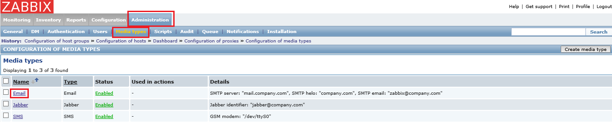
 
5.	设置 smtp 服务器 以及smtp helo 填 localhost, smtp email 填 zabbix@localhost, 点击 ‘Save’

	
 
6.	点击 ‘Administration’ -- > ‘Users’ -- > ‘Admin(Zabbix Administrator)’

	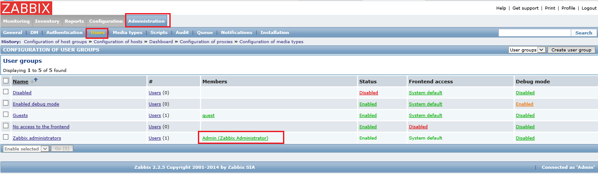
 
7.	点击 ‘Media’ -- > ‘Add’ -- >  ‘Send to’ 这里填您想要获取邮件通知的邮件地址, 即上面步骤中验证过的能收到邮件的邮件地址，选择邮件通知级别，可以选择所有，意味着任何事件都会发送邮件通知。请根据实际情况选择。然后点击‘Add’, 点击‘Save’
 
	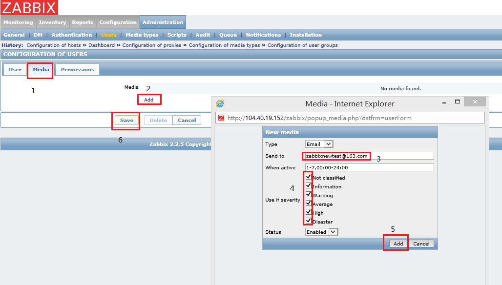
  
8.	点击 ‘Configuration’ -- > ‘Actions’ -- > ‘create action ‘

	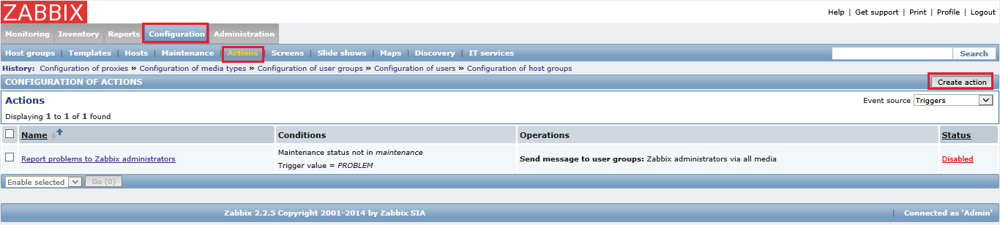
 
9.	自定义’Name’, 勾选 ‘Recovery message’

	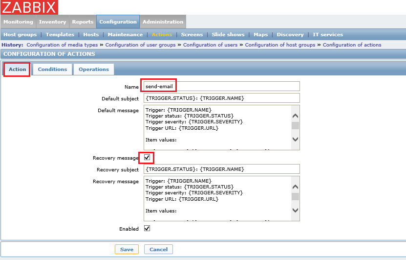
 
10.	点击 ‘Conditions’ , 选择“OR” 

	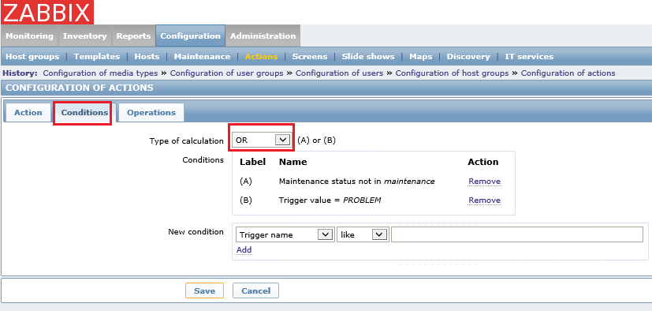
 
11.	点击 ‘Operations’ -- > ‘New’ 

	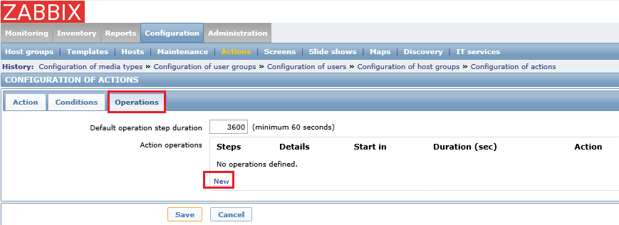
 
12.	设置‘default operation step duration’ 值为60, 在 ‘Send to Users’ 区域点击 ‘Add’, 选择 “Admin” 用户, 点击 ‘Select’

	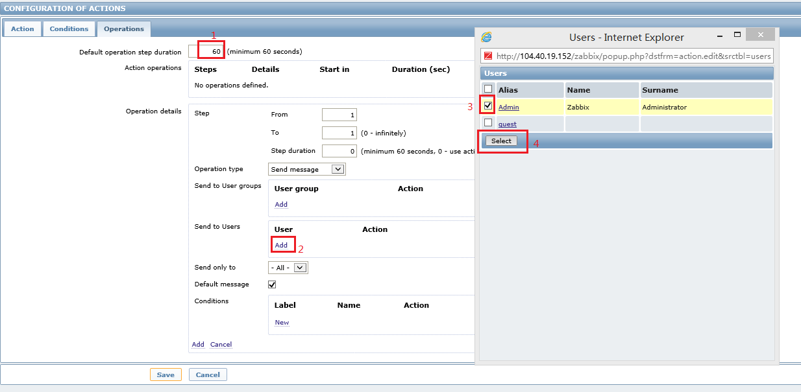
 
13.	选择 ”Send only to” 为 “Email”, 点击“Add”

	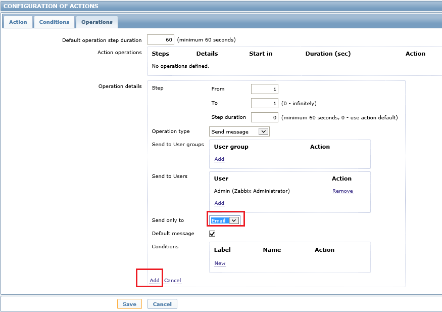
 
14.	点击 ‘Save’

	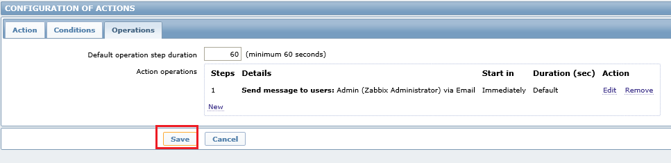
 

之后只要被监控的虚拟机出了‘问题’，您都将会收到邮件通知。

##自定义监控项

我们也许有自定义的项目需要监控。接下来展示一个例子：

1.	点击 “Configuration” -- > “Hosts” -- > 选择其中一台机器的“Items”

	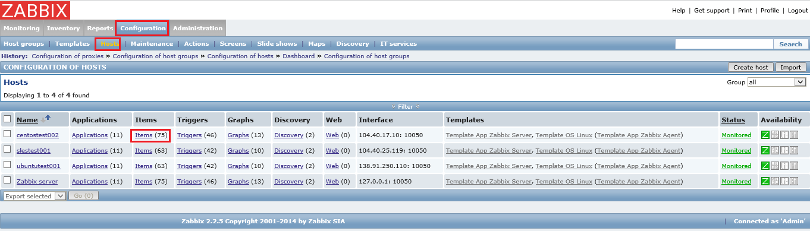
 
2.	点击“Create item”

	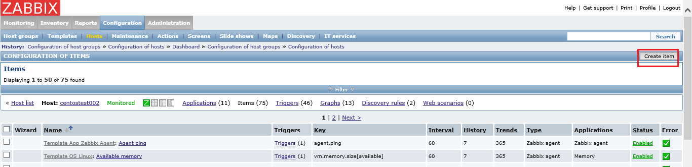
 
3.	设置项目名, 点击 “Select”, 选择您需要监控的项目, 这里我们选 “net.tcp.listen[port]”

	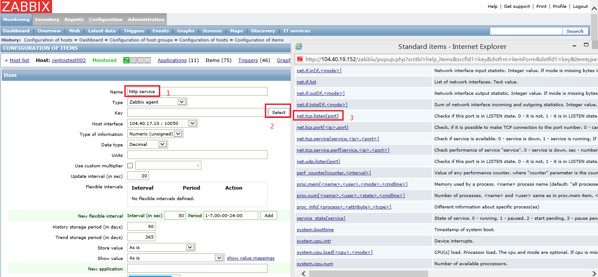
 
4.	将其中的 “port”用端口号代替, 比如我们想监控80端口，这里就填80

	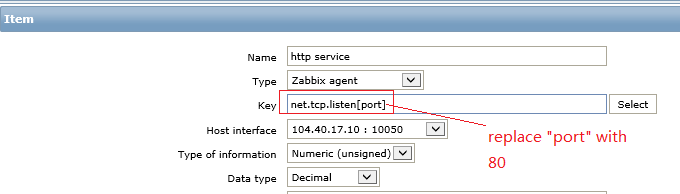
 
5.	点击底部的”save”

6.	现在项目已经添加了。我们需要为此项目创建触发器。 点击 “Triggers”

	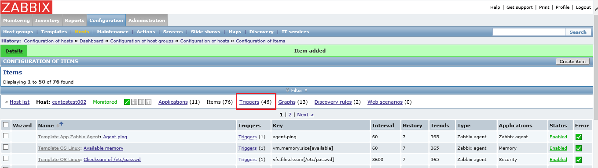
 
7.	点击 “Create trigger”

	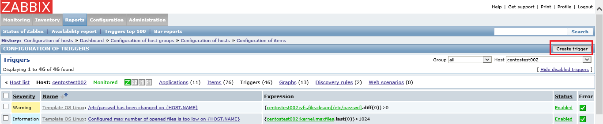
 
8.	设置触发器名, 点击 ‘Add’ -- > ‘Select’

	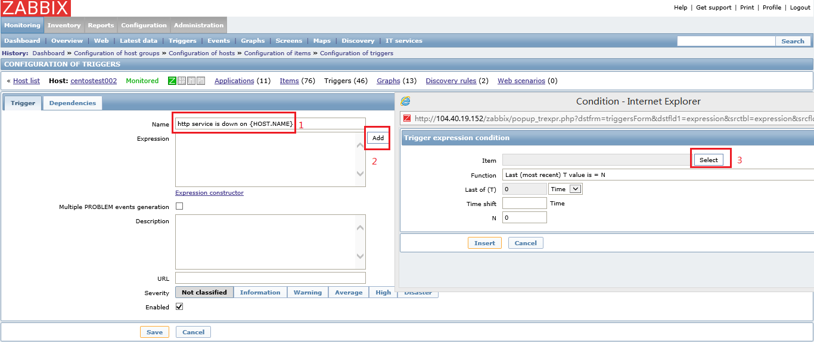
 
9.	选择 ‘http service’

	
 
10.	点击 ‘Insert’

	
 
11.	您可以选择 “Multiple PROBLEM events generation”,意思是会一直不断的发送邮件通知，只要这个监控项所代表的问题还存在，只有当问题解决才会停止发送邮件通知。比如我们这个监控项是监控80端口有没有打开，我们可以把使用 80 端口的 http 进程停掉，这样就会触发此触发器，邮件就会一直发送，直到我们再次启动 http 进程才停止邮件通知。 设置级别，点击 ‘Save’
 
	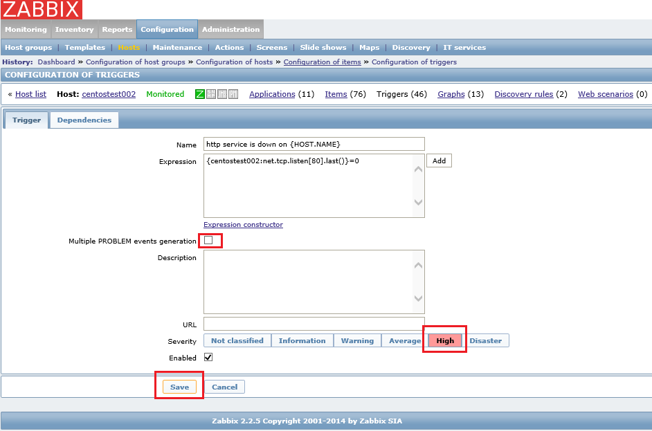
  
12.	现在触发器已经添加. 如果此虚拟机没有打开80端口，就会触发此事件。之后您就会看到事件状态。

	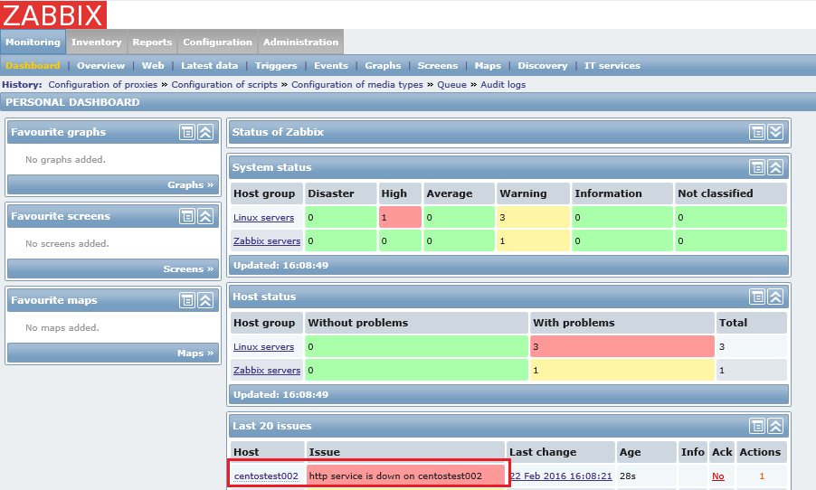
 
13.	检查您的邮箱。您会收到类似下图邮件:
 
	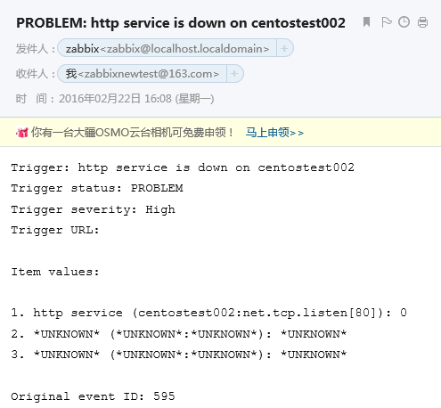
