<properties
	pageTitle="在 Azure Linux 虚拟机上配置 zabbix 监控（二）"
	description="本文介绍在 Azure Linux 虚拟机上配置zabbix监控（二）"
	services="open-source"
	documentationCenter=""
	authors=""
	manager=""
	editor=""/>

<tags
	ms.service="open-source-website"
	ms.date=""
	wacn.date="06/14/2016"/>
 
#在Azure Linux虚拟机上配置zabbix监控（二）

##目录

 - [设置邮件通知](#settingmailnotification)
 - [自定义监控项](#customizemonitoringitems)
 - [监控 Nginx ](#monitorNginx)

##设置邮件通知

当被监控的虚拟机出现一些问题，比如 CPU 使用率，磁盘 I/O 等居高不下，您可以在“Monitoring” -- > “Dashboard” 看到这些消息，但是我们并不是时刻都盯着这个页面，我们需要在出现问题的时候第一时间收到邮件通知。
有好几种设置邮件通知的方式，接下来展示一种简单的设置方法： 

1.	使用 putty 连接到 zabbix server, 执行如下命令 `$ sudo yum install mailx`

2.	检查邮件能否发出去 `$ echo “configuration” |sudo mail -s “haproxy” youremail@163.com`

3.	youremail@163.com指的是您的真实有效的邮件地址。检查是否收到了邮件。如果收到，我们可以继续下一步

4.	打开网址 http://zabbix server ip/zabbix ,  输入 admin/zabbix, 点击 “Administration” -- > “Media types” -- > “Email” 

  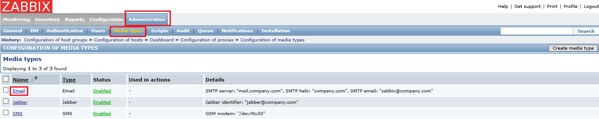
 
5.	设置 smtp 服务器 以及smtp helo 填 localhost, smtp email 填 zabbix@localhost, 点击 ‘Save’

  
 
6.	点击 ‘Administration’ -- > ‘Users’ -- > ‘Admin(Zabbix Administrator)’

  
 
7.	点击 ‘Media’ -- > ‘Add’ -- >  ‘Send to’ 这里填您想要获取邮件通知的邮件地址, 即上面步骤中验证过的能收到邮件的邮件地址，选择邮件通知级别，可以选择所有，意味着任何事件都会发送邮件通知。请根据实际情况选择。然后点击‘Add’, 点击‘Save’
 
  
  
8.	点击 ‘Configuration’ -- > ‘Actions’ -- > ‘create action ‘

  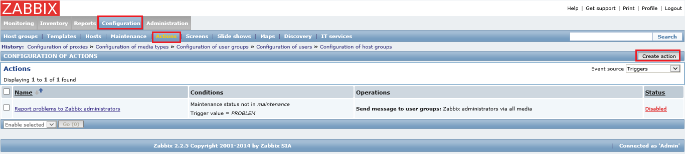
 
9.	自定义’Name’, 勾选 ‘Recovery message’

  
 
10.	点击 ‘Conditions’ , 选择“OR” 

  
 
11.	点击 ‘Operations’ -- > ‘New’ 

  
 
12.	设置‘default operation step duration’ 值为60, 在 ‘Send to Users’ 区域点击 ‘Add’, 选择 “Admin” 用户, 点击 ‘Select’

  
 
13.	选择 ”Send only to” 为 “Email”, 点击“Add”

  
 
14.	点击 ‘Save’

  
 

之后只要被监控的虚拟机出了‘问题’，您都将会收到邮件通知。

##自定义监控项

我们也许有自定义的项目需要监控。接下来展示一个例子：

1.	点击 “Configuration” -- > “Hosts” -- > 选择其中一台机器的“Items”

  
 
2.	点击“Create item”

  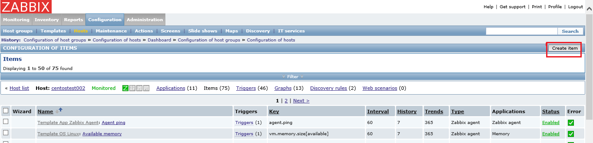
 
3.	设置项目名, 点击 “Select”, 选择您需要监控的项目, 这里我们选 “net.tcp.listen[port]”

  
 
4.	将其中的 “port”用端口号代替, 比如我们想监控80端口，这里就填80

  
 
5.	点击底部的”save”

6.	现在项目已经添加了。我们需要为此项目创建触发器。 点击 “Triggers”

  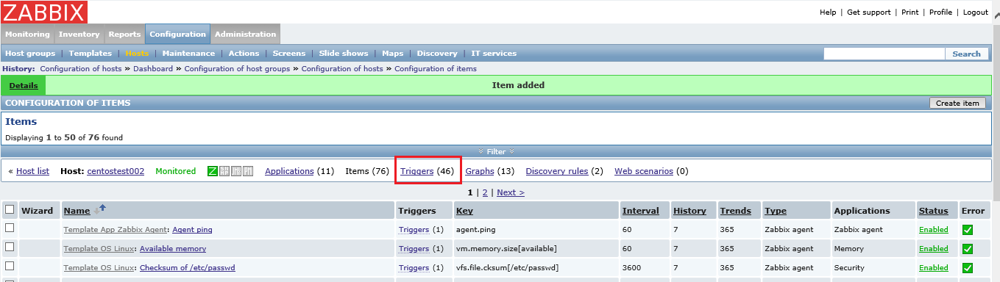
 
7.	点击 “Create trigger”

  
 
8.	设置触发器名, 点击 ‘Add’ -- > ‘Select’

  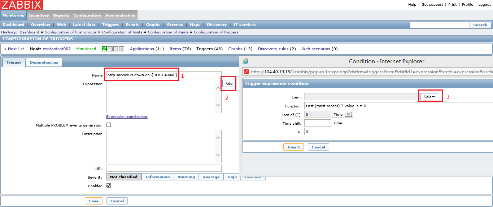
 
9.	选择 ‘http service’

  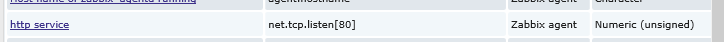
 
10.	点击 ‘Insert’

  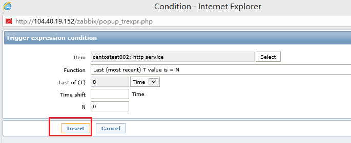
 
11.	您可以选择 “Multiple PROBLEM events generation”,意思是会一直不断的发送邮件通知，只要这个监控项所代表的问题还存在，只有当问题解决才会停止发送邮件通知。比如我们这个监控项是监控80端口有没有打开，我们可以把使用 80 端口的 http 进程停掉，这样就会触发此触发器，邮件就会一直发送，直到我们再次启动 http 进程才停止邮件通知。 设置级别，点击 ‘Save’
 
  
  
12.	现在触发器已经添加. 如果此虚拟机没有打开80端口，就会触发此事件。之后您就会看到事件状态。

  
 
13.	检查您的邮箱。您会收到类似下图邮件:
 
  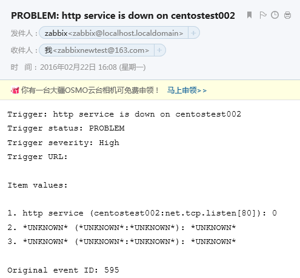

##监控 Nginx 

1.	Nginx server 必须安装 zabbix agent 软件包，以及打开10050,10051和它的服务端口，比如80. 然后启动 zabbix agent 进程，添加到监控列表。

2.	查看 nginx server 是否安装了 http_stub_status 模块. 使用 nginx -V 命令检查. 如果没有，重新编译。下面是一个简单示例 (CentOS 7 为例)

3.	连接到 nginx server , 执行 `$ sudo yum install zlib zlib-devel pcre pcre-devel openssl openssl-devel -y`

4.	下载，安装 nginx

        $ sudo wget http://nginx.org/download/nginx-1.9.8.tar.gz
        $sudo tar xzvf nginx-1.9.8.tar.gz
        $cd nginx-1.9.8
        $sudo ./configure --prefix=/opt/nginx --with-http_stub_status_module --with-http_ssl_module --with-threads
        $sudo make
        $sudo make install
    
5.	编辑 /opt/nginx/conf/nginx.conf, 添加如下红色部分
    
        server {
            listen       80;
            server_name  localhost;
    
            #charset koi8-r;
    
            #access_log  logs/host.access.log  main;
    
            location / {
                root   html;
                index  index.html index.htm;
            }
            location /nginx_status {
                stub_status on;	
            }
            #error_page  404              /404.html;
    
            # redirect server error pages to the static page /50x.html
            #
            error_page   500 502 503 504  /50x.html;
            location = /50x.html {
                root   html;
        }
6.	启动 nginx 进程

        $sudo /opt/nginx/sbin/nginx
    
7.	检查 nginx 连接状态. 打开 http://nginx server ip/nginx_status

  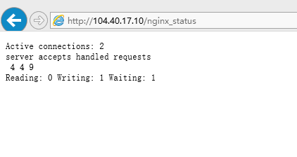
 
8.	Zabbix agent 设置。创建目录

        $ sudo mkdir -p /usr/local/zabbix/scripts

9.	编辑 /usr/local/zabbix/etc/zabbix_agentd.conf, 添加如下 

        #nginx
        UserParameter=nginx.accepts,/usr/local/zabbix/scripts/nginx_status.sh accepts
        UserParameter=nginx.handled,/usr/local/zabbix/scripts/nginx_status.sh handled
        UserParameter=nginx.requests,/usr/local/zabbix/scripts/nginx_status.sh requests
        UserParameter=nginx.connections.active,/usr/local/zabbix/scripts/nginx_status.sh active
        UserParameter=nginx.connections.reading,/usr/local/zabbix/scripts/nginx_status.sh reading
        UserParameter=nginx.connections.writing,/usr/local/zabbix/scripts/nginx_status.sh writing
        UserParameter=nginx.connections.waiting,/usr/local/zabbix/scripts/nginx_status.sh waiting

10.	编辑 /usr/local/zabbix/scripts/nginx_status.sh, 内容如下

        #!/bin/bash
        
        # Set Variables
        BKUP_DATE=`/bin/date +%Y%m%d`
        LOG="/var/log/nginx_status.log"
        #HOST=`/sbin/ifconfig eth0 | sed -n '/inet /{s/.*addr://;s/ .*//;p}'`
        HOST=`/sbin/ifconfig eth0 |sed -n '/inet /{s/.*inet \([0-9.]\+\).*/\1/p}'`
        #HOST=`curl ifconfig.me 2>/dev/null`
        PORT="80"
        #PORT="443"
        
        # Functions to return nginx stats
        
        function active {
                /usr/bin/curl -k "http://$HOST:$PORT/nginx_status" 2>/dev/null| grep 'Active' | awk '{print $NF}' 
                } 
        
        function reading {
                /usr/bin/curl -k "http://$HOST:$PORT/nginx_status" 2>/dev/null| grep 'Reading' | awk '{print $2}' 
                } 
        
        function writing {
                /usr/bin/curl -k "http://$HOST:$PORT/nginx_status" 2>/dev/null| grep 'Writing' | awk '{print $4}' 
                } 
        
        function waiting {
                /usr/bin/curl -k "http://$HOST:$PORT/nginx_status" 2>/dev/null| grep 'Waiting' | awk '{print $6}' 
                } 
        
        function accepts {
                /usr/bin/curl -k "http://$HOST:$PORT/nginx_status" 2>/dev/null| awk NR==3 | awk '{print $1}'
                } 
        
        function handled {
                /usr/bin/curl -k "http://$HOST:$PORT/nginx_status" 2>/dev/null| awk NR==3 | awk '{print $2}'
                } 
        
        function requests {
                /usr/bin/curl -k "http://$HOST:$PORT/nginx_status" 2>/dev/null| awk NR==3 | awk '{print $3}'
                }
        
        # Run the requested function
        $1

11.	设置执行权限

        $sudo chmod o+x /usr/local/zabbix/scripts/nginx_status.sh

12.	重启 zabbix agent 进程

        $sudo /etc/init.d/zabbix_agentd restart
        
13.	可以去到 zabbix 官网 Zabbix 官网模板下载相应的 nginx 模板并依据相关的指导完成 nginx 模板的导入和设置。步骤14-19是用从 zabbix community 社区找到的 nginx 模板所做的相关测试。模板放置在链接下载此 nginx 模板 并关联到 nginx server。（注：此模板非官方提供，由社区贡献，如有顾虑，建议从官网下载 nginx 模板。）

14.	点击“Configuration” -- > “Templates” -- > “Import”
 
  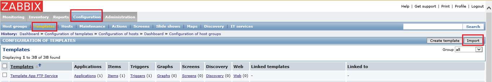

15.	点击 “Browse” -- >选择模板文件, 这里我们选择下载下来的 “nginx_status 2.0.xml”, 点击 “Import”

  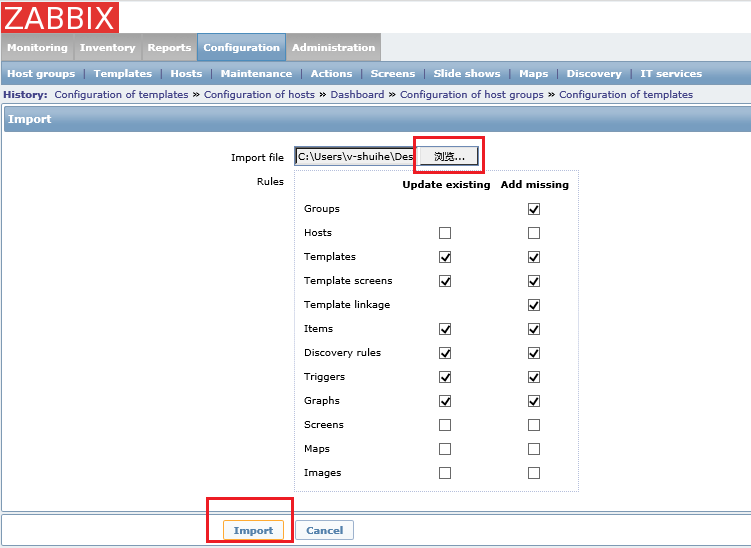
 
16.	点击 ‘Configuration’ -- > ‘Hosts’ -- > 选择 nginx server
 
  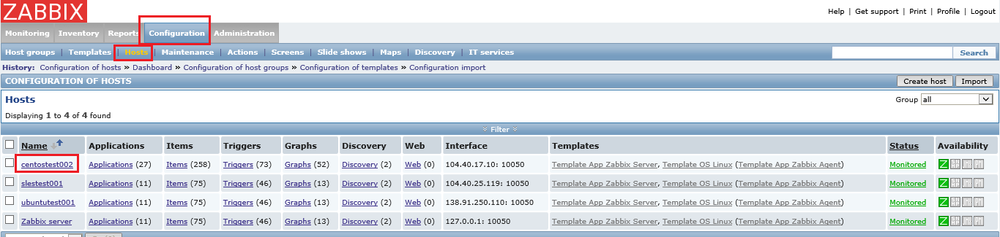

17.	点击 “Templates” -- > “Select” -- > 选择 “Nginx Status” 模板 , 点击“Select”, 然后点击 “Add” -- > “Save”

  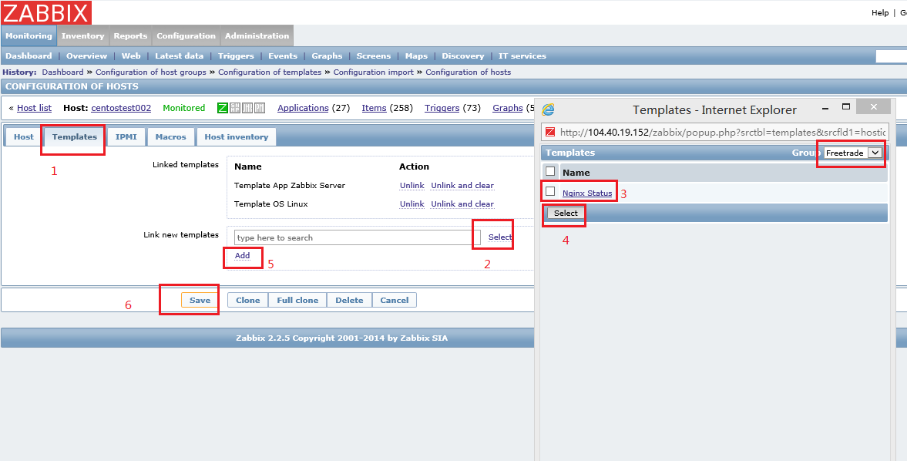
 
18.	然后我们发现 nginx server 的 nginx 状态已经被监控。去到 “Monitoring” -- > “Graphs” -- > 选择 nginx server, 选择“Nginx Socket Status” 图, 会看到类似下图

  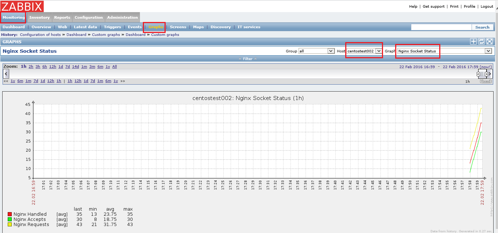
 
19.	您也可以选择 “Nginx Clients Status” 图。

  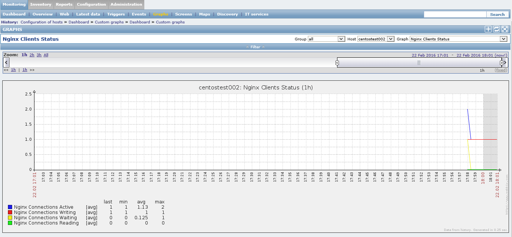
 

