<properties
	pageTitle="在Azure Linux虚拟机上配置zabbix监控（三）"
	description="本文介绍如何在Azure Linux虚拟机上配置zabbix监控（三）"
	services="open-source"
	documentationCenter=""
	authors=""
	manager=""
	editor=""/>

<tags
	ms.service="open-source-website"
	ms.date=""
	wacn.date="06/14/2016"/>

#在Azure Linux虚拟机上配置zabbix监控（三）

##监控 MySQL 和 MySQL 主从复制

1.	在 mysql 主从虚拟机上都安装 zabbix agent 包，打开端口 10050,10051,3306 . 启动 zabbix agent 进程, 添加 mysql 主从虚拟机到监控列表。

2.	安装 mysql ，配置主从复制。请参考如下步骤3-12 (以CentOS 7 为例)

3.	使用 putty 连接到 mysql 主服务器, 执行下面命令

        $sudo yum install mariadb-server -y

4.	编辑 /etc/my.cnf, 添加下面内容到 [mysqld]下

        server-id	= 1
        log_bin	= /var/lib/mysql/mysql-bin.log

5.	使用 putty 连接到 mysql 从服务器，执行下面命令

        $sudo yum install mariadb-server -y

6.	编辑/etc/my.cnf, 添加下面内容到 [mysqld]下

        server-id	= 2
        log_bin	= /var/lib/mysql/mysql-bin.log

7.	去到 mysql 主服务器，启动进程

        $sudo service mariadb start

8.	创建复制用户. 使用真实的从服务器，用户，密码代替下面代码中的 repluser, slave ip, password。 

        $mysql -uroot -p<password>
        grant replication slave on *.* to 'repluser'@'slave ip' identified by 'password';  
        flush privileges;
        exit

9.	重启服务，查看主服务器状态

        $sudo service mariadb restart
        $mysql -uroot -p<password>
        show master status;

    执行 ‘show master status’结果类似下图。我们之后会用到 ‘File’ 和 ‘Position’ 的信息
    
  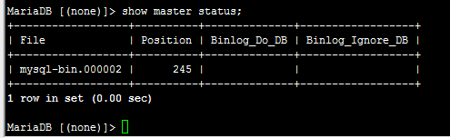
 
10.	去到 mysql 从服务器，执行

        $sudo service mariadb start

11.	执行下面命令. 请根据实际情况填写。 ‘master log bin’ 和’pos’信息是上面’show master status’命令获取到的；’repluser’ 和’password’ 是上面授权的命令定义的; ‘mysql master ip’ 是 mysql 主服务器的 IP 。

        $ mysql -uroot -p<password>
        change master to master_host=’mysql master ip’, master_user=’repluser’, master_password=’password’,                     
        master_log_file=’master log bin’, master_log_pos=pos;
        start slave;
        show slave status\G

    show slave status\G 会显示主从复制状态，结果类似下图

  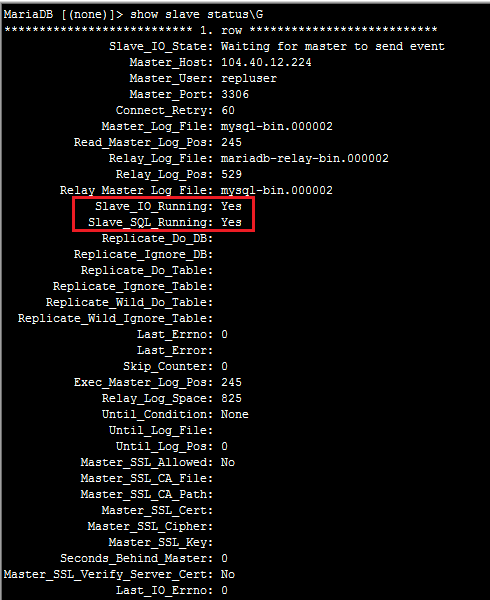
 
    我们检查 “Slave_IO_Running” 和“Slave_SQL_Running”, 如果都是 “Yes”, 通常意味着主从复制正常工作

12.	我们可以做一些数据操作检测数据同步是否正常. 在 mysql 主服务器上执行

        $ mysql -uroot -p<password>
        create database shopping;
        use shopping;
        create table book (id int(10), name varchar(20));
        insert into book values (1, ‘war and pe’);

    去到从服务器上执行

        $ mysql -uroot -p<password>
        select * from shopping.book;

    如果结果类似下图，表明数据同步正常
    
  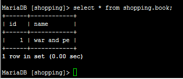
 

我们现在可以继续下一步了: 配置 zabbix ，使用 zabbix mysql 模板监控 mysql 状态。步骤如下

1.	在 mysql 主服务器上执行

        $ mysql -uroot -p<password>
        GRANT USAGE,PROCESS,SUPER,REPLICATION CLIENT,REPLICATION SLAVE ON *.* TO 'zabbix'@'localhost' IDENTIFIED BY 'zabbix';
        flush privileges;
        exit

2.	在 /usr/local/zabbix/etc/创建 .my.cnf

        $sudo vi /usr/local/zabbix/etc/.my.cnf
        [mysql]
        host=localhost
        user=zabbix
        password=zabbix
        [mysqladmin]
        host=localhost
        user=zabbix
        password=zabbix

3.	编辑/usr/local/zabbix/etc/zabbix_agentd.conf, 在文件末尾添加下面内容

        ### MySQL DB Infomation
        UserParameter=mysql.status[*],echo "show global status where Variable_name='$1';"|mysql --defaults-file=/usr/local/zabbix/etc/.my.cnf -N|awk '{print $$2}'
        UserParameter=mysql.variables[*],echo "show global variables where Variable_name='$1';"|mysql --defaults-file=/usr/local/zabbix/etc/.my.cnf -N|awk '{print $$2}'
        UserParameter=mysql.ping,mysqladmin --defaults-file=/usr/local/zabbix/etc/.my.cnf ping|grep -c  alive
        UserParameter=mysql.version,echo "select version();"|mysql --defaults-file=/usr/local/zabbix/etc/.my.cnf -N
         
        #### MySQL Master Information
        UserParameter=mysql.master.Slave_count,echo "show slave hosts;"|mysql --defaults-file=/usr/local/zabbix/etc/.my.cnf -N|wc -l
        UserParameter=mysql.master.Binlog_file,echo "show master status;"|mysql --defaults-file=/usr/local/zabbix/etc/.my.cnf -N|awk '{print $1}'|awk -F. '{print $1}'
        UserParameter=mysql.master.Binlog_number,echo "show master status;"|mysql --defaults-file=/usr/local/zabbix/etc/.my.cnf -N|awk '{print $1}'|awk -F. '{print $2}'
        UserParameter=mysql.master.Binlog_position,echo "show master status;"|mysql --defaults-file=/usr/local/zabbix/etc/.my.cnf -N|awk '{print $2}'
        UserParameter=mysql.master.Binlog_count,echo "show binary logs;"|mysql --defaults-file=/usr/local/zabbix/etc/.my.cnf -N|wc -l
        UserParameter=mysql.master.Binlog_total_size,echo "show binary logs;"|mysql --defaults-file=/usr/local/zabbix/etc/.my.cnf -N|awk '{sum+=$NF}END{print  sum}'
         
        #### MySQL Slave Information
        UserParameter=mysql.slave.Seconds_Behind_Master,echo "show slave status\G"|mysql --defaults-file=/usr/local/zabbix/etc/.my.cnf|grep "Seconds_Behind_Master"|awk '{print $2}'
        UserParameter=mysql.slave.Slave_IO_Running,echo "show slave status\G"|mysql --defaults-file=/usr/local/zabbix/etc/.my.cnf|grep "Slave_IO_Running"|awk '{print $2}'
        UserParameter=mysql.slave.Slave_SQL_Running,echo "show slave status\G"|mysql --defaults-file=/usr/local/zabbix/etc/.my.cnf|grep "Slave_SQL_Running"|awk '{print $2}'
        UserParameter=mysql.slave.Relay_Log_Pos,echo "show slave status\G"|mysql --defaults-file=/usr/local/zabbix/etc/.my.cnf|grep "Relay_Log_Pos"|awk '{print $2}'
        UserParameter=mysql.slave.Exec_Master_Log_Pos,echo "show slave status\G"|mysql --defaults-file=/usr/local/zabbix/etc/.my.cnf|grep "Exec_Master_Log_Pos"|awk '{print $2}'
        UserParameter=mysql.slave.Read_Master_Log_Pos,echo "show slave status\G"|mysql --defaults-file=/usr/local/zabbix/etc/.my.cnf|grep "Read_Master_Log_Pos"|awk '{print $2}'
         
        #### MySQL InnoDB Information
        #
        UserParameter=mysql.innodb[*],/usr/local/zabbix/bin/mysql_innodb_status.sh $1
         
        ####MySQL MyISAM Information
        #

4.	创建 /usr/local/zabbix/bin/mysql_innodb_status.sh, 内容如下

        #!/bin/bash
         
        #Get InnoDB Row Lock Details and InnoDB Transcation Lock Memory
        #mysql> SELECT SUM(trx_rows_locked) AS rows_locked, SUM(trx_rows_modified) AS rows_modified, SUM(trx_lock_memory_bytes) AS lock_memory FROM information_schema.INNODB_TRX;
        #+-------------+---------------+-------------+
        #| rows_locked | rows_modified | lock_memory |
        #+-------------+---------------+-------------+
        #|        NULL |          NULL |        NULL |
        #+-------------+---------------+-------------+
        #1 row in set (0.00 sec)
         
        #+-------------+---------------+-------------+
        #| rows_locked | rows_modified | lock_memory |
        #+-------------+---------------+-------------+
        #|           0 |             0 |         376 |
        #+-------------+---------------+-------------+
         
        #Get InnoDB Compression Time
        #mysql> SELECT SUM(compress_time) AS compress_time, SUM(uncompress_time) AS uncompress_time FROM information_schema.INNODB_CMP;
        #+---------------+-----------------+
        #| compress_time | uncompress_time |
        #+---------------+-----------------+
        #|             0 |               0 |
        #+---------------+-----------------+
        #1 row in set (0.00 sec)
         
         
        #Get InnoDB Transaction states
         
        #TRX_STATE  Transaction execution state. One of RUNNING, LOCK WAIT, ROLLING BACK or COMMITTING.
         
        #mysql> SELECT LOWER(REPLACE(trx_state, " ", "_")) AS state, count(*) AS cnt from information_schema.INNODB_TRX GROUP BY state;
        #+---------+-----+
        #| state   | cnt |
        #+---------+-----+
        #| running |   1 |
        #+---------+-----+
        #1 row in set (0.00 sec)
         
         
         
         
         
        innodb_metric=$1
         
        case $innodb_metric in
           Innodb_rows_locked)
                              value=$(echo "SELECT SUM(trx_rows_locked) AS rows_locked, SUM(trx_rows_modified) AS rows_modified, SUM(trx_lock_memory_bytes) AS lock_memory FROM information_schema.INNODB_TRX;"|mysql --defaults-file=/usr/local/zabbix/etc/.my.cnf -N| awk '{print $1}')
                              if [ "$value" == "NULL" ];then
                                 echo 0
                              else
                                 echo $value
                              fi
                            ;;
           Innodb_rows_modified)
                              value=$(echo "SELECT SUM(trx_rows_locked) AS rows_locked, SUM(trx_rows_modified) AS rows_modified, SUM(trx_lock_memory_bytes) AS lock_memory FROM information_schema.INNODB_TRX;"|mysql --defaults-file=/usr/local/zabbix/etc/.my.cnf -N| awk '{print $2}')
                              if [ "$value" == "NULL" ];then
                                 echo 0
                              else
                                 echo $value
                              fi
                            ;;
           Innodb_trx_lock_memory)
                              value=$(echo "SELECT SUM(trx_rows_locked) AS rows_locked, SUM(trx_rows_modified) AS rows_modified, SUM(trx_lock_memory_bytes) AS lock_memory FROM information_schema.INNODB_TRX;"|mysql --defaults-file=/usr/local/zabbix/etc/.my.cnf -N| awk '{print $3}')
                              if [ "$value" == "NULL" ];then
                                 echo 0
                              else
                                 echo $value
                              fi
                            ;;
              Innodb_compress_time)
                              value=$(echo "SELECT SUM(compress_time) AS compress_time, SUM(uncompress_time) AS uncompress_time FROM information_schema.INNODB_CMP;"|mysql --defaults-file=/usr/local/zabbix/etc/.my.cnf -N|awk '{print $1}')
                              echo $value
                              ;;
                
             Innodb_uncompress_time)
                              value=$(echo "SELECT SUM(compress_time) AS compress_time, SUM(uncompress_time) AS uncompress_time FROM information_schema.INNODB_CMP;"|mysql --defaults-file=/usr/local/zabbix/etc/.my.cnf -N|awk '{print $2}')
                              echo $value
                              ;;   
                 Innodb_trx_running)
                                 value=$(echo 'SELECT LOWER(REPLACE(trx_state, " ", "_")) AS state, count(*) AS cnt from information_schema.INNODB_TRX GROUP BY state;'|mysql --defaults-file=/usr/local/zabbix/etc/.my.cnf -N|grep running|awk '{print $2}')
                                 if [ "$value" == "" ];then
                                    echo 0
                                 else
                                    echo $value
                                 fi
                                ;;
               Innodb_trx_lock_wait)
                                 value=$(echo 'SELECT LOWER(REPLACE(trx_state, " ", "_")) AS state, count(*) AS cnt from information_schema.INNODB_TRX GROUP BY state;'|mysql --defaults-file=/usr/local/zabbix/etc/.my.cnf -N|grep lock_wait|awk '{print $2}')
                                 if [ "$value" == "" ];then
                                    echo 0
                                 else
                                    echo $value
                                 fi
                                ;;
            Innodb_trx_rolling_back)
                                 value=$(echo 'SELECT LOWER(REPLACE(trx_state, " ", "_")) AS state, count(*) AS cnt from information_schema.INNODB_TRX GROUP BY state;'|mysql --defaults-file=/usr/local/zabbix/etc/.my.cnf -N|grep rolling_back|awk '{print $2}')
                                 if [ "$value" == "" ];then
                                    echo 0
                                 else
                                    echo $value
                                 fi
                                ;;
            Innodb_trx_committing)
                                 value=$(echo 'SELECT LOWER(REPLACE(trx_state, " ", "_")) AS state, count(*) AS cnt from information_schema.INNODB_TRX GROUP BY state;'|mysql --defaults-file=/usr/local/zabbix/etc/.my.cnf -N|grep committing|awk '{print $2}')
                                 if [ "$value" == "" ];then
                                    echo 0
                                 else
                                    echo $value
                                 fi
                                ;;
         Innodb_trx_history_list_length)
                                 echo 'show engine innodb status\G'|mysql --defaults-file=/usr/local/zabbix/etc/.my.cnf -N|grep "History list length"|awk '{print $4}'
                                ;;
            Innodb_last_checkpoint_at)
                                 echo 'show engine innodb status\G'|mysql --defaults-file=/usr/local/zabbix/etc/.my.cnf -N|grep "Last checkpoint at"|awk '{print $4}'
                                ;;
         
           Innodb_log_sequence_number)
                                 echo 'show engine innodb status\G'|mysql --defaults-file=/usr/local/zabbix/etc/.my.cnf -N|grep "Log sequence number"|awk '{print $4}'
                                ;;
            Innodb_log_flushed_up_to)
                                 echo 'show engine innodb status\G'|mysql --defaults-file=/usr/local/zabbix/etc/.my.cnf -N|grep "Log flushed up to"|awk '{print $5}'
                                ;;
           Innodb_open_read_views_inside_innodb)
                                 echo 'show engine innodb status\G'|mysql --defaults-file=/usr/local/zabbix/etc/.my.cnf -N|grep "read views open inside InnoDB"|awk '{print $1}'
                                ;;
                Innodb_queries_inside_innodb)
                                echo 'show engine innodb status\G'|mysql --defaults-file=/usr/local/zabbix/etc/.my.cnf -N|grep "queries inside InnoDB"|awk '{print $1}'
                                ;;
                Innodb_queries_in_queue)
                                echo 'show engine innodb status\G'|mysql --defaults-file=/usr/local/zabbix/etc/.my.cnf -N|grep "queries in queue"|awk '{print $5}'
                                ;;
                Innodb_hash_seaches)
                                echo 'show engine innodb status\G'|mysql --defaults-file=/usr/local/zabbix/etc/.my.cnf -N|grep "hash searches"|awk '{print $1}'
                                ;;
               Innodb_non_hash_searches)
                                echo 'show engine innodb status\G'|mysql --defaults-file=/usr/local/zabbix/etc/.my.cnf -N|grep "non-hash searches/s"|awk '{print $4}'
                                ;;
               Innodb_node_heap_buffers)
                                echo 'show engine innodb status\G'|mysql --defaults-file=/usr/local/zabbix/etc/.my.cnf -N|grep "node heap"|awk '{print $8}'
                               ;;
               Innodb_mutex_os_waits)
                                echo 'show engine innodb status\G'|mysql --defaults-file=/usr/local/zabbix/etc/.my.cnf -N|grep "Mutex spin waits"|awk '{print $9}'
                               ;;
               Innodb_mutex_spin_rounds)
                                echo 'show engine innodb status\G'|mysql --defaults-file=/usr/local/zabbix/etc/.my.cnf -N|grep "Mutex spin waits"|awk '{print $6}'|tr -d ','
                               ;;
               Innodb_mutex_spin_waits)
                                echo 'show engine innodb status\G'|mysql --defaults-file=/usr/local/zabbix/etc/.my.cnf -N|grep "Mutex spin waits"|awk '{print $4}'|tr -d ','
                               ;; 
         
                           *)
                            echo "wrong parameter"
                            ;;
         
        esac

5.	设置执行权限和属主

        $sudo chmod 755 /usr/local/zabbix/bin/mysql_innodb_status.sh
        $sudo chown zabbix:zabbix /usr/local/zabbix/bin/mysql_innodb_status.sh

6.	可以去到 zabbix 官网 Zabbix 官网模板下载相应的 mysql 模板并依据相关的指导完成 mysql 模板的导入和设置。步骤7-9是用从 zabbix community 社区找到的 mysql 模板所做的相关测试。模板放置在链接下载此 mysql 模板，并关联到 mysql 主服务器。（注：此模板非官方提供，由社区贡献，如有顾虑，建议从官网下载 mysql 模板。）

7.	导入 mysql 模板 ，关联到 mysq l主服务器。

    如果出现下面的问题
    
  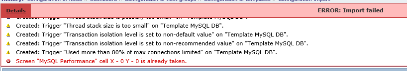
 
    在导入时不勾选 “Template Screens” ，如下图。然后点“import”
    
  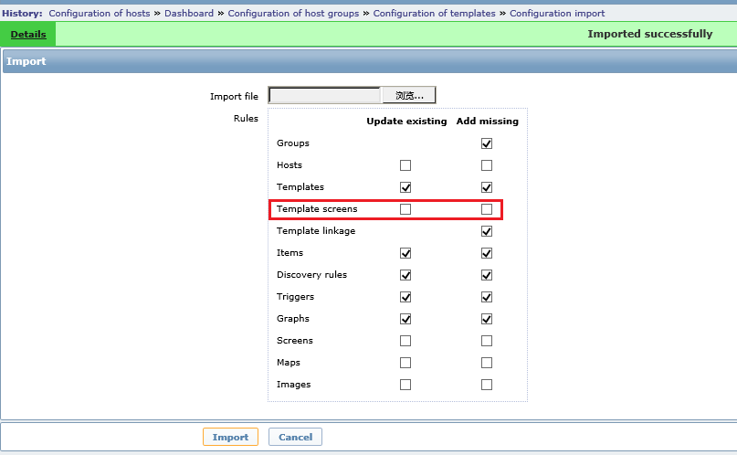
 
    当关联模板到mysql 主服务器时，选择如下
    
  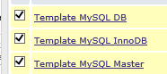
 
8.	去到 mysql 主服务器，执行如下

        $sudo /etc/init.d/zabbix_agentd restart

9.	现在您可以检查 mysql 状态了。打开 http://zabbix server ip/zabbix, 登录, 点击 “Monitoring” -- > “Graphs” -- > 选择 mysql 主服务器和一个想要查看的图形，比如 “MySQL Connections/Threads”
 
  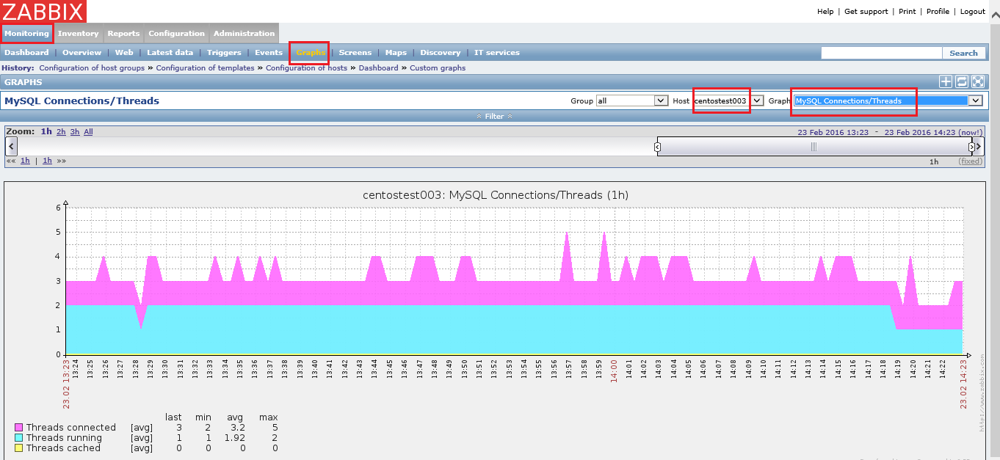

现在设置主从复制监控. 步骤如下:

1.	在 mysql 从服务器上执行如下命令, 记住用 mysql 主服务器的真实 IP

    $ mysql -uroot -p<password>
    grant replication client on *.* to 'zabbix'@'mysql master ip' identified by 'zabbix';
    flush privileges;
    exit

2.	去到 mysql 主服务器，创建文件 /usr/local/zabbix/bin/check_mysql_replication.sh, 内容如下。记住用真实的从服务器的IP替代 mysqlslaveip

        #!/bin/bash
        mysql -uzabbix -pzabbix -h mysqlslaveip -e 'show slave status\G' |grep -E "Slave_IO_Running|Slave_SQL_Running"|awk '{print $2}'|grep -c Yes

3.	设置权限和属主

        $sudo chmod 755 /usr/local/zabbix/bin/check_mysql_replication.sh
        $sudo chown zabbix:zabbix /usr/local/zabbix/bin/check_mysql_replication.sh

4.	编辑/usr/local/zabbix/etc/zabbix_agentd.conf, 在文件末尾添加下面内容

        UserParameter=mysql.replication,/usr/local/zabbix/bin/check_mysql_replication.sh
        
5.	重启 zabbix agent 进程

        $sudo /etc/init.d/zabbix_agentd restart

6.	打开网址 http://zabbix server ip/zabbix, 登录，为 mysql 主服务器添加监控项。点击 “Configuration” -- > “Hosts” -- > 点击mysql主服务器的’items’

  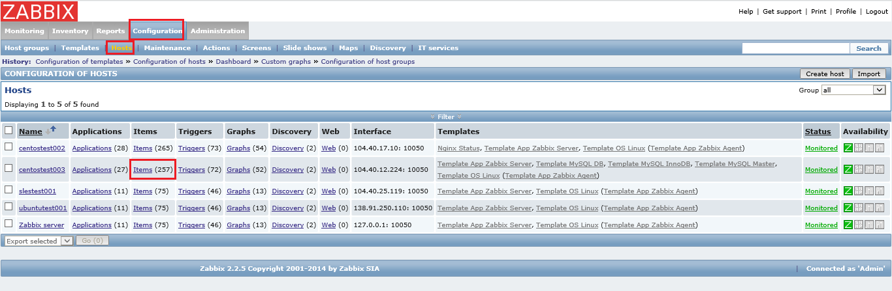
 
7.	点击 ‘Create item’ , 定义名字, 设置key为 ‘mysql.replication’, 点击“Save”

  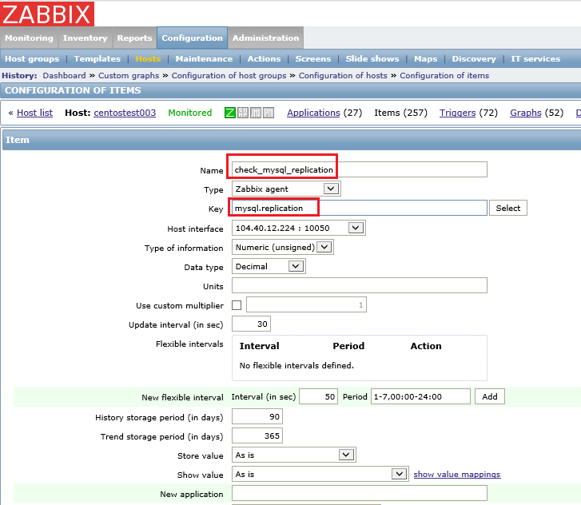
 
8.	创建触发器. 定义触发器名, 选择 ‘check_mysql_replication’ 项目

  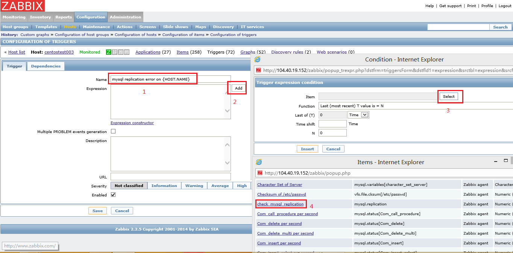
 
9.	设置表达式如下，然后点击 “Insert”

  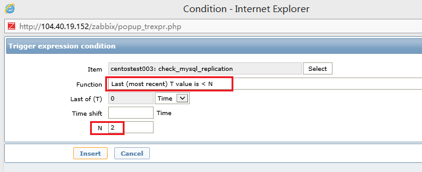
 
10.	设置级别，然后点击 “Save”

  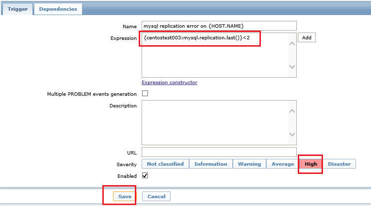
 
11.	验证。 在mysql从服务器上，stop slave, 然后看 zabbix 是否监控到了。可以看到确实监控到。

  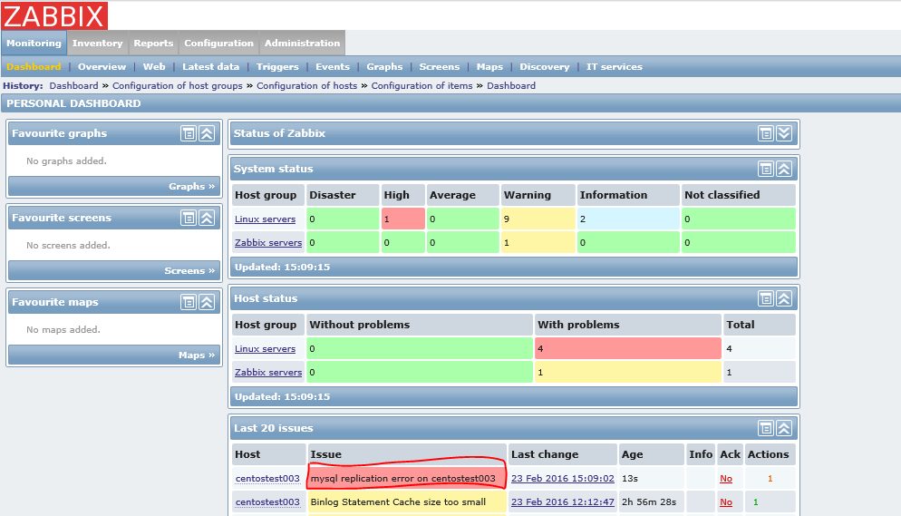
 
12.	检查您的邮箱。收到邮件内容类似下图

  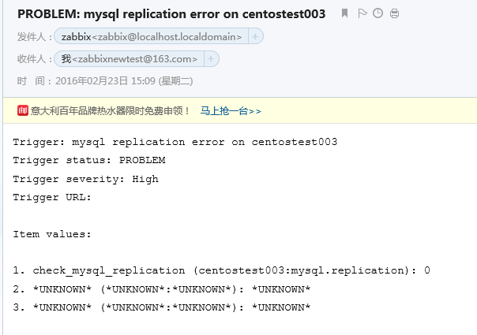
 

