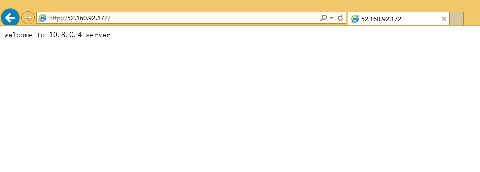
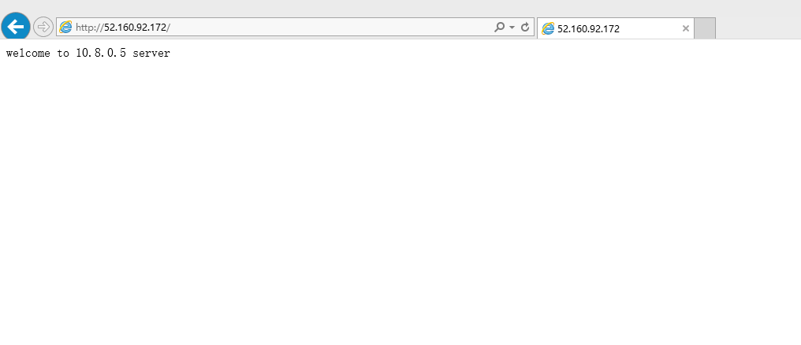
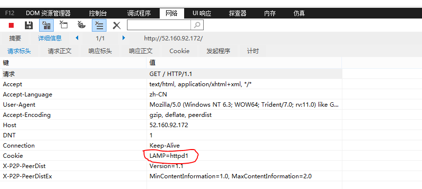

<properties
	pageTitle="在 Azure Linux 虚拟机上安装配置 HAProxy"
	description="了解如何在 Azure Linux 虚拟机上安装配置 HAProxy"
	services="open-source"
	documentationCenter=""
	authors=""
	manager=""
	editor=""/>

<tags
	ms.service="open-source-website"
	ms.date=""
	wacn.date="06/14/2016"/>

# 在 Azure Linux 虚拟机上安装配置 HAProxy

## 目录

- [安装](#install)
- [配置](#configure)
- [配置 session 绑定](#configure-session-binding)
- [配置 HAProxy 使用 SSL](#configure-haproxy-to-use-ssl)

HAProxy 可以看作是提供高可用，负载均衡，反向代理等功能的开源，快速，可靠的解决方案，特别适用于访问量大，高并发的网站。过去的这几年 HAProxy 已经成为标准的开源负载均衡器，在某些云平台默认部署。

它的运作模式使得与现有的架构进行集成变得非常的容易，而且让脆弱的 web server 不直接暴露在公网上。这篇文档演示了 HAProxy 的安装，配置和使用过程。

## 安装

以下面图示演示 HAProxy 的安装使用过程。

用户访问 HAProxy 的 IP 地址，HAProxy 则把请求转发到后端的两台 web server 上面，由这两台 web server 提供 web 服务。

这三台机器的详细信息如下：

<table border="1">
<thead>
<tr>
<th>role</th>			<th>ip address</th>	<th>Software</th>	<th>ports</th>
</tr>
</thead>
<tbody>
<tr>
<td>HAProxy</td>		<td>10.8.0.6</td>	<td>HAProxy</td>	<td>22,80</td>
</tr>
<tr>
<td>Web server01</td>	<td>10.8.0.4</td>	<td>Apache2</td>	<td>22,80</td>
</tr>
<tr>
<td>Web server02</td>	<td>10.8.0.5</td>	<td>Apache2</td>	<td>22,80</td>
</tr>
</tbody>
</table>

1. 创建虚拟网络。建议 HAProxy 和它的后端提供具体服务的服务器处于同一个子网下，或者让它们处于同一个数据中心，比如区域都选择中国东部或中国北部，以降低网络延迟。

	不想让这些服务器处于同一子网的话可以忽略‘创建虚拟网络’这步，那么则让它们的区域保持一致，都是中国东部或者中国北部。在创建虚拟机时选择区域。

	Azure 有提供虚拟网络的服务，可以让不同的虚拟机处于同一个子网下。请参考[虚拟网络链接](/documentation/articles/virtual-networks-create-vnet-classic-portal/)创建虚拟网络

2. 新建三台 VM，选择 OS， 比如 CentOS 7.0。参考 [Azure Linux VM tutorial](/documentation/articles/virtual-machines-linux-tutorial-portal-rm/). 创建虚拟机。在创建时记得选择上一步创建的虚拟网络。必须在创建虚拟机时指定虚拟网络。创建虚拟机后，不能将它加入虚拟网络。没有创建虚拟网络的话则请在选择区域时保持一致。

3. 三台 VM 打开上面表格中提到的相应端口。参考[创建终结点](/documentation/articles/virtual-machines-linux-classic-setup-endpoints/)

4. 连接到 HAProxy VM. 如果这是您第一次使用 AZURE 的虚拟机，请参考 [Azure Linux VM tutorial](/documentation/articles/virtual-machines-linux-tutorial-portal-rm/) 连接到虚拟机。

5. 下载 HAProxy 源码包。访问 HAProxy 官网下载您所需的版本，比如 http://www.haproxy.org/download/1.6/src/haproxy-1.6.3.tar.gz

		$sudo wget http://www.haproxy.org/download/1.6/src/haproxy-1.6.3.tar.gz

	如果提示说没有 wget 命令，请先安装 wget。不同的 linux 发行版本在安装 wget 时会有少许差别，比如:

	RedHat based 用 yum install wget 

	Ubuntu 用 apt-get install wget

	SLES 用 zypper install wget

	也可以直接在浏览器输入上述下载地址，下载到本地，再上传到 HAProxy VM。

6. 安装。这里以 CentOS 7.0 为例

		$sudo tar zxvf haproxy-1.6.3.tar.gz
		$cd haproxy-1.6.3
		$sudo yum install gcc
		$sudo make TARGET=linux2628 PREFIX=/usr/local/haproxy
		$sudo make install PREFIX=/usr/local/haproxy

	其他的 linux 发行版本只在 $sudo yum install gcc 这步上有区别，比如：

	Ubuntu 用 sudo apt-get install make gcc           #---》 Ubuntu 默认没有安装 make

	SLES 用 sudo zypper install gcc

## 配置

配置过程在不同的 linux 发行版本上都是一样的。这里还是以 CentOS 7.0 为例。

1. 编辑 /usr/local/haproxy/haproxy.cfg， 内容如下：

		global         
		       maxconn 4096           
		       chroot /usr/local/haproxy
		        uid 99                 
		        gid 99               
		       daemon                  
		       pidfile /usr/local/haproxy/haproxy.pid  

		defaults             
		       log    global
		        log     127.0.0.1       local3        
		       mode    http         
		       option  httplog       
		        option  dontlognull  
		        option  httpclose    
		       retries 3           
		       option  redispatch   
		       maxconn 2000                     
		       timeout connect     5000           
		       timeout client     50000          
		       timeout server     50000          

		frontend http-in                       
		       bind *:80
		        mode    http 
		        option  httplog
		        log     global
		        default_backend httppool 
		       
		backend httppool                    
		       balance roundrobin
		        server  10.8.0.4 10.8.0.4:80  weight 5 check inter 2000 rise 2 fall 3
		        server  10.8.0.5 10.8.0.5:80  weight 5 check inter 2000 rise 2 fall 3

	其中 10.8.0.4 和 10.8.0.5 是两台 web server 的私有IP地址。

2. 启动 haproxy 程序

		$sudo /usr/local/haproxy/sbin/haproxy -f /usr/local/haproxy/haproxy.cfg

	这个时候访问 [http://HAProxy 的公网地址:80](#) 会出错，因为它后端的两台 web server 还没有提供 web 服务。

3. 去到两台 web server 安装好 apache2 并启动。

4. 这时访问 [http://HAProxy 的公网地址:80](#) 就可正常访问了。类似下图：

	

	然后刷新一下浏览器，会发现有另外一台 web server 提供了服务。

	

5. 可在 HAProxy 上面配置状态页等统计信息。编辑 /usr/local/haproxy/haproxy.cfg,

	在 defaults 项目下添加如下信息

		stats	uri	/haproxy-admin
		stats	auth	admin:adminpass

	重启 HAProxy 服务

		$sudo /usr/local/haproxy/sbin/haproxy -f /usr/local/haproxy/haproxy.cfg -st `cat /usr/local/haproxy/haproxy.pid`

6. 访问 [http://HAProxy IP/haproxy-admin](#), 输入用户名和密码，即上面定义的 admin/adminpass

	

	即可出现如下图所示信息

	

## 配置 session 绑定

有多种方式实现，下面介绍三种方式。

1. 源 IP 地址绑定的方式

	修改 /usr/local/haproxy/haproxy.cfg 中 backend httppool 的部分，将 balance roundrobin 改成 balance source , 内容如下

		backend httppool                    
		       balance source
		        server  10.8.0.4 10.8.0.4:80  weight 5 check inter 2000 rise 2 fall 3
		        server  10.8.0.5 10.8.0.5:80  weight 5 check inter 2000 rise 2 fall 3

	重启 HAProxy 服务

		$sudo /usr/local/haproxy/sbin/haproxy -f /usr/local/haproxy/haproxy.cfg -st `cat /usr/local/haproxy/haproxy.pid`

	再次在浏览器里输入 [http://HAProxy 的公网地址:80](#) 并不断的刷新，发现访问的都是固定的一台 web server。
 

2. 通过 roundrobin+cookie 的方式来解决 sesion 会话的问题

	修改 /usr/local/haproxy/haproxy.cfg 中 backend httppool 的部分，修改后内容如下

		backend httppool           
		        balance  roundrobin         
		        cookie  LAMP insert indirect nocache
		        server  10.8.0.4 10.8.0.4:80  weight 5 cookie httpd1 check inter 2000 rise 2 fall 3
		        server  10.8.0.5 10.8.0.5:80  weight 5 cookie httpd2 check inter 2000 rise 2 fall 3

	重启 HAProxy 服务

		$sudo /usr/local/haproxy/sbin/haproxy -f /usr/local/haproxy/haproxy.cfg -st `cat /usr/local/haproxy/haproxy.pid`

	再次在浏览器里输入 [http://HAProxy 的公网地址:80](#), 按 F12 ，选择“网络” -- > 点击绿色的开始按钮，然后刷新

	

	这时看到了访问的详细信息。我们看到 cookie

	

	

	不断的刷新浏览器，访问的都是固定的同一台 web server。清除浏览器缓存，cookie 等，重新打开浏览器，输入 [http://HAProxy 的公网地址:80](#), 按 F12 查看 cookie 信息。 发现不管怎么刷新，访问的都是同一台 web server。

3. 通过 uri 的方式来将访问同一个 url 的请求，代理给同一台主机

	修改 /usr/local/haproxy/haproxy.cfg 中 backend httppool 的部分，修改后内容如下

		backend httppool           
		        balance  uri        
		        server  10.8.0.4 10.8.0.4:80  weight 5 cookie httpd1 check inter 2000 rise 2 fall 3
		        server  10.8.0.5 10.8.0.5:80  weight 5 cookie httpd2 check inter 2000 rise 2 fall 3

	重启 HAProxy 服务

		$sudo /usr/local/haproxy/sbin/haproxy -f /usr/local/haproxy/haproxy.cfg -st `cat /usr/local/haproxy/haproxy.pid`

	再次在浏览器里输入 [http://HAProxy 的公网地址:80](#), 不断的刷新浏览器，访问的都是固定的同一台 web server。

## 配置 HAProxy 使用 SSL

有两种主要的策略：

1. 在负载均衡器终止/解码 SSL 连接并发送非加密连接到后台服务器
2. SSL 连接在每个代理服务器终止，将 CPU 负载都分散到那些服务器

第一种意味着在 HAProxy 上放置 SSL 证书并进行处理，第二种意味着 HAProxy 只是起到负载的作用，在后端的服务器放置 SSL 证书，处理 HTTPS

我们先来看第一种配置

1. HAProxy 自 1.5 版本起支持 SSL，虽然我们安装的是 1.6.3 版本，我们还是需要重新编译。在 HAProxy VM (以 CentOS 7.0 为例)上，去到 HAProxy 源码的解压目录，执行如下命令

		$sudo yum install openssl-devel
		$cd haproxy-1.6.3
		$sudo make clean
		$sudo make TARGET=linux26 USE_OPENSSL=1 ADDLIB=-lz
		$sudo ldd haproxy|grep ssl
		$sudo make install PREFIX=/usr/local/haproxy

2. 创建自签名证书。在生产环境您需要去服务提供商购买 SSL 证书，我们这里演示自签名证书的创建过程。

		$sudo mkdir /etc/ssl/haproxycert
		$sudo openssl genrsa -out /etc/ssl/haproxycert/haproxycert.key 1024
		$cd /etc/ssl/haproxycert/
		$openssl req -new -key haproxycert.key -out /etc/ssl/haproxycert/haproxycert.csr

	此时会要求输入一些相关信息，注意填 Common Name 时候记得填写 HAProxy VM 的域名信息，然后 email, password, optional company name 可以不填，直接回车。

	

	继续

		$sudo openssl x509 -req -days 365 -in /etc/ssl/haproxycert/haproxycert.csr -signkey /etc/ssl/haproxycert/haproxycert.key -out /etc/ssl/haproxycert/haproxycert.crt
		$cat haproxycert.crt haproxycert.key | tee haproxycert.pem

3. 修改 /usr/local/haproxy/haproxy.cfg 的内容。修改 frontend 部分即可。修改后内容如下

		frontend http-in
		                     
		        bind *:80
		        bind *:443 ssl crt /etc/ssl/haproxycert/haproxycert.pem
		        redirect scheme https if !{ ssl_fc }
		        mode    http 
		        option  httplog
		        log     global
		        default_backend httppool

	注意 bind *:443 ssl crt /etc/ssl/haproxycert/haproxycert.pem 这句指定的 ssl 证书即是刚刚我们创建的字签名证书，如果您是购买的证书，需要把证书文件上传到 HAProxy VM，并在这里填写证书文件的绝对路径

	redirect scheme https if !{ ssl_fc } 这一句是将 http 的访问请求也转向 https, 如果您需要的是 http 就走 http， https 走https, 可把这一句删掉。

	重启 HAProxy 服务

		$sudo /usr/local/haproxy/sbin/haproxy -f /usr/local/haproxy/haproxy.cfg -st `cat /usr/local/haproxy/haproxy.pid`

4. 在HAProxy VM打开443端口。参考[创建终结点](/documentation/articles/virtual-machines-linux-classic-setup-endpoints/)
5. 在浏览器里输入 [https://HAProxy 域名](#), 会出现如下图。

	

	点击“继续浏览此网站”， 

	

	输入 [https://HAProxy 的公网地址](#) 访问也是同样效果。

	

6. 输入 [http://HAProxy 域名](#)，会转向 https. 至此配置成功。

第二种配置。即在后端的 web server 配置 ssl, HAProxy 只提供负载均衡的作用。

1. HAProxy VM 上重新编译。

		$sudo yum install openssl-devel
		$cd haproxy-1.6.3
		$sudo make clean
		$sudo make TARGET=linux26 USE_OPENSSL=1 ADDLIB=-lz
		$sudo ldd haproxy|grep ssl
		$sudo make install PREFIX=/usr/local/haproxy

2. 修改 /usr/local/haproxy/haproxy.cfg 的内容。修改 defaults, frontend 和 backend 关于 mode http 的部分，将 mode http 改成 mode tcp 。修改后内容如下

		defaults
		       mode    tcp
		       option  tcplog
		frontend http-in                       
		        bind *:80
		        bind *:443
		        mode tcp
		        option  tcplog
		        log     global
		        default_backend httppool
		backend httppool          
		        mode tcp 
		        balance roundrobin 
		        option ssl-hello-chk       
		        server  10.8.0.4 10.8.0.4:80  weight 5 check inter 2000 rise 2 fall 3
		        server  10.8.0.5 10.8.0.5:80  weight 5 check inter 2000 rise 2 fall 3

	重启 HAProxy 服务

		$sudo /usr/local/haproxy/sbin/haproxy -f /usr/local/haproxy/haproxy.cfg -st `cat /usr/local/haproxy/haproxy.pid`

3. 在 HAProxy VM 以及后端两台 web server 打开 443 端口。参考[创建终结点](/documentation/articles/virtual-machines-linux-classic-setup-endpoints/)
4. 在 web server 配置 SSL。请参考 apache 官网 [https://httpd.apache.org/docs/2.2/ssl/](https://httpd.apache.org/docs/2.2/ssl/)

更多关于 HAProxy 的详细信息请参考[官网](http://www.haproxy.org/)

