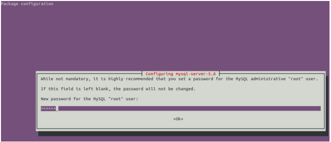

<properties
	pageTitle="在 Azure Linux 虚拟机上安装 MySQL"
	description="了解如何在 Azure Linux 虚拟机上安装 MySQL"
	services="open-source"
	documentationCenter=""
	authors=""
	manager=""
	editor=""/>

<tags
	ms.service="open-source-website"
	ms.date=""
	wacn.date="06/14/2016"/>

# 在 Azure Linux 虚拟机上安装 MySQL

##目录

- [Redhat base Linux 下安装 MySQL Server 5.6](#install-mysql-server-5_6-under-redhat-base-linux)
- [Ubuntu Linux 下安装 MySQL Server 5.6](#install-mysql-server-5_6-under-ubuntu-linux)
- [SUSE Linux 下安装 MySQL Server 5.6](#install-mysql-server-5_6-under-suse-linux)

MySQL 有多个稳定版本以及多种安装方式，这篇文档以 MySQL 5.6， repository package 安装方式演示整个安装过程。

连接到您的 LINUX 虚拟机。如果这是您第一次使用 Azure 的 LINUX 虚拟机，请参考 [Azure Linux VM tutorial](/documentation/articles/virtual-machines-linux-tutorial-portal-rm/) 连接到虚拟机。

不同的 LINUX 发行版在安装 MySQL 时有少许的不同。请根据您的 LINUX 版本选择对应的步骤。

## Redhat base Linux 下安装 MySQL Server 5.6: (以 CentOS 7.0, 64-bit system, MySQL Server 5.6 为例)

1. 下载 MySQL yum repository

		$sudo wget http://repo.mysql.com/mysql-community-release-el6-5.noarch.rpm

2. 安装此 release package

		$sudo yum localinstall -y mysql-community-release-el6-5.noarch.rpm

3. 安装 MySQL Server 5.6

		$sudo yum install mysql-community-server -y

	注意，由于网速等原因可能会导致下载安装包时等待时间过多而安装失败的情况， 没有关系，只需重复此命令安装即可。

4. 启动 MySQL Server 5.6

		$sudo service mysqld start

5. 设置 MySQL root 密码。安装后默认 root 密码为空。第一次使用时最好设置 root 密码

		$sudo mysqladmin -u root password <password>

	其中 <password> 是您要设置的 root 密码

6. 如果需要更新 root 密码的话，有好几种方式。这里还是用 mysqladmin 命令

		$sudo mysqladmin -uroot -p<password> password

	其中 <password> 是您原先的 root 密码，敲入上述命令后回车，输入新密码即可。

7. 停止 MySQL 服务

		$sudo service mysqld stop

8. 配置开机自启动

		$sudo chkconfig mysqld on             #CentOS 7.0 亦可使用此命令

9. 授权其他机器访问。默认 root 只有本机访问。

		$mysql -uroot -p
		mysql>grant all privileges on *.* to 'root'@'10.0.0.1' identified by '123456';
		mysql>flush privileges;
		mysql>exit

	注意上面 10.0.0.1 是被授权访问此 MySQL Server 的机器地址，123456 是您 root 密码。如果用 % 替代 IP 地址的话表明所有机器都可访问此数据库服务器。

10. 打开 3306 端口。3306 端口是 MySQL 的默认端口。请参考[创建终结点](/documentation/articles/virtual-machines-linux-classic-setup-endpoints/)打开端口
11. 此时可以从 10.0.0.1 机器远程访问您的 MySQL 数据库了。

## Ubuntu Linux 下安装 MySQL Server 5.6: (以 Ubuntu 14.04, 64-bit system, MySQL 5.6 为例)

1. 安装 MySQL Server 5.6

		$sudo apt-get update
		$sudo apt-get -y install mysql-server-5.6

	在安装时会出现类似下面窗口要求您设置 root 密码

	

	输入密码，再次确认后即可。

2. 访问。MySQL Server 安装完后会自动启动，因此我们可以直接访问

		$mysql -uroot -p

	输入 root 密码即可登录访问

3. 停止 MySQL 服务

		$sudo service mysql stop

4. 启动 MySQL 服务

		$sudo service mysql start

5. 授权其他机器访问

		$ sudo sed -i 's/^bind-address/#bind-address/' /etc/mysql/my.cnf
		$mysql -uroot -p
		mysql>grant all privileges on *.* to 'root'@'10.0.0.1' identified by '123456';
		mysql>flush privileges;
		mysql>exit

	注意上面 10.0.0.1 是被授权访问此 MySQL Server 的机器地址，123456 是您 root 密码。如果用%替代 IP 地址的话表明所有机器都可访问此数据库服务器。

6. 打开 3306 端口。3306 端口是 MySQL 的默认端口。请参考[创建终结点](/documentation/articles/virtual-machines-linux-classic-setup-endpoints/)打开端口 

7. 此时可以从 10.0.0.1 机器远程访问您的 MySQL 数据库了。

## SUSE Linux 下安装 MySQL Server 5.6: (以 SLES 12, 64-bit system, MySQL Server 5.6 为例)

1. 下载 repository package

		wget http://dev.mysql.com/get/mysql57-community-release-sles12-7.noarch.rpm

2. 安装 repo package

		$sudo rpm -ivh mysql57-community-release-sles12-7.noarch.rpm
		$sudo rpm --import /etc/RPM-GPG-KEY-mysql
		$sudo zypper modifyrepo -d mysql57-community
		$sudo zypper modifyrepo -e mysql56-community
		$sudo zypper refresh

3. 安装 MySQL Server 5.6

		$sudo zypper install -y mysql-community-server

	注意，如果由于网速等原因在下载时时间过长导致安装失败，没有关系，重复此命令安装即可。

4. 开机自启动

		$sudo systemctl enable mysql

5. 启动服务

		$sudo systemctl start mysql

6. 设置 root 密码

		$sudo mysqladmin -u root password <password>

	其中 <password> 是您要设置的 root 密码

7. 授权其他机器访问。默认 root 只有本机访问。

		$mysql -uroot -p
		mysql>grant all privileges on *.* to 'root'@'10.0.0.1' identified by '123456';
		mysql>flush privileges;
		mysql>exit

	注意上面 10.0.0.1 是被授权访问此 MySQL Server 的机器地址，123456 是您 root 密码。如果用%替代 IP 地址的话表明所有机器都可访问此数据库服务器。

8. 打开 3306 端口。3306 端口是 MySQL 的默认端口。请参考[创建终结点](/documentation/articles/virtual-machines-linux-classic-setup-endpoints/)打开端口 

9. 此时可以从 10.0.0.1 机器远程访问您的 MySQL 数据库了。

更多资料请参考[官网](http://dev.mysql.com/doc/refman/5.6/en/) 
