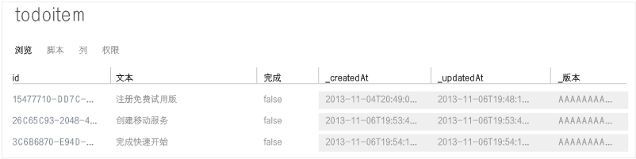

<properties
	pageTitle="Azure 移动服务和 Sencha 入门"
	description="请按照本教程来开始使用移动服务和 Sencha HTML5 移动应用程序框架进行开发。"
	services="mobile-services"
	documentationCenter=""
	authors="ggailey777"
	manager="dwrede"
	editor=""/>

<tags
	ms.service="mobile-services"
	ms.date="02/10/2016"
	wacn.date="03/21/2016"/>

#  移动服务和 Sencha Touch 入门

[AZURE.INCLUDE [mobile-services-selector-get-started](../includes/mobile-services-selector-get-started.md)]
&nbsp;

[AZURE.INCLUDE [mobile-services-hero-slug](../includes/mobile-services-hero-slug.md)]

##概述

本教程演示了如何在您的 Sencha Touch 应用程序中利用 Azure 移动服务。使用可利用你通过 Azure 经典门户定义的移动服务的 Sencha Touch，来创建一个简单的*待办事项列表*应用。本教程适用于中级到高级的 Web 应用程序开发人员，这些开发人员非常了解 JavaScript 并熟悉 Sencha Touch 框架。

下面显示的是完成的应用程序的屏幕快照：

![][0]

## 要求

- 下载并安装 [Sencha Touch](http://wwww.sencha.com/products/touch/download"target="\_blank")。

- 下载并安装 [Sencha Cmd Tool](http://www.sencha.com/products/sencha-cmd/download"target="\_blank")。

- Java Runtime Environment (JRE) 或 Java 开发工具包（如果您创建 Android 应用程序）
- Ruby 和 SASS gem。

##  创建新的移动服务

[AZURE.INCLUDE [mobile-services-create-new-service](../includes/mobile-services-create-new-service.md)]

## 创建 TodoItems 表

创建移动服务后，你可以在 Azure 经典门户中按照简单的快速入门来创建一个新数据库表，以便在该移动服务中使用。

1. 在 [Azure 经典门户]中单击“移动服务”，然后单击你刚刚创建的移动服务。

2. 在快速启动选项卡中，单击“选择平台”下的“HTML”，然后展开“创建新的 HTML 应用程序”。

    

    此时将显示三个简单步骤，描述如何创建和托管与移动服务连接的 HTML 应用程序。

    

3. 单击“创建 TodoItem 表”以创建用于存储应用程序数据的表。

	> [AZURE.NOTE]不要从 Azure 经典门户下载 HTML 应用。相反，我们将在下面的部分中手动创建一个 Sencha Touch 应用程序。

1. 记下 Azure 经典门户中的 **appKey** 和 **appUrl**。您将在本教程的其他部分中使用它们。

    

1. 在“配置”选项卡中，验证 是否已列在“跨域资源共享(CORS)”下的“允许来自以下主机名的请求”列表中`localhost`。如果未列出，请在“主机名”字段中键入 `localhost`，然后单击“保存”。

    

## 生成您的 Touch 应用程序

使用 Sencha Cmd 可轻松地生成 Sencha Touch 模板应用程序，同时它也是快速启动和运行应用程序的绝佳方式。

从安装了 Touch 框架的目录发出以下命令：

	$ sencha generate app Basic /path/to/application

这将生成一个名为“Basic”的 Touch 模板应用程序。若要启动您的应用程序，只需将您的浏览器指向目录 /path/to/application，然后将显示标准的 Touch 示例应用程序。

## 安装 Sencha Touch Extensions for Azure

可手动安装 Azure 扩展或将其作为 Sencha 包进行安装。所使用的方法完全由您决定。

### 手动安装

在大多数 Touch 应用程序中，如果您希望添加类的外部库，则只需下载 Sencha 包、在应用程序目录中解压缩它并在该库的位置配置 Touch 加载程序。

您可以使用以下步骤手动将 Azure 扩展添加到您的应用程序：

1. 从[此处](https://market.sencha.com/extensions/sencha-extensions-for-microsoft-azure)下载 Azure 扩展包。（您可能会使用自己的 Sencha 论坛 ID 访问此区域。）

2. 将该 Azure 扩展包从下载目录复制到您最终希望放置和解压缩它的位置：

        $ cd /path/to/application
	    $ mv /download-location/azure.zip .
    	$ unzip azure.zip  

    这将创建包含整个程序包源、示例和文档的 **azure** 目录。该源将位于 **azure/src** 目录中。

### 作为 Sencha 包安装

> [AZURE.NOTE]只有在使用 <code>sencha generate app</code> 命令生成了应用程序时，才能使用此方法。

所有由 Sencha Cmd 生成的应用程序在根目录下都具有一个“packages”文件夹。可以配置“packages”文件夹的位置，但不管其位置如何，您的应用程序（或多个应用程序，如果您已创建 Sencha 工作区）都可以将该文件夹用于存储所有程序包。

由于 Ext.Azure 是 Sencha Cmd“包”，因此使用 Sencha Cmd 可轻松地安装源代码并将其包括在应用程序中。（有关详细信息，请参阅 [Sencha Cmd 包](http://docs.sencha.com/cmd/6.x/cmd_packages/cmd_packages.html)）。

若要从 Sencha 包存储库下载和安装 Azure 扩展包，你需要将程序包的名称添加到你的 **app.json** 文件并生成你的应用程序：

1. 将 Azure 包添加到需要 app.json 文件的部分：

	    {
            "name": "Basic",
	        "requires": [
    	        "touch-azure"
        	]
    	}
    
2. 使用 **sencha cmd** 重新生成你的应用程序以提取和安装该程序包：

	    $ sencha app build

**sencha app build** 和 **sencha app refresh** 现在都将执行将程序包集成到你的应用程序所需的步骤。通常，在更改程序包的要求之后，你将需要运行 **sencha app refresh**，以便支持“开发人员模式”所需的元数据是最新的。

无论运行哪个命令，Sencha Cmd 都会将程序包下载到“packages”文件夹并将其展开。完成此操作后，您可以在工作区中找到“packages/touch-azure”文件夹。

## 包括并配置 Azure

**文件名**：app.js

由于已下载了 Azure 扩展并将其安装在您的应用程序目录下，下一步则要告知您的应用程序查找源文件的位置以及需要这些文件的位置：

1. 使用源代码的位置配置 Sencha 加载程序：
 
        Ext.Loader.setConfig({
					enabled : true,
           	paths   : {
               	'Ext'       : 'touch/src',
               	'Ext.azure' : '/path-to/azure-for-touch/azure/src'
            }
        });

2. 需要 Azure 类文件：

		Ext.application({

			requires: [ 'Ext.azure.Azure' ],

			// ...

		});

3. 配置 Azure：

	通过调用应用程序的启动部分中的 **Ext.Azure.init** 方法来初始化 Azure 包。此方法将传递一个配置对象，该对象包含移动服务凭据以及需要使用的其他凭据和功能。

	虽然你可以将配置对象直接传递给 init 方法，但我们建议创建一个名为 **azure** 的 Sencha 应用程序配置属性，并将所有相应信息都放入其中。然后，可以将此属性的值传递给 Ext.Azure.init 方法。

	当你在 Azure 中创建移动服务时（请参阅 [Azure 入门](http://senchaazuredocs.azurewebsites.net/#!/guide/getting_started)），将应用程序密钥和 URL 分配给该服务。必须向 Azure 包提供此信息，以便它可以连接到您的服务。

	此示例演示了在仅提供应用程序密钥和 URL 时进行的非常简单的 Azure 配置和初始化：

	    Ext.application({
    	    name: 'Basic',

        	requires: [ 'Ext.azure.Azure' ],

	        azure: {
    	        appKey: 'myazureservice-access-key',
        	    appUrl: 'myazure-service.azure-mobile.net'
	        },

    	    launch: function() {

        	    // Call Azure initialization

            	Ext.Azure.init(this.config.azure);

				}
    		});

	有关 Azure 配置选项的详细信息，请参阅 Ext.Azure API 文档。

祝贺你！ 您的应用程序现在应该可以访问您的移动服务。

## 生成 ToDo 应用程序

由于我们已将您的应用程序配置为包含 Azure 扩展，并向其提供了您的移动服务凭据，因此接下来我们可以创建一个可使用移动服务的 Touch 应用程序，以便查看和编辑存储在该服务中的 ToDo 列表数据。

### 配置 Azure 数据代理

**文件名：**app/model/TodoItem.js

Touch 应用程序可通过数据代理与移动服务进行通信。此代理执行将请求发送到移动服务和从移动服务接收数据的所有工作。如果将 Touch 应用程序与 Touch 数据模型和存储结合使用，则可以免去处理远程数据和将其获取到您的应用程序中的所有繁琐工作，Touch 将自行处理这些工作。

Sencha Touch 模型提供了您将在应用程序中使用的数据记录的定义。它们不仅允许您定义数据字段，而且还提供有关处理应用程序与 Azure 移动服务之间通信的代理的配置。

在下面的代码中您可以看到我们不仅为该模型定义字段（及其类型），还提供代理配置。当配置您的代理时，您需要为其提供类型（本例中为“azure”）、移动服务表名 (ToDoItem) 和其他可选参数。在此示例中，我们将启用代理分页，以便我们可以通过列表项无缝地向前和向后翻页。

Azure 代理会按照 Azure API 所预期的相应 CRUD 操作（包括身份验证凭据，如果它们存在）自动设置所有 HTTP 标头。

	Ext.define('Basic.model.TodoItem', {
    	extend : 'Ext.data.Model',

	    requires : [
    	    'Ext.azure.Proxy'
    	],

	    config : {
    	    idProperty : 'id',
        	useCache   : false,

	        fields     : [
    	        {
        	        name : 'id',
            	    type : 'int'
            	},
            	{
                	name : 'text',
                	type : 'string'
            	},
            	{
	                name : 'complete',
    	            type : 'boolean'
        	    }
	        ],

	        proxy : {
    	        type               : 'azure',
        	    tableName          : 'TodoItem',
            	enablePagingParams : true
        	}
    	}
	});

### 存储 ToDo 项 

**文件名**: app/store/TodoItems.js

Sencha Touch 存储可用于存储用作 Touch 组件的源的数据记录（模型）的集合，以便以各种不同的方式显示这些记录。这可能包括网格、图表、列表等等。

此处，我们定义一个存储，用于保存从 Azure 移动服务检索到的所有存储 ToDo 列表项。请注意，此存储配置包含模型类型（Basic.model.TodoItem - 已在上面定义）的名称。这定义了该存储中所包含的记录的结构。

我们还有一些其他存储配置选项（如指定页的大小（8 个记录）），而且通过 Azure 移动服务远程完成对此存储的记录的排序（无法以本地方式在存储本身内进行排序）。

	Ext.define('Basic.store.TodoItems', {
    	extend : 'Ext.data.Store',

	    requires : [
    	    'Basic.model.TodoItem'
	    ],

	    config : {
    	    model        : 'Basic.model.TodoItem',
        	pageSize     : 8,
	        remoteSort   : true,
    	    remoteFilter : true
    	}
	});

### 查看和编辑 ToDo 项

**文件名**： app/view/DataItem.js

由于我们已定义了每个 ToDo 项的结构并且已创建了存储来放置所有记录，因此应考虑希望如何向应用程序的用户显示此信息。我们通常通过使用“视图”向用户显示信息。视图可以是任意数量的 Touch 组件之一，可单独使用或与其他元素组合使用。

下面的视图由 ListItem 组成，它定义每个记录以及某些按钮的显示方式，这些按钮将容纳删除每个项的操作。

	Ext.define('Basic.view.DataItem', {
    	extend : 'Ext.dataview.component.ListItem',
    	xtype  : 'basic-dataitem',

	    requires : [
    	    'Ext.Button',
        	'Ext.layout.HBox',
        	'Ext.field.Checkbox'
    	],

	    config : {
    	    checkbox : {
        	    docked     : 'left',
            	xtype      : 'checkboxfield',
            	width      : 50,
            	labelWidth : 0
        	},

	        text : {
    	        flex : 1
        	},

	        button : {
    	        docked   : 'right',
        	    xtype    : 'button',
            	ui       : 'plain',
	            iconMask : true,
    	        iconCls  : 'delete',
        	    style    : 'color: red;'
        	},

	        dataMap : {
    	        getText : {
        	        setHtml : 'text'
            	},

	            getCheckbox : {
    	            setChecked : 'complete'
        	    }
        	},

	        layout : {
    	        type : 'hbox',
        	    align: 'stretch'
        	}
    	},

	    applyCheckbox : function(config) {
    	    return Ext.factory(config, Ext.field.Checkbox, this.getCheckbox());
    	},

	    updateCheckbox : function (cmp) {
    	    if (cmp) {
        	    this.add(cmp);
        	}
    	},

	    applyButton : function(config) {
    	    return Ext.factory(config, Ext.Button, this.getButton());
    	},

	    updateButton : function (cmp) {
    	    if (cmp) {
        	    this.add(cmp);
        	}
    	}

	});

### 创建您的主视图

**文件名**：app/view/Main.js

由于我们已定义了单独的 ToDo 列表项（如上所示）的布局，因此我们希望在列表周围环绕一个完整的用户界面，该列表定义项的实际列表、应用程序标题和用于添加新任务的按钮。

	Ext.define('Basic.view.Main', {
    	extend : 'Ext.dataview.List',
    	xtype  : 'main',

	    requires : [
    	    'Ext.TitleBar',
        	'Ext.dataview.List',
        	'Ext.data.Store',
        	'Ext.plugin.PullRefresh',
        	'Ext.plugin.ListPaging',
        	'Basic.view.DataItem'
    	],

	    config : {
    	    store : 'TodoItems',

        	useSimpleItems : false,
        	defaultType    : 'basic-dataitem',

	        plugins : [
    	        {
        	        xclass          : 'Ext.plugin.PullRefresh',
            	    pullRefreshText : 'Pull down to refresh!'
            	},
            	{
                	xclass     : 'Ext.plugin.ListPaging',
                	autoPaging : true
            	}
        	],

	        scrollable : {
    	        direction     : 'vertical',
        	    directionLock : true
        	},

	        items : [
    	        {
        	        docked : 'top',
            	    xtype  : 'titlebar',
                	title  : 'Azure Mobile - Basic Data Example'
            	},
            	{
                	xtype  : 'toolbar',
                	docked : 'bottom',
                	items  : [
                    	{
                        	xtype       : 'textfield',
                        	placeHolder : 'Enter new task',
                        	flex        : 1
                    	},
                    	{
                        	xtype  : 'button',
                        	action : 'add',
                        	text   : 'Add'
                    	}
                	]
            	}
        	]
    	}
	});

### 使一切协同工作

**文件名**：app/controller/Main.js

我们的应用程序中的最后一步是对按钮按下（删除、保存等）做出响应，并提供所有这些请求背后的逻辑。Sencha Touch 使用可侦听这些事件并做出相应响应的控制器。

	Ext.define('Basic.controller.Main', {
    	extend : 'Ext.app.Controller',

	    config : {
    	    refs : {
        	    todoField : 'main toolbar textfield',
            	main      : 'main'
        	},

	        control : {
    	        'button[action=add]'    : {
        	        tap : 'onAddItem'
            	},
            	'button[action=reload]' : {
                	tap : 'onReload'
            	},

	            main : {
    	            activate      : 'loadInitialData',
        	        itemdoubletap : 'onItemEdit'
            	},

	            'basic-dataitem checkboxfield' : {
    	            change : 'onItemCompleteTap'
        	    },

            	'basic-dataitem button' : {
                	tap : 'onItemDeleteTap'
            	}
        	}
    	},

	    loadInitialData : function () {
    	    Ext.getStore('TodoItems').load();
    	},

	    onItemDeleteTap : function (button, e, eOpts) {
    	    var store    = Ext.getStore('TodoItems'),
        	    dataItem = button.up('dataitem'),
            	rec      = dataItem.getRecord();

	        rec.erase({
    	        success: function (rec, operation) {
        	        store.remove(rec);
            	},
            	failure: function (rec, operation) {
                	Ext.Msg.alert(
                    	'Error',
                    	Ext.util.Format.format('There was an error deleting this task.  	Status Code: {0} Status Text: {1}', 
                    	operation.error.status, 
                    	operation.error.statusText)
                	);
            	}
        	});
    	},

	    onItemCompleteTap : function (checkbox, newVal, oldVal, eOpts) {
    	    var dataItem = checkbox.up('dataitem'),
        	    rec      = dataItem.getRecord(),
            	recVal   = rec.get('complete');

	        // this check is needed to prevent an issue where multiple creates get triggered from one create
        	if (newVal !== recVal) {
            	rec.set('complete', newVal);
            	rec.save({
                	success: function (rec, operation) {
                    	rec.commit();
                	},
                	failure: function (rec, operation) {
                    	// since there was a failure doing the update on the server then silently reject the change
	                    rec.reject(true);
    	                Ext.Msg.alert(
        	                'Error',
            	            Ext.util.Format.format('There was an error updating this task.  Status Code: {0} Status Text: {1}', 
            	            operation.error.status, 
            	            operation.error.statusText)
	                    );
    	            }
        	    });
        	}
    	},

	    onItemEdit : function (list, index, target, record, e, eOpts) {
    	    var rec = list.getSelection()[0];

        	Ext.Msg.prompt('Edit', 'Rename task',
            	function (buttonId, value) {
                	if (buttonId === 'ok') {
                    	rec.set('text', value);
                    	rec.save({
                        	success: function (rec, operation) {
                            	rec.commit();
                        	},
                        	failure: function (rec, operation) {
                            	// since there was a failure doing the update on the server then reject the change
                            	rec.reject();
                            	Ext.Msg.alert(
                                	'Error',
                                	Ext.util.Format.format('There was an error updating this task.  Status Code: {0} Status Text: {1}', 
                                	operation.error.status, 
                                	operation.error.statusText)
                            	);
                        	}
                    	});
                	}
            	},
            	null,
            	false,
            	record.get('text')
        	);
    	},

	    onReload : function () {
    	    Ext.getStore('TodoItems').load();
    	},

	    onAddItem : function () {
    	    var me = this,
        	    rec,
            	store = Ext.getStore('TodoItems'),
            	field = me.getTodoField(),
            	value = field.getValue();

	        if (value === '') {
    	        Ext.Msg.alert('Error', 'Please enter Task name', Ext.emptyFn);
        	}
        	else {
            	rec = Ext.create('Basic.model.TodoItem', {
                	complete : false,
                	text     : value
            	});
            	//store.insert(0, rec); //insert at the top
            	//store.sync();
            	rec.save({
                	success: function (rec, operation) {
                    	store.insert(0, rec); //insert at the top
                    	field.setValue('');
                	},
                	failure: function (rec, operation) {
                    	Ext.Msg.alert(
                        	'Error',
                        	Ext.util.Format.format('There was an error creating this task.  Status Code: {0} Status Text: {1}', 
                        	operation.error.status, 
                        	operation.error.statusText)
                    	);
                	}
            	});
        	}
    	}
	});

### 将其放在一起

**文件名**: app.js

我们的最后一个步骤是完成编辑主应用程序文件，并提供有关已定义的模型、存储、视图和控制器的信息。这些资源的源文件会自动加载到应用程序中。最后，调用 launch 方法，它创建并显示主应用程序视图“Basic.main.View”。

	Ext.Loader.setConfig({
    	enabled : true,
    	paths   : {
        	'Ext'       : 'touch/src',
        	'Ext.azure' : 'packages/azure/src'
    	}
	});

	Ext.application({
    	name : 'Basic',

	    requires : [
    	    'Ext.MessageBox',
        	'Ext.azure.Azure'
    	],

	    views : [
    	    'Main'
    	],

	    controllers : [
    	    'Main'
    	],

	    stores : [
    	    'TodoItems'
    	],

	    azure : {
    	    appUrl : 'YOUR_APP_URL.azure-mobile.net',
        	appKey : 'YOUR_APP_KEY'
    	},

	    icon : {
    	    '57'  : 'resources/icons/Icon.png',
        	'72'  : 'resources/icons/Icon~ipad.png',
        	'114' : 'resources/icons/Icon@2x.png',
        	'144' : 'resources/icons/Icon~ipad@2x.png'
    	},

	    isIconPrecomposed : true,

	    startupImage : {
    	    '320x460'   : 'resources/startup/320x460.jpg',
        	'640x920'   : 'resources/startup/640x920.png',
        	'768x1004'  : 'resources/startup/768x1004.png',
        	'748x1024'  : 'resources/startup/748x1024.png',
        	'1536x2008' : 'resources/startup/1536x2008.png',
        	'1496x2048' : 'resources/startup/1496x2048.png'
    	},

	    launch : function () {
    	    // Destroy the #appLoadingIndicator element
        	Ext.fly('appLoadingIndicator').destroy();

	        // Initialize Azure
    	    Ext.Azure.init(this.config.azure);

	        // Initialize the main view
    	    Ext.Viewport.add(Ext.create('Basic.view.Main'));
	    },

	    onUpdated : function () {
    	    Ext.Msg.confirm(
        	    "Application Update",
            	"This application has just successfully been updated to the latest version. Reload now?",
	            function (buttonId) {
    	            if (buttonId === 'yes') {
        	            window.location.reload();
            	    }
            	}
        	);
			}
	});

### 托管并运行 Sencha Touch 应用程序

本教程的最后一个阶段是在本地计算机上托管和运行您的新应用程序。

  1. 在您的终端中，浏览到您解压缩的应用程序的位置。

  2. 使用 Sencha Cmd，运行以下命令：

    * *sencha app refresh*：这将指示 Sencha Cmd 找到所有的应用程序依赖关系，并下载任何所需的程序包（例如，[Sencha Touch Extensions for Azure](https://market.sencha.com/extensions/sencha-extensions-for-microsoft-azure)）。

    * *sencha web start*：这将启动本地的 Web 服务器以测试我们的应用程序。

    

  3. 在 Web 浏览器中打开你的终端中列出的 URL，以启动该应用程序（例如 http://localhost:1841)）。

  4. 在应用程序中键入有意义的文本（例如 “完成此教程”），然后单击“添加”。

    

    这样可向在 Azure 中托管的新移动服务发送 POST 请求。来自请求的数据被插入到 TodoItem 表。

  5. 返回 [Azure 经典门户]，单击“数据”选项卡，然后单击“TodoItems”表。

    

    这使您可以浏览此应用插入表中的数据。

    

## 后续步骤
完成入门指南后，请了解如何通过 Sencha 在移动服务中执行其他重要任务。

[下载](https://github.com/arthurakay/sencha-touch-azure-example)具有其他样式和功能的已完成示例应用程序，以查看 Sencha Touch 还可以做些什么！

然后，深入了解有关 Sencha Touch Extensions for Azure 的详细信息：

  * 示例应用程序[演练](http://docs.sencha.com/touch-azure/1.0.0/#!/guide/data_filters)
  * 在 [Sencha 论坛](http://www.sencha.com/forum)中获得帮助
  * 浏览 [Sencha 文档](http://docs.sencha.com/)
  * 将 Sencha 与 Azure 移动服务配合使用：[（视频）](http://channel9.msdn.com/Shows/Cloud+Cover/Episode-126-Using-Sencha-With-Windows-Azure-Mobile-Services)

## 其他资源

  * [下载 Sencha Touch](http://pages.sencha.com/touch-for-azure.html)
  * [Sencha Touch Extensions for Azure](https://market.sencha.com/extensions/sencha-extensions-for-microsoft-azure)
 

## 摘要

此处所述的示例在 Sencha Touch Extension for Azure 包中提供，并作为“基本数据”示例位于示例目录中。还提供了几个其他示例，它们演示了此扩展的其他功能以及详细的注释和说明。

有关 Sencha Touch 入门的详细信息，请访问整套[指南](http://docs.sencha.com/touch/#!/guide)

[AZURE.INCLUDE [app-service-disqus-feedback-slug](../includes/app-service-disqus-feedback-slug.md)]

<!-- images -->

[0]: ./media/partner-sencha-mobile-services-get-started/finished-app.png

[Azure 经典门户]: https://manage.windowsazure.cn/

<!---HONumber=Mooncake_0118_2016-->